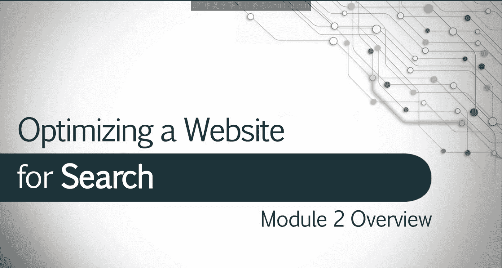
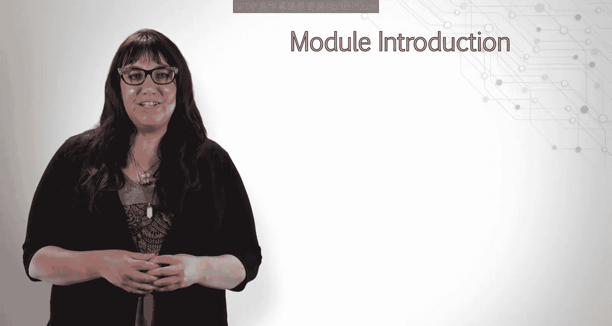
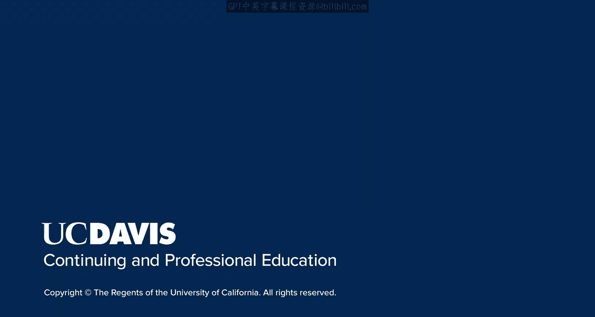

# UCD《搜索引擎优化（谷歌、SEO基础、优化网站、进阶、毕业项目）｜Search Engine Optimization》中英字幕 p68 12_高级页面SEO.zh_en -BV1N66VYsEue_p68-

Welcome to the module， Advanced On page SEO。

Last week， we learned about the importance of keyword research and how to evaluate our competition。

This week， armed with those skills， we'll explore the realms of audience analysis。

 competitive content analysis， and how to perform an internal content audit。

But our major emphasis this week will be in the areas of domain level content strategy to increase visibility and creating great content。

We'll take a look at the factors that contribute to successful strategies and examine the elements that make content great。

A carefully crafted strategy will lead audiences to the site。

 but great content will prompt action and help businesses meet their goals。By the end of this module。

 you will be prepared to analyze content， design an effective strategy。

 and develop great content for your site。There's a lot to cover this week， so let's get started。

