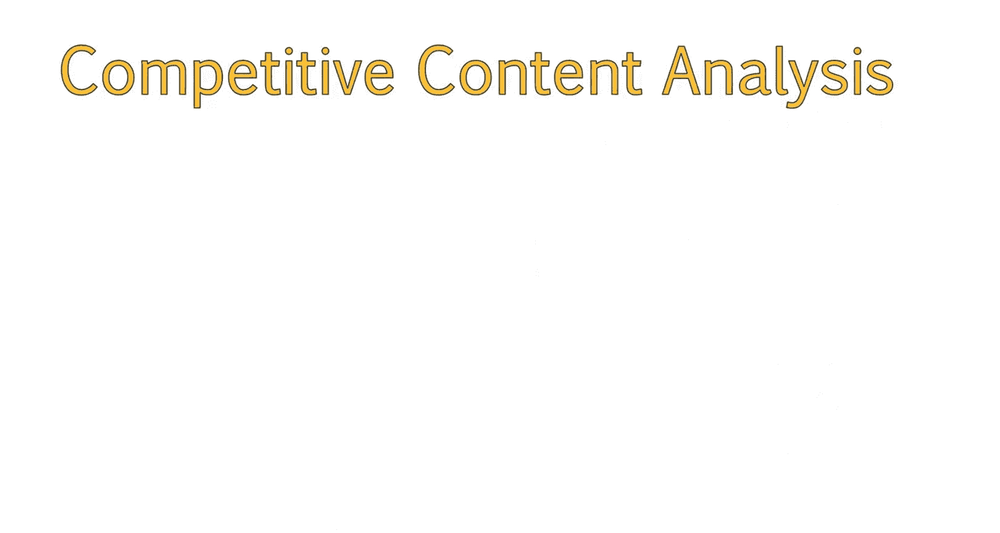
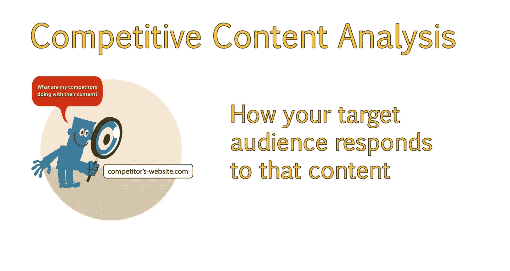
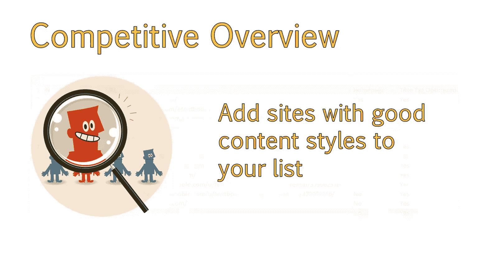
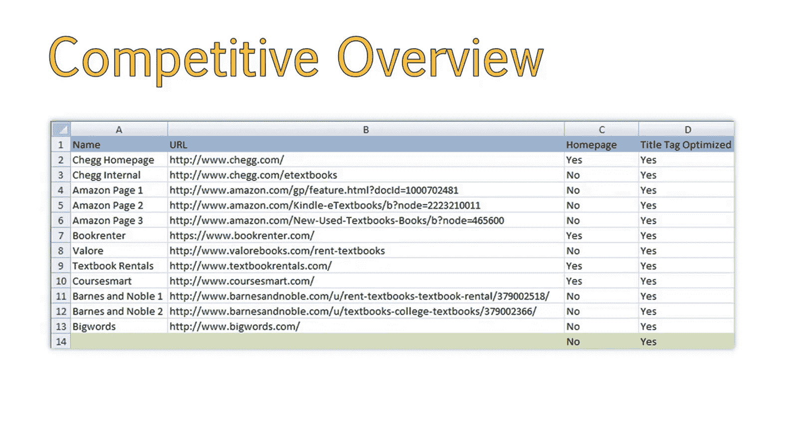
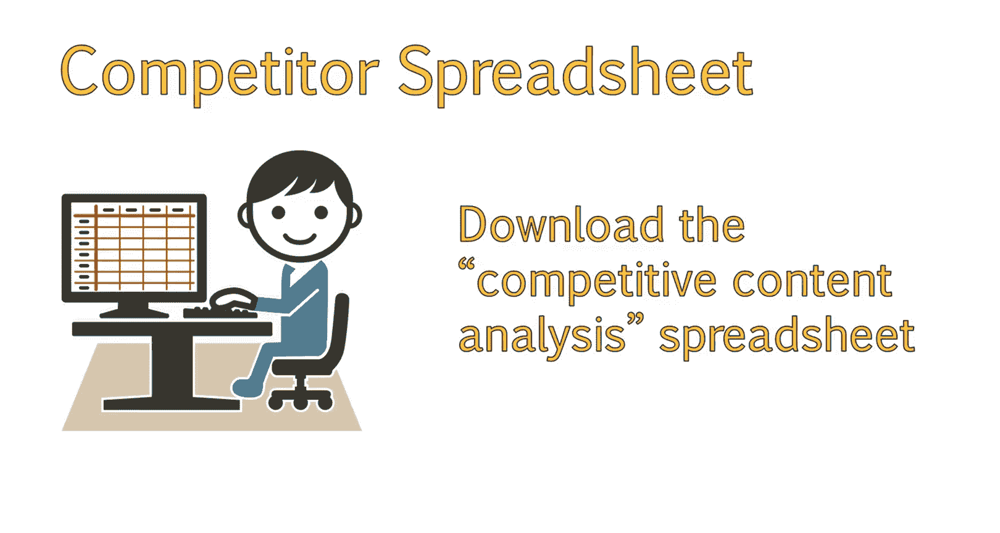
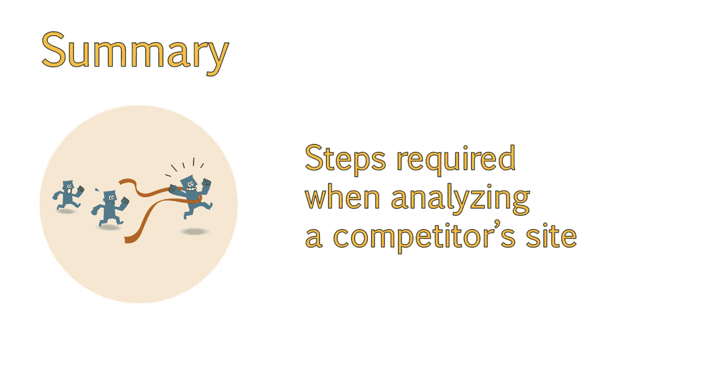

# UCD《搜索引擎优化（谷歌、SEO基础、优化网站、进阶、毕业项目）｜Search Engine Optimization》中英字幕 p69 13_竞争性内容分析的优势.zh_en -BV1N66VYsEue_p69-

Hello。😊，In the last module， you learned how to analyze a competitor's keywords。

And while that's an important element of on page SEO。

 another important element is knowing who your competitors are and what strategies they are using to attract audiences。

In this lesson， you will learn how to identify and analyze your competition using the competitive content analysis。

By the end of the lesson， you will know the steps involved in designing a competitive content analysis and how to analyze the results。

A competitive content analysis will give you a good idea of what your competitors are doing with their content。

😊。

These insights will tell you who your true competition is when it comes to content。

How your target audience responds to that content。

And ideas for improving your existing content。 A competitive content analysis will help you answer questions like。

What types of content should I consider。White papers may work great for one industry。

 while infographics may work best for another。Other questions include what voice should my content be written in。

How does your target audience respond to the type of voice used by your competitors。

If one speaks in a very down to earth friendly manner， while the other uses business speak。

Check out how people respond to each。Another common question is what platforms is your target audience most likely to share content on。

If most people are using sites like Pinterest， for example。

 then image heavy content might work best for you。

The first step is to determine who your competitors are。

We already have a really good idea what we are up against in organic search during our competitive analysis。

😊，There may be other sites that you are interested in from a content standpoint。 If so。

 feel free to add any additional sites to your list。

Let's start with the competitive overview we worked on earlier。We ended up with Chegg， Amazon。

 book printer， voreore， text book rentals， Comar。

Barnnes and noble。 and big words。

The next step is to create a new spreadsheet with different tabs for each competitor。

You'll also want to list out any areas you want to analyze。These can vary by sight。

 but there is a set of data I usually look at。Sites like Amazon are going to be more difficult in this scenario because they are very broad focused e-commerce accounts and by nature。

 will have different types of content than the other sites you are looking at。In instances like this。

 I would focus on competitors in your industry first。

As this will provide you with the most actionable insights。

You can download this spreadsheet called Compitive content analysis。So you can reference this later。

You can also use it as a future template， if needed。

Let's get started evaluating the content of one of our competitors。

You should now have an understanding of the purpose behind a competitive content analysis。

And the steps we will take when analyzing a competitor's site。Next。

 let's walk through the steps and fill out a spreadsheet to discover content opportunities。

