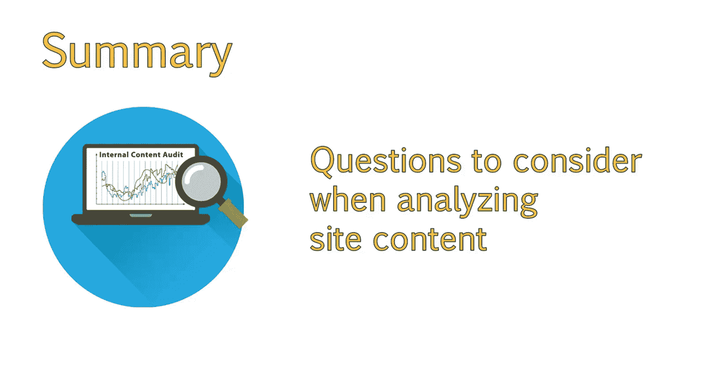

# UCD《搜索引擎优化（谷歌、SEO基础、优化网站、进阶、毕业项目）｜Search Engine Optimization》中英字幕 p72 16_执行内部内容审核.zh_en -BV1N66VYsEue_p72-

Hello， again。So far this week， we focused on using competitive content analysis and social signals to analyze our competitor' content and social presence。

Now， let's turn our attention to taking inventory of your own website。

An internal content audit can help you organize and identify where your content can improve。

In this lesson， we'll use the content analysis as a tool to help us frame the questions we need to ask ourselves to improve our sites。

One of the best places to start researching how to improve content。

Is by performing a content audit of your own site。If you are building a new site。

 skip this step as you'll have no data to work with yet。This process is very time consuming。

 but can have a great impact。Because this can be a very time consuming project to undertake。

 especially based on the size of your site and the resources you have available。

This may become an ongoing project。One of the things we will do as we identify and analyze content within our site。

Is ask ourselves a series of questions about how that content or resource can be improved upon。

As you look through content， ask yourself the following questions。

Do all articles and blog posts have an eye catching and supportive image。

Are there other supporting pages within our site that the content can link to？

Are there external resources we can link to in order to provide a better user experience？

Could other resources such as video be added to make this more appealing？

Can this be combined with other potentially competing pages？If the content is quite lengthy。

 can this be split up into a multipart series or a guide。

Make notes about your initial reactions and thoughts for how the content might be improved as you go along。

It is important to keep a record of your ideas so that you can reference this later。

 You should now have an understanding of the importance of an internal content audit。

As well as some questions to consider when analyzing the content of your own site。

Let's move on to identifying and organizing our own site's content。

