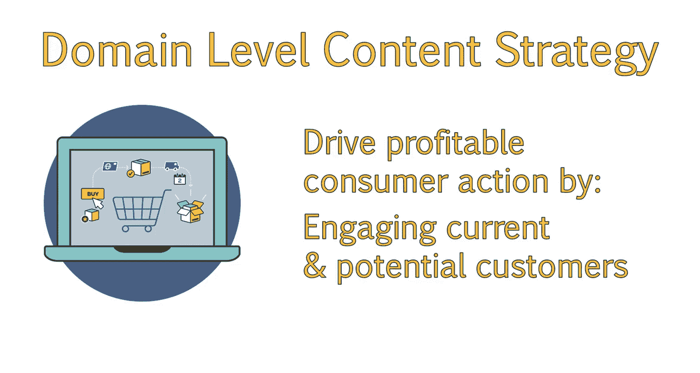

# UCD《搜索引擎优化（谷歌、SEO基础、优化网站、进阶、毕业项目）｜Search Engine Optimization》中英字幕 p75 19_制定内容优化策略.zh_en -BV1N66VYsEue_p75-

Welcome back。Now that we've discussed how to organize and evaluate content。

 it's time to shift our focus towards some of the more conceptual elements of content strategy。

We'll talk about whether or not content really is king in the SEO world。

 and we'll lay the foundation for developing a domain level strategy that will optimize a website's content。

Having a content strategy in place is important to the optimization of your site for several reasons。

The more content you have， the more opportunities you have to bring in search traffic for a variety of keywords。

😊，This helps to introduce potential customers to your brand or services that may not have been aware of you before。

The more engaging your content is。The more engaged with your site your users will be。

Since there is a good correlation between user engagement and higher rankings。

This can improve the efforts of your site as a whole。The more shareable your content is。

 the more opportunities you have to increase brand presence。😊，Like user engagement。

 there is a correlation with social shares and higher ranking content。

In addition to potential Seo benefits， it makes you more memorable and helps you gain consumer trust and loyalty。

In the Seo world， the phrase content is king， has become increasingly popular。

This has both positives and negatives。The positive is that， yes。

 content is king when you have a well thought out strategy and great content。😊。

The downside is that since more and more people are hearing how important content is。

Some marketers are just throwing any content they can on their website。

This has resulted in many companies hiring outsourced rid who don't have a good understanding of the business。

 brand， goals or services。Content creation without a fully thought out strategy。

 comes off as generic and is unlikely to capture the hearts and minds of your audience。

That content is therefore unlikely to rank well organically because nobody cares about it。

A domain level content strategy。Allows you to create content that makes sense to your users and contributes to your goals。

It's important to take your entire domain or site into account when creating this strategy。

Rather than just a single blog page or static page。

A domain level content strategy is a high level vision of your site's theme。

 which will help guide the creation of future content to meet specific business objectives。

The main goal of just about any business is to drive profitable consumer action。

You can do this by attracting new customers to your site and making them aware of your brand。

Driving existing customers back to your site for repeat purchases。Thus。

 increasing their lifetime value。Engaging existing and potential customers。

 which will result in these individuals organically spreading brand messaging for you。

Let's review some important elements that make up a domain level content strategy and review some real life examples。

