# UCD《搜索引擎优化（谷歌、SEO基础、优化网站、进阶、毕业项目）｜Search Engine Optimization》中英字幕 p77 21_优质内容的要素.zh_en -BV1N66VYsEue_p77-

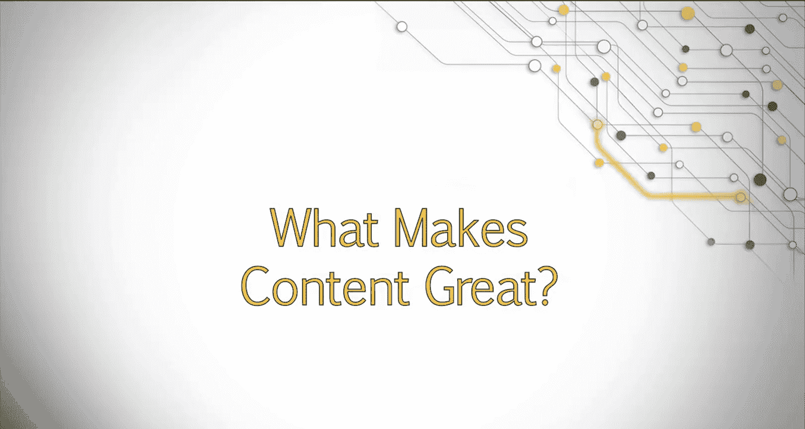

Welcome back。In the last couple of lessons， you've learned about why it is important to have a domain level content strategy and how to develop that strategy。

Now， let's turn our attention to the content itself。In this lesson。

 we'll discuss the many factors that make content great。Including how easily users can get to it。

What users do once they are there？And what they might do next。

 We'll talk about how we can align our audience profiles with the type of content we build and how that revolves around our core theme and brand identity。

There are a lot of factors that go into having a great piece of content。First。

 let's look at the end result of a piece of content or what you are hoping to accomplish。

We can then work backwards from here。First， people need to be able to find the content you have available in search engines。

If our content is focused around the right keywords， with the right intent。

People will be able to discover the content。This is covered in our previous modules on keyword theory and research。

Second。

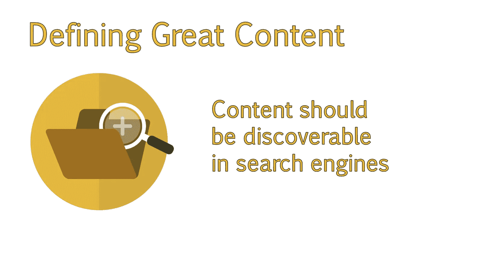

The content should prompt action by the user。It isn't going to be helpful if the content is discovered red。

 and then the user goes， oh， that's interesting and immediately leaves the sight。

We want the user to feel a connection to us and perform some sort of action after reading that content。

Whether it's making a purchase， creating an account， signing up for a newsletter。

 or leaving a comment。Any action on their part will show that our content did its job。In some cases。

 even just taking the time to view additional pages after landing on that page is good。

As this shows interest and may prompt a return visit。

You can help accomplish this by linking to other posts and resources within your content。

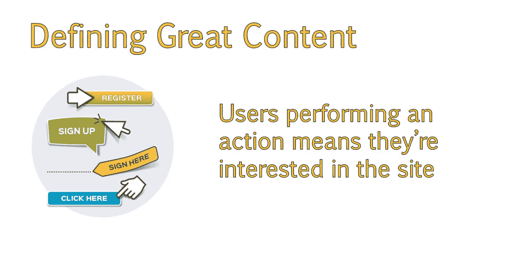

Third， the content should be shareworthy。We want users to share the page with their friends。

 family or coworkers on social networks。The more content is shared。

 the more people are exposed to our sight。This increases our online presence and our traffic。Also。

 remember the correlation between social shares and higher rankings。

While social shares don't directly relate to higher rankings。

 they can indirectly lead to more traffic and better ranking of your site。

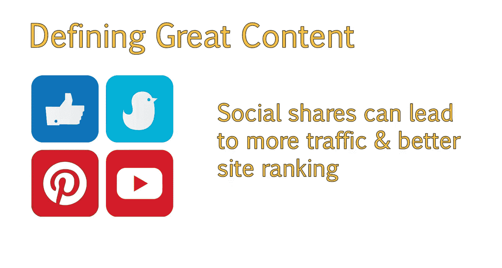

So how can we make sure that our content meets those end goals。First。

 we have to research the type of content enjoyed and shared by our particular audience。

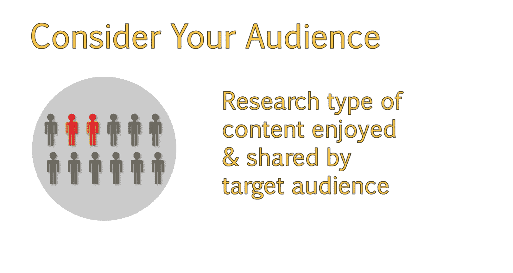

For example， seniors are more likely to find content on desktop computers rather than mobile devices。

And。They will generally find content with slightly larger fonts and images easier to read。

They may also be more inclined to watch a video rather than read the content。

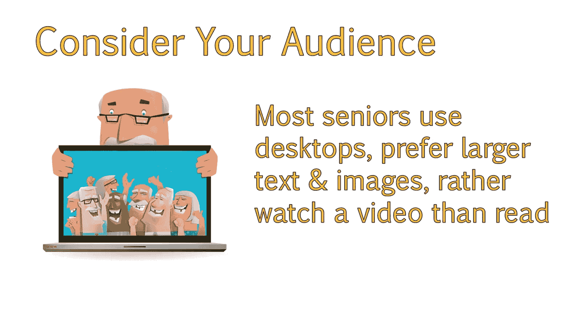

Various studies show that teenagers will usually search from their mobile device。

 and they'll tend to scan the article rather than read the whole thing。

We need mobile friendly content with catchy headlines sprinkled throughout that will grab their attention so they read more。

😊。

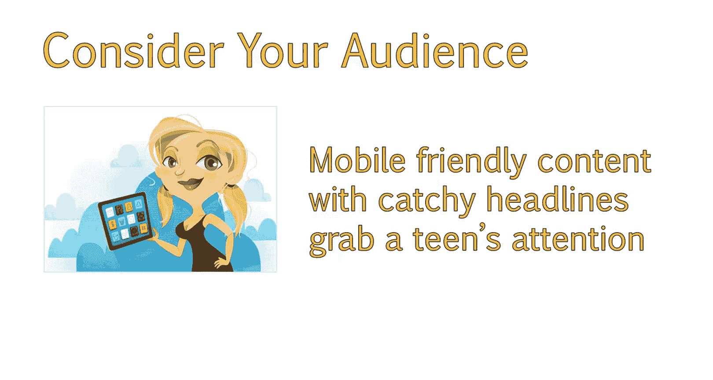

We also need to make sure that we provide users with the tools necessary to complete the next step we want them to take。

Whether that next step is sharing it with friends， buying a product or just signing up for a newsletter。

This means including calls to action， which tell the reader what their next step should be。

For example， simply including a call to action， such as did you enjoy this article。

 make sure to sign up to our newsletter to be notified of new great content。

And then linking to your newsletter can result in more subscriptions。

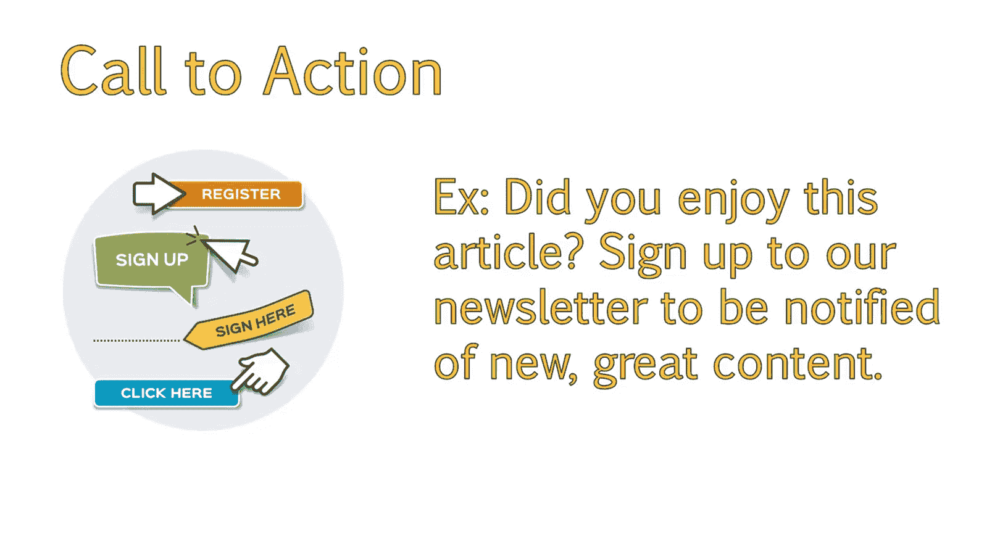

To enable more sharing， it's a good idea to include sharing buttons above and below the content。😊。

Or buttons along the side。So that they are easily seen and reached by users。

Users are more likely to share content with their networks if they don't have to hunt around for the share buttons。

Plus， the minute a user thinks， oh， that's interesting。 I should share that。

You want the share button to be visible to them， and easily accessible。Another example。

 depending on the audience you are trying to reach。

Is to include tweetable pieces of text within the article。

These will be highlighted with a phrase that says， tweetwe this。

And all the user has to do is click on the link to share that quote。

If your audience is likely to be Pinterest users。Spending extra time on the images you use within your posts。

And creating lots of visual posts。Will help aid in spreading your content through sites like Pinterest。

Your goal is to make it as simple as possible to share the content。

And that your user understands the next steps they can take to either share that content or stay connected with your site。

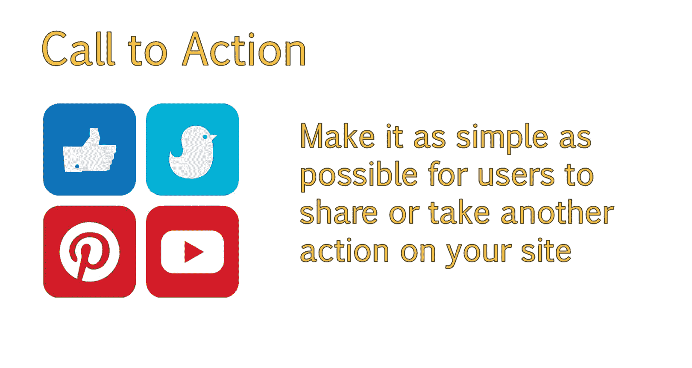

Second。Consider how the content you are creating aligns with the focus of your site and your branding goals。

For example， with textbook rentals。You will quickly run out of topics if you have a blog。

Where you always write about textbooks and nothing else。

Consider what other secondary topics might appeal to that specific audience。

While still helping you meet your brand goals。

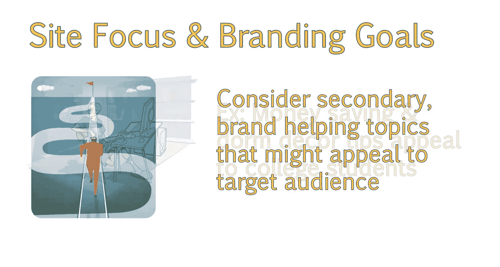

For example， college students might find content about saving money during college or thrifty college dorm decor tips useful。

Since these appeal to the more financially conscious student。

It makes sense that renting textbooks would also appeal to them as well。After all。

 all college students need textbooks。You can then relate this topic back to what you offer。

For example， in a post about decorating your dorm on a budget。

 you can add a line about how renting textbook can save money that they can then spend on decor。

Even topics that can't always directly relate back to textbooks。But still。

 appeal to the college student。Would be a good idea to write about。However。

You should stick to topics that are closely related first。

Topics that can tie into what you offer second。And topics that will be of interest to your user base the last。

 as you don't want to cause confusion when they land on your site。

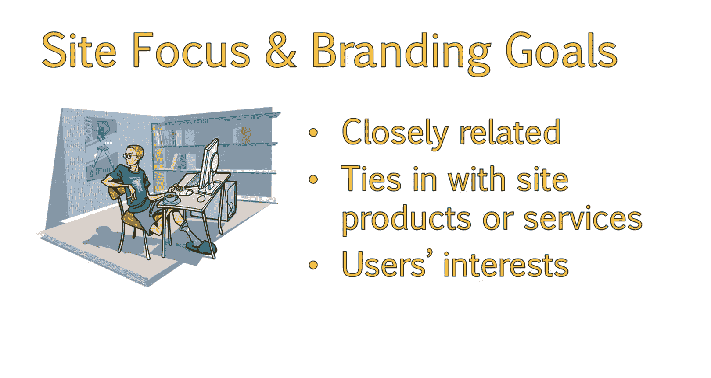

We will explore how to come up with relevant topic ideas shortly。

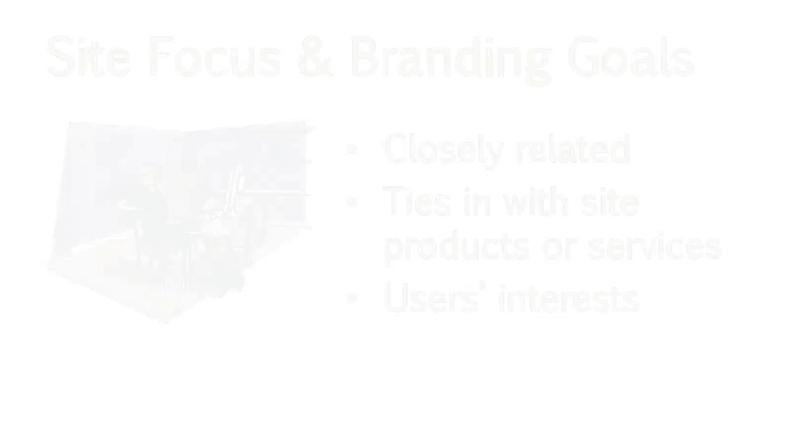