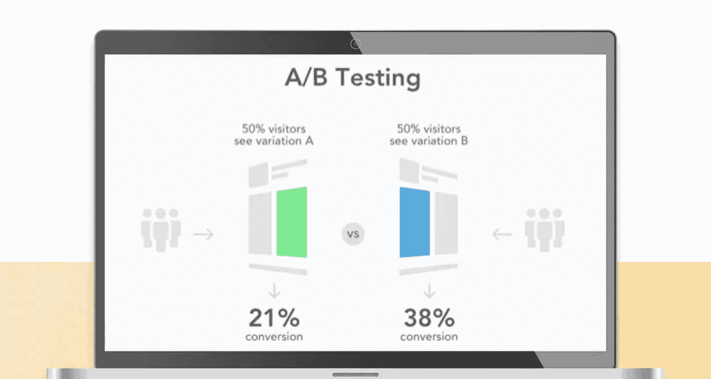
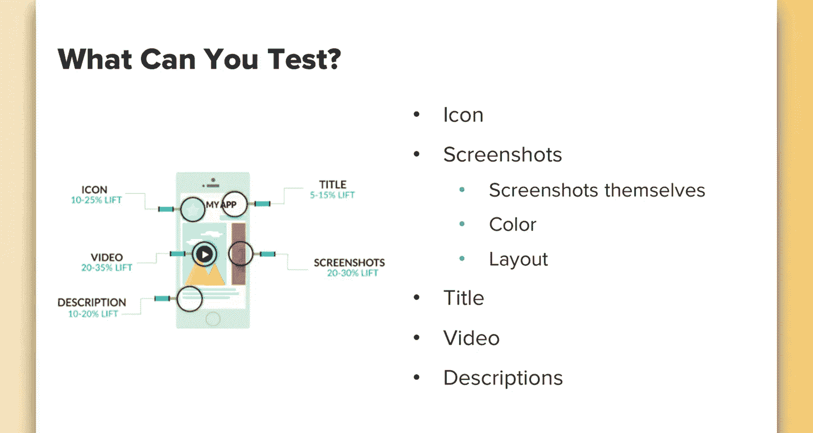
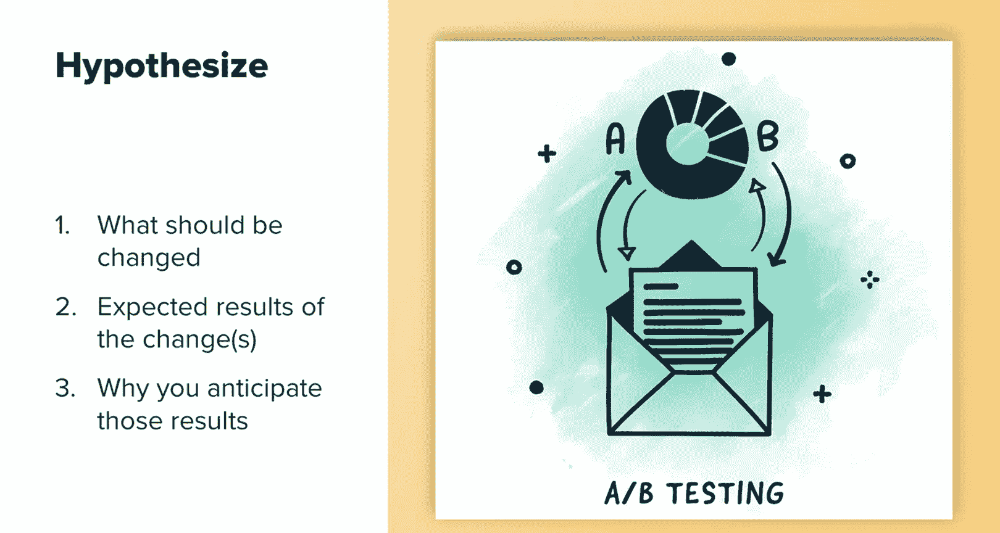
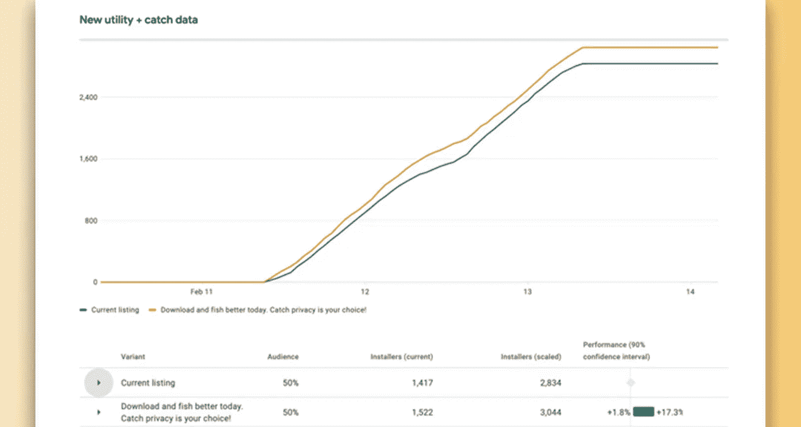
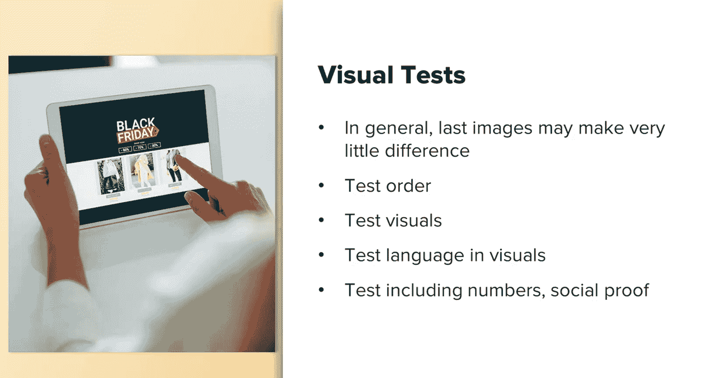
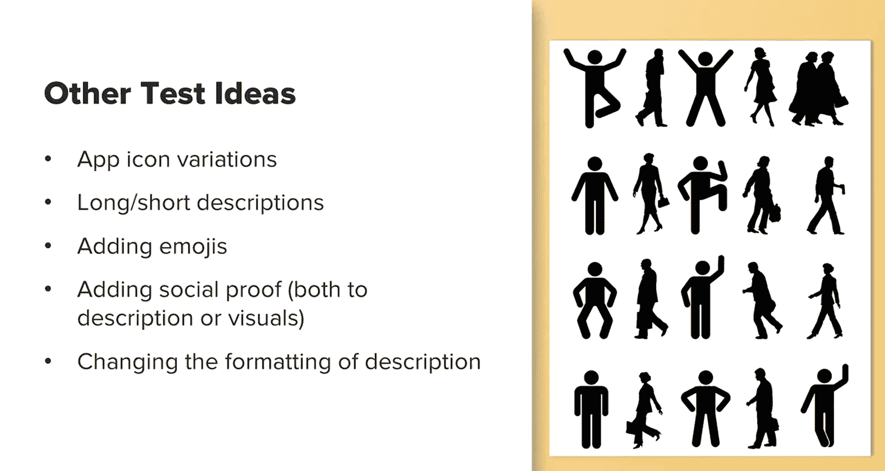
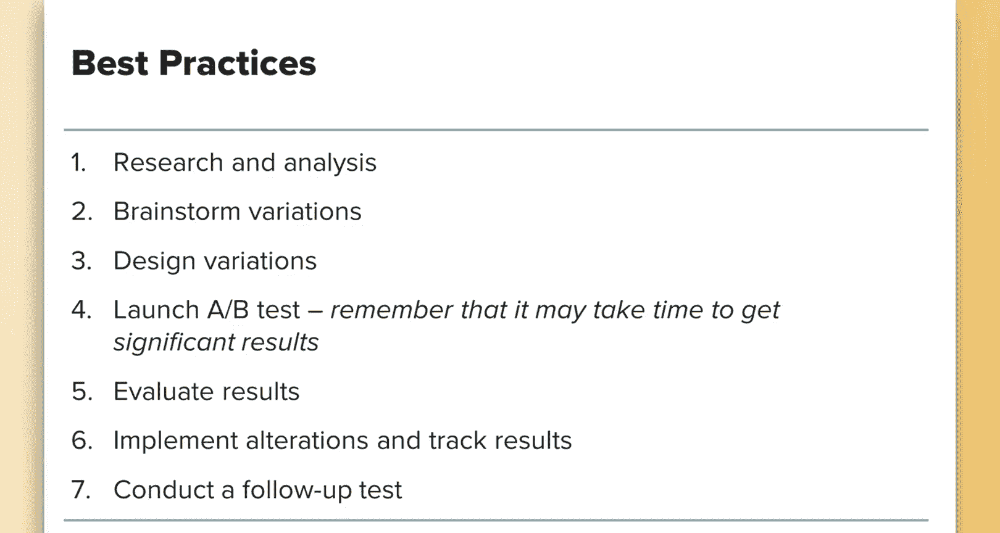

# UCD《搜索引擎优化（谷歌、SEO基础、优化网站、进阶、毕业项目）｜Search Engine Optimization》中英字幕 p85 29_应用A-B测试.zh_en -BV1N66VYsEue_p85-

Let's start by discussing what AB testing is and why you should be doing this as part of your app optimization efforts。

A B testing basically means that you're testing one aspect of your app or aspect A with another aspect B。

Your audience is then split equally into which tests they see so you can see which result performed the best over a period of time。

You can also split this up into more variables。 For example。

 three versions of a headline against the current one and then split each by 25% with an app optimizationim strategy。

 You want to know that your making data driven decisions。

 relying on guesswork or feelings may result in lower acquisition rates of your app。 In fact。

 studies show that even just testing the icon of the app alone has been shown to increase conversions by as much as 25%。

You can and should run tests for most everything about your app。

Some examples of what you can test include the app icon， testing screenshots。

 you can test the screenshot themselves， test the language on the screenshots， test the color。

 test the layout and arrangement， you can test the title， the video， your app descriptions， and more。

There are really endless possibilities， this graphic is from a site called Stormaven and represents the potential uplift that you can see from testing various areas。

 according to their study。

When running tests， keep in mind that not only will behavior among users differ across devices and app stores。

 you're also limited to what you can test across the different app stores。

Google has a great built in tool that allows you to run a number of tests within Google Play console directly。

 it will automatically segment users for you， let you know when it has found statistically relevant data to draw a conclusion and more。

Apple， unfortunately， doesn't allow testing。You can try to do some basic testing through testing interactions on your own app landing page on your website。

 or you can test messaging， using ads to see what users respond to best or use third party tools。

I haven't personally yet used thirdpart tools for the app store， but from what I understand。

 they create a fake mockup of the app store， and then they target users to go to that mockup through other ad platforms like Facebook or other ads that they're running and then they check the statistics of that and see which one users responded to best the downside。

 as I mentioned above， is that since users can behave differently across different devices。

 if they're on Facebook or other platforms outside of the app store。

 the results may not be the most reliable。To run good tests。

 you need a reason for why you're running the test and an idea of the outcome you wish to get。

 always start with an hypothesis。Running tests for the sake of just running them will not help you get actionable insights that you can draw conclusions from。

Start with a hypothesis to help you out when creating your test。

 you should have an idea of what will be changed， what the expected results of your changes are。

 and why you anticipate those results。

Here is an example using fish brain。We had run a survey where results showed that a large number of users were concerned about using our apps because they were afraid about giving away their fishingish spots。

I decided to run a test on our app description， highlighting the ability that users have to keep their phishing spots private。

 the idea behind this was that it'll help educate people that they do have privacy options on the platform and that this will result in better trust and more downloads。

We saw close to a 17% increase in downloads after implementing this privacy related messaging。

This test also underlines why it's important to test more than just keywords。

 don't only think of SEO when running tests， think about what the users will respond to。

This shows that using insights from your audience will help users make informed decisions about what their needs are and what your app can provide them。

Now， not all tests will be winners， but don't discount the losing tests either。

They may provide valuable insights in other ways。 Some tests that have failed at optimization experiments。

Provided us with good data as a company。 For example。

 our app launched a marketplace that allows users to buy fishing gear that other users have rated or that our data shows that fish have been caught with。

We ran several tests with both the description and images and these all featured the marketplace and the ability to shop and find top rated gear and all of these lost。

This tells us that our branding is more strong on other features。

 and customers don't generally go to an app with the intention to shop。

 but to participate in community aspects and learn about fishing。With this information。

 we can make sure to only promote the shop in our app tests closer to big shopping specific days。

 like Black Friday or Christmas， plus on these days you're most likely to see a decline in phish activity anyway。

 so you're both helping capture trending topics and only using it for a short period of times。

 you don't push your users' way who know your app is used for specific things that they keep returning to over time and time again。

Also， losing tests can lead to better understanding of your consumer's behavior in many ways。

Always question why a test may have lost and look at what you can learn from it。

 Doing a follow up test is important to helping you understand why something didn't work or may work in a different circumstance in a different type of test。

When testing screenshots， remember that the first two screenshots are the most viewed and very few people scroll past that。

The last image may make very little difference， so try playing around with the order of images to see if you can get an uplift。

You can also test the visuals themselves， test using two screens to highlight one concept。

 test using each page to highlight a specific feature or test screenshots that educate your users on how to use the app。

You should also test the language used in your visuals。

 Maybe a visual isn't working well because of the text in the visual and not the visual itself。

Before declaring an image doesn't work， test it in a couple of different scenarios and make sure it wasn't the text or the image itself。

Here are some other test ideas for you to try， try testing variations of the app icon。

Test both the long and short description and not only the content but where the content within the description is displayed。

 for example， maybe you want to try moving something that's currently at the bottom to the top and see what kind of results that gets。

Test adding emojis to highlight special features or draw interest。

And try adding social proof both to descriptions or visuals。

And then consider changing the format of the description， you can include bullet points。

 use emojis's bullet points， and more。

Remember these best practices when A B testing your app。Start with research and analysis。

Insights gained from your users is an excellent place to start。

Brainstorm variations you want to test。Design those variations。

 whether it be getting visuals designed or writing different copy。Launch your test。

Monitor it carefully and be patient， it can take some time to get statistically relevant results of your test。

Then carefully evaluate your results if anything is unclear。

 you should retest or test it in a different way to confirm your results。Next。

 evaluate the risk that there is still a small chance that the test results may be off。 Remember。

 Google gives a 90% confidence interval， So there's still a little。

 a little bit of room for error there。Next， conduct any follow up tests based on your learnings。

In summary， testing your app can be both fun and rewarding。

There are many different elements you can test and while this summarizes some of them。

 this isn't an entire list， come up with many on your own。

But rely on insights from your actual users to help you come up with test ideas。

Even losing tests may have important information that you can learn from。

Always do follow up tests to confirm your results or find out what aspects may be working or not working。

 For example， if an image didn't work， test it again and use a different bit of text on the same image or try the same text and use a different image。

I hope this inspired you to run some AB tests of your own on your own app。

 and I hope this gives you some ideas to get started。

