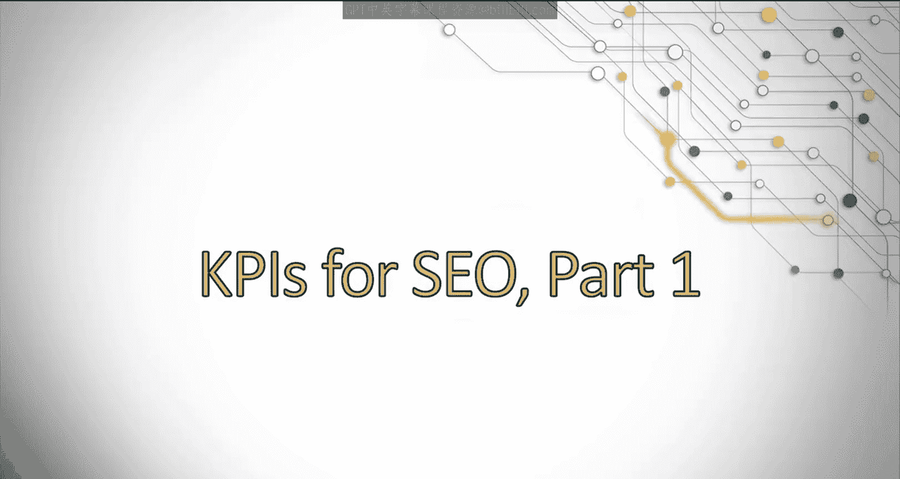
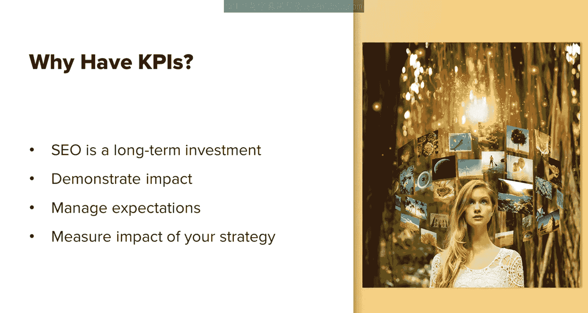

# UCD《搜索引擎优化（谷歌、SEO基础、优化网站、进阶、毕业项目）｜Search Engine Optimization》中英字幕 p87 31_SEO关键绩效指标 第一部分.zh_en -BV1N66VYsEue_p87-

Hello， let's dive into discussing SEO related KPIs。That's a lot of acronyms right First。

 let's just quickly touch on what KPIs are to make sure we're all on the same page KPI stands for key performance indicator。

While you'll ultimately be held responsible for the ROI and the value of the work you bring in。

 KPIs are smaller metrics you can use to show progress along the way。

Let's discuss some reasons why you need to have KPIs。

Since SEOo takes time to build value compared to other channels。

KPIs are a great way of showing that your project and the work that you're doing is seeing initial results。

And that more value will come later。This will give you a quick way to demonstrate the impact of your SEO efforts。

It's also a great way to manage expectations for example。

 if you've just started on a project and we're not ranking for any of the target keywords。

 but now you're ranking on page 3。That probably isn't delivering much monetarily yet。

 but it shows that your efforts are working and rankings are improving。

This helps show that over time， your efforts will bear fruit。Last， when discussing SEOo strategy。

 we often talk in terms of traffic， rankings， click through rate and more。

 while a high ROI is the ideal outcome， these KPIs are precursors to what you need to achieve those。

 and they're the basis of your SEO strategy。They provide a quick method of seeing if something is working。

 if something is going wrong or how quickly things are moving。Basically。

 KPIs should be the important steps you track leading up to delivering ROI。

Let's discuss some best practices for determining what KPIs you should track。

It's important to understand why you're tracking a certain metric。For example。

 tracking something like time spent on site is great if you have a reason behind why that metric matters to your business goals。

If you can't clearly tie a KPI to a business school。Then it's probably not a valuable KPI to track。

Next， don't have too many。 You want to focus on what's most important rather than trying to chase after too many things。

 There's no hard and fast rule as to how many K Ps you should have。

 This should be determined by your company goals and objectives in the amount of resources you have to both implement and track these changes。

You should always benchmark your data。You can't know if a KPI is performing well or poorly unless you know how it was performing prior to your SEO efforts。

Always benchmark your data so you can compare before and after a project。And always remember。

 K Ps are best understood when in comparison to one another。

Month to month comparison may not always be accurate if your business has a lot of seasonality fluctuations。

 for example， comparing year over year is generally a more accurate and more acceptable way to show growth over time because it accounts for changing consumer behavior due to seasonality。

 holidays and more。😊，Now， let's discuss some common KPIs you can track。

This will not be an exhaustive list， but will be some of the common ones and my reasoning behind it。

 ultimately， remember that you need to check what is most important to your business goals。

Let's start with organic traffic， the most common and obvious KPI we should track。

Organic traffic is a bit tricky when looking at Google Analytics。

 Use the method most applicable to your needs。 Google Analytics can get confusing because it will label things as users。

 new users and sessions， and all can be easily confused for one another。

 deciding which one to track will depend on your business goals。

 Perhaps you have found that you don't make a lot of new revenue off of existing users。

 You're only looking at acquiring new users to your site。😊，According to studies。

 most marketers actually use sessions because it gives a better idea of engagement。

 a visit driven by organic search。So to summarize each of these different types of tracking metrics of organic traffic organic sessions is the entire visit of a user If a user were to visit your site and then stop what they're doing go make a cup of coffee。

 make a quick phone call come back to your site 30 minutes later。

 that actually is going to count as two visits because during that time their visit idled out so depending on how you want to track sessions you you might not want to track that because it could kind of double some of the visits but it also determines engagement so if they actually did come back to your site and continue browsing around they're interested and they didn't just close your browser and go elsewhere so new users are defined as people who have not yet visited your site and sometimes this may overestimate the amount of people who are actually new because some of these people may use。

Software or browser tools that block cookies or other tracking software。

 so it doesn't give an accurate representation of people who are actually new versus people that Google Analytics just can't identify as having been to your site before。

And then you have users， and these are people who have visited your website once within a specified period of time。

