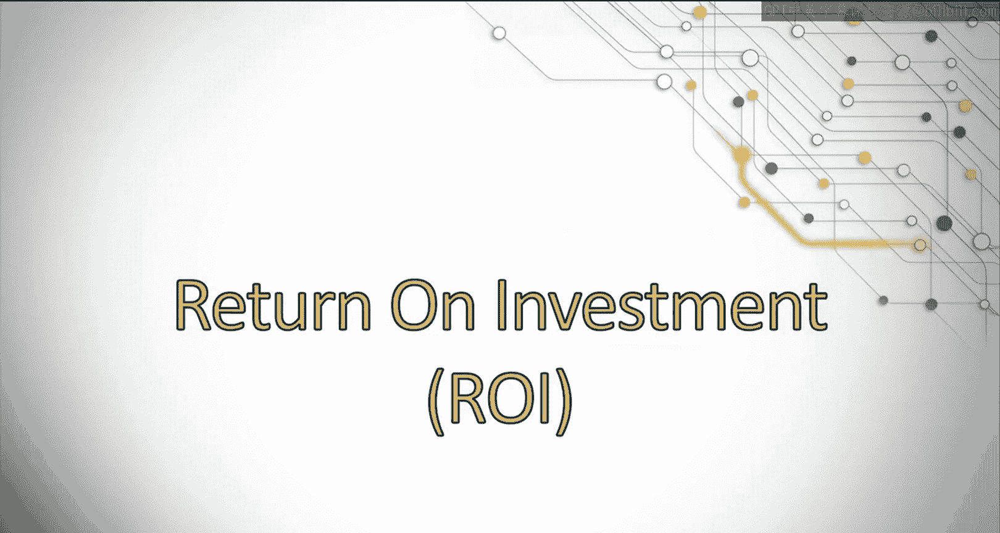
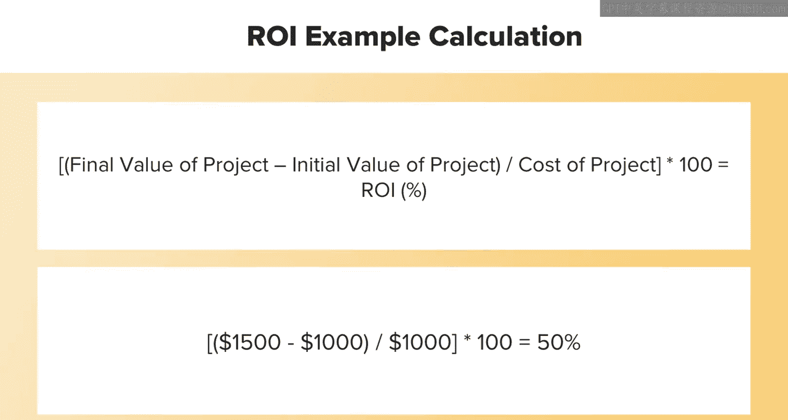
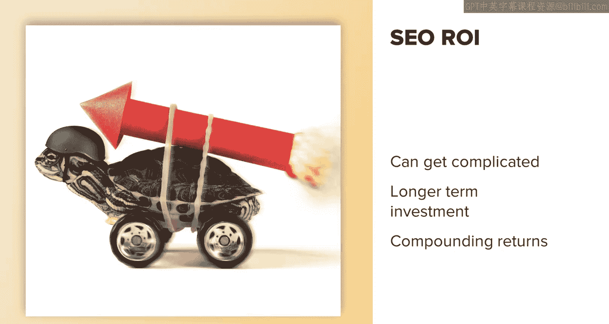
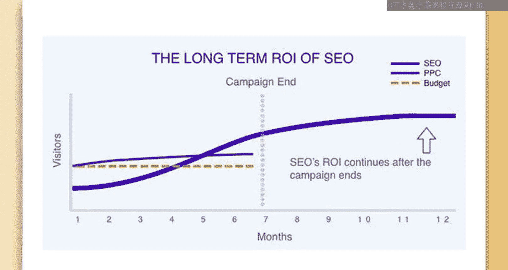
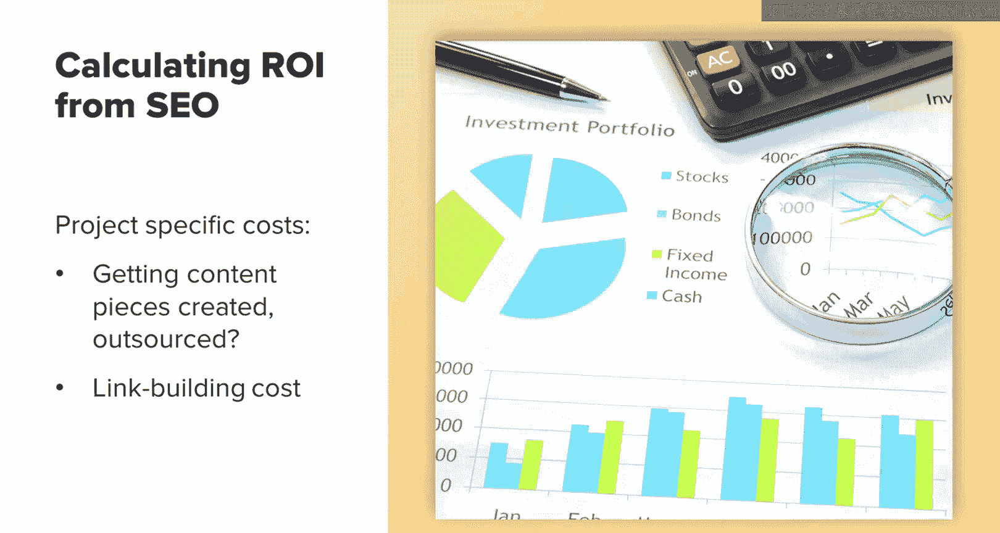
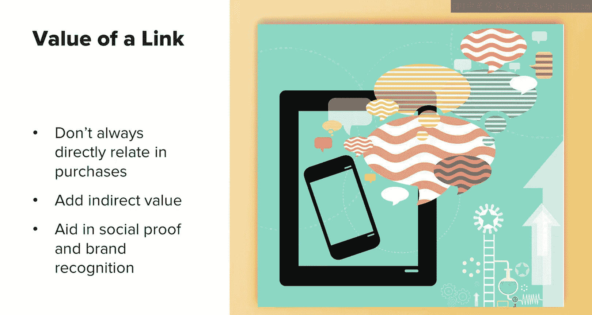

# UCD《搜索引擎优化（谷歌、SEO基础、优化网站、进阶、毕业项目）｜Search Engine Optimization》中英字幕 p89 33_投资回报率(ROI).zh_en -BV1N66VYsEue_p89-

Hello， this is Rebecca。Let's discuss the what and the why of calculating ROI。First。

 to make sure we're all starting off on the same page。

 let's briefly touch on what ROI is ROI stands for returnturn onInvest。At a high level。

 ROI is used to determine if a project was profitable。

You can calculate a simple ROI using this formula。All you need is the cost of the project and the revenue of the project to determine what your return on investment is based on the revenue you earned。

This is a pretty standard calculation and can be changed depending on your needs and goals。

I encourage you to look up different methods of calculating ROI for projects you have worked on to get an idea of the different ways you can present your findings。

Keep in mind， calculating RI for Seo can get a little complicated。

 especially when compared to other marketing efforts like paperpercl with paid campaigns。

 you can see an immediate Ri。 So then you know if something is profitable and if it's working with Seo。

 however， it's a longer term investment so it can take a while to start seeing actual gains。

But then once you get that traction， it builds and builds and those begin to compound and deliver a really great return。

When directly comparing paid RI to organic Ri from a channel like Seo。

 it might look like this for some couple of months before you start seeing good returns from Seo。

 However， once the Seo project is put in place， it continues to acquire revenue over time。

 compared to paid once you stop your your campaign。

 your leads generated from that campaign will also just stop coming in。

Another thing to note is that paid budgets are generally higher than SEO。

 meaning you can get even more leads from SEO at a lower cost per lead than you could with paid efforts。

There are many different ways to calculate ROI from SEO。

 depending on the projects you put in place and your company's specific revenue model。

I will walk through some examples starting with the easiest and then touching on some other scenarios you might run into。

There are a couple of inherent problems that are present when calculating ROI for an organic channel。

1 is what do you count as cost of the project When calculating R Oi， do you count your salary。

 for example。I will go with the model your company has set up unless youre working as a contractor。

 then you should always include your fees for inhouse Ses， find what other departments do。

 For example， does the pay team calculate their time spent on campaigns or only the cost of their campaigns。

 go with whatever is already established。

Other costs to consider when calculating ROI are project specific costs， for example。

 maybe you worked with external writers for SEOo to create articles for your site。

Calculate the cost per article in this case。The same with other project specific costs。

 another common one is link building。You could calculate this as the fee for a link building agency or the cost for articles written for link building pieces that you're placing on external sites or hiring an agency to help pitch sites。

 whatever that cost is， just calculate that as the cost that you're going to calculate into your ROI。

Take a moment to think about all the costs associated to SEOo projects you're currently working on and note those down having this list handy will help you out when you're in a situation to calculate ROI of a given project later on。

Another common question that arises， especially with organic traffic is attribution。

Organic plays an important role in the whole customer journey， which is no longer linear。

Simply looking at direct organic contribution to your end goals doesn't provide a full picture of how organic contributed to your goals。

However， something like multichan attribution is really tricky to measure。

 so many companies will go with what's called last touch attribution。

 and that basically means the last channel that brought in the sale gets the credit。

So in these examples， if someone were to Google for a question related to your products or services。

 and then they went on to discover your sites and what you offer。

 and in got ideas for other things they wanted to search for around that so they went back to Google to search for specific products and services mentioned on your site。

 and then they click on an ad from you， and then they convert。Organic is not part of that sale。

 even though it was a driving force in that purchase journey for the consumer。Due to this。

 organic efforts often get less credit than they deserve。There are some ways around this。

 It's harder to tell who visited your site organically before clicking on an ad， for example。

 but you can get information like the number of organic visits that then subscribe to your newsletter or organic visits that clicked on your social media links and then followed you。

 You might not be able to tell who followed you from that。

 but you can tell that they clicked on your links and make a reasonable assumption that they followed you。

One thing you can do is count the percentage of organic visits that came in through those channels。

And then claim a percentage of sales attributed to those channels as organic。Of course。

 it's not entirely accurate。 you can't assume that every customer who signed up to a newsletter during that period went on to purchase something。

 but newsletter subscribers are really valuable and organic is contributing to growing that list over time。

 so it's a fair assumption to make。I'd say one of the hardest things about calculating ROI of SEO is calculating the impact of your link building efforts on your revenue。

This is difficult for multiple reasons。 You can't expect every link you acquire to be clicked on。

And every link that's clicked on to results in a sale。

Many links are acquired for the purpose of improving your site's authority score。

 which improves your ranking overall and helps build that sales channel。

So we know that links don't always directly relate to purchases。

 but they do aid in social proof and brand recognition。

 and they offer a lot of indirect value such as increasing your authority。

 so what are some ways you can accurately count that for ROI。

One of the things you might try to do is look at the PR team within your company and what model they use to count that PR is in a similar spot where they spend a lot of time and effort gaining media mentions and shares。

 but that doesn't necessarily directly correlate to sales either。

 There is obviously give value in it， but it's harder to calculate。 If your company has a PR team。

 speak with them and find out what their methods are。

 as this can then be applied to calculating the Ri of your work with link building。

Another way to determine value is to find the estimated advertising cost of what you would have paid to those sites if you were advertising on them。

In this case， I would get an average of the domain authority of the links you acquired over a certain period of time and then find the average cost on advertising sites in your industry that have about that level of authority。

This is difficult because it doesn't directly translate to value。

 but it is a potential metric you can use on money saved。

You can also look at attributing sales coming in as referral traffic to your SEOo efforts。

 or at least a portion of it again， links may not directly bring in referral traffic， but some might。

 and overall the increase in your domain authority from those links that you gained is helping to build brand recognition。

And that helps word of mouth and that helps you generate more links and that comes in referrals。

 so in a roundabout way， you can argue that organic did impact this。

 especially if you can relate organics traffic growth over time to the rate at which your referral traffic grows。

This isn't an exhaustive list， but there are some common ways I have seen and used。

 If you find other ways to calculate this， I would love to hear more。

 please reach out on LinkedIn and let me know what your methods are。

That wraps up our discussion on ROI。This is a big topic， and we covered quite a bit here。

 such as understanding what ROI is。Understanding how you can calculate the ROI of different SEO projects based on content writing or general ROI for Swide projects。

You should understand how to calculate the cost of your SEO efforts。

You should understand what attribution is， why last touch attribution is a challenge for SEO and various ways of showing a more fair value of your efforts。

And understanding the troubles inherent with calculating the value of links acquired and some ways to consider when determining ROI for that channel。

