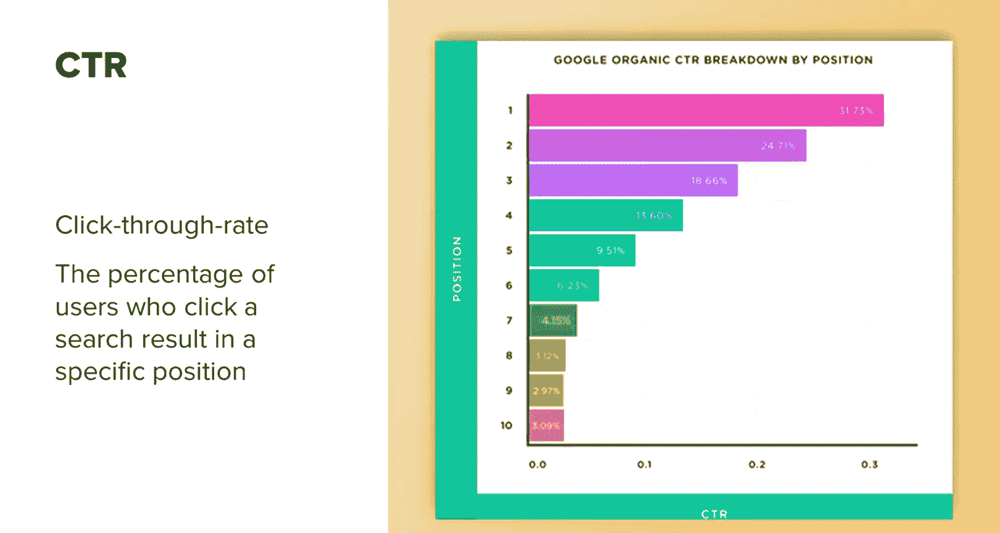

# UCD《搜索引擎优化（谷歌、SEO基础、优化网站、进阶、毕业项目）｜Search Engine Optimization》中英字幕 p92 36_SEO影响预测 第二部分.zh_en -BV1N66VYsEue_p92-

One easy way to create a main forecast that takes these questions into account is to integrate a range of possibilities into your forecast。

 For example， I personally advocate for a process that delivers four sets of assumptions。

 a conservative case， which is met with about a 75 to 80% probability。A base case。

 which is met with a 50% probability。An aggressive case， which is met with a 25% probability。

 for example， if you were able to complete every SEO project。

 you have roadmap for the next year and maybe even some extra projects。

 the chances with that are probably pretty low， so that would be more of an aggressive case。

I particularly also like to add a do nothing case， this is where we would be if we don't do anything at all and we just remain exactly where we are with our current trajectory this is what our results will look like that gives people just an idea of how SEO is directly impacting the traffic and how your continued impacts or your continued SEO projects deliver value and keep your rankings from dropping over time。

For SEOo， a good forecast should include。Projections of upcoming resources that you need to achieve your goal。

The context of your industry， for example， are specific services or products related to your business trending up or down。

Market size and share。This can be found by historical key rate volumes and a comparison of ranking and traffic metrics。

 For example， if the market size of your industry is 1。5 million organic searches per month。

Then how much can you expect to attain rankings upper page one， middle page one， bottom of page one。

 etc？And competition you should continually monitor your competition to see where their SEO maturity is if they're really great at SEO。

 you can probably expect that they're going to continue to be really great and be competitors in your industry if they're not great at SEO it's reasonable that they won't start out ranking you but you also have to take into account as we mentioned with difficulties in forecasting they may suddenly hire a great SEO and shoot up but you do need to look at this in relation to your forecast in your industry and note that。

Also remember when forecasting keyword data is historical。

 so one year may be even larger than the next， you can get a good idea by looking at various topics related to your business on Google trendsrends and see how this is trending year over year if interest is up year over year。

 then you can reasonably expect a higher number of searches。Over the coming year or two。

 depending on when you watch this， currently this is being recorded in the very beginning of 2021。

This year's data will take into account the search volume of 2020 and that was really skewed because of how COVID impacted a lot of user behavior so it may be unreliable for the next year。

 year and a half depending on when until things go back to what's considered normal and。

How we will adjust to that normal in the future。 So just one thing to note is like when big changes like this happen that does impact search behavior and you can't always like exactly rely on historical keyword metrics applied to the future in this type of scenario。

 There are many different ways to forecast SEOio。If you ask other people in the industry about their favorite ways。

 you'll get a wide range of answers from different tools like Power BI to Google Data consoles and more others use advanced calculation in Excel。

 write their own programs， ultimately， go with what feels best for you depending on your level of experience in certain tools。

 the data you have available and more。I won't go into forecasting in detail as this will get us bogged down into calculations and various methods。

 and you may not need all that at the present time。

 I will leave links to some great resources to explore calculations and formulas in greater detail and go over the methods at a high level for how you need to start forecasting SEO data。

Useful and pretty accessible tools that you'll need to or that you can use you don't necessarily need all of these to forecast SEO are Google Analytics which is free Google search console。

 also free Google trendsd， another free tool sites that show data on competition such as SEM rush that one's a paid tool I'll leave a link to a 14 day free trial they have really good competitive analysis tools there's also similar ones on the market that you can try。

Google Data Studio， another free tool， and some that are mixed， you know Excel。

 a subscription to Power BI or other data visualization tools that you can use and are comfortable with。

Google Tds can be useful in determining industry growth or decline year over year。

We can see with the exception of 2020， which was impacted differently due to COVID。

 that interest in fishing， for example， has remained relatively stable year over year。

This can give insights into expected traffic。 For example。

 if we were to disregard 2020 and assume we maintained the current positions all year。

 then traffic would be unlikely to grow very much year over year。

 if we look up an industry like electric scooter rentals。We can see that， again， disregarding 2020。

 this shows growth year over year at about a rate of 10% or so。Now。

 please note this doesn't directly translate to traffic。

But we can make a reasonable assumption that if our positions remain stable。

 we would still see an increase in traffic。You can use this to get an estimate of interest for your market and see how search volume might change year over year it's not the most accurate since again。

 this is just depicting interest over time what I would do is go ahead and do a Google a search on Google trends and then click on that little icon interest over time it'll give you more data into how this is displayed and what those numbers mean so it's not the most accurate but it is a really good starting place for gauging interest in a particular topic or category and can help you estimate what that same level or what that level of interest may be in the next year。

Also， remember， forecasts are just forecasts， they don't need to be entirely accurate。

 so don't get too hung up on that。Using the previous examples saying with scooters for example。

 I'll use a very simple example to keep it reasonable about the kind of growth you might be able to forecast with this information。

 so given that Google trends information， you can see that if Google Analytic showed you had。

 let's say 50000 searches last year， and we know traffic might increase by 10% if we did absolutely nothing and we stayed the same positions we are now。

We know at the very least， we would see an increase of 5，000 organic searches year over year。Now。

 taking this a step further， if we translate that into measurable gains。

We can take an average conversion rate of our organic traffic。 For this example， let's assume a 3。

5% conversion rate， which is pretty average。And then let's say each conversion was worth $100。

So every time somebody subscribe to your site they bought $100 worth of products This means that you can forecast that revenue attributed to the SEOo efforts next year as $192500。

However， it's unlikely that you're just going to do nothing and maintain your current positions。

 it's a very basic starting point， you're working to capture more volume and better positions so you can then take that into account with your forecast and increase that number。

One thing that will be handy to you， regardless of which forecasting method you go with。

 is being able to estimate the CTR or click through rate of site results in various positions。

 This means that you will be able to forecast what type of traffic you are likely to see if you are to move up or down in search result positions。

This allows you to see things at a higher level or get granular by keyword or keyword set。

Depending on how detailed you want to get， you can use click Through rate charts online This example is from backlinkko。

Or you can get really detailed and find the click through rate of your own site and create your own CTR curve。

