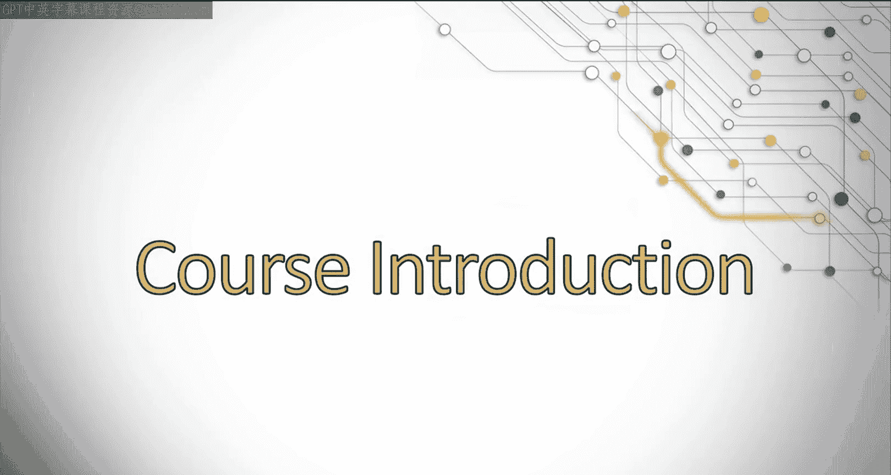
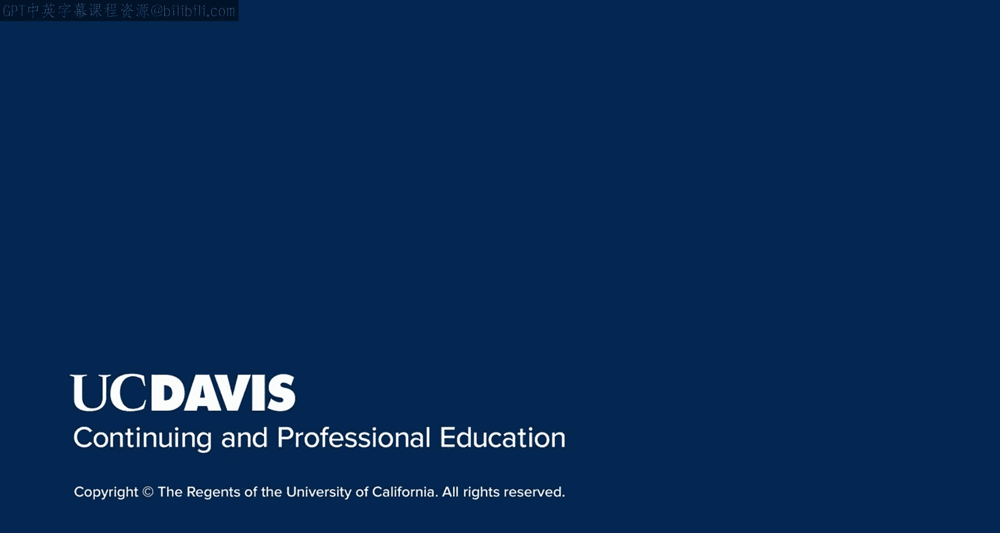

# 001：UCD《搜索引擎优化（谷歌、SEO基础、优化网站、进阶、毕业项目）｜Search Engine Optimization》中英字幕 p01 0_课程与专业方向介绍.zh_en -BV1N66VYsEue_p1-

Hello and welcome to the course Introuction to SEO by UC Davis my name is Rebecca May and I'll be your instructor for many of these lessons。

I have been in the SEO industry for over 12 years now。I got started doing SEO as a freelancer。

Moved on to agencyside， where I worked with brands all around the world developing SEOo strategies。

And I also develop SEOo strategies for some amazing brands in house。

I am excited to share what I have learned over the years with you so you can start developing your career in SEOo。

In this course， we're going to discuss many exciting topics that will give you knowledge of the foundation of SEOo that you can then build on in future lessons and your career。

Have you ever done a Google search and wondered why the results that got returned were returned to you or how Google knew what your intent was of that search or how it evaluated the websites in its index to return the right websites for your query？

We're going to discuss how search engines work， how they analyze websites。

 and how they return the right results to you。😊，You can then use this information in building on your own SEO strategies。

We will also discuss how SEO as a marketing practice evolved。

We'll go over some best practices you need to be aware of。

And how to better understand the intent of your audience so you can match that to both your SEO and your branding。

