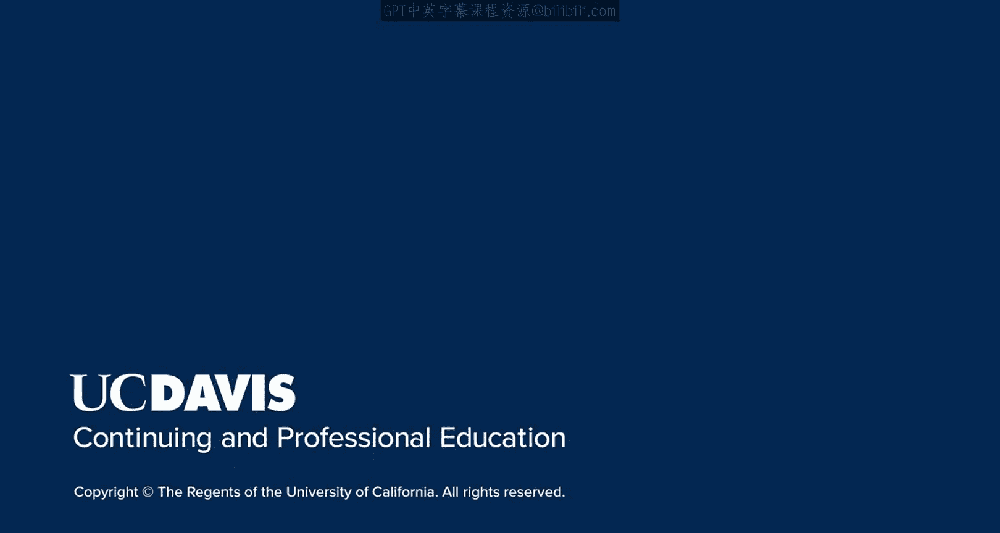

# 002：导论 🚀

在本节课中，我们将学习搜索引擎优化（SEO）的基础导论。我们将探讨SEO的演变历程，理解为何今天存在特定的最佳实践，以及这些知识如何帮助我们为未来的优化工作做好准备。

---

西奥多·罗斯福曾说过：“你对过去理解得越透彻，就越能为未来做好准备。” 这在SEO领域尤为贴切。通过深入了解早期搜索引擎的工作原理，我们可以理解为何今天会存在某些最佳实践，以及搜索引擎技术为何会发展出某些特定的进步。

上一节我们提到了理解历史的重要性，本节中我们来看看SEO的具体演变过程、当前最佳实践的成因，以及你需要为未来做哪些准备。

以下是关于早期搜索引擎工作原理及其影响的关键点：

*   早期搜索引擎主要依赖**基础算法**来抓取和索引网页。
*   它们使用简单的**关键词匹配**技术来评估网页内容与用户查询的相关性。
*   这种机制导致了一些容易被操纵的排名因素。

由于早期技术的这些特点，SEO领域逐渐形成了一些核心的最佳实践来应对挑战并提升效果。

以下是这些核心实践原则：

1.  **创建高质量内容**：提供对用户真正有价值、信息丰富且原创的内容。
2.  **进行关键词研究**：找出用户实际搜索的词汇，并将其自然地融入内容中。
3.  **优化技术要素**：确保网站速度快、适合移动设备浏览且易于搜索引擎抓取。

随着搜索引擎算法（可表示为不断更新的 **`ranking_algorithm`** ）变得越来越复杂，它们开始更智能地理解内容质量和用户意图，而不仅仅是关键词本身。这意味着SEO的重点从“优化以迎合机器”逐渐转向“优化以服务用户”。

---

本节课中，我们一起学习了SEO的简要介绍。我们探讨了理解搜索引擎历史如何帮助我们把握当前的最佳实践，并认识到SEO是一个持续发展的领域，其核心始终围绕着为用户提供最佳体验。掌握这些基础原理，将为后续学习更具体的优化策略打下坚实的基础。