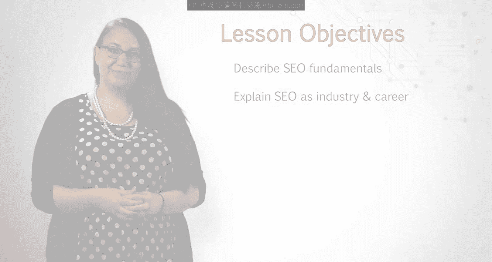
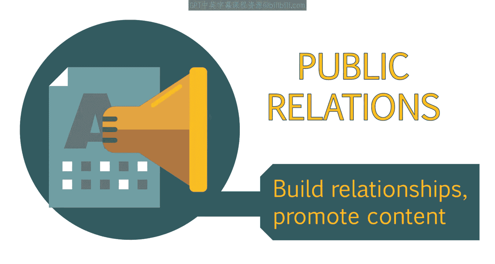
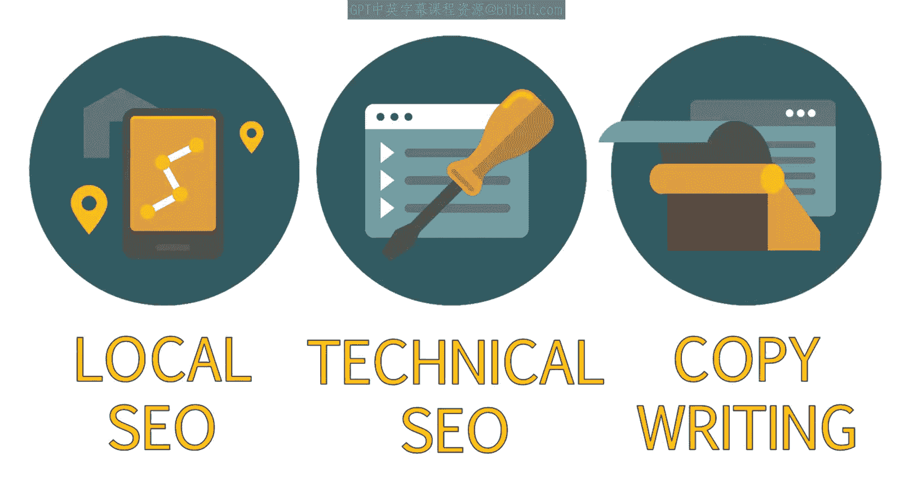
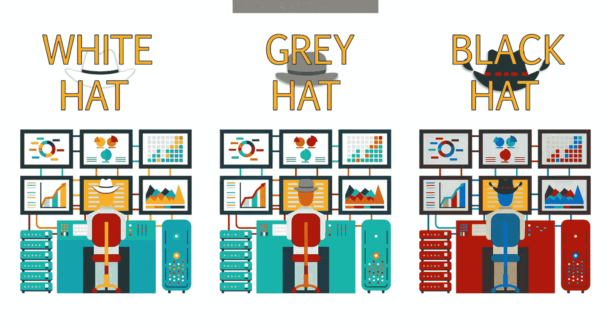
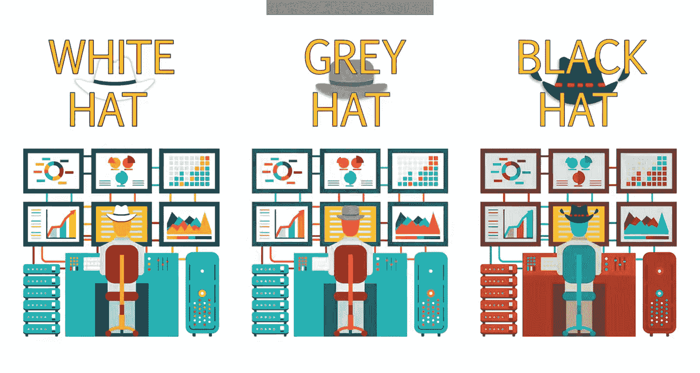
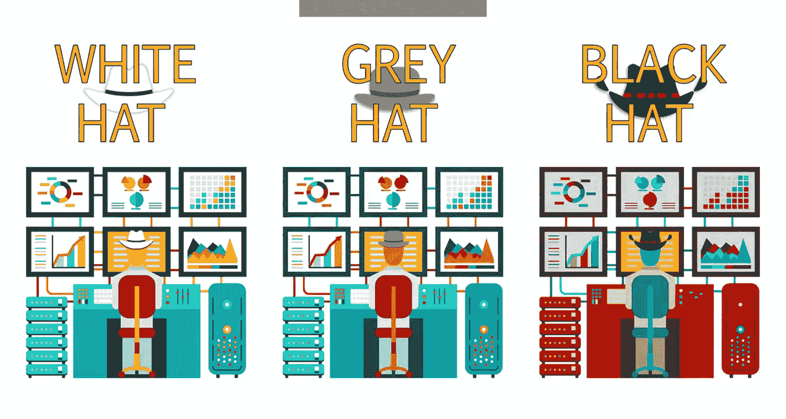
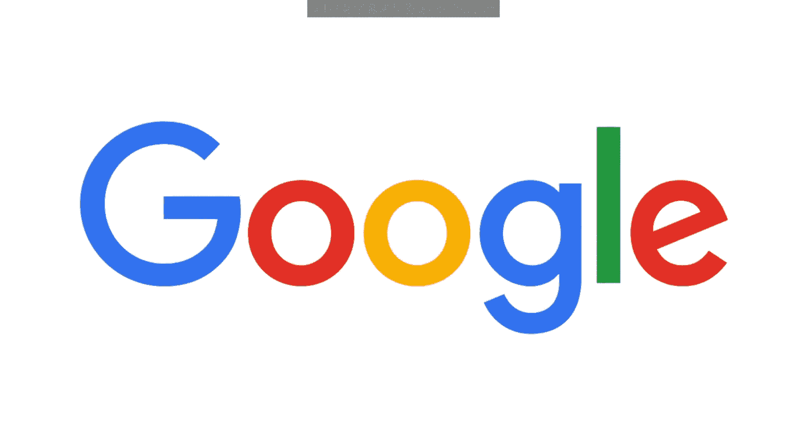
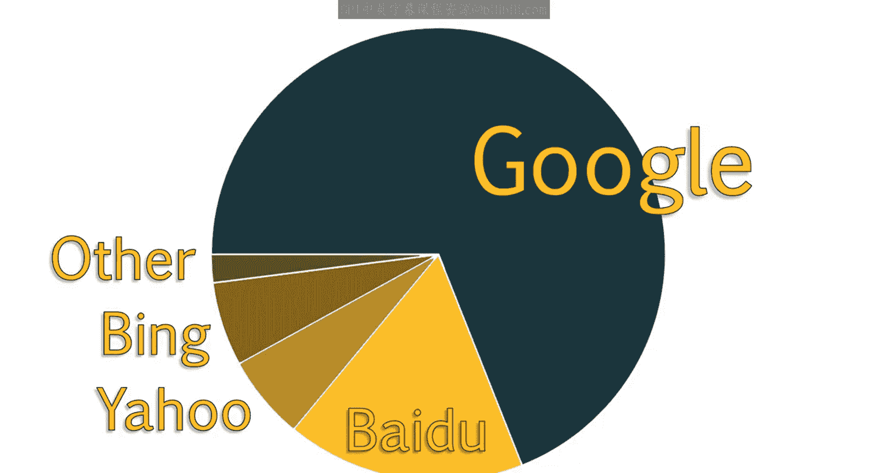
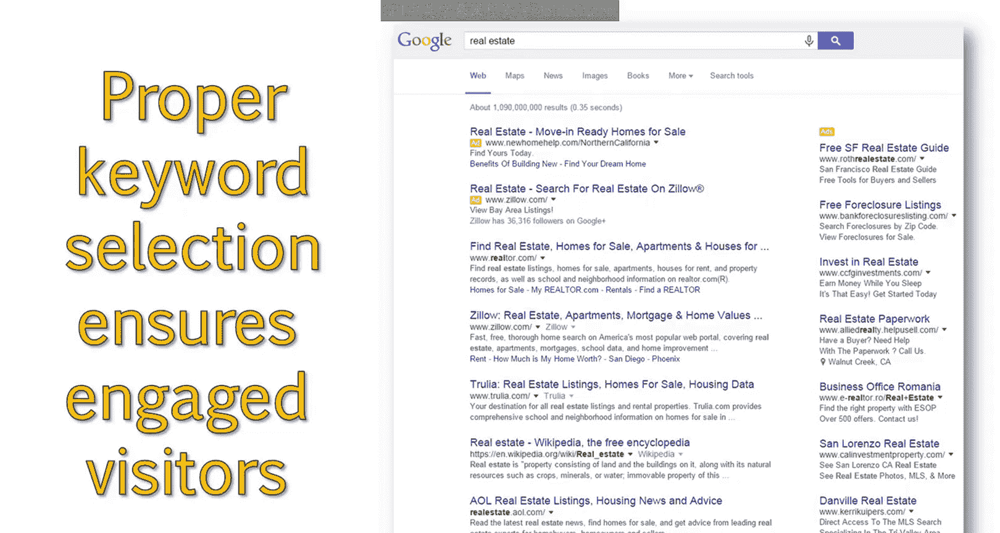

# 003：谷歌SEO入门 🚀

在本节课中，我们将要学习搜索引擎优化（SEO）的基础知识，熟悉一些基本术语，并为你提供工具，以便你能专业地谈论SEO这个行业和职业选择。我们将在下一课中进行更深入的探讨。

## SEO的定义与定位

上一节我们介绍了课程概述，本节中我们来看看SEO的具体定义及其在数字营销中的位置。

SEO代表**搜索引擎优化**，其核心公式可以概括为：

**SEO = 提升网站在搜索引擎中的可见度**

SEO是更广泛的数字营销策略的一部分，它更侧重于获取免费或自然的流量。其他数字营销角色可以与SEO策略紧密协作。

以下是数字营销领域内其他相关角色的简要介绍：

*   **搜索引擎营销**：专注于在搜索引擎中竞标付费广告位。
*   **社交媒体营销**：涵盖免费和付费的社交广告及互动实践。
*   **内容营销**：专注于为博客、新闻通讯等撰写内容。
*   **公共关系**：专注于建立关系并推广有新闻价值的内容。

要在SEO领域取得全面成功，你需要很好地理解这些领域，并具备与其他营销角色紧密合作以实现互利的能力。

## SEO行业内的不同流派

你甚至会发现在SEO行业内部也存在许多不同的思想流派和专业方向。

例如，有些人喜欢选择某个专业方向，如本地SEO、技术SEO或SEO文案撰写；而另一些人则喜欢拥有更广泛的专业知识，涉足所有领域。

甚至在SEO从业者之间也存在关于白帽、黑帽和灰帽SEO的争论。

*   **白帽SEO**：遵循谷歌等搜索引擎制定的最佳实践准则。
*   **黑帽SEO**：倾向于反其道而行之，采用一些可能被视为操纵性的手段。
*   **灰帽SEO**：通常介于两者之间。

黑帽SEO更容易频繁地受到搜索引擎的惩罚，并以一种“快速见效、快速消亡”的策略而闻名。

在本课程中，我们专注于不会导致你被搜索引擎惩罚或封禁的白帽策略。然而，我确实建议你花些时间自行了解不同的SEO思想流派。你也可以在自己的网站上测试各种方法，这将帮助你更好地理解搜索引擎和SEO的工作原理。对于SEO来说，最好的学习方式是通过实践和持续测试。

## 主要搜索引擎介绍

在课程中，我们会频繁提及搜索引擎。主要的搜索引擎是谷歌、雅虎和必应，此外还有一些知名度较低的搜索引擎。

以下是部分国际搜索引擎的介绍：

*   **百度**：中国的主要搜索引擎。
*   **Yandex**：俄罗斯的主要搜索引擎。
*   **Naver**：韩国的主要搜索引擎。

除非你正在制定国际SEO策略并使用外语，否则你不会过多接触这些搜索引擎。但了解它们的存在很重要。在本课程中提及搜索引擎时，我们主要指**谷歌**，因为谷歌在所有搜索引擎中拥有最大的市场份额。

虽然了解其他搜索引擎很重要，且不应把所有鸡蛋放在一个篮子里，但SEO从业者和客户对优化谷歌排名有着极大的兴趣。一些SEO从业者甚至开玩笑说，我们不是搜索引擎优化专家，而是谷歌优化专家。这是因为谷歌是最广泛使用的搜索引擎，拥有最佳的市场份额。此外，通过针对谷歌进行优化，你遵循的网站最佳实践将有助于你的网站在所有搜索引擎中获得更好的排名。

## 搜索结果页面解析

这是一个典型搜索结果页面的示例。对于一次普通的搜索，每个结果页面中间会显示**10个自然搜索结果**。

在搜索结果的顶部和侧面，你会看到**广告**。这是搜索引擎营销人员关注的领域。这些广告针对查询词或关键词进行竞价（类似于SEO优化的目标），以便他们的广告能优先显示在搜索结果的第一页。

当我们讨论SEO以及谷歌做出的一些调整时，重要的是要记住，谷歌是一家营利性企业，这些广告是其大部分利润的来源。

与搜索引擎营销人员类似，SEO从业者也希望自己的网站显示在第一页。然而，我们专注于**自然搜索结果列表**。我们的目标是让我们自己或客户的网站在相关关键词的自然搜索结果中尽可能高地排名。

## 排名位置的重要性

值得注意的是，搜索结果的位置会极大地影响其获得的点击量和网站访问量。研究表明，超过71%的网站流量来自搜索结果第一页的访问。

用户更倾向于直接优化他们的搜索查询，而不是继续浏览搜索结果的第二页。

事实上，自然搜索结果中的前五个位置带来了最高比例的流量，约占网站总点击量的68%。

在搜索结果中仅仅提升几个位置，就能显著增加网站的流量。反之，确保你的网站健康且优化良好，以避免排名或流量下降，也同样重要。

然而，关键在于确保你正在优化的关键词最有可能吸引到有参与度并能转化的访客。这将涉及到关键词心理学和研究，我们将在接下来的章节中详细讨论。

## 课程总结

本节课中我们一起学习了搜索引擎优化的基本概念。我们明确了SEO的定义及其在数字营销生态中的位置，了解了行业内的不同流派（白帽、黑帽、灰帽），认识了以谷歌为主的主要搜索引擎，并深入分析了搜索结果页面的构成，特别是自然搜索结果与付费广告的区别。最重要的是，我们理解了网站在搜索结果中排名位置对获取流量的决定性影响，这为后续学习关键词优化等核心技能奠定了基础。