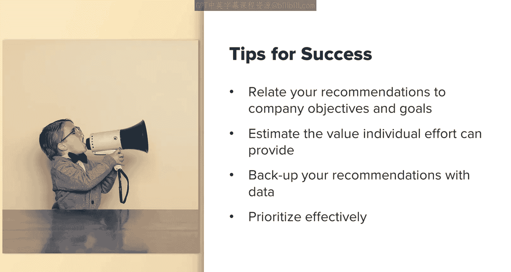
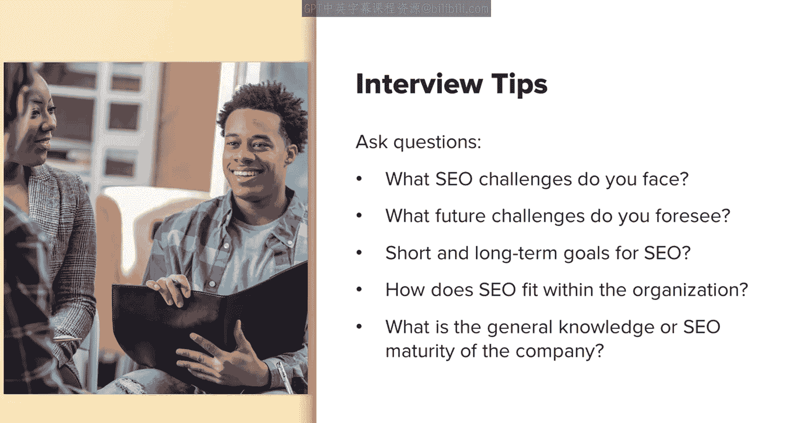
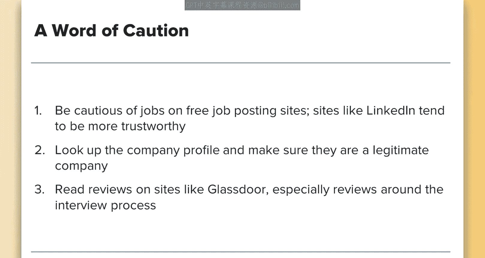

# 004：SEO职业路径与技能 🚀

在本节课中，我们将探讨SEO作为一项职业的选择、发展路径以及所需的核心技能。我们将了解SEO在营销行业中的角色定位、不同的职业方向，以及如何在面试中脱颖而出。

---

## SEO的职业定位与价值

SEO是一项在营销行业内持续发展并日益成熟的职业选择。事实上，它现在被认为是营销人员必备的核心技能之一。即使你不打算成为团队中的专职SEO人员，掌握SEO知识也大有裨益。

SEO的独特之处在于，它既是一个专业角色，又要求从业者具备多方面的能力。为了有效实践SEO，你需要能够制定全面的SEO策略，并向客户或内部部门清晰地传达这些策略。

---

## SEO与其他营销角色的协同

SEO是一个能从互补的营销学科知识中受益的角色，同时它也能很好地补充其他职位。与SEO互补的角色包括：

*   **内容营销**
*   **社交媒体**
*   **CRO（转化率优化）专家**
*   **用户体验专家**
*   **公关**

---

## 主要的SEO职业路径

SEO从业者有多种职业选择。例如：

*   你可以作为**顾问**，在提供营销服务的**代理机构**工作。
*   你可以作为**内部SEO专员**，在**企业内部**工作。在此基础上，你可以为小型企业、初创公司甚至大型企业级客户服务。

我曾有幸在顾问、代理机构和内部岗位都工作过，并经常在我的博客上分享这些经历。

---

## 与外部SEO团队的合作

在所有这些职业路径中，你都可能需要与其他SEO团队合作。例如，在企业内部工作时，与外部代理机构或SEO顾问合作是很常见的，对于大型企业尤其如此。

通常，外部SEO专家可能会被引入，以提供特定的技术或平台专业知识，或帮助扩展现有的SEO策略（如链接建设或内容营销策略）。他们可能因多种具体情况而被聘请。

因此，无论你是内部SEO、顾问还是代理机构方，了解你自身领域之外的SEO角色都是有益的，这将在必要时帮助你与他们协作。

---

## SEO从业者的核心能力

无论选择哪条职业道路，你都需要能够有效地做到以下几点：

*   **将你的建议与公司目标联系起来。**
*   **有效评估单个SEO工作能为公司带来的价值。**
*   **准备好并能够用数据、过往案例研究等来支持你的建议。**
*   **有效确定优先级**，以便当必须在两个重要建议之间做出选择时，你能快速轻松地决策。

---

## 成功所需的技能组合

在以上所有领域，你都需要一套特定的技能来帮助你取得成功。我建议你查看SEO招聘信息，了解哪些职位正在招聘，以及它们明确或隐含要求哪些技能。

你会发现有用的技能包括：

*   **人际交往能力**
*   **项目管理和规划能力**
*   **战略性思维能力**
*   **敏捷性和主动性**
*   **保持对行业趋势和新闻的更新**
*   **分析数据并从中得出结论的能力**

---

## SEO面试技巧

讨论一些面试技巧可能很重要。虽然这可能不适用于顾问，但几乎每个SEO从业者在某个阶段都需要参加求职面试。

以下是一些在面试中取得成功的建议：

**1. 准备作品集**
你应该准备一个作品集。这有助于突出你过去的工作，展示你的实践经验。即使本课程是你第一次接触SEO，完成其中的练习也将帮助你建立作品集，积累可展示的工作案例和经验。

**2. 引用具体相关的例子**
在面试中，面试官会解释该公司SEO角色的具体职能以及他们面临的一些特定挑战。如果他们没提到，务必主动询问。当他们谈论这些时，尝试抓住机会，根据你过去取得过积极成果的工作经验，为他们面临的挑战提供解决方案。如果你在该领域没有具体经验，但基于理论知识知道一个很好的机会，请务必提出你在那种情况下的建议。

**3. 提出有洞察力的问题**
确保提出一些问题，帮助你理解公司的需求以及SEO在其组织中的定位。揭示这些需求将帮助你判断：第一，这个角色是否适合你；第二，如果适合，你如何能最好地支持公司实现其目标。

**4. 提前练习**
最后但同样重要的是，确保提前与朋友练习。练习即兴思考比试图死记硬背一系列问题和答案更有帮助，后者通常会显得排练过度且不真诚。

---

## 关于面试案例研究的注意事项

我想提醒你在SEO求职中注意一点：企业在面试过程中要求你完成一个案例研究的情况并不少见。

然而，我要提醒你对那些要求投入异常多时间和精力的案例研究保持警惕。虽然要求完成少量工作作为你能胜任任务的证明并不罕见，但存在一些不太可靠的招聘广告，它们基本上是利用面试过程从SEO从业者那里获取大量免费工作。

为避免此类情况，我建议你对免费发布网站上的职位保持谨慎。例如，在LinkedIn等网站上发布的职位往往更可信，但这并不意味着它们总是可信的，所以仍需保持警惕。其次，最好查一下公司资料，确保它是一家合法的公司。此外，你可以在Glassdoor等网站上阅读评论，特别是关于面试过程的评论。花些时间浏览这些评论，看看是否有关于面试过程冗长或要求大量工作的投诉。

不过请记住，仅仅因为你做了案例研究却没有得到工作机会，并不一定意味着这是个骗局。但如果那是一个耗时费力的要求，而你没有得到任何回复，你应该努力在Glassdoor等网站上记录这一点，以帮助揭露这样做的公司，并提醒其他潜在的求职者他们可能面临的情况。

---

## 总结

本节课中，我们一起学习了SEO的职业发展全景。我们探讨了SEO在营销生态中的价值、不同的职业路径（内部、代理机构、顾问），以及成功所需的硬技能和软技能。我们还深入了解了如何在面试中有效展示自己，并对可能遇到的案例研究要求保持了必要的警惕。掌握这些知识，将帮助你更好地规划自己在SEO领域的职业生涯。