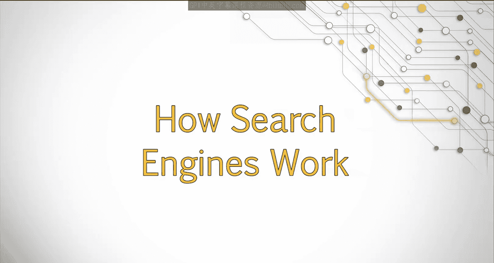
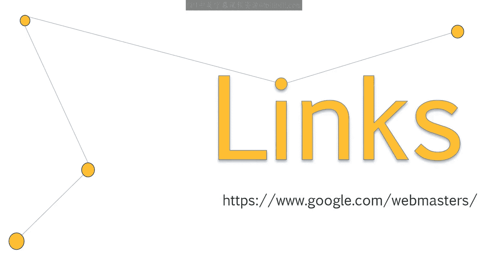
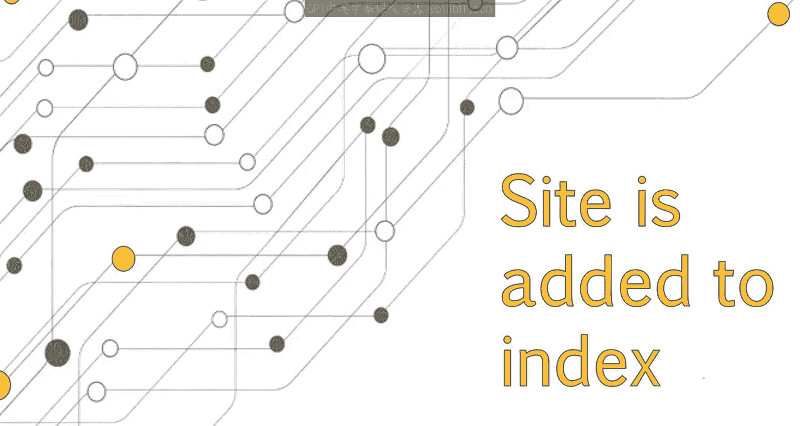
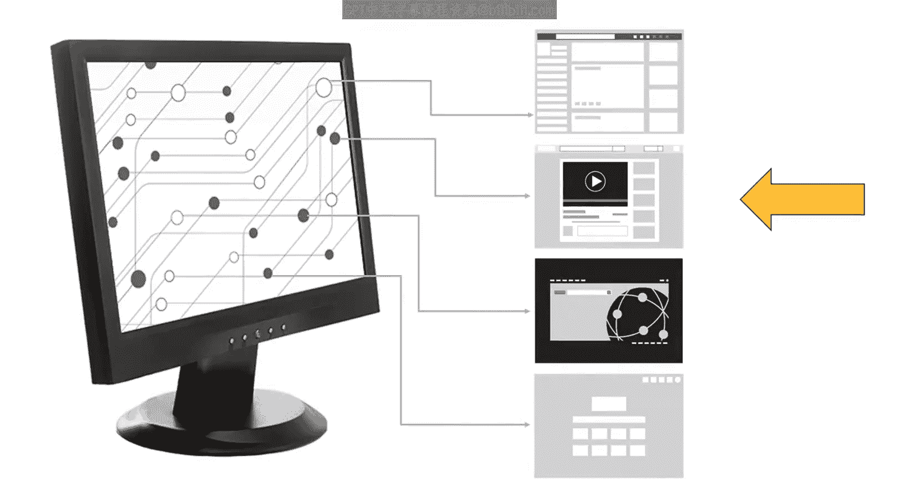

# 005：UCD《搜索引擎优化（谷歌、SEO基础、优化网站、进阶、毕业项目）｜Search Engine Optimization》中英字幕 p05 4_搜索引擎工作原理.zh_en -BV1N66VYsEue_p5-

Having looked at the current Seo landscape when it comes to careers。

 we're now going to dive in and take a look at how web searching works and learn all the parts that make up what we think of as a search engine。

You'll learn the role of links， robots， and indexing in relation to SEO and to searching the web in general。

Search engines have created programs known as robots。

 These robots are also called crawlers or spiders， and each search engine uses a robot unique to them。

 These robots crawl the web in an effort to discover new web pages and documents。 One way。

 robots discover new sites is through links。 If another website links to your website。

 This creates an easy path for robots to follow。 robots can use this map to explore the web and continually discover new pages In the early days of the Internet。

 Webmasters had to submit their site to search engines so it could be discovered by the robots。

Now， robots will find your site on their own。Adding your site to free services such as Google Webmaster tools will aid in this discovery process。

 Once a robot discovers a new page or site， it analyzes all of the content and data on the page to determine what the page is about and what topics it should rank for。

 The site is then added to a massive database also known as an index。

 Each page is cataloged so search engines can quickly reference the data when needed and return the appropriate results to user search query。

To help speed up the process， there are many data centers all around the world。

 which allow for a larger quantity of information to be accessed quickly。

When a user performs a search query， the search engines look through their index for web pages they have crawled and analyzed。

 They then return the results in a fraction of a second。 In that fraction of a second。

 a search engine has to first determine which results are the most relevant to a user's query and also rank those results。

 according to the authority of a website。 Our job as Seos is to understand what makes a website considered highly relevant for a search query。

 In the past， search engines would only look at the content on your page。

 or which words also known as keywords were used most frequently。

 search engines have grown a lot smarter。 And today。

 there are hundreds of factors influencing the relevance of a search result。

 These factors are all part of an algorithm， which we will discuss next。

