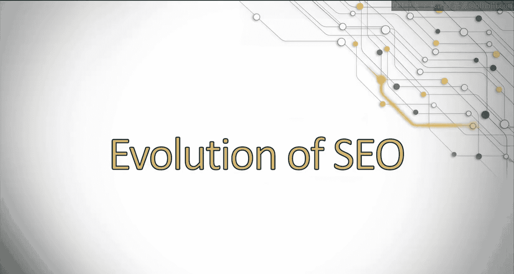
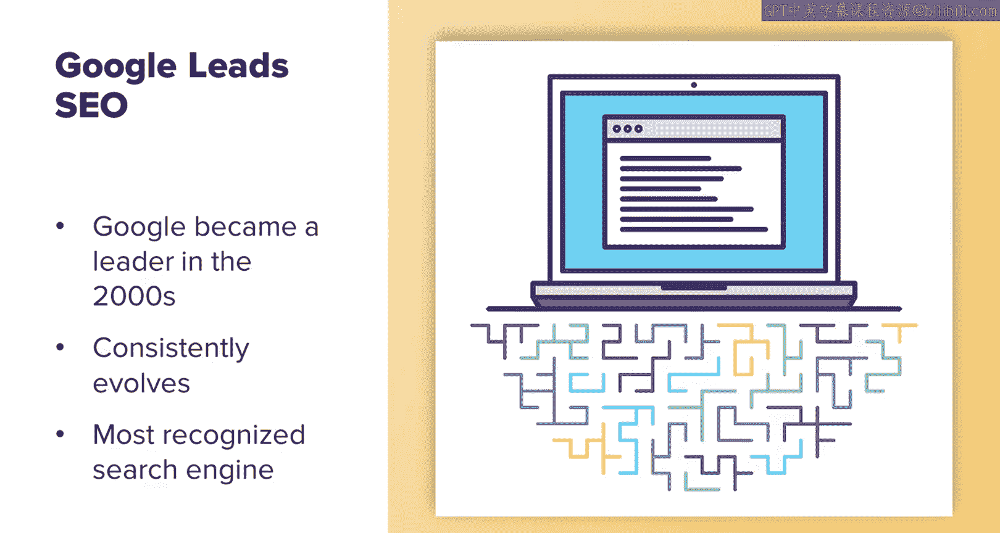
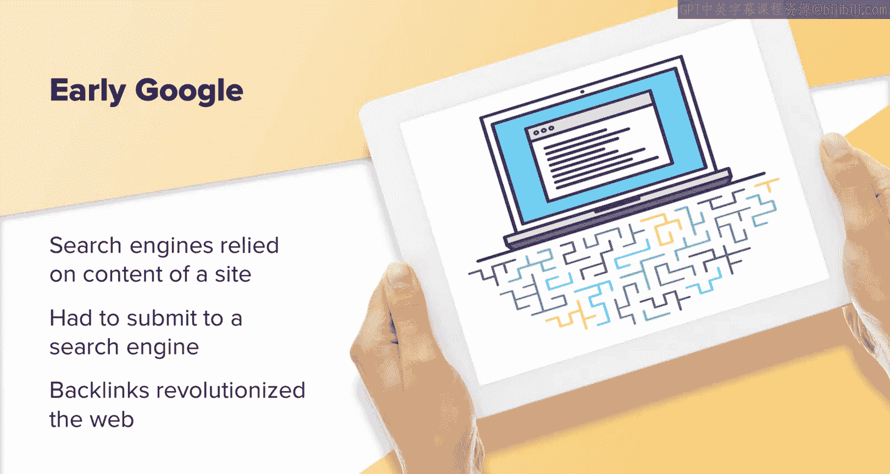
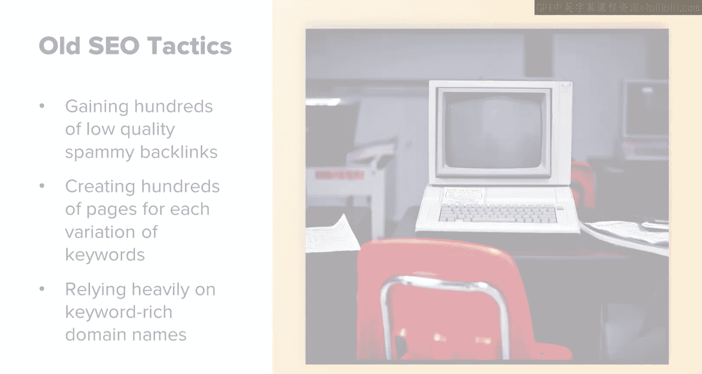
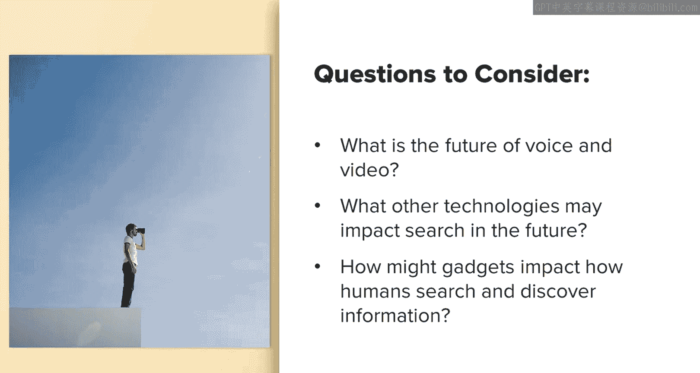

# 006：UCD《搜索引擎优化（谷歌、SEO基础、优化网站、进阶、毕业项目）｜Search Engine Optimization》中英字幕 p06 5_SEO发展历程.zh_en -BV1N66VYsEue_p6-

Let's briefly discuss the evolution of Seo。 This is important to understanding how Se started and what the future may hold。

Google has been a leader in the search space for so long now that many people forget what the internet or search engine was like before Google came around。

Since Google entered the scene， it has consistently evolved and SEOo with it。

And that provides us with the search experience we recognize today。

When Google was first introduced to the public， the algorithm largely consisted of finding and ranking content based on backlink to a site and evaluating the content on the site。

These are still major parts of the algorithm today， but now hundreds of new factors are added in。

Before Google， search engines mainly relied on the content of a site alone to rank it for relevant search queries。

In order to discover your website， you also had to submit it to search engines。

The addition of backlinks to evaluate websites and content was revolutionary in both discovering new sites and gauging the authority of a website。

The early days of Seso were still very wild west。 It was a pretty lawless land with the mentality of anything goes if it works。

😊，Back then， things like domain penalties didn't exist。

Any and all tactics could be used to rank website， and now many of those tactics are thought of as spammy and could get your site penalized。

There are many common tactics pd in the early days of Seo that have the potential of getting your site banned now and would be considered either black hat or just poor Seo practices。

Some common old school tactics were things like adding a ton of keywords you wanted to rank for to your content。

 often hundreds and hundreds of times。Adding a lististic keywords as white text over a white background so search engines could see it。

 but users couldn't。Gaiing hundreds of low quality and spammy backlinks。

Creating hundreds of pages for each variation of keywords。 So for example。

 blue pants and blue trousers and blue slacks。And relying heavily on keyword rich domain names。

I included a link to a video on how black Ha Seo has changed over the years。

 which has interesting insights on how Seo in general has evolved。

 I recommend you taking a moment to watch it。

Google used to allow Webmasters to see what their website's score was based on backlink。

This was called Pagernk， which is named after Larry Page， one of the creators of Google。

You will still see that term used today pay ranks still exist。

 but it is a much more in depth and secretive metric than it was in the early days。

Knowing the pay rank of your site and other competing sites allowed Webmasters to easily build websites purely for link building。

And many were even able to rake in a lot of extra cash to charge for placement。

We will discuss pay drink and link building in later lessons。

In an effort to cut down on spammy sites and tactics。

 Google slowly began adjusting and improving their algorithm in an effort to provide an improved user experience。

Many improvements were made from personalized search to giving Webmasters more insight and control into their domains。

They did things like launched Google Analytics and search consoleole。

 which is formerly called Google Webmaster Tools to give website owners more insight into how Google views their website。

While Google really helped SEO become more mainstream and involved。

 it's important to remember other factors that impact SEO today。

Think of the big picture when thinking of Seo。When you look at the term search engine optimization。

 remember that search engine is now many things beyond the basic search engine that we can think of。

For example， social networks are search engines as well。

Learning their individual algorithms to gain more visibility is also something SEOs can focus on for the feature。

This is especially important as Google's algorithms continue to look more and more into things like branding and social presence across the web as trust factors。

I included a link to an article about how reputation management is becoming more important as Google looks at reputation around the web on review sites。

 social networks and more。I suggest you take a moment to read it。

It's important to continue looking ahead。 Google continues to make improvements to their algorithm in favor of user experience and providing a trustworthy experience。

It's important to look ahead to what SEO may encompass in the future。Consider questions， such as。

What is the future of voice and video。These are already big parts of our search experience。

 but how can they become more integrated into the future？

What other technologies such as AR might impact search in the future？

How might gadgets such as watches， glasses， and more impact how humans search and discover information？

While these may not make a big impact in your daily life to day。

 it's really important to think ahead。As we look into the future。

 it's always a good idea to ask yourself questions that make you think of what improvements Google may have around the corner。

This can help you stay fresh and ahead of the game。

