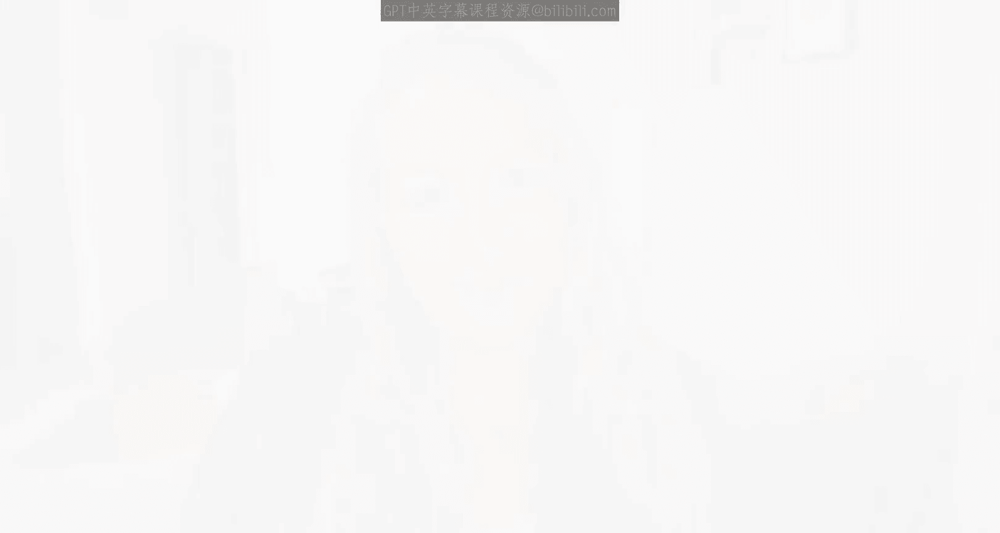
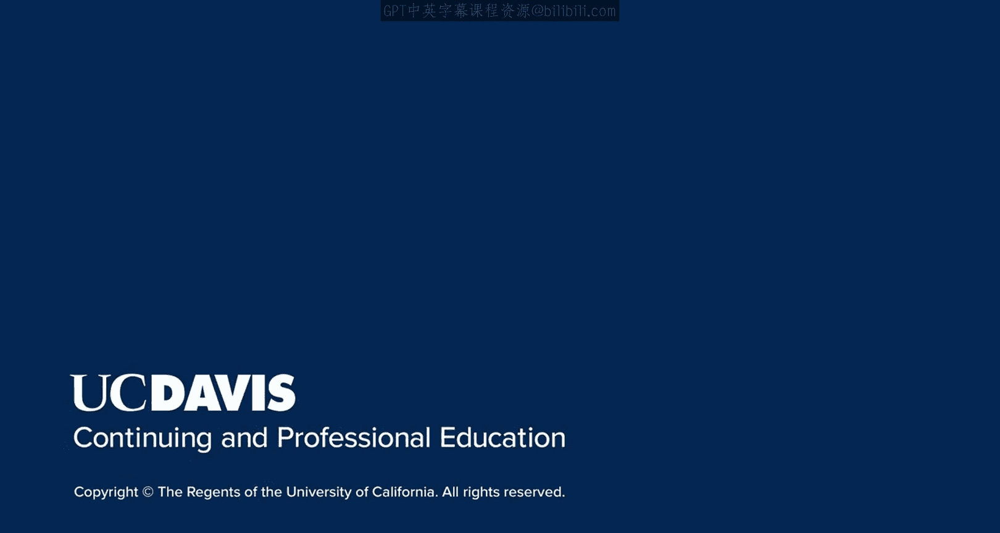

# 007：当前SEO最佳实践

在本节课中，我们将要学习当前搜索引擎优化（SEO）的核心最佳实践。我们将探讨谷歌如何判断网站的相关性，以及如何避免被搜索引擎视为垃圾网站，从而帮助您的网站在搜索结果中获得更好的排名。

## 从历史到实践

上一节我们介绍了搜索引擎的历史和SEO的演变过程。本节中，我们来看看一些具体的、能直接影响您网站排名的关键因素。遵循这些最佳实践至关重要，否则您的网站可能永远停留在搜索结果第十页，无法被用户发现。

## 理解谷歌的核心目标

我们知道，谷歌希望向用户返回最相关的结果。因此，让我们探讨谷歌如何确定相关性，以及如何过滤垃圾网站。了解这些，既能帮助您避免被谷歌误判为垃圾信息，也能让您的网站通过SEO被更多用户看到并吸引他们。

以下是您作为一名SEO从业者，需要深入理解的一些具体算法和因素。

### 核心排名因素

*   **内容质量与相关性**：谷歌的算法（如**RankBrain**）会评估您网页内容与用户搜索查询的匹配程度。高质量、原创且深度覆盖主题的内容更受青睐。
*   **用户体验信号**：包括页面加载速度（可通过**Core Web Vitals**指标衡量）、移动设备友好性以及网站浏览的直观性。
*   **权威性与信任度**：这主要通过其他高质量网站链接到您网站的数量和质量（即**反向链接**）来体现。公式可简化为：`权威度 ∝ 高质量反向链接数量`。
*   **技术SEO健康度**：确保网站结构清晰，便于搜索引擎抓取和索引。例如，拥有一个正确的 `sitemap.xml` 文件和无死链（404错误）的网站。

### 必须避免的陷阱

*   **关键词堆砌**：在内容中过度重复关键词，意图操纵排名。这会被算法识别并惩罚。
*   **购买低质量链接**：从垃圾网站或链接农场获取链接，这严重违反谷歌指南。
*   **隐藏文本或链接**：使用与背景色相同的文字来隐藏关键词，这对用户不可见，但企图欺骗搜索引擎。
*   **抄袭内容**：发布非原创的、复制自其他网站的内容。

## 总结

本节课中我们一起学习了当前SEO的核心最佳实践。我们了解到，成功的SEO建立在提供高质量内容、优化用户体验、建立真实权威以及保持技术标准的基础上，同时必须严格避免任何企图操纵排名的黑帽手法。理解并应用这些原则，是让网站在谷歌搜索结果中获得可见性的坚实基础。