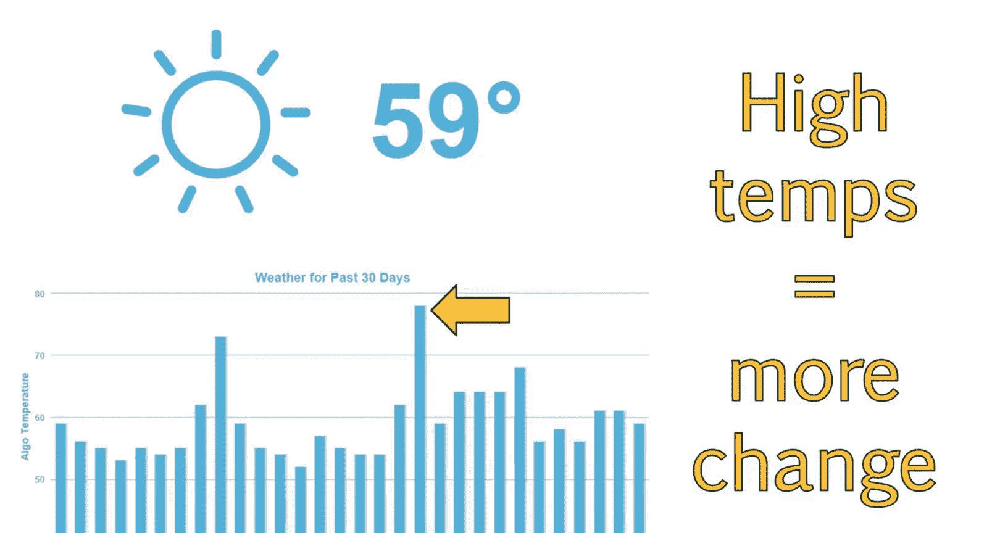
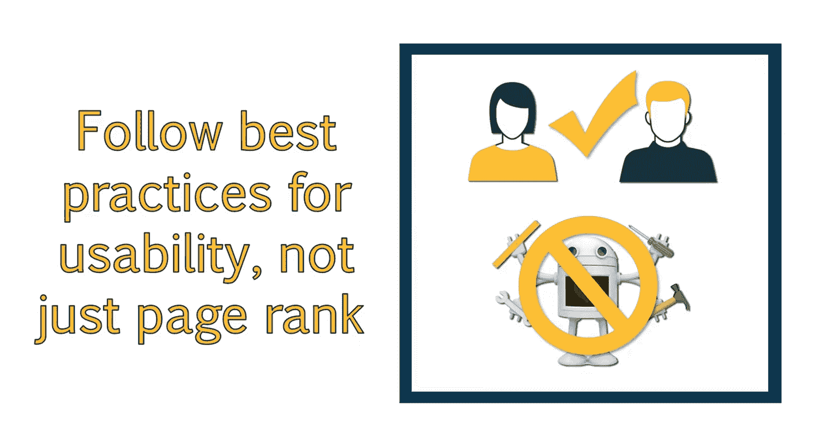

# SEO基础教程：008：搜索引擎算法导论 🧠

在本节课中，我们将学习搜索引擎算法的基本概念，了解SEO从业者如何监控算法更新及其影响，并掌握保持网站长期健康发展的核心策略。

---

## 什么是搜索引擎算法？

上一节我们介绍了搜索引擎的目标，本节中我们来看看它们如何通过算法实现这些目标。

搜索引擎使用算法来确定网站的质量、主题，以及网站应出现在哪些搜索查询的结果中。算法还用于决定特定网站在特定查询的搜索结果中的排名位置。存在许多不同的算法，它们会考察围绕网站的数百个因素。作为SEO从业者，我们的工作是确定哪些算法关注哪些因素，以便优化网站以满足其标准。

## 搜索引擎的目标与商业模式

所有搜索引擎都有相同的目标：为用户搜索查询提供相关信息。如果搜索引擎无法及时提供用户寻找的结果，用户就会转向其他搜索引擎。请记住，虽然我们可以免费使用搜索引擎，但搜索引擎本身是盈利性业务。每次执行搜索时，都会显示一系列自然搜索结果和付费广告结果。在某个搜索引擎上执行的搜索越多，就会有越多的人被吸引到该搜索引擎购买广告位。这意味着，如果谷歌只展示广告而不展示自然结果，用户很快就会对提供的结果感到厌倦，并转向其他地方。为了留住用户，搜索引擎必须提供良好的自然结果和广告组合，以吸引用户并让他们持续使用。

## 排名因素与算法更新

通过多年研究搜索引擎和进行测试，SEO社区已就许多影响网站及其排名的不同因素达成共识。其中一些因素仍存在争议和推测。每年，知名的SEO工具和社区Moz都会提供一份他们认为的当年最重要排名因素列表。这份列表总是值得一读，可以深入了解SEO领域的变化以及最佳关注领域。虽然你可能还不理解这些不同的因素，但我建议你查看学习材料中提供的页面并将其添加为书签。它将在你的SEO职业生涯中证明有用，并且你会多次参考它。

我们关注的主要算法是由谷歌创建和维护的算法。这是因为谷歌拥有最高的市场份额。我们知道谷歌使用了超过200种不同的排名因素或信号来理解和排名网站。除此之外，每天都有算法更新。这些更新可能并不总是巨大的，或者直接影响你的网站。但重要的是要了解，谷歌的算法在不断变化，以便为用户提供最佳结果。在一年内，算法将进行超过500次更新。由于更新如此之多，我们必须依靠自己来注意这些变化以及它们如何影响搜索结果。

## 如何监控算法更新

谷歌只会宣布他们所做更新的一小部分。而且通常，他们对于具体更新了什么以及何时更新非常模糊。保持对搜索引擎结果变化的警惕非常重要，这样你才能了解更新何时发生、可能是什么变化，以及你是否需要对网站进行调整。

保持对算法潜在变化警惕的一种方法是使用Moz创建的工具。这个工具叫做Mozcast。它提供一份报告，显示一段时间内算法的波动情况。波动是通过研究排名波动来衡量的。温度较高的日子，排名波动的百分比更高，意味着更多人经历了显著变化。这可能暗示算法更新已经推出。每当你注意到排名或流量发生重大变化时，最好查看一下Mozcast，以了解其他网站管理员是否可能遇到类似问题。

以下是Mozcast报告的示例：

在这个例子中，你可以看到，我查看的那天非常“温和”，很可能没有发生什么。但这里有一些日子，温度远高于平均水平，这可能表明进行了小的更新。请花点时间访问 Mozcast.com，查看你观看此视频日期当前的“天气”状况。我建议通读Mozcast，以了解更多关于他们选择的样本数据以及他们用来生成此报告的指标。

## 采取主动的SEO策略

由于算法在不断发展，对你的SEO工作采取主动的方法非常重要。否则，你将不断追逐算法，然后根据已发生的变化更新你的网站。最好的方法是查看过去发生了哪些类型的更新，并思考谷歌的最终目标是什么。然后，你可以以一种经得起时间考验的方式来优化你的网站。这意味着遵循我们在本课程中将阐述的许多最佳实践，以及以用户而非搜索引擎为中心来优化你的网站。遵循谷歌的最佳实践对于确保你的网站不会因算法更新而受到惩罚或封禁大有帮助。

我已提供一个由谷歌制作的视频链接，标题为“谷歌如何改进其搜索引擎算法”。

请在继续之前花点时间观看该视频。

---

## 总结

本节课中我们一起学习了搜索引擎算法的核心概念。我们了解到算法是搜索引擎用于评估和排名网站的核心机制，它们不断更新以提供更好的搜索结果。我们介绍了监控算法更新的工具（如Mozcast），并强调了采取主动、以用户为中心的SEO策略的重要性，这有助于网站长期稳定地获得良好排名。记住，理解算法的本质是制定有效SEO策略的基础。