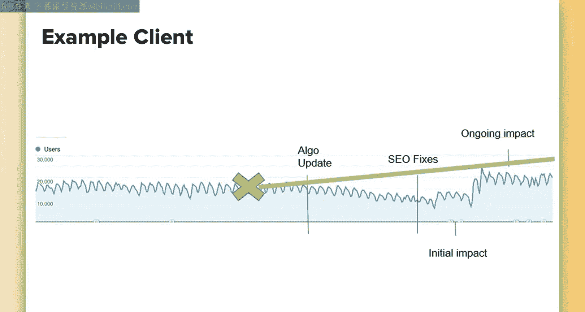
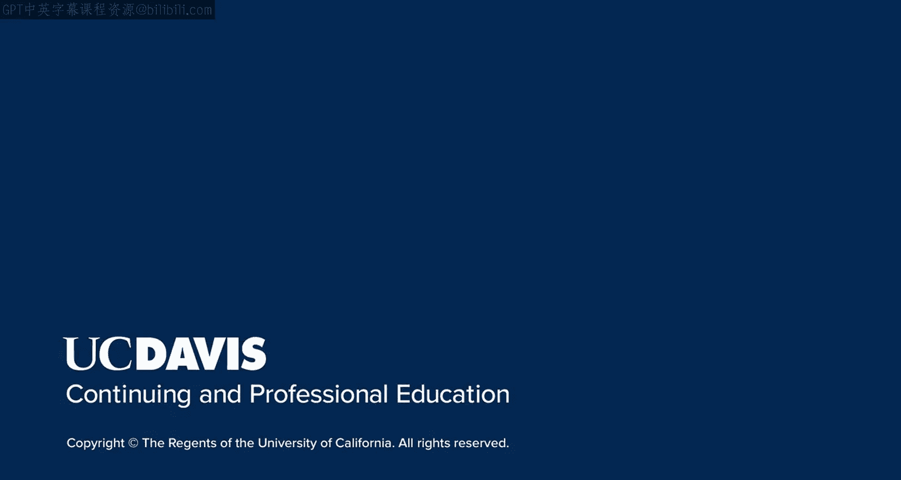

# 009：UCD《搜索引擎优化（谷歌、SEO基础、优化网站、进阶、毕业项目）｜Search Engine Optimization》中英字幕 p09 8_算法更新史 第一部分.zh_en -BV1N66VYsEue_p9-

Let's briefly discuss Google's use of algorithm updates to keep their search engine results high quality and how having a proactive mindset to SEO。

Can help you prepare for future updates and win the day。Google is the world's leading search engine。

And they've become so well recognized because they focus on providing quick and accurate results to a user's query。

In order to do this， their search engine uses a variety of algorithms that work behind the scenes to quickly analyze a user's query and return the most relevant and high quality results。

In order to stay on top of the game， Google makes regular updates to their algorithm in an effort to continue to deliver those high quality results。

In fact， they make thousands of updates to the algorithm each year。

This means in a single day you can see many， many updates。Now。

 not all of these updates will be game changers。 Some are barely recognizable。

Others are considered core updates and drastically change search。

Sometimes updates and changes are so big， there are even updates to updates。

Most of the major updates have names。 These names are often given by Ses to reference the updates。

And sometimes Google adopts these names as well。Other times。

 Google will announce the name themselves ahead of time。

Especially when the update is particularly important。For example。

 Bt is one of these algorithms named by Google， which we'll discuss shortly。As an SEO。

 it's a good idea to familiarize yourself with the history of Google's updates。

Being able to spot patterns in Google's behavior is important to being proactive in SEO。

You should be able to predict what Google made you next and fold this into your recommendations and strategies。

Thinking ahead and following best practices will help you stand the test of time and be ahead of the curve when an update happens。

I'd like to discuss a cautionary tale about a past client of mine。

This will help illustrate why it's so important to be proactive in SEO。Now。

 I can't discuss who this client is or divotege certain specific details。

 but I'll discuss it kind of broadly to give you an idea of what the situation was and how you can avoid this in the future。

At an agency， one of the biggest mistakes I frequently saw were businesses that were reactive in their Seo needs。

 rather than being proactive。 This means that they waited for an update to hit and often started seeing a negative downward trend in traffic in order to jump on it and start doing things to mitigate that effect。

So this particular client happened to have a ton of pages。

 and these pages often had just a few sentences of content。

 and oftentimes the content was repetitive or duplicated from page to page。On top of that。

 all of these pages randomly linked together， there were semi relevant pages。

 and it all created just a poor experience for users and a subop crawling experience for search engines。

With SEO， a problem arises when websites are getting by by providing a mediocre experience。

This is unfortunate because when decision makers who rely on data to make their decisions。

See traffic in numbers as stable。 They then have a false belief that they're fine and they just need to put optimization efforts elsewhere on the site in order to start seeing positive returns。

So in this case， my immediate suggestion to the client was to look at that issue and condense the amount of thin pages and content that they had on their site and then add quality content to the remaining ones。

Now， the pushback received on this was it wasn't currently harming them。

 and this was a very time and resource intensive project to take on。

 so because they weren't seeing negative effects， they didn't want to prioritize this over other potentially beneficial recommendations。

Unfortunately， a few months later， an algorithm update hit。 and as I predicted， the site was harmed。

 Now， they had two different sites。 One of their sight suffering from similar issues as this saw a 30 per cent drop in traffic overnight。

😔，Now， their main sight， which luckily had some decent authority and quality pages to it。

 saw a more slow but sure negative impact。This resulted in a need for them to scramble and divert resources to correct this issue when they could have prevented it in the first place。

This then took away resources from other important matters at the time。

I have some advice for those of you dealing with issues like this， where， you know。

 best practices aren't being followed， and， you know。

 it's only a matter of time before they see a negative impact。

These situations are always tough because you can't produce data to show that it's currently harming them。

So in situations like this， the next best step is to find a case study of similar instances where companies were hit post algorithm update。

These can often be argued that had they been following clear best practices and good SEO hygiene from the beginning。

They wouldn't have seen the negative impact that they did。

You can then translate that into what it means for this business。

So quickly back to this example to show you how it worked out。😊。

Once we were able to go in and make the improvements that we originally recommended。

We not only saw a correction to the algorithm update， but an improvement to overall SEOo。After all。

 had they fixed the changes here when we recommended？

The upper trend would have looked more like this。So even though this ended up turning into an Seo win。

 you can still see there's a lot of missed opportunity with traffic and lost revenue。

This is because the hill they ended up needing to climb after taking it from Google and being considered lower quality was much higher。

Then the hill that they needed to climb had they just applied these changes ahead of time。

 they probably wouldn a new Vi and had a hill。 They would have just been racing ahead。

 getting traffic and more revenue and building up that authority for the longer term。

