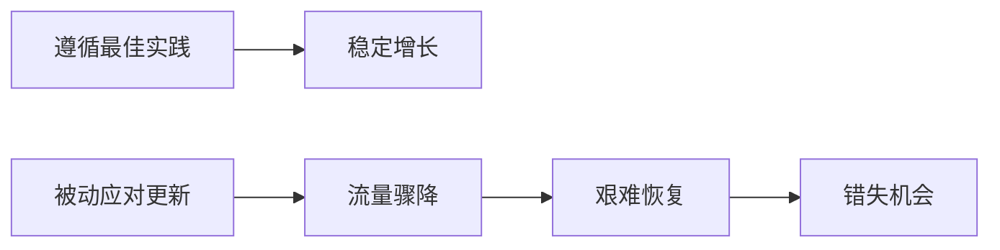

# 009：算法更新史（第一部分）📜

在本节课中，我们将学习谷歌如何通过算法更新来维持其搜索结果的高质量，以及为何在SEO工作中保持前瞻性思维至关重要。理解算法更新的历史与模式，能帮助你更好地为未来变化做准备，从而在竞争中保持优势。

---

谷歌是全球领先的搜索引擎。它之所以获得广泛认可，是因为其始终致力于为用户查询提供快速且准确的结果。为了实现这一目标，谷歌搜索引擎在幕后运行着多种算法。这些算法能快速分析用户查询，并返回最相关、最高质量的结果。

为了保持领先地位，谷歌会定期对其算法进行更新，以持续提供高质量的结果。事实上，谷歌每年会进行数千次算法更新。这意味着在一天之内，就可能发生多次更新。

并非所有更新都会带来颠覆性变化。有些更新几乎难以察觉，而另一些则被视为核心更新，会显著改变搜索生态。有时，更新和改动如此之大，甚至会出现“更新的更新”。大多数主要更新都有名称。这些名称通常由SEO从业者命名以方便指代，有时谷歌也会采纳这些名称。在其他时候，谷歌会提前自行宣布更新名称，尤其是在更新特别重要时。例如，**BERT**就是谷歌自己命名的算法之一，我们稍后会讨论。

作为一名SEO从业者，熟悉谷歌的更新历史是一个好主意。能够洞察谷歌行为模式对于采取主动的SEO策略非常重要。你应该能够预测谷歌下一步的行动，并将这种预测融入你的建议和策略中。提前思考并遵循最佳实践，将帮助你的网站经受住时间考验，并在更新发生时领先一步。

---

上一节我们了解了算法更新的普遍性和重要性，本节中我们来看一个具体的警示案例。这个案例将说明为何在SEO中保持前瞻性如此关键。

我想分享一个过去客户的警示故事。这有助于说明为什么在SEO中采取主动态度至关重要。虽然我不能透露客户的具体信息或细节，但可以大致描述情况，让你了解发生了什么以及未来如何避免。

在代理机构工作时，我经常看到企业犯的一个最大错误是：他们在SEO需求上采取被动反应，而非主动预防。这意味着他们总是等到算法更新冲击后，看到流量开始出现负面下滑趋势时，才匆忙采取措施来减轻影响。

这位特定的客户拥有大量网页。这些网页通常只有寥寥几句内容，而且内容经常在不同页面间重复或雷同。此外，所有这些页面被随意地相互链接，其中一些页面只是半相关。这共同为用户创造了糟糕的体验，也为搜索引擎带来了次优的爬取体验。

在SEO中，当网站仅靠提供平庸的体验而勉强维持时，问题就会出现。这很不幸，因为依赖数据做决策的管理者看到流量数字稳定时，会产生一种错误的信念，认为一切安好，只需将优化工作放在网站其他地方就能看到积极回报。

因此，在这个案例中，我立即向客户建议：审视这个问题，合并网站上那些内容单薄的页面数量，并为保留的页面添加高质量内容。然而，我收到的反馈是：这目前并未对他们造成损害，而且这是一个非常耗时耗资源的项目。由于他们没有看到负面影响，因此不想将此建议优先于其他可能带来收益的建议。

不幸的是，几个月后，一次算法更新来袭。正如我所预测的，网站受到了损害。他们当时有两个不同的网站。其中一个存在类似问题的网站，流量在一夜之间下降了**30%**。而他们的主站，幸运的是拥有一定的权威性和一些高质量的页面，遭受了更缓慢但确凿的负面影响。

这导致他们需要仓促行动，并抽调资源来纠正本可预防的问题。而这又分散了当时处理其他重要事务的资源。

---

对于那些你明知未遵循最佳实践，并且负面影响只是时间问题的类似情况，我有一些建议。这些情况总是很棘手，因为你无法提供数据证明当前正在造成损害。

在这种情况下，下一步最佳做法是找到一个案例研究，展示其他公司在算法更新后遭受打击的类似实例。这通常可以论证：如果他们从一开始就遵循明确的最佳实践和良好的SEO规范，就不会遭受那样的负面影响。然后，你可以将此转化为对该业务意味着什么。

让我们快速回到这个例子，看看结果如何。😊

一旦我们能够实施最初建议的改进措施，我们不仅看到了算法更新带来的损害被修正，还看到了整体SEO表现的提升。毕竟，如果他们当初在我们建议时就进行了修复，上升趋势本应更像这样：

所以，尽管这最终变成了SEO上的胜利，你仍然可以看到其中存在大量的流量机会错失和收入损失。这是因为，在受到谷歌惩罚并被认定为低质量后，他们需要攀爬的“恢复之山”远比他们提前应用这些更改时需要攀爬的“预防之山”要高得多。如果他们提前进行了更改，可能根本不会经历低谷，而是一直向前冲刺，获取更多流量和收入，并为长期发展积累权威。

---

本节课中，我们一起学习了谷歌算法更新的基本逻辑及其对网站的重要性。通过一个具体的客户案例，我们深刻理解了被动应对SEO风险的代价，以及采取前瞻性策略、遵循最佳实践的价值。记住，在SEO的世界里，防患于未然远比亡羊补牢更为有效。在接下来的课程中，我们将继续深入探讨更多具体的算法更新。