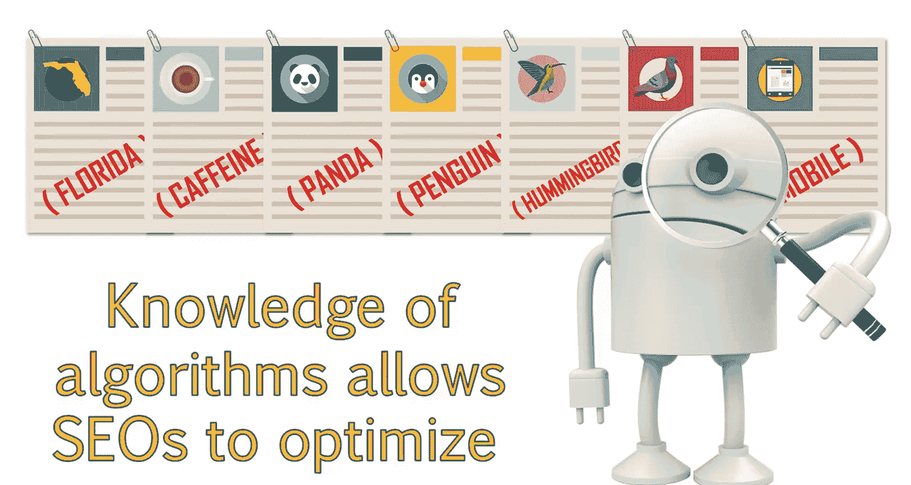

# 搜索引擎优化（谷歌、SEO基础、优化网站、进阶、毕业项目）：011：SEO最佳实践与排名因素 🧭

在本节课中，我们将学习搜索引擎提供商制定的最佳实践，以及这些实践如何为智能网页设计提供路线图。我们还将讨论网站的优化与过度优化，以及如何利用算法变化对网站产生积极或消极的影响。通过本次讨论，你将对关键的页面排名因素有更深入的理解。

---

## 算法演变与过度优化

上一节我们介绍了算法的基础知识。本节中我们来看看为什么算法会频繁更新。部分原因在于，网站管理员会操纵算法，使不相关的页面获得高排名。这给SEO行业带来了不好的名声。

当SEO从业者更多地了解算法后，一些人会针对这些因素进行**过度优化**。这迫使搜索引擎调整算法，以应对这些垃圾技术。

例如，发薪日贷款领域就是一个典型例子。谷歌不得不专门创建一个更新，来处理该领域臭名昭著的垃圾搜索结果。

因此，不过度优化你的网站是一个明智的选择。过度优化可能在短期内有效，但从长远来看并不可行。为确保你的网站不受惩罚或算法调整的影响，遵循最佳实践至关重要。

---

## 谷歌官方最佳实践

谷歌为网站管理员提供了一套应遵循的最佳实践，这有助于确保网站针对搜索进行优化。你可以在学习材料提供的链接中查看这些最佳实践的详细信息。在本课中，我们将重点介绍几个要点。

以下是谷歌推荐的核心最佳实践：

*   **提供高质量内容**：特别是你的**主页**。从用户体验角度看，这有助于用户立即了解你的网站内容及其如何满足他们的需求。从SEO角度看，主页是网站中权威性最高的页面，也是最终在搜索中排名的主要页面之一。向用户提供信息很重要，但让搜索引擎理解你的网站内容并给予适当排名同样重要。
*   **获取外部链接**：从其他网站获取链接是另一项重要实践。每个指向你网站的链接都会为你带来权威性。因此，高质量的外部链接越多，网站的权威性就越高，这有助于在搜索结果中获得更好排名。
*   **确保网站可访问**：确保你的网站对用户和搜索引擎都可访问。有些网站的编码方式导致用户能看到内容，但搜索引擎无法抓取。这被称为“隐藏”，可能导致惩罚。你的网站需要同时从用户和搜索引擎的角度提供价值，但用户体验应放在首位。
*   **建立清晰的网站结构**：拥有清晰的层级结构非常重要。如果你的网站结构导致难以找到内页，或难以理解网站不同部分的主题，将导致糟糕的用户体验。除了影响用户体验外，这也会使搜索引擎机器人更难抓取和分析网站。

请记住，谷歌公开的这些最佳实践只是冰山一角。还有许多其他因素潜藏在水面之下。

---

## SEO社区与排名因素探索

关于排名因素的更多信息，是通过搜索引擎代表参与的会议、博客、论坛和小组获得的。但大部分经验来自于SEO从业者持续测试他们的假设并监控变化。

SEO社区非常擅长合作，共同揭示排名因素、可能发生的变化，并帮助行业内的其他人。阅读博客、新闻并随时了解变化非常重要。

分析谷歌提交的专利也为我们提供了算法工作原理的见解，以及未来几年我们可能看到的变化。专利通常充满法律术语，可能难以理解。业内有一位名叫Bill Slawski的SEO专家，非常擅长审查专利并阐述他对专利中讨论的信息如何影响或可能影响SEO的解读。建议你阅读他的博客“SEO by the Sea”，特别是他关于专利的文章，这些内容非常有启发性且有趣。

---

## 排名因素的三大类别

通过对搜索引擎和算法的分析，SEO行业揭示了许多不同的排名因素。这些因素分为三个关键领域：

*   **页面因素**：指网站特定页面内的因素。
*   **站外因素**：例如外部链接和品牌提及。
*   **域名或网站级因素**：指可能影响整个网站的信号。这也涉及到**技术SEO**。

在本课程中，我们将更详细地讨论这些领域。但在此，我想简要介绍一下SEO从业者多年来发现的一些重要排名因素。

---

## 主要算法更新及其影响

虽然谷歌会持续更新其算法，但偶尔会有重大的算法更新，对整个SEO行业产生巨大冲击。这些变化通常对单个网站乃至整个行业都有重大影响。

由于这些重大更新都有名称，我们可以轻松识别某个特定排名因素可能源于何时，或者网站的问题可能归因于哪次特定更新。通过将潜在的SEO问题与特定更新联系起来，我们可以更好地理解影响网站排名能力的问题，并为改进网站提出适当的建议。

过去有过许多重大更新，接下来我将讨论一些我们今天仍然经常提及的主要更新。这些更新在当前SEO格局中扮演着重要角色。请继续关注下一课，我们将更详细地讨论每一次算法变化。

---

## 总结

本节课中，我们一起学习了搜索引擎算法的重要性，以及谷歌如何使用这些算法来改进搜索结果。理解谷歌如何使用这些算法，为SEO从业者提供了如何更好地优化网站并在搜索中获得更高排名的信息。接下来，我们将详细讨论具体的算法。