# 012：Panda算法更新 🐼

在本节课中，我们将主要学习被称为Panda更新的算法。虽然它并非传统意义上的算法更新，但Panda对搜索引擎格局产生了巨大影响。学完本课后，你将能够识别出SEO需要关注的各种问题页面，并了解如何避免受到Panda及其类似更新的影响。

现在，让我们转换一下思路。上一节我们讨论了算法更新的基本概念，本节中我们来看看一个具体的、影响深远的更新——Panda。

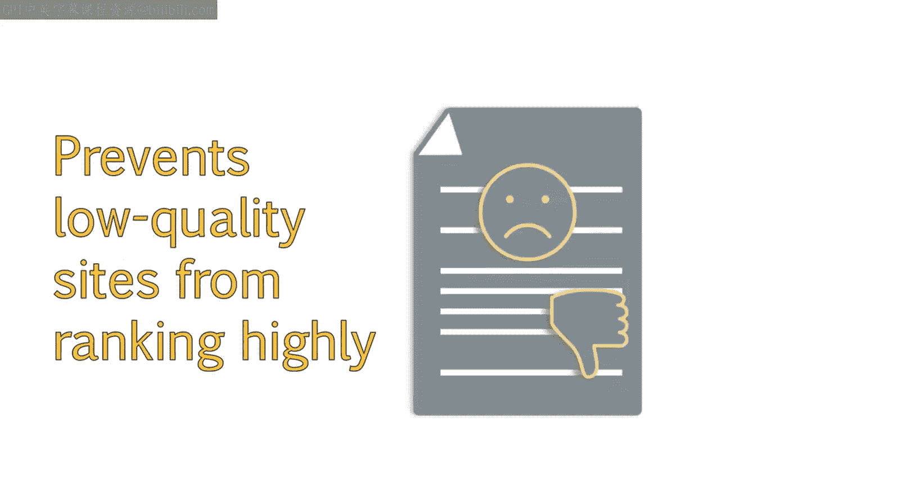

## Panda算法概述

我想讨论的第一个算法更新被称为Panda。它并非一次性变更，而是一个搜索过滤器，这意味着你会持续看到它不定时地推出更新。

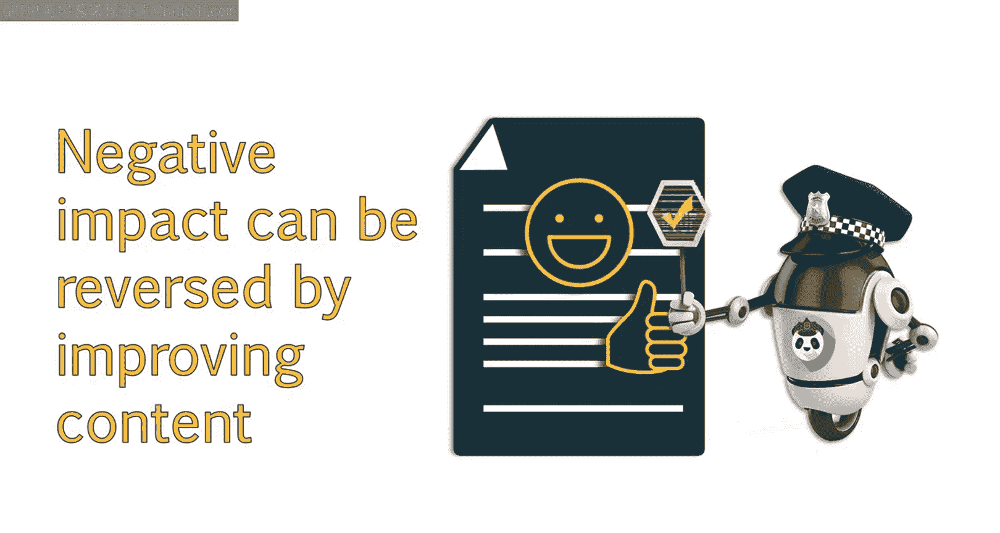

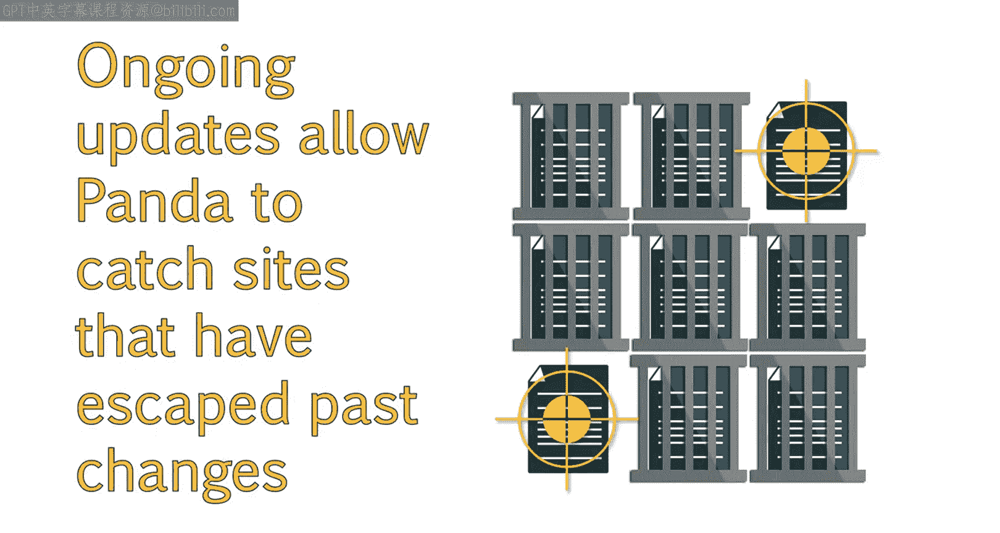

这个算法的创建目的是防止内容质量低的网站在搜索结果中获得良好排名。

## Panda更新的特点

由于Panda会定期（尽管时间不可预测）更新，这意味着如果你的网站曾在某次Panda更新中受到惩罚，但只要你花时间改进内容并对网站进行适当调整，就可以开始从惩罚中恢复。

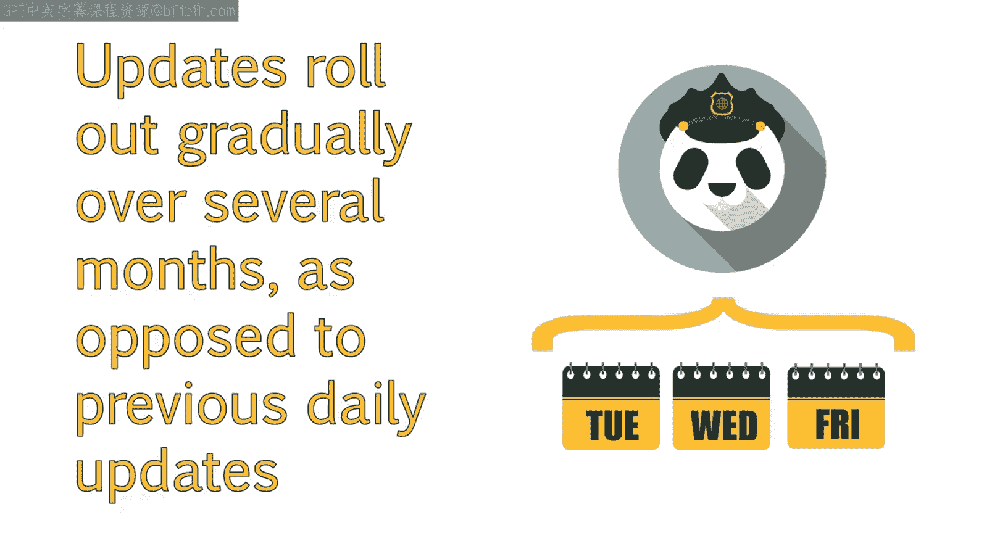

持续的更新也有助于捕获并惩罚那些可能逃过以往更新的网站。

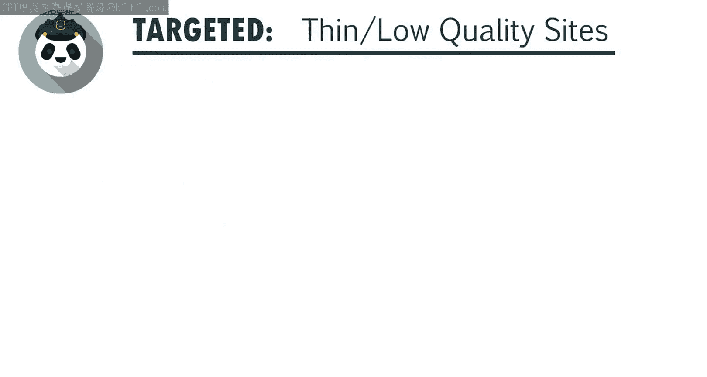

近来，Panda的更新不再是集中推出，而是在几个月内缓慢地逐步实施。谷歌已确认这是由于与技术更新相关的内部问题所致。此前，过滤器会在几天内应用，站长们能立即知道网站的变化是否源于Panda更新。

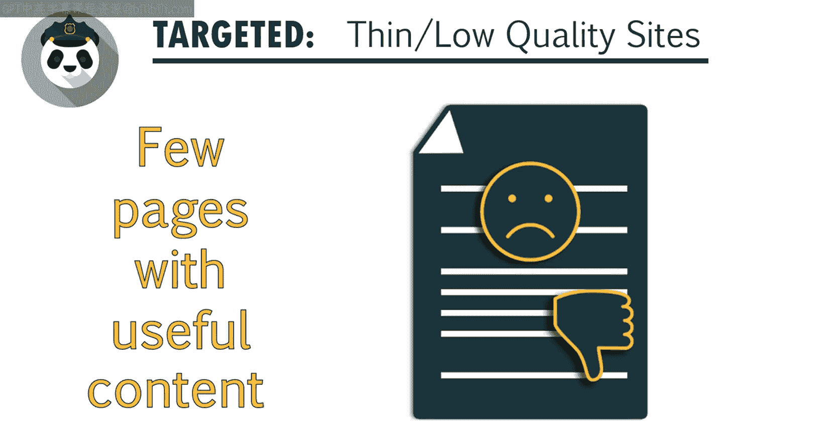

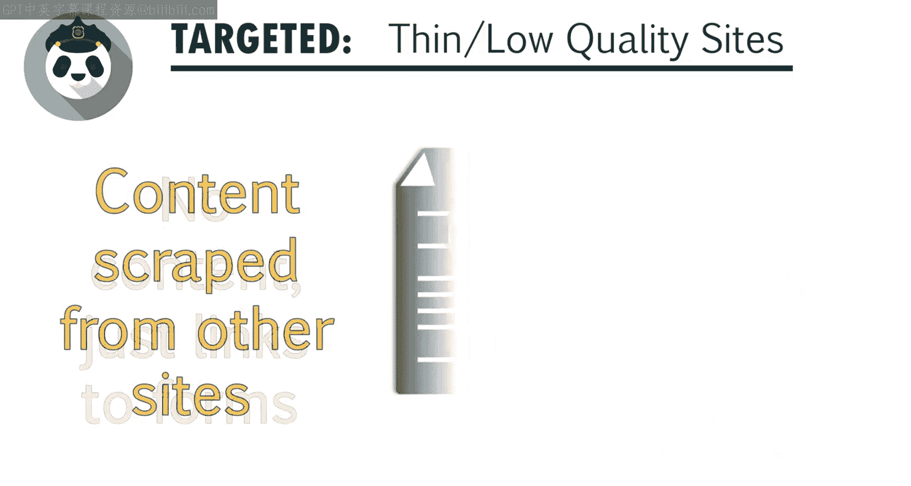

我建议你观看提供的Google Hangout视频，其中谷歌的John Mueller回答了有关Panda推出过程的问题。该讨论从视频开始持续约七分钟。链接已附在你的学习材料中。

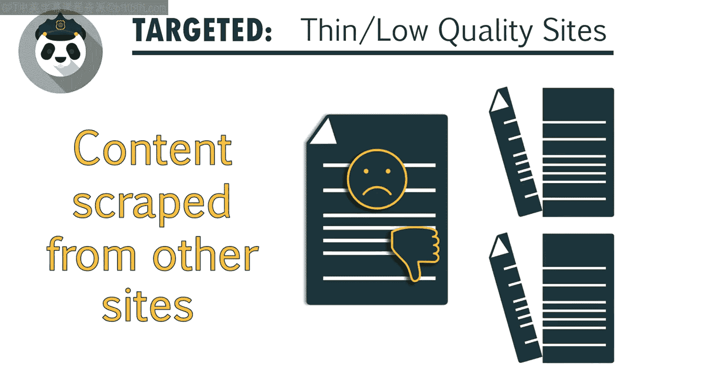

## Panda针对的目标

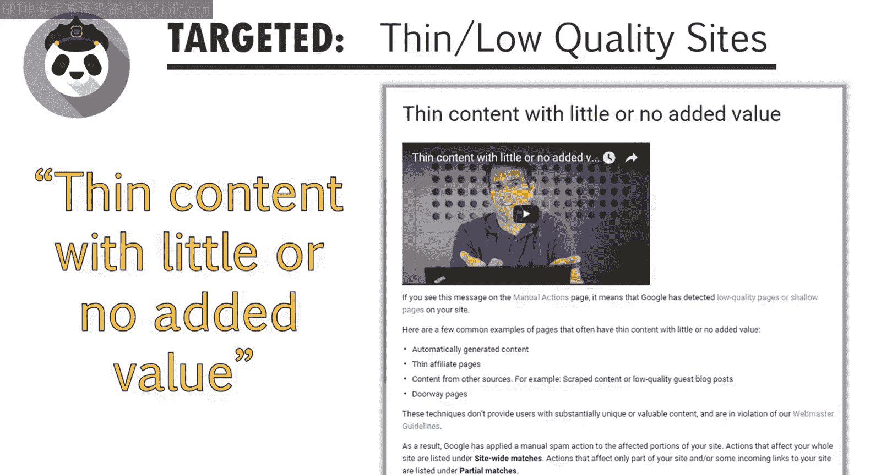

我们所知的Panda主要针对低质量或“单薄”的网站。

“单薄”意味着网站包含对用户有用或信息丰富的页面非常少。这可能包括：内容大体相同的页面、没有内容的页面、导向表单的页面，或是内容来自网络其他页面（聚合或抓取）的页面。

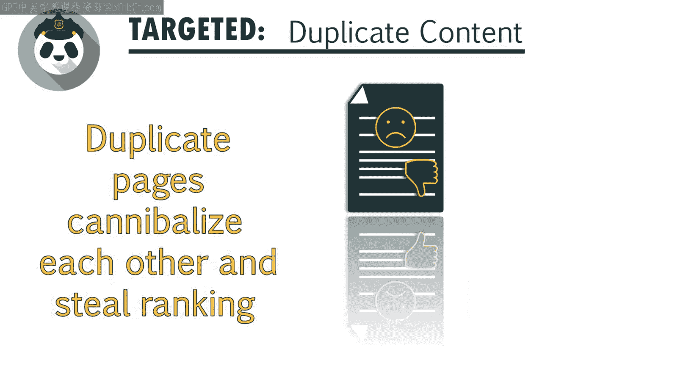

为了更好地理解谷歌认为什么是“单薄内容”，请阅读谷歌支持页面《**Thin content with little or no added value**》（添加价值极少或没有的单薄内容），并观看内嵌视频。我已在你学习材料中提供了该资源的链接。

## 重复内容问题

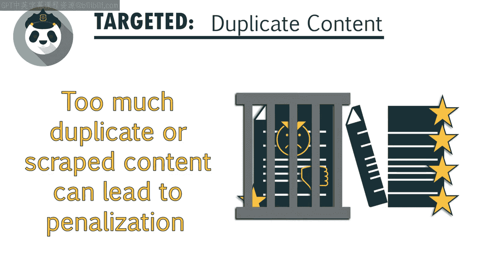

Panda会寻找的另一个问题是重复内容。这可能指你网站内部重复的页面，或是你从其他网站抓取内容并放置在自己网站上的页面。

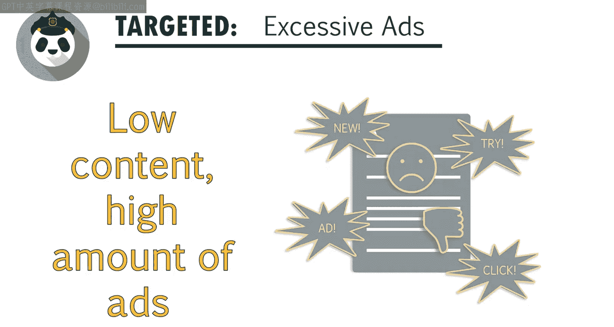

由于这些重复页面没有提供额外价值，它们排名不会好。你自己网站上的重复页面最终会相互蚕食流量，导致两者都无法获得应有的排名。

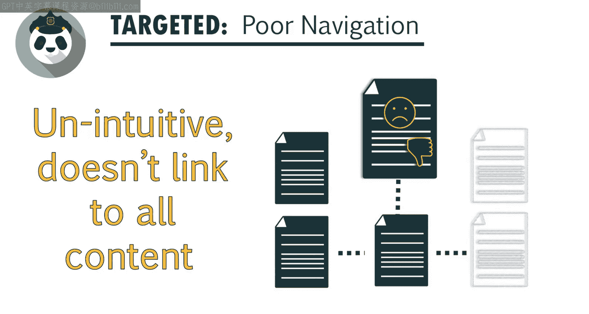

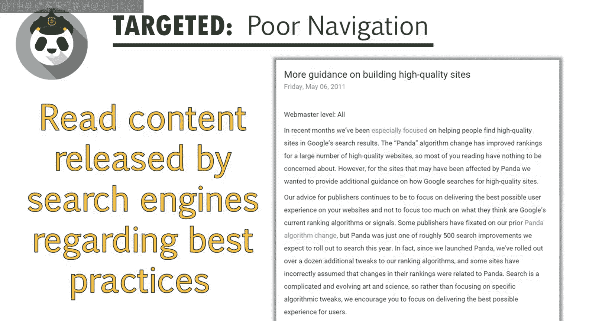

通常，对于从其他网站复制或抓取的内容，首先发布该信息的网站将获得认可并为此内容排名，而复制内容的网站则排名不佳。在某些情况下，如果你拥有大量抓取的内容，你的网站可能会受到惩罚。

## 其他可能触发Panda惩罚的因素

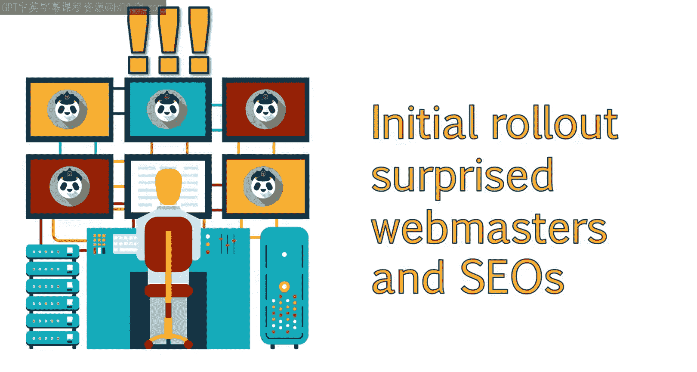

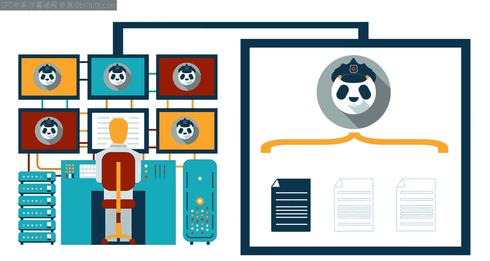

可能触发Panda惩罚的其他因素包括网站上过多的广告。

如果你的页面内容很少却被广告包围，这并没有为用户提供太多价值，该页面排名就不会好。这会被视为一个单薄页面。

谷歌还会查看你网站的导航等因素，判断导航是否直观以及是否链接到你所有的内容。

因此，你必须确保为用户提供良好的用户体验。

谷歌在其官方博客上发表了一篇文章，就如何建设高质量网站提供了一些指导。我建议阅读所提供链接的文章。

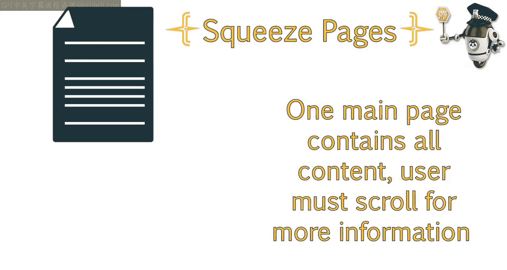

## Panda更新的影响与案例

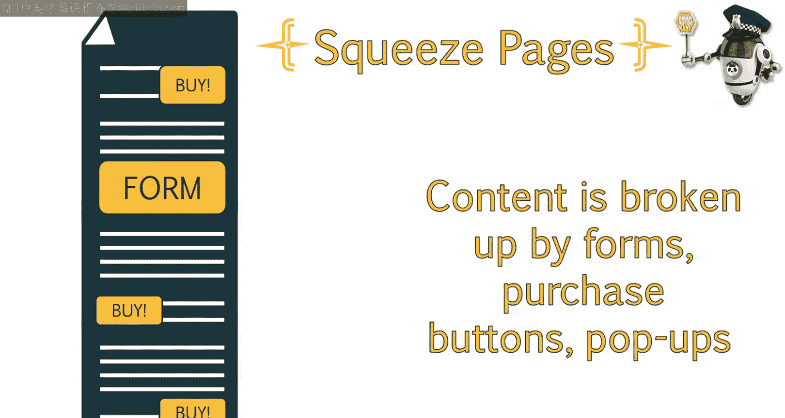

最初的Panda推出让许多站长和SEO从业者感到意外。我们知道更新趋势的变化旨在让站长为用户提供更多价值，但这次更新对许多网站打击沉重，其中一些再未恢复。

网站“panalized.com”的创建就是为了追踪Panda如何影响大型网站。当该算法推出时，几个知名网站受到严重影响，有些再未恢复正常。以下是该网站的一些图表，你可以直接访问该网站查看更多Panda过滤器如何影响这些网站的例子。

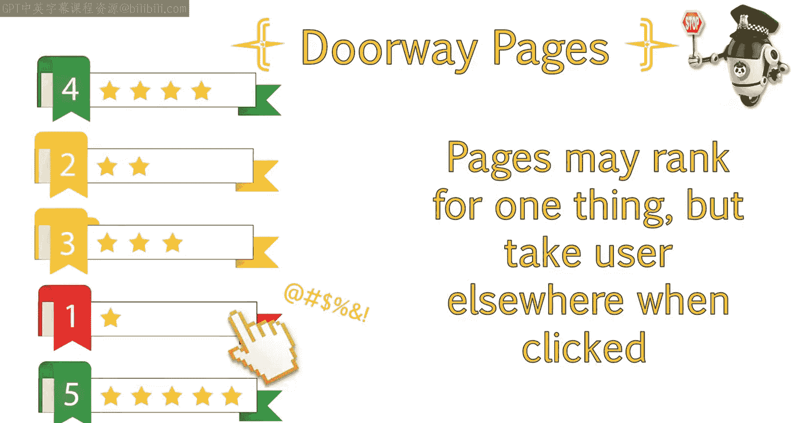

以下是Panda针对的一些内容类型示例：

*   **自动生成内容**：也称为“伪原创”内容，由程序创建并插入相关关键词，但文章通常是胡言乱语或写得极差，用户难以理解。
*   **挤压页面**：类似于着陆页，一个主页面包含所有内容，你必须不断向下滚动以获取更多信息。内容通常被表单和“立即购买”按钮打断。你有时会遇到难以退出的网站，因为弹出窗口会要求你取消操作。
*   **门页**：为搜索引擎而非用户构建的页面。这些页面通常为某一事物排名，但点击后会将用户重定向到关于另一个主题的页面或网站。这通常出于商业或恶意目的。为了让页面显示在搜索引擎中，站长经常使用所谓的“元刷新”，这意味着一旦你登陆该网站，它会在你点击返回按钮之前刷新到另一个网站。谷歌开始惩罚使用元刷新技术的网站，随后站长们开始使用JavaScript或通过创意链接诱骗访问者访问期望的目的地。
*   **低质量客座博文**：因为获取指向你网站的链接对SEO非常有益，一种称为“客座博客”的趋势变得广泛。不幸的是，正如流行事物常有的情况，一些人开始利用这一点，创建了专注于各种主题低质量客座博文的网站。这引起了谷歌的注意，他们开始惩罚发布这些低质量博文的网站。不幸的是，一些你可以去找写手为你博客撰写客座博文的好网站也受到了牵连。

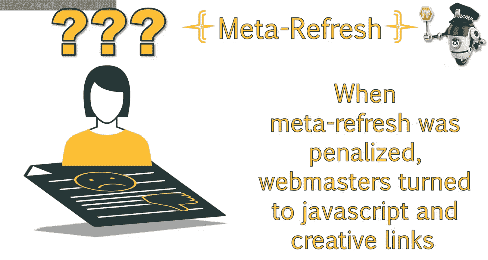

## 如何避免Panda惩罚

基本上，要避免受到Panda惩罚，请像用户一样审视你的网站。查看哪些信息对他们有帮助和有价值，哪些可能是不必要的信息，最好放在其他地方或直接删除。始终问自己，你的网站如何与其他网站区分开来，并增加价值。

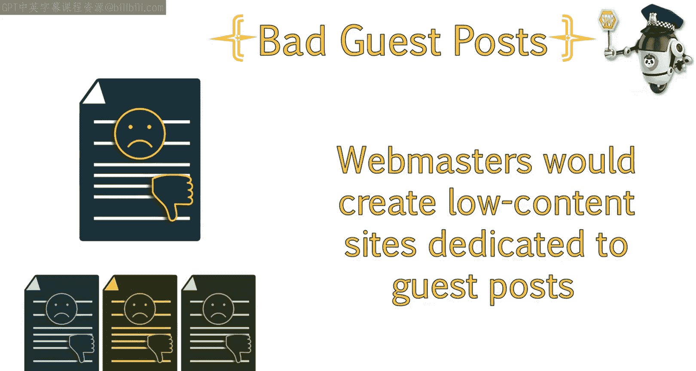

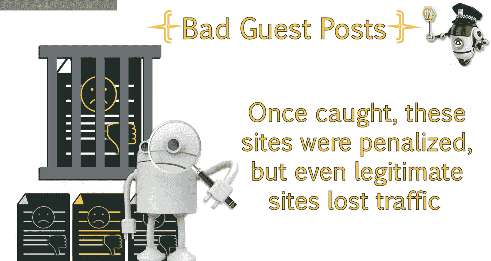

---

**本节课总结**

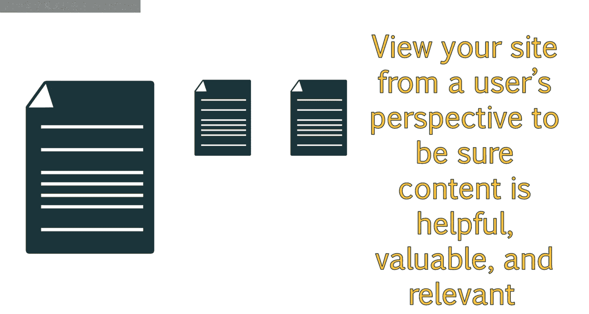

本节课中，我们一起学习了Panda算法更新。我们了解到Panda是一个持续更新的搜索过滤器，旨在打击低质量、单薄和重复内容。它关注的因素包括：自动生成内容、挤压页面、门页、低质量客座博文、过多广告以及糟糕的用户体验和导航。要避免受到Panda惩罚，核心在于从用户角度出发，创建独特、有价值的高质量内容，并提供良好的用户体验。