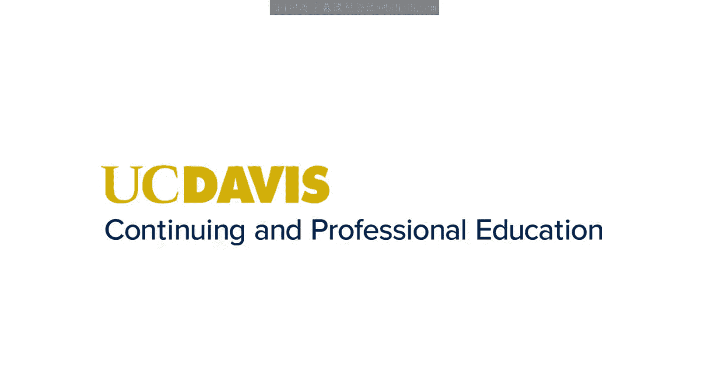
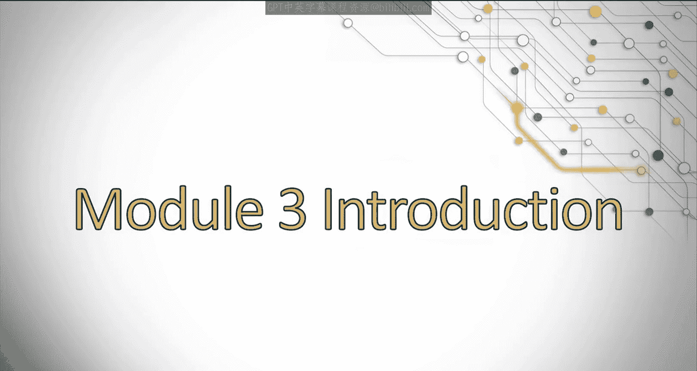

**课程名称：搜索引擎优化（谷歌、SEO基础、优化网站、进阶、毕业项目）**
**章节编号：014**
**章节名称：SEO的现在与未来**

在本节课中，我们将深入探讨现代搜索引擎优化的最佳实践以及当前影响排名的关键因素。我们将了解其他营销策略（如改善用户体验）如何影响SEO，并探索小型或不知名品牌是否有机会在搜索中与知名大品牌竞争。

---

### **模块三：当今、明日及未来的SEO 🚀**

欢迎来到模块三。本模块将更深入地探讨影响我们当下的现代SEO最佳实践与排名因素。

你是否曾思考过，其他营销策略（例如改善用户体验）会如何影响SEO？或者你是否好奇，一个规模较小、知名度不高的品牌，是否有可能在搜索中与那些知名的大品牌竞争？让我们一起来寻找答案。

在本模块中，我们将讨论你不应忽视的SEO重要领域。我们将探讨如何制定一个全面且深思熟虑的关键词研究策略。

我们将介绍谷歌喜欢向用户展示的内容类型，以及这如何与你的关键词研究策略相关联。同时，我们也会分析SEO与品牌建设如何共同影响你的网站在搜索中的排名表现。

---

### **总结**

本节课我们一起学习了现代SEO的核心关注点。我们明确了本模块将深入研究当前的SEO最佳实践与排名因素，并提出了关于用户体验影响SEO以及小品牌竞争可能性的关键问题。接下来，我们将逐一探讨这些重要领域，从关键词策略到内容类型，再到品牌与SEO的关联。