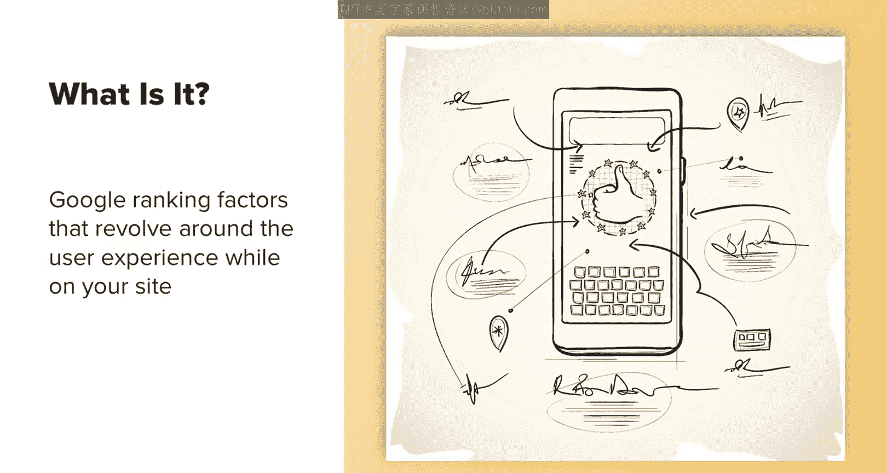
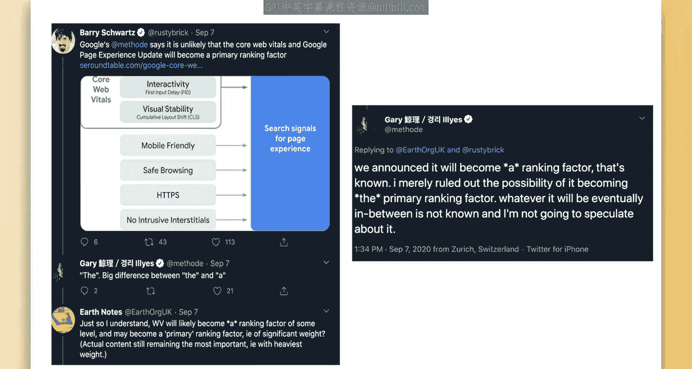
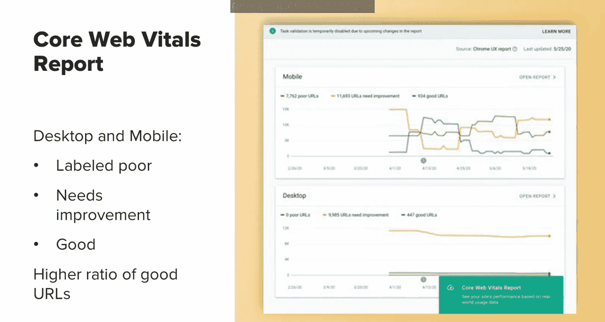
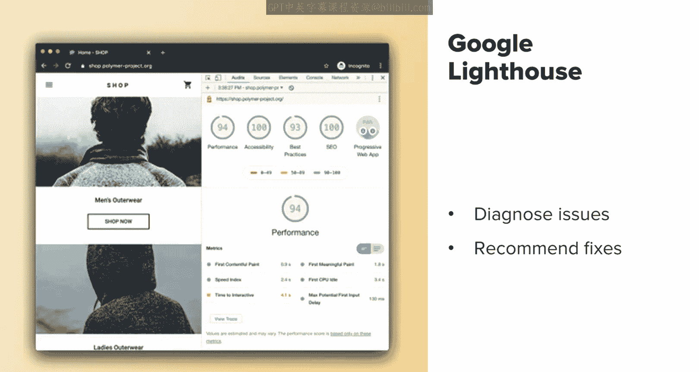
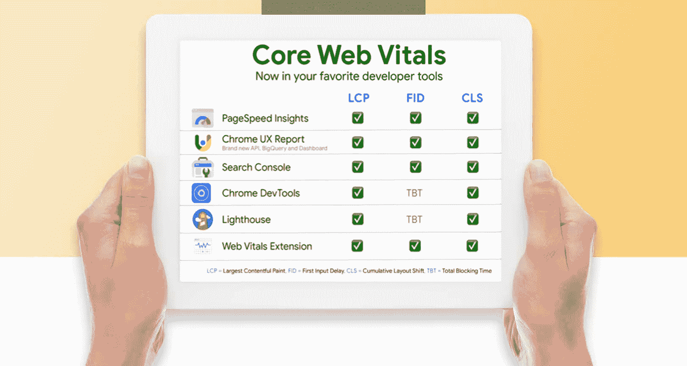

# 搜索引擎优化：015：核心网页指标 🎯

在本节课中，我们将要学习谷歌核心网页指标的概念、重要性以及如何衡量和优化它们。核心网页指标是谷歌官方确认的一组围绕用户体验的排名因素，理解并优化它们对于提升网站在搜索结果中的表现至关重要。

---

上一节我们讨论了网站速度与用户体验的重要性，本节中我们来看看谷歌如何通过核心网页指标来具体衡量这些方面。

## 什么是核心网页指标？

核心网页指标本质上是谷歌的一组排名因素，它们围绕用户在您网站上的体验展开。谷歌很少透露具体的排名信号，因此核心网页指标的公布非常重要，它确认了许多SEO专家长期以来倡导的最佳实践。这也延续了之前如“咖啡因”等算法更新的精神，验证了速度等因素仍然是重要的排名因素。

## 核心网页指标为何重要？

正如刚才提到的，谷歌公开透露实际排名信号的情况非常罕见。核心网页指标被谷歌定义为“真实世界体验指标”。这意味着您网站上任何可能影响用户登陆后体验的因素都会被考虑在内。这包括页面加载时间、网站稳定性、网站安全性以及可能影响用户体验的大量弹窗等因素。

## 核心网页指标影响什么？

核心网页指标将同时影响移动端和桌面端的搜索排名，也会影响您的网站是否有资格出现在谷歌的“头条新闻”板块中。此前，谷歌要求网站使用AMP才能出现在该板块。现在AMP不再是强制要求，取而代之的是您的网站必须在核心网页指标上达到最低分数。除了排名和头条新闻资格，谷歌自身的研究表明，优化这些指标可以将网站跳出率降低高达24%。

以下是核心网页指标主要影响的方面：
*   **搜索排名**：影响网站在移动端和桌面搜索结果中的位置。
*   **头条新闻资格**：决定网站能否出现在谷歌的“头条新闻”板块。
*   **用户参与度**：优化体验可以显著降低用户跳出率。

## 何时需要关注核心网页指标？

谷歌于2020年7月宣布了核心网页指标，并表示相关算法更新将在2021年的某个时间生效。因此，现在就需要开始关注并优化您的网站。

## 如何衡量核心网页指标？

您可以通过多种工具来衡量您的网站是否符合核心网页指标的要求。目前，您可以在谷歌搜索控制台、Lighthouse等工具中查看相关数据。

在谷歌提供的免费工具——谷歌搜索控制台中，侧边栏已经新增了一个名为“核心网页指标”的报告。点击进入后，数据会按桌面设备和移动设备分开显示，您可以查看有多少URL属于以下类别：**差**、**需要改进**或**良好**。预计大多数网站都会混合存在质量差、良好和一般的URL，重要的是确保良好URL的比例高于质量差的URL。

## 如何使用工具进行优化？

您可以使用像谷歌Lighthouse这样的工具来帮助诊断您的页面在速度等方面存在的问题。Lighthouse会提供具体的优化建议，指导您如何最好地解决这些问题。

以下是推荐的优化步骤：
1.  **诊断问题**：使用谷歌搜索控制台或Lighthouse生成性能报告。
2.  **分析建议**：仔细阅读Lighthouse报告中针对每个问题的具体优化建议。
3.  **实施修复**：根据建议，对代码、图片、服务器等进行优化。
4.  **持续监控**：定期检查核心网页指标报告，确保优化效果得以维持。

---

本节课中我们一起学习了谷歌核心网页指标。它不仅是影响SEO排名的关键因素，更直接影响用户与您网站的互动和转化效果。关注并优化像核心网页指标这样的数据，本身就是一种良好的营销实践。通过利用谷歌搜索控制台和Lighthouse等工具，您可以系统地诊断问题、实施优化，从而为用户提供更佳的浏览体验，并最终提升网站的整体表现。