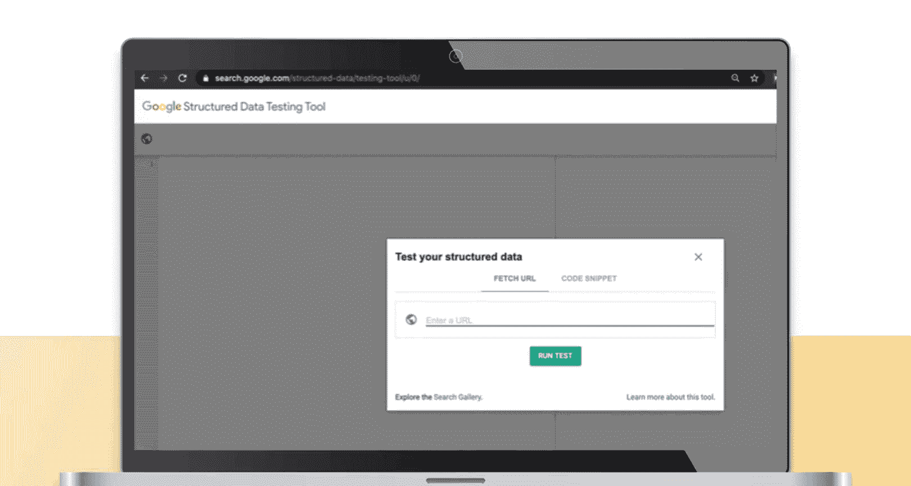

# 017：UCD《搜索引擎优化（谷歌、SEO基础、优化网站、进阶、毕业项目）｜Search Engine Optimization》中英字幕 p17 16_精选摘要与富摘要.zh_en -BV1N66VYsEue_p17-

Let's discuss featured snippets and rich snippets so you can better understand the difference between the two and how each will help your SEOo strategy。

Google is constantly adjusting their algorithm to better solve the user's query as soon as possible。

One of the ways in which Google tries to provide a better user experience is through changing the look of the search results page and how users interact with it。

That is where rich snippets and featured snippets come into play。For clarification。

 rich snippets can also be referred to as rich results。And they're often used interchangeably。

I will discuss both featured snippets and rich snippets。

 explain the difference between the two and provide some best practices for obtaining these types of search results。

Let's start out with featured snippets。Featured snippets are a video or article that Google displays at the very top of organic search results。

This is often called position zero。And it aims to answer a user's query right away。

These snippets are often also the answer for related voice search questions on voice assisted devices like Google Home。

If you have a Google voice device， go ahead and test it out and see which results match both featured snippets and voice results。

Rich snippets are results that changes the way a normal organic result appears in search。

And better differentiates this result from others。Examples include results that have review stars。

 data， and more。Previously， featured snippets were highly prized in the Se O community。😊。

One could have a featured snippet and also be listed on the first page of Google。

 taking up a lot of shelf space with your brand。With Google's latest update。

 which was around May of 2020。Featured snippets became less of an advantage to obtain in some cases。

With this latest update， Google has now prevented a website from appearing in both a featured snippet and a normal page one organic result。

This presents some pros and cons to ranking here。Now please keep in mind that Google is constantly adjusting their algorithm。

 so this may change again in the future。Studies have shown an increase in what's called zero click searches。

 This means a search result took place and a user's question was answered without them having to actually click over to a particular result。

This behavior is great for Google as it gets impressions on ad revenue and satisfies the consumer。

But it can be terrible for content creators and website owners。

 as Google has basically scraped their content。And provided an answer within their own search results。

 preventing a visit to your site。An article by Rand Fishkin at Spark Toro shows that about 50% of search results receive no clicks because the featured snippet already answered their question。

You can read more about the trend over time and how this breaks down by mobile and desktop traffic on the blog post。

 which I'm including a link to。For reference， you can see how often people click on a search result and visit your website using Google Search consolesole。

 which is a free tool provided by Google。The amount of times people click over to your site is known as CTR or click through rate。

 which takes the number of clicks a search result receives and then divides it by the number of times it's viewed on the search engine result page。

 which is also known as an impressionm。Your CTR can be impacted by many things such as the query type。

 your target audience and their behavior。Your specific industry。

Whether or not you have a featured snippet or rich or。Whether or not you have a featured snippet。

 rich snippet， or a normal organic result。And many more things。

Studies show that when there is a featured snippet in the number one position。It gets about 8。

6% of clicks， on average。While the page that ranks right below it will get about 19。6% of clicks。

 on average。How does this compare to a regular number one ranking page position with no featured snippet above it。

That page got 26% of all clicks。So basically， the featured snippet steals results from the number one result。

 but having the featured snippet versus no featured snippet at all will net you with less clicks。

I'm including a link to a blog that has a lot of study data on this。The question that remains is。

 should you optimize for the featured snippet。Previously， when you could appear in both results。

 This was a no rainer with the new change ranking for featured snippets may at times be detrimental to your overall traffic。

Approximately 13% of all search queries have a feature snippet， and this is growing all the time。

First， it's a good idea to determine if the queries you're trying to rank for have a feature snippet result。

But keep in mind， this isn't foolproof。 Remember， just because there isn't a feature snippet to day doesn't mean there won't be one to mor。

Second， if branding and thought leadership are important to your goals。

 then a featured snippet would be ideal as this gets your brand up front and center and helps you position yourself as a thought leader。

If your article relies more on getting a user to your site to take a certain action。

Then you'd be better off driving traffic to that post instead。

While the reasons of obtaining a featured snippet may not be so clear cut。

 rich snippets are always beneficial， and you should always optimize for rich snippets。Brichnippets。

Will help you improve your click through rate by drawing attention to your search result。

Which will help it better compete and stand out against other nearby results。

There are a ton of different rich snippets you can obtain。Earlier， you saw a recipe example。

 and here are two more examples featuring more review stars， data around the subject， stock levels。

 dates and more。In order to optimize for rich snippets。

 you should apply the right schema data to your website。

 Schema is basically a markup to your existing content that helps search engines better understand the data and content。

It can then take this data to present it in a more visually appealing way in search results。

There is schema for almost everything。And you can play around with searching schema。

org for the appropriate markup language to apply。Feel free to use multiple schema types to mark up a page。

This will help you obtain rich results for various query types。

I suggest you spend some time browsing the site and the different schema types available to you。

When you find a schema you like， you can scroll to the bottom and see an example of how to integrate this into your website's code。

The most common way is using Json， but there are other options available。

 You can work with your developers to discover what mark up is best to use with your site's needs。

Once you have implemented the markup， you can use Google Strucd Data Test tool to validate it and make sure it was implemented correctly。

Google will let you know where your structured data or markup may have problems or show you how it'll appear in search results。

That wraps up our lesson on featured snippets and rich snippets。

 You should now understand the difference between the two and have a good idea of when to try and optimize for the featured snippets and how to optimize for rich snippets。

