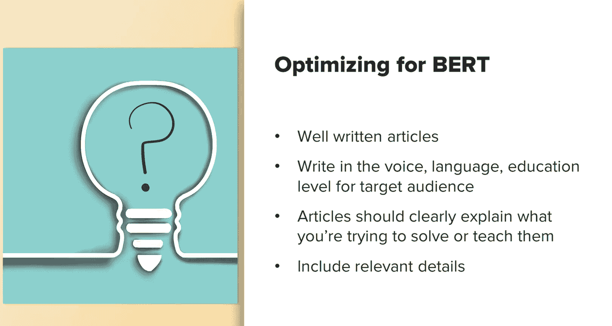

# 018：UCD《搜索引擎优化（谷歌、SEO基础、优化网站、进阶、毕业项目）｜Search Engine Optimization》中英字幕 p18 17_BERT算法.zh_en -BV1N66VYsEue_p18-

Now let's discuss the core algorithm update known as Bert。

Which has revolutionized the way Googleul both understands the content on a website and ranks it for relevant search queries。

Bt rolledd out in late 2019 and early 2020。BerRT is one of Google's largest algorithm updates they've made。

And at the time of it rolling out， it's impacted about one in every 10 search queries。

Bert basically helps Google understand human language better。

So it can better determine the context of a search query。In a way that they couldn't do previously。

There is so much information to discuss about Bert。

I can quickly find myself diving down a tech rabbit hole。 So to avoid this。

 I will attempt to keep things on a more high level discussion， and。

Discuss only the most important parts you need to know。If you want to learn more。

 which I highly encourage you do， there are numerous articles on the topic。

One of the best is from Google themselves， and I provided a link for you。

Some of the things you need to know about Bert。Is that Bert stands for bi directionional encoder representation form transformers。

 That's a mouthful。

Basically， what that means is it's a neural network technique for natural language processing。

 Also a mouthful。 But think of it this way。 Google will analyze a sentence both forward and backwards to really understand how the words fit together and the full context of that。

 So in short， Bert helps computers， understand human language and speech patterns better。In the past。

 Google had a set of stop words that it didn't pay much attention to when determining the overall query。

 These words included or these phrases included words like to or with。By at on stuff like that。

 So it would just ignore these。 Now， Google includes these to understand the subject of a sentence better。

When Google was ignoring these， over time， engineers realized that this didn't always return the most relevant aqueries。

 So they designed the system as。

A way of helping Google understand the full context。

This also helps Google better understand the sentiment of phrases and discussions on the web。

 so in short， Google cannot not only better understand the subject of a sentence。

 it can understand if a sentence is positive， negative， sarcastic， and more。

For more information on Bt and how it can be used for sentiment analysis。

 I included a link to a great article。Here is an example of Google showing a more relevant featured snippet for a query using Bt as。

A way to better understand the language。 So before， if a user typed parking on a hill with no curb。

A query like this would confuse Google。 So Google would have placed too much importance on the word curb。

 and they would have ignored the word no entirely。 And it did not understand how critical that word was to appropriately responding to this query。

So we would see search results like the before example。

 which didn't actually provide an answer to what the user was looking for。 Now， with Bt。

 Google provides much more accurate answers。

Now， if you go to Google and you tried it。Search around for how to optimize for Bt。

Pretty much every article you'll read says you don't optimize for BEt。

But I think that's only half true。Because it's an algorithm that better understands language and context。

You can't really do much from a traditional perspective of keyword targeting within your content。

However。I think that you can create better optimized pages and articles that will enable Bt to rank you for related queries。

This can be done through things like making sure your articles are well written。

 so enough for human to understand， not just written for robots。Ensure your writing in the voice。

 language， and education level of your target audience。

Make sure any articles you write clearly explain what you're trying to solve or teach them。

And make sure you include relevant details。

While there are numerous areas of search that Bt impacts。

It's important to keep in mind that the intelligence behind Bert has huge impacts in other areas as well。

 This can be used in instances， for social listening tools。

How chatbots respond to and interact with users and more。As a critical thinking exercise。

Consider what types of search queries Google's Bt would impact the most and how you might be able to better optimize content on your own site。

 so it better aligns with this update。

