# 020：强化关键词策略 🔑

在本节课中，我们将探讨现代搜索引擎与其早期版本在语义关系领域的差异。你将了解搜索引擎为提供更准确结果所做的改进，以及一些试图通过不当手段提升排名的行为。课程结束时，你应该能够制定一个使用有效替代关键词的策略，以提升网站的排名和可见性。

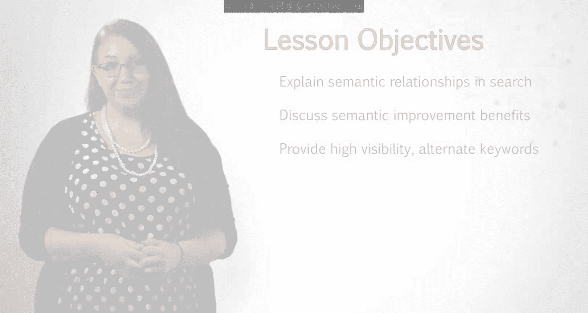

## 概述

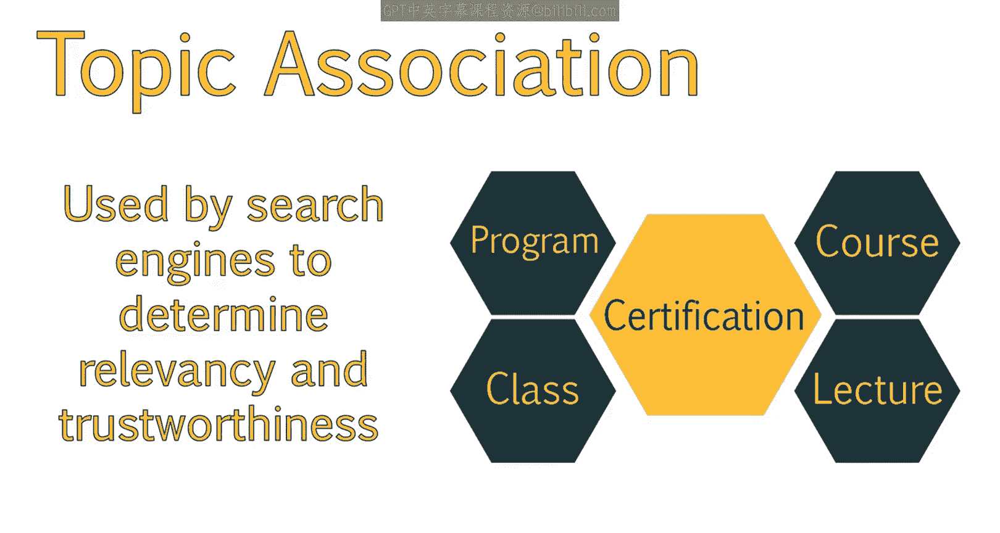

上一节我们讨论了关键词的基础知识，本节我们将深入探讨**主题关联**的概念，以及谷歌如何利用它来判断全网内容的**相关性与可信度**。理解主题关联的运用方式，可以帮助你为自己或客户的网站创建更优化的内容。

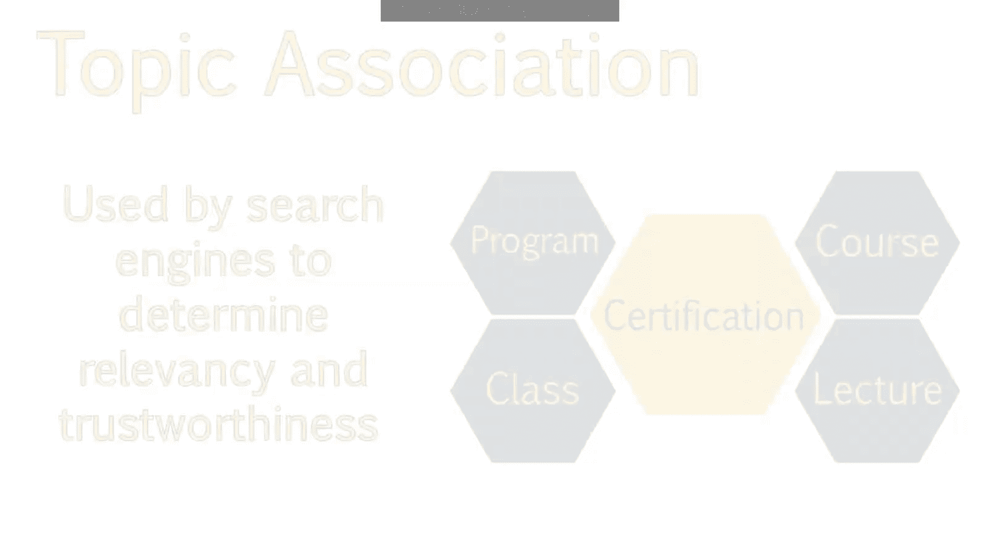

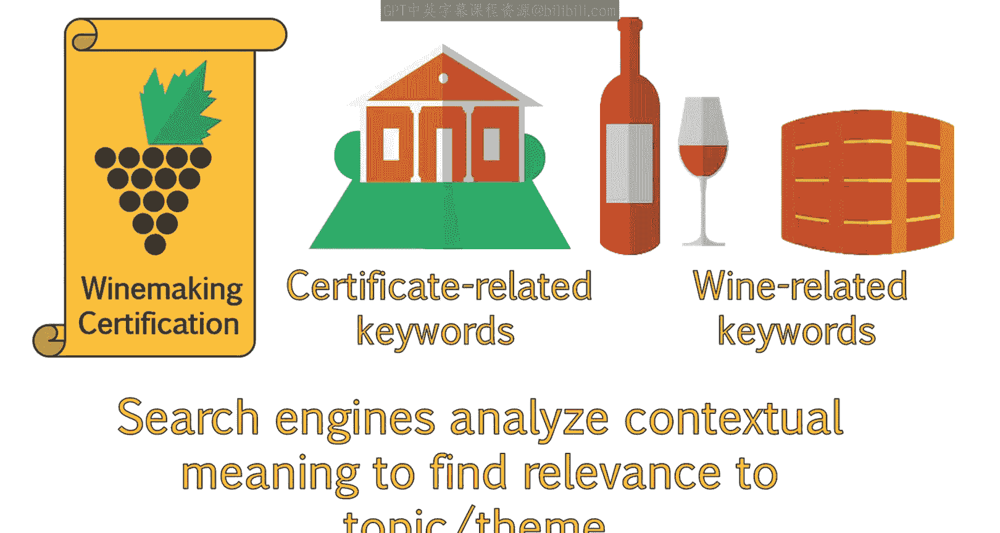

## 主题关联与内容优化

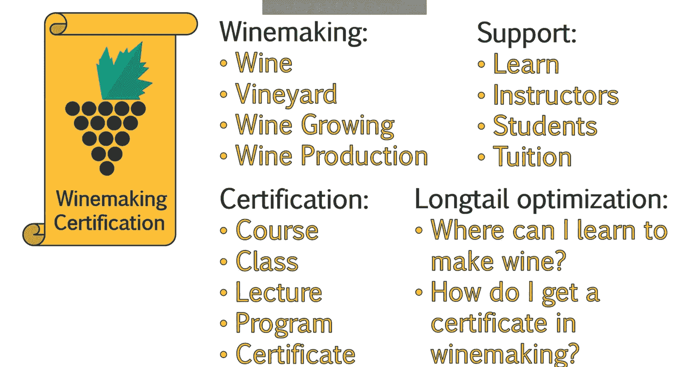

如今，谷歌会更深入地审视网页的**上下文含义**以及整个网站提供的内容，以此来确定你的网站应该针对哪些**主题或主题集合**具有相关性。

这意味着，一个页面应包含与你的**核心关键词**相关的词汇，而不是简单地选择一个核心关键词并在内容中重复多次。

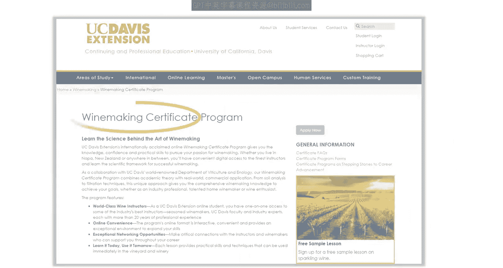

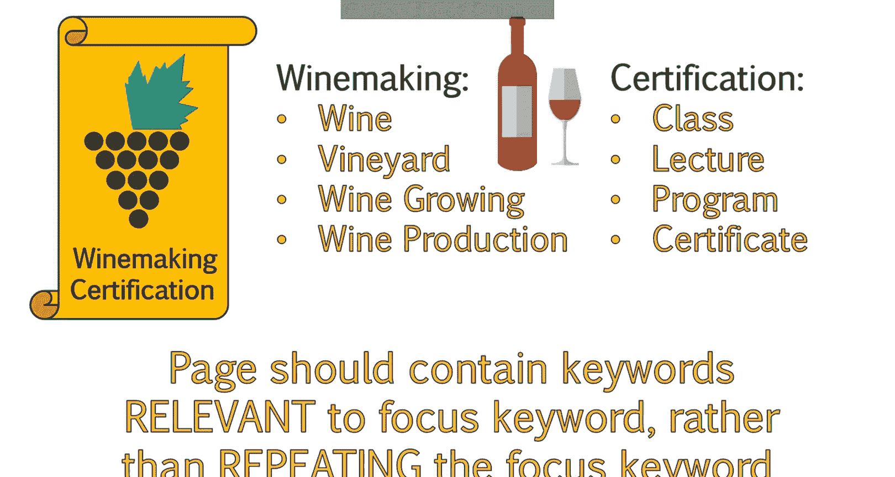

例如，假设加州大学戴维斯分校葡萄酒酿造课程的核心关键词是 **“winemaking certificate”**。在这种情况下，使用与核心关键词相关或同义的词汇，将有助于该页面被视为与该核心关键词（即其试图排名的主题“葡萄酒酿造认证”）更相关。

你可以看到核心关键词如何被分解为各种元素。在这样做时，请问自己：我还能如何描述“winemaking”或“certification”？还有哪些词可能与这些相关？哪些其他词汇能支持页面所选的关键词或主题？

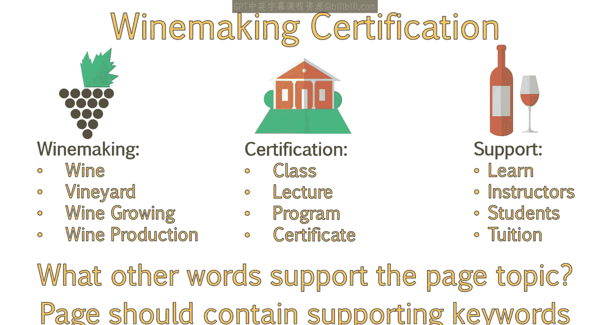

如果一个页面要对读者有用，它应包含支持整体主题的词汇和短语。在此例中，你可能会在页面中看到像 **“land”** 和 **“students”** 这样的词，因为它们支持认证项目的整体主题。

这不仅会提高页面对于某个主题的相关性，还会自然地在你撰写的内容中融入各种我们称之为**长尾关键词**的词汇。

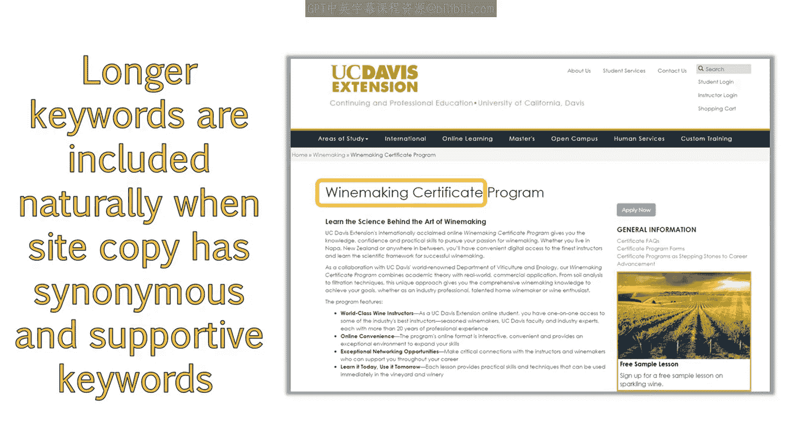

长尾关键词是更长、更难以预测但通常非常精准的关键词或短语。例如，此页面的一个长尾关键词可能是 **“where can I learn how to make wine”**。通过包含支持性关键词以及与“winemaking”和“certification”同义的词汇，这个长尾关键词会自然地融入到内容中。

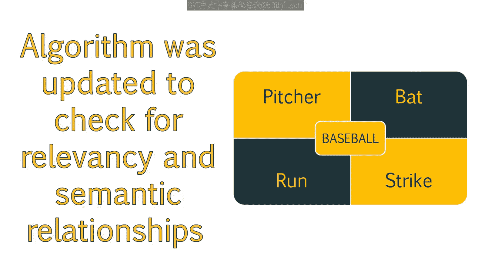

## 语义分析与算法演进

为了帮助确定页面主题及词汇间的关系，谷歌改进了其算法，以检查相关性和语义关系。这为SEO和内容优化创造了更全面的方法。

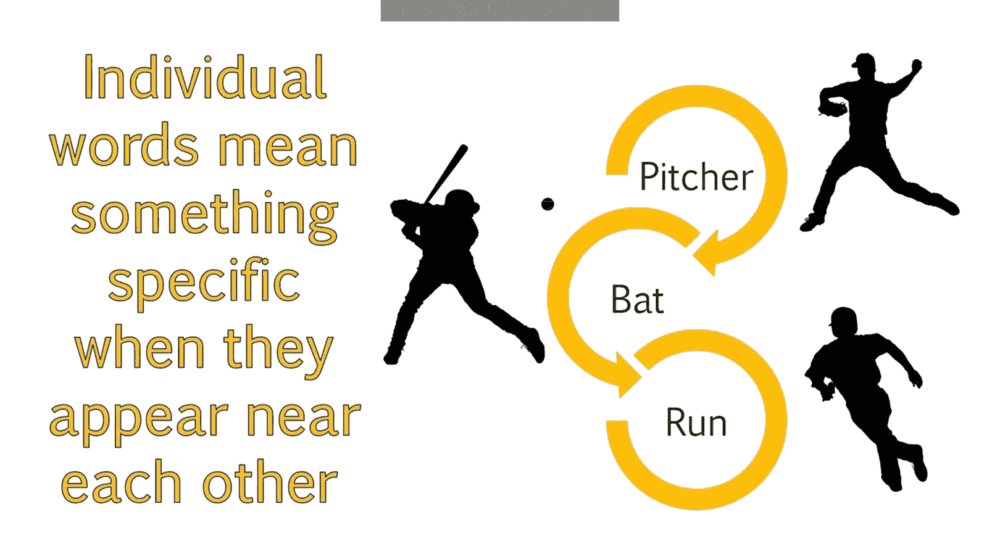

语义分析主要研究词汇如何关联，以及两个词之间可能存在的关系。例如，一个关于棒球的网站应包含像 **“pitcher”**、**“bat”** 和 **“run”** 这样的词。所有这些词在脱离上下文时可能有不同含义，但结合在一起，它们有助于支持该页面“棒球”的主题。

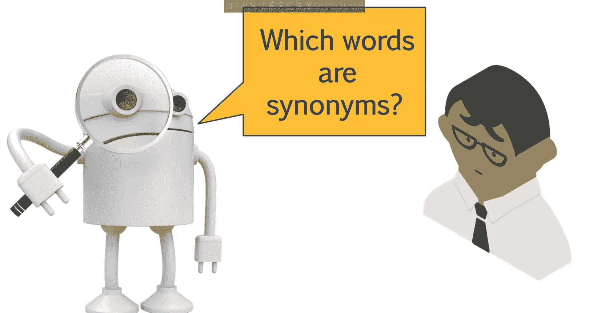

谷歌工程师Amit Singhal曾讲述了一个有趣的故事，关于谷歌如何学习哪些词是同义词。在讨论算法这部分创建过程时，Amit说：“我们很早就发现了一个非常巧妙的现象。人们会改变查询中的用词。比如，有人会搜索‘pictures of dogs’，然后又会搜索‘pictures of puppies’。这告诉我们，‘dogs’和‘puppies’可能是可以互换的。”

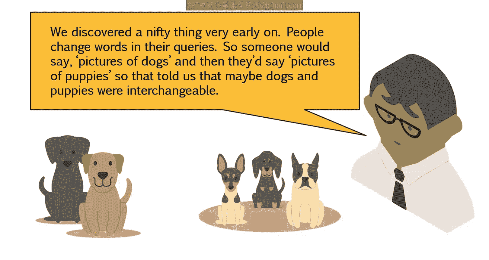

Amit接着说：“我们还了解到，当你烧开水时，得到的是热水。我们是在向人类重新学习语义学，这是一个巨大的进步。”

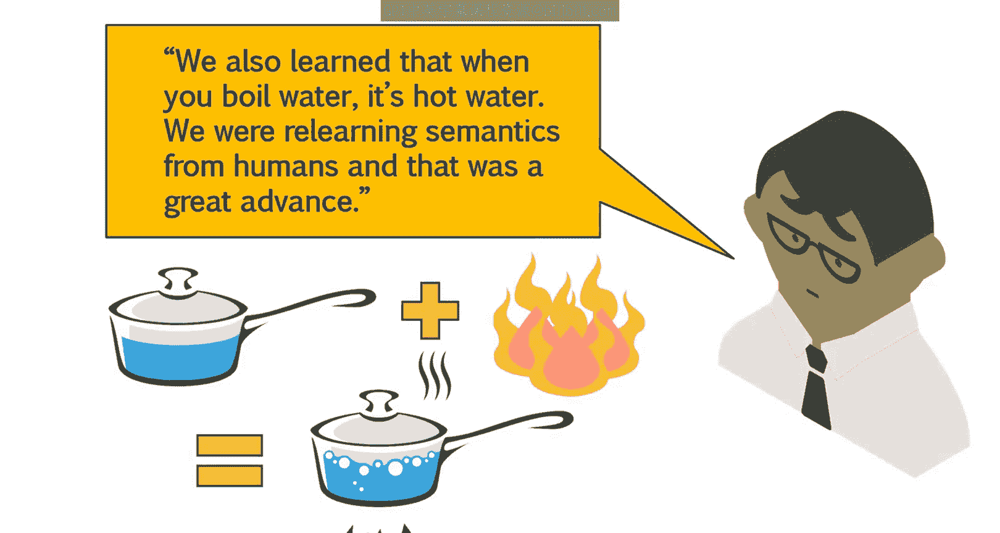

但是，也存在障碍。谷歌的同义词系统理解了“dog”类似于“puppy”，以及“boiling water”是“hot”。但这也意味着它得出结论：“hot dog”等同于“boiling puppy”。这个问题在2002年底通过应用哲学家**路德维希·维特根斯坦**的理论得以解决。

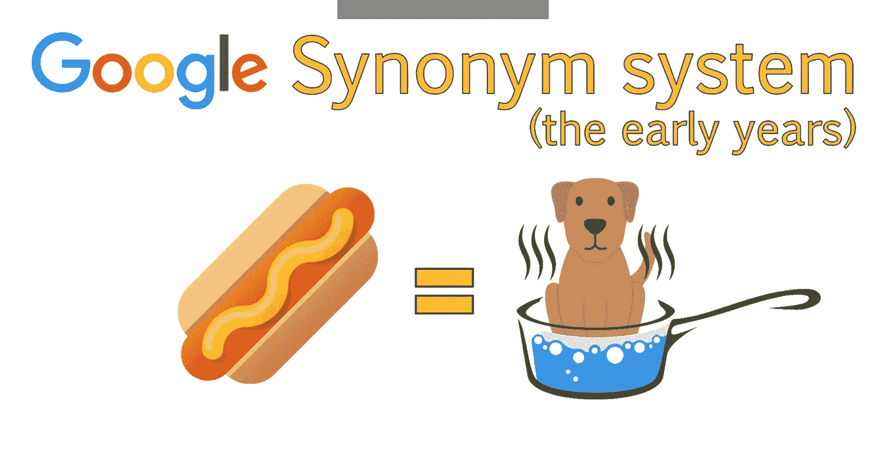

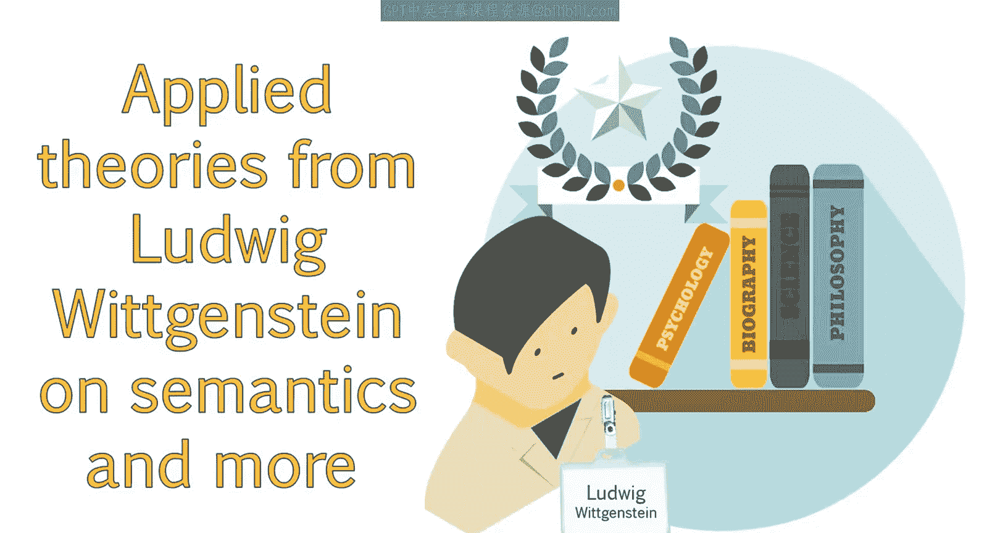

随着谷歌分析其索引中的数十亿文档，它也开始分析彼此接近的词汇。“Hot dog”会出现在同时包含“bread”、“mustard”和“baseball games”的搜索中，而不是出现在关于烹饪狗的食谱里。我们可以在今天的搜索中看到这种改进。

## 搜索结果的演变

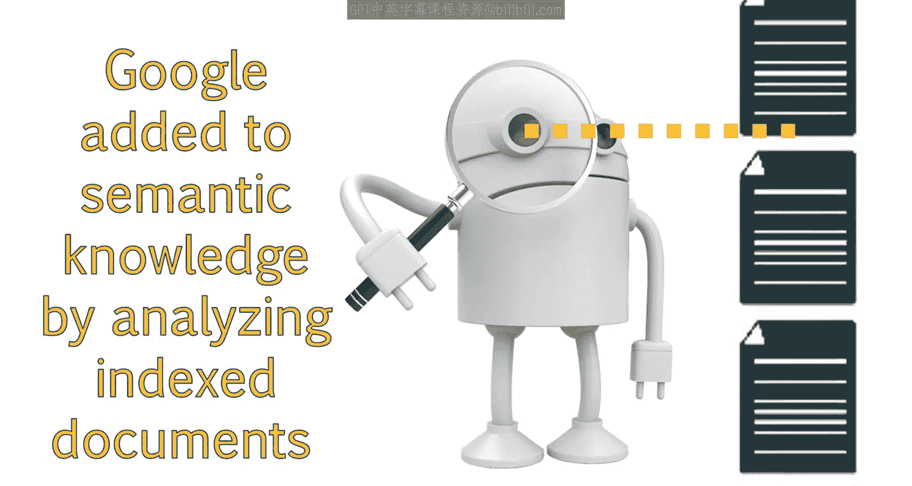

过去，如果我搜索“hiking spots in the Bay Area”，我很可能会得到示例中提供的结果。谷歌会首先在其索引中查找包含我所搜索短语的网站，如果找到，这些结果会优先展示。请注意，我的确切关键词在元描述中被加粗，并且确切关键词也出现在标题中。

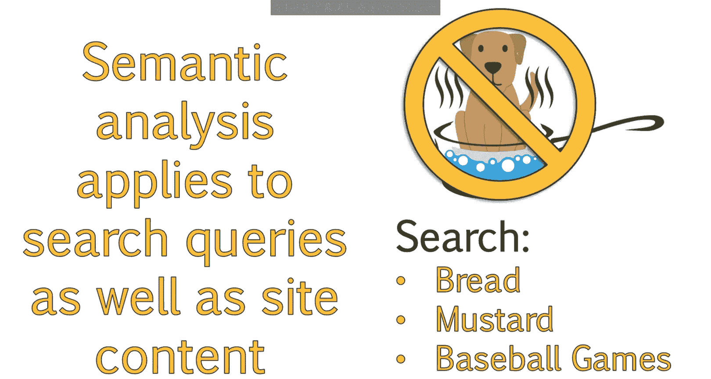

随着谷歌算法的进步，对确切术语和词序的关注减少了。你会开始看到包含与我查询相关的词汇（如“hiking in Bay Area”）以及相关词汇（如用“throughout”代替“in”）的结果。这些词都被加粗，还有像“trails”这样的相关词也被加粗。

在谷歌的蜂鸟算法更新之后，此类结果继续得到改善。现在，除了“hiking spots”，我继续看到像“hiking trails”这样的加粗关键词。随着谷歌更新其算法并加入诸如地理位置、过往搜索历史等个性化因素，我还得到了一些更好的本地结果。搜索结果将继续发展和改进。

## SEO的未来

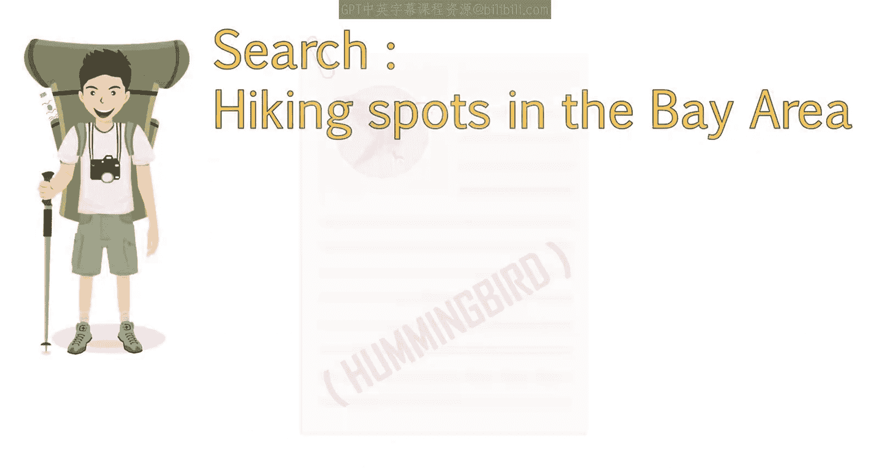

SEO不再是那种仅靠关键词定位和链接建设就能让任何网站在搜索结果中名列前茅的单一技巧。要想成功，SEO从业者需要着眼未来，专注于如何最好地服务用户并保持他们的参与度。

SEO的未来在于了解用户需要什么内容，以及以最佳方式将这些内容交付给他们。

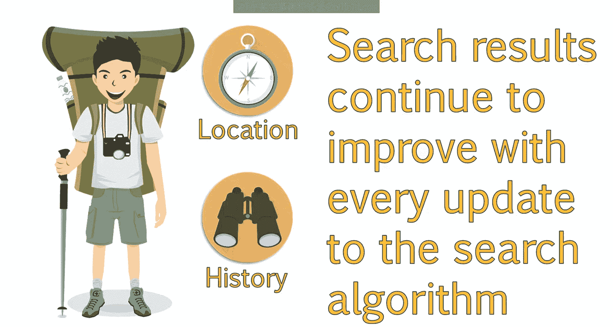

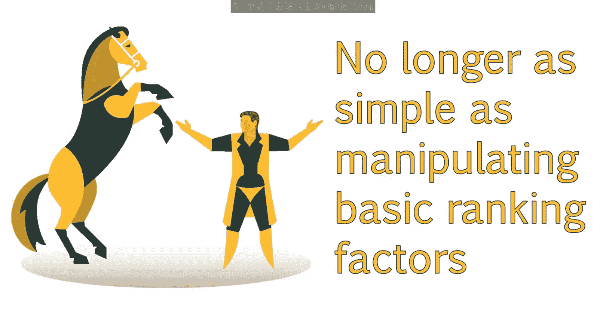

## 总结

本节课中，我们一起学习了**主题关联**的定义，并解释了在整个内容中使用**语义相关关键词**的重要性。掌握了这些知识，你应该能够撰写或管理创建对用户和搜索引擎都有价值的内容的过程。

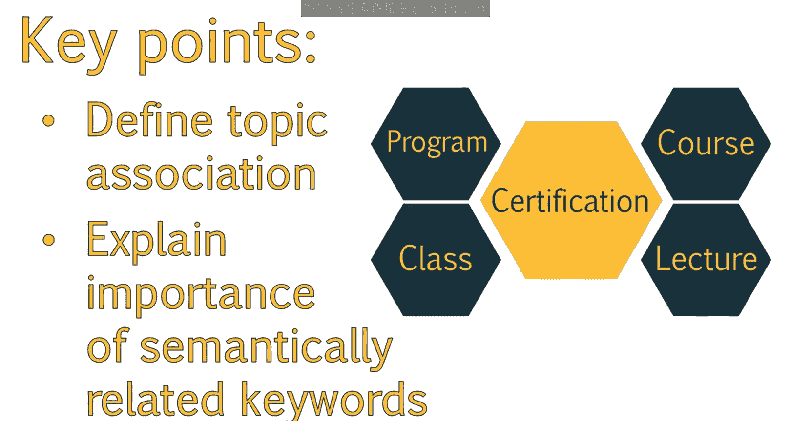

通过理解语义关系，你可以制定更有效的关键词策略，从而提升网站的可见性和排名。