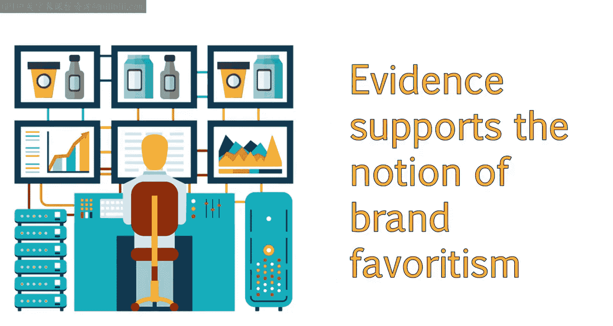
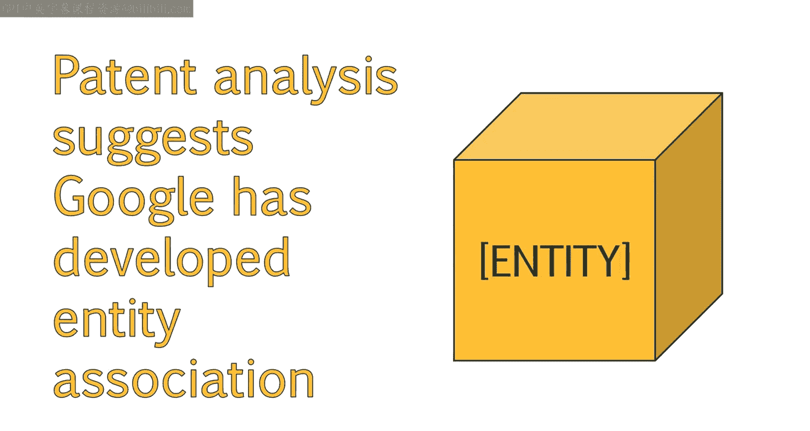
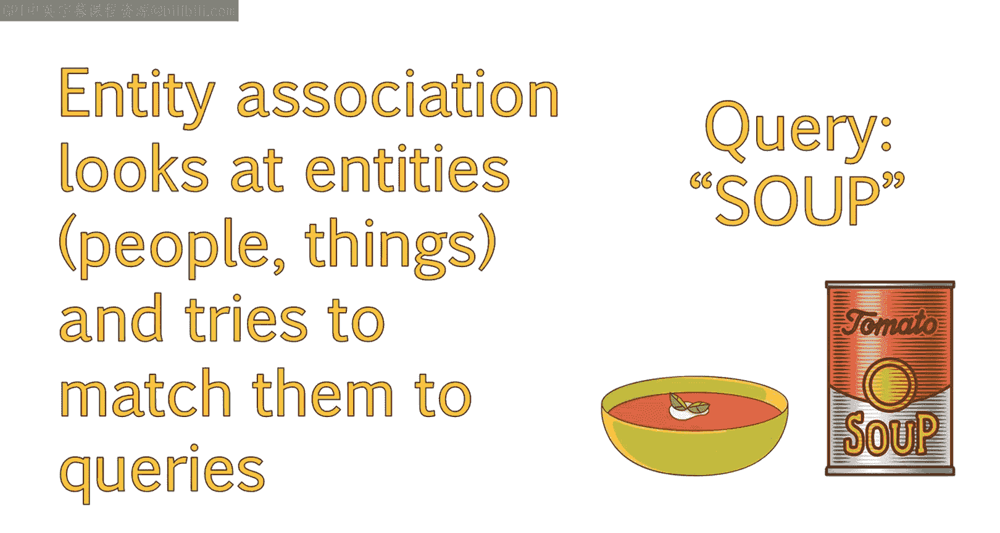
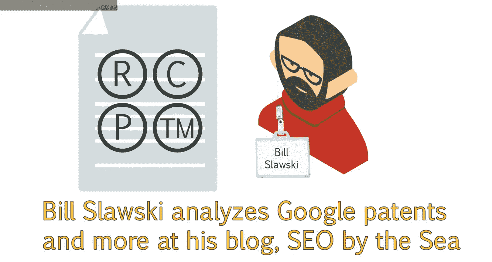
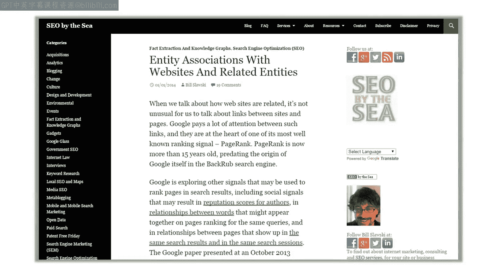
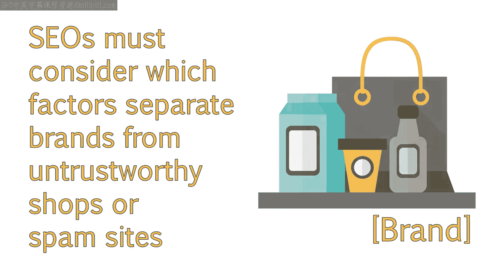
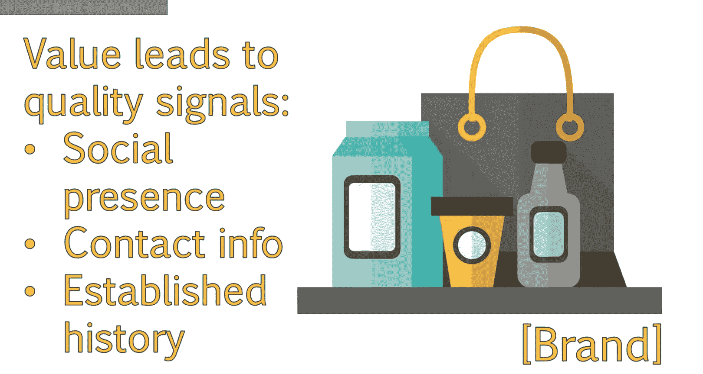
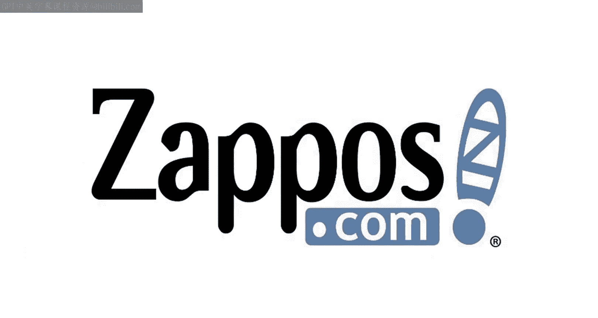
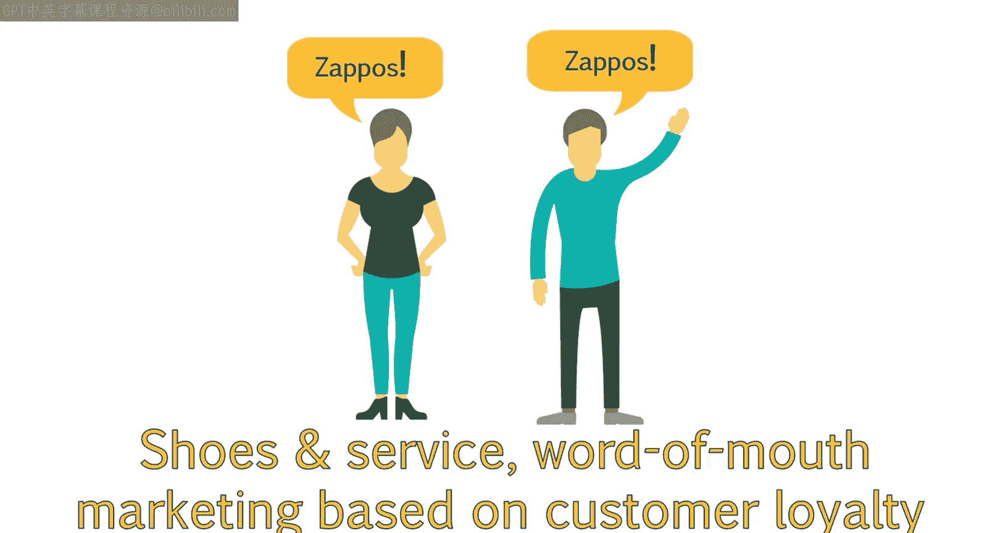
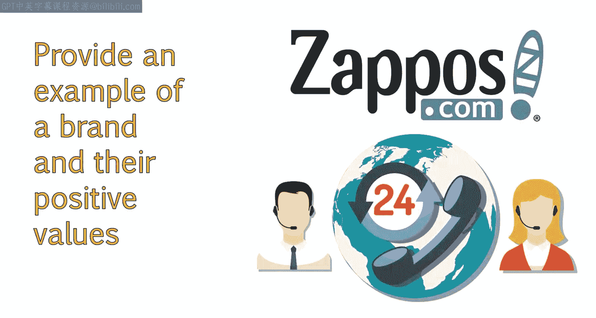

# 021：品牌如何影响网站排名 🏷️

在本节课中，我们将探讨品牌认知度与搜索结果之间的关系，并分析品牌信号如何影响搜索引擎排名。你将有机会形成自己对内容处理方式有效性的看法。课程结束时，你应能预测社交媒体及其他网络营销形式与SEO的关联，并了解从大型品牌到个人网站，品牌建设的重要性。

## 概述

品牌不仅对营销策略至关重要，还能支持和提升SEO效果。本节课将重点阐述品牌如何成为Google相关性算法中日益重要的因素。从用户角度看，当用户在搜索结果中看到熟悉的品牌时，他们对搜索查询的满意度更高。Google认为用户熟悉这些品牌，因此存在一定的偏好。

## 品牌在搜索结果中的高排名示例

以下是品牌在搜索结果中获得高排名的示例。例如，搜索“瑞士巧克力”时，第一个结果是知名瑞士巧克力公司**Lindt**的网站。许多SEO专家认为，Google不公平地奖励品牌，尤其是大品牌，使其获得更好的搜索引擎结果位置。

## 品牌优势的证据与分析

虽然很多情况可能与相关性有关，因为大品牌往往能获得更多链接，并且自然有更多人在社交媒体上讨论品牌，但有大量证据表明Google偏爱品牌而非相对不知名的网站。例如，通过专利分析，我们怀疑Google已开发出**实体关联**技术。

该关联不一定寻找品牌的存在，而是试图理解是否可以将查询与特定个体或事物匹配。任何实体的识别都可能影响搜索结果。

例如，搜索“番茄汤”时，即使未在搜索中指定寻找食谱，Google仍在顶部搜索结果中提供了以食品和食谱为重点的知名品牌。查看这些结果，前两个结果均来自同一网站**Food Network**，这是一个知名品牌。

## 品牌信号与Google的考量因素

从SEO角度思考品牌时，重要的是考虑Google可能使用哪些因素来确定一个网站是品牌，还是潜在不可信的在线零售商或垃圾网站。

以下是品牌更可能具备的某些信号：

*   **社交媒体存在**：品牌更可能拥有社交媒体存在，且其社交媒体活跃度可能高于垃圾或普通网站，因为用户更可能与品牌互动。
*   **联系信息**：品牌更可能在网站上列出联系信息，例如在“关于我们”页面，包括实体地址、电话号码以及电子邮件或联系表单。
*   **历史与持久性**：品牌更可能拥有既定的历史，并打算长期存在。Google可能通过**域名注册时长**等信号来确定这种意图。
*   **品牌搜索量**：品牌更可能获得其品牌名称的搜索量。对于大品牌，其大量流量往往具有非常强的品牌特异性。
*   **网络提及**：品牌更可能在网站和社交媒体渠道上获得更多提及。
*   **网站权威性**：网站的权威性也很可能发挥作用。
*   **其他营销策略**：Google还可能考虑网站是否参与除SEO和社交媒体之外的其他营销策略，例如使用**Google AdWords**等服务并对其品牌名称进行竞价。这可能为Google提供更多信号来识别它是一个品牌。

在付费搜索中，品牌关键词已知能带来更好的转化率，因为搜索者心中已有访问该品牌网站的意图。

基本上，尝试思考哪些外部质量信号可以帮助你的网站在用户和搜索引擎面前显得更合法、更可信。更多的外部信号也将与更好的在线可见性相关。

## 如何建立品牌并提升质量信号

为了帮助建立品牌并增加这些质量信号，应尽可能专注于**提供价值**。

以**Zappos**为例。1999年推出时，它是一个销售鞋类、提供优质客户服务和产品的简单网站。到2001年，其年销售额增长了四倍多，达到860万美元。Zappos的广告成本极低，主要通过口碑发展业务。

从一开始，Zappos就围绕客户忠诚度和发展客户关系构建其商业模式。其声誉迅速增长，卓越的服务有助于影响其品牌认知，并促进了业务的病毒式传播。

Zappos始终高度重视客户服务。推出时，其CEO决定提供双向免费送货、365天退货政策、24/7客户服务等。这些措施，结合我们刚讨论的故事，为其赢得了大量在线提及、网站链接、社交媒体分享等，从而壮大了品牌，并巩固了其在线领域的权威性。

## SEO与品牌的协同作用

许多SEO专家和营销人员错误地认为品牌建设和SEO是相互排斥的。实际上，这是两种非常强大的营销策略，它们能很好地协同工作以支持业务。事实上，很多SEO工作通过提高品牌在线可见性来帮助提升品牌知名度。

必须制定明确的目标，专注于如何为客户提供价值，无论是在线还是离线。离线努力将转化为在线提及、链接等，并有助于整体策略。

从SEO的角度来看，你可以通过**创建优质内容**、**发展有吸引力的社交媒体存在**以及**从权威网站获取链接**来帮助传播品牌信息。这也将有助于培养品牌搜索，并发展其他重要的品牌信号，以改善在线定位。

## 总结

本节课中，我们一起学习了品牌信号对搜索引擎的重要性，以及搜索引擎为何要分析那些暗示公司是知名且可信品牌的因素。基于对潜在算法变化的这种理解，你现在应知道从SEO角度可以采取哪些步骤来改进网站，并更好地将其定位为可信实体。