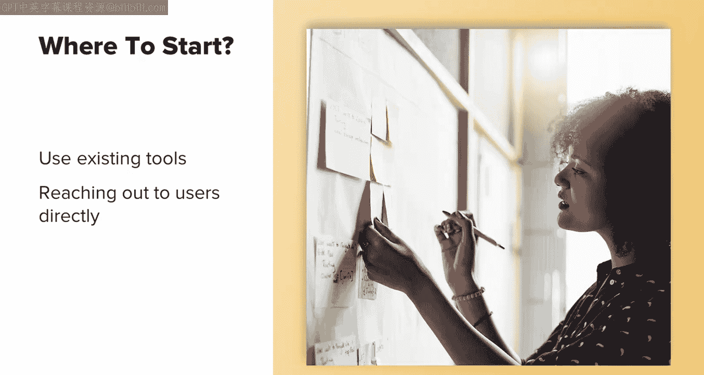
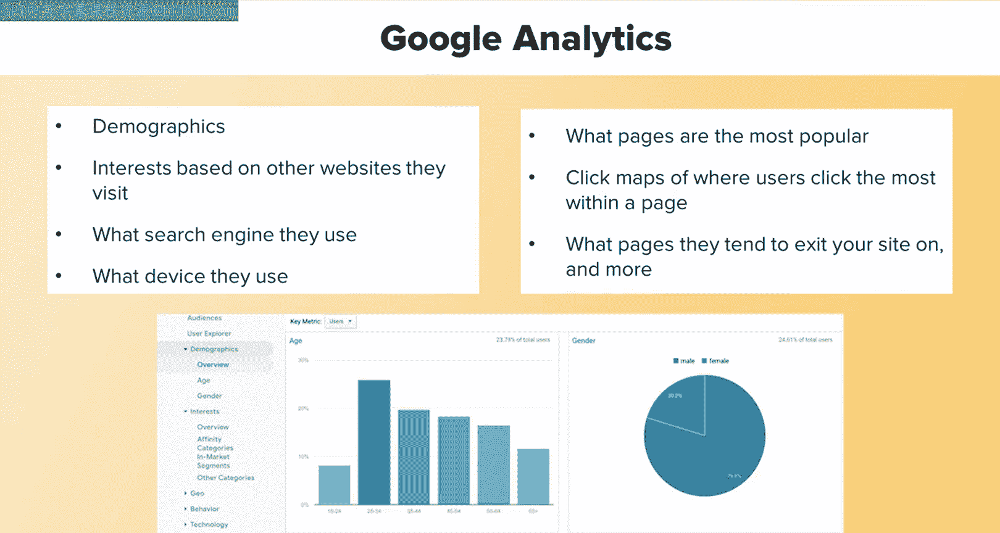
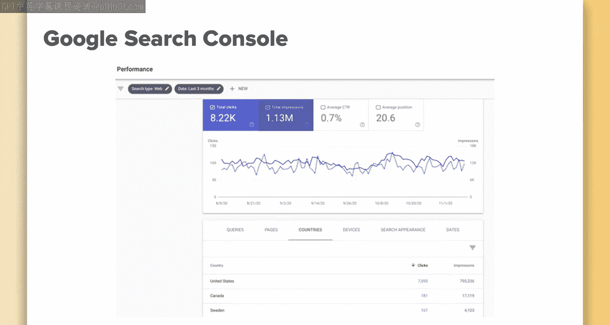
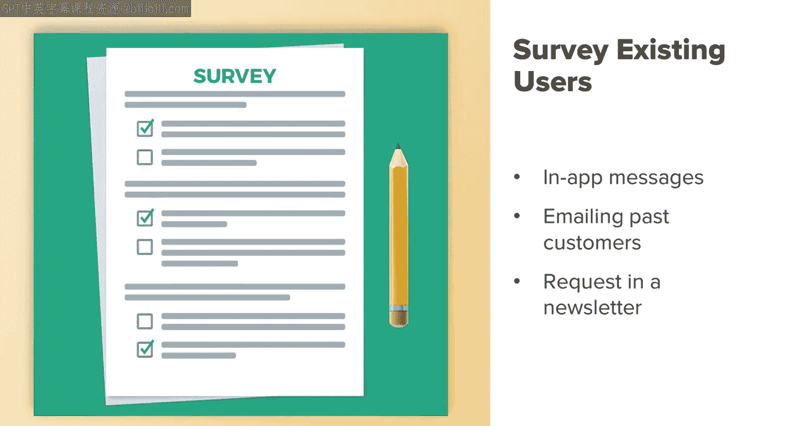

# 023：用户画像开发 🎯

在本节课中，我们将学习用户画像开发。我们将讨论什么是营销用户画像，以及SEO如何帮助创建有效的营销用户画像。此外，我们还将探讨营销用户画像如何助力你的SEO策略。

## 什么是用户画像？

上一节我们介绍了课程概述，本节中我们来看看用户画像的定义。用户画像开发是一种常见的营销策略，它涉及创建一个理想目标用户的代表形象。这类用户是你希望吸引到网站，并最终完成某个目标的用户。这个目标可以是完成购买、提交表单，或是满足你的业务的其他需求。

对于SEO而言，建立一个买家画像非常有帮助，因为它能让你更好地理解用户需求及其网络搜索方式。这将使你能够围绕符合其搜索意图的主题来开发内容。用户画像在你的初始关键词研究和内容策略中扮演着重要角色。如果不了解你的用户，你就无法知道他们在搜索什么、如何搜索，以及他们可能使用哪些词语和短语。

## 如何构建用户画像？

现在，当你开始构建营销用户画像的初始过程时，最好的起点是你的现有客户或用户。这些是已经购买过你产品或服务的人，因此你理想情况下希望吸引更多类似的人。如果你正在构建一个全新的产品、服务或网站，这可能不是一个选项，我们稍后会讨论如何发现更多关于这些用户信息的方法。

那么，如何获取关于这些用户的信息呢？以下是获取现有用户需求和行为信息的多种方法，这些信息将帮助你构建一个理想的画像，以吸引更多类似的用户。这些方法涉及你现有的工具以及直接联系用户。

### 利用现有工具

以下是你可以用来帮助构建用户画像的一些现有工具。

通过像Google Analytics这样的工具了解现有用户的行为，将帮助你确定当前用户认为什么有用，或者他们可能在你现有产品或服务中缺少什么信息。使用Google Analytics，你可以关注以下方面：
*   **受众特征**：如年龄、性别、地理位置。
*   **兴趣**：用户的兴趣类别。
*   **行为**：他们最常访问的其他网站。
*   **设备**：他们通常使用桌面设备还是手机搜索，以及使用哪种手机。

这些都能提供大量关于目标用户的洞察。你还可以查看网站上哪些页面或内容最受欢迎，这能让你了解用户认为网站上什么内容最具吸引力，并可能希望看到更多。你可以查看他们在页面内点击最多的热力图，可以观察他们倾向于在哪些页面离开网站，等等。基本上，Google Analytics为你提供了丰富的初始数据，供你查看并更深入地了解你的用户。

另一个可以使用的现有工具是Google Search Console。Google Search Console（原名Google Webmaster Tools，你可能听到过这两个名称）是谷歌提供的另一个免费工具，用于提供关于用户和网站表现的洞察。请记住，Google Search Console主要提供网站性能的洞察，而Google Analytics则让你能更深入地研究用户行为。然而，Google Search Console中有一个区域可以让你看到你的网站出现并被用户点击的热门搜索词。这将帮助你确定那些获得很多展示但点击量很少，或者反之的搜索查询。未来，谷歌可能会更多地整合这两个工具，因此根据你观看此内容的时间，许多这些功能可能已成为单一工具体验的一部分，很可能是在Google Analytics中。

### 直接联系用户

构建用户画像的最佳方法之一是调查你的现有用户。根据你的业务类型，你可以通过多种方式实现。如果你拥有一个移动应用，可以发送应用内消息，邀请用户参与调查。我发现喜爱产品的人通常非常愿意与你分享他们的见解。如果你不具备进行调查的能力，联系现有用户的另一种方法是通过电子邮件联系过去的客户，或者在发送给用户的新闻通讯或定期通信中包含调查请求。如果你有用户引导流程，也可以尝试在整个过程中收集一些信息。

### 利用公司内部资源

公司内部的其他良好资源包括咨询你的支持团队和销售团队。这些人员经常直接与客户和潜在买家打交道。建议你与这些团队会面，了解他们经常被问到的问题类型，以及哪些信息可能对潜在客户有帮助。

无论你是否能联系到现有用户，除了当前客户能告诉你的信息之外，进行外部研究也是一个好主意。这将帮助你扩大范围，以触达更多用户和不同类型的用户。一个完整的营销用户画像应包含用户档案、平均年龄、收入、职业类型等信息。这有助于构建完整的营销和内容策略。然而，在现阶段，对于你的初始关键词研究，只需确定他们在搜索什么以及如何搜索，是你目前最需要了解的重要信息。

## 总结

本节课中，我们一起学习了用户画像开发。我们了解了用户画像是理想目标用户的代表，并探讨了如何利用现有工具（如Google Analytics和Search Console）、直接调查用户以及利用公司内部资源来构建用户画像。理解你的用户及其搜索行为，是制定有效SEO关键词策略和内容策略的基础。