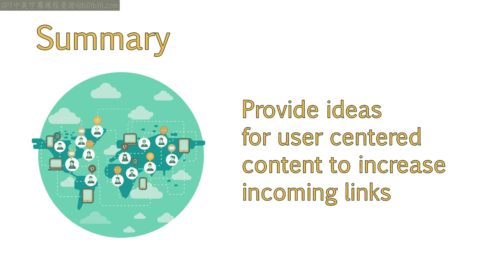
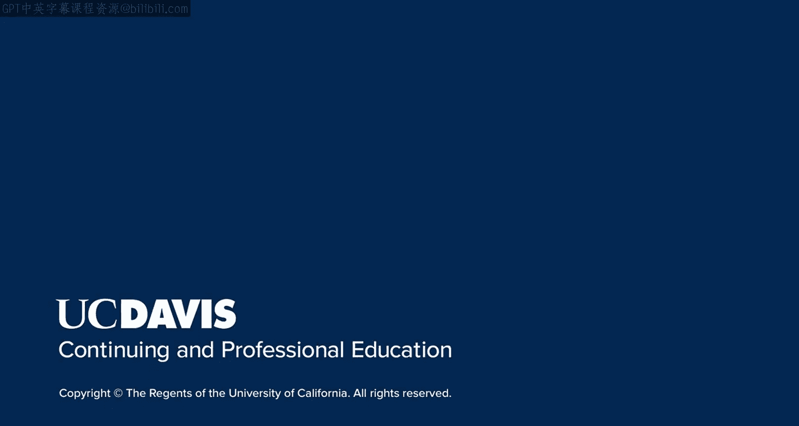

# 025：了解目标受众 🎯

在本节课中，我们将学习如何利用多种工具来深入了解您网站的目标受众。通过分析地理、人口统计和行为数据，您可以更有效地塑造网站内容和营销策略，从而提升SEO效果和用户参与度。

---

如今，有大量工具可以帮助您更深入地了解网站的潜在受众。从Google Trends到Alexa、Quantcast，再到Followerwonk等，每种工具都能帮助您收集关于网站访问者地理位置和习惯的具体数据。

本节中，我们将探讨几种SEO工具可以提供的具体受众数据，并解释这些数据如何帮助您优化网站内容和营销策略。

## 利用Google Trends分析地理数据 🌍

上一节我们提到了多种工具，本节中我们来看看Google Trends。Google Trends能让我们洞察地理数据，这有助于我们定位合适的关键词。这对于可能产生大量社交分享的博客文章或网站资源尤其有用。

例如，当我们查看“教科书租赁”的区域兴趣时，我们发现大部分搜索来自美国。进一步深入分析，我们可以看到哪些州的搜索量最高。

这可能会为您提供一些绝佳的博客主题创意，或者与最热门州的大学合作以进行链接建设的想法。

例如，您可以创建一个关于路易斯安那州根据教科书租赁数据统计的最热门学习科目的信息图或报告。然后，您可以将该报告提供给可能发布并链接回您网站的大学或其他媒体。

## 从人口统计数据中获取主题和关键词灵感 👥

人口统计数据能提供更多洞察，但获取难度稍大且不完全可靠。不过，它确实能为您或您客户的目标市场提供额外信息，并帮助您更有效地优化网站。

以下是几个可以提供此类数据的网站：

*   **Alexa** 和 **Quantcast**：您可以查看这些网站提供的数据。

您也可以在Google Analytics中启用此功能。使用Alexa，我们可以看到他们认为“textbookrentals.com”网站的一些顶级关键词流量。我们可以看到“教科书租赁”关键词的变体，但也发现用户关心寻找“便宜的教科书租赁”。

Alexa还提供受众人口统计信息。例如，如果我们查找其他教科书租赁网站，可以看到一些人已经完成了某种程度的大学教育，这符合我们对网站服务对象的了解。此外，大多数人从家里或工作场所浏览，很少在学校浏览。这可能为您提供关于可以创建何种内容来吸引这些用户的见解。

再次强调，这些数据并非完全可靠，但可能为您指明一些有用的方向。

## 探索受众兴趣与流量来源 🔄

类似地，SimilarWeb显示了网站访问者可能感兴趣的其他潜在主题。如果我们想开设一个博客，根据其展示的主题云，我们可能需要考虑的一些类别包括职业相关文章、教育相关文章以及关于书籍和文学的帖子。从主题云中，我们可以很好地了解使用的热门关键词。

SimilarWeb还显示流量来源，这可以让您很好地了解在直接访问或搜索之外的渠道，应在何处以及如何推广内容。查看除直接或搜索之外的渠道时，我们可以看到这个受众对邮件的响应很好，这可能意味着新闻通讯是触达您受众的有效媒介。

## 从社交媒体获取人口统计数据 📱

我们也可以从社交媒体获取一些人口统计数据。让我们以Followerwonk为例。Followerwonk是一个允许您分析Twitter个人资料、关注者和简介等功能的工具。他们提供大量免费信息，同时也是Moz订阅的一部分，因此如果您是会员，可以通过关联账户访问更多数据。

为了向您展示所有可用数据，我将通过我的Moz会员身份登录。我认为Followerwonk的数据相当可靠，因为它直接取自Twitter。但这仅意味着其可靠性与Twitter本身一样。

还需注意，这并不意味着您在这里找到的信息可以应用于您的整个目标市场，因为这仅是您目标市场中使用Twitter的那一部分。例如，如果您面向老年人进行营销，通过分析Twitter个人资料很可能找不到太多所需信息。

同样重要的是要记住，并非Twitter上的每个人都是真人，许多可能是拥有虚假个人资料和信息的机器人。

请记住，有时Followerwonk可能无法识别关注者性别，这可能是由于Twitter个人资料不完整、机器人等原因。因此，比较同一行业内的多个账户是个好主意。

您还可以查看关注者所在地的实用地图，以了解您的目标市场在特定区域的活跃程度。由于地区词汇差异，这在决定关键词选择时可能会有所帮助，我们将在接下来的几张幻灯片中讨论创建买家角色时进一步探讨。

---

本节课中，我们一起学习了如何使用多种工具来深入了解您的受众以及他们可能感兴趣的主题。您现在应该熟悉了一些可用于获取更多受众信息的工具。此外，这些分析可能会为您提供一些用户可能乐于与其关注者分享的内容创意，从而增加您的反向链接。