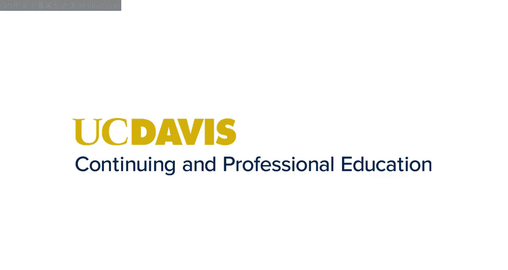
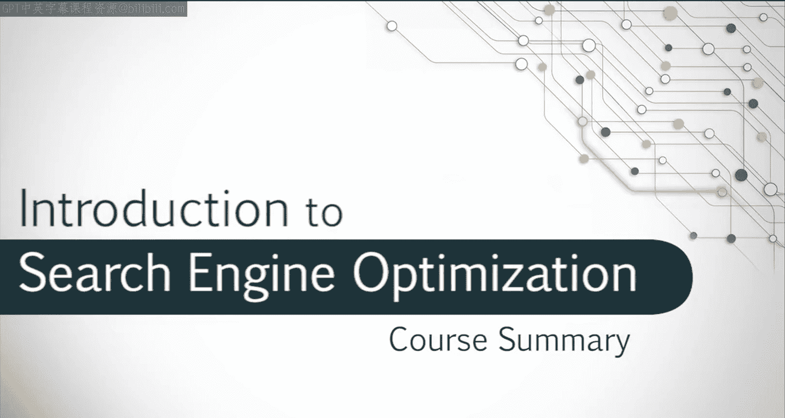

# 搜索引擎优化：027：课程总结与回顾 🎓

在本节课中，我们将对《搜索引擎优化》课程的全部内容进行总结与回顾。我们一起走过了从基础概念到行业实践的完整学习旅程，现在让我们来梳理一下所学到的核心知识。

感谢大家参与这门搜索引擎优化的入门课程。

## 课程内容回顾 📚

我们讨论了大量的内容，希望你现在对SEO行业的基础知识和框架有了更深入的理解。

### 职业发展与行业入门

在课程初期，我们探讨了SEO领域的职业发展。希望这部分内容能让你对如何开启自己的SEO职业生涯有了一些见解。

### 搜索引擎的演进

我们回顾了互联网的引入和搜索引擎的诞生，并追踪了它们发展到现代社会的历程。

### 搜索引擎的科学原理

我们深入探讨了搜索引擎如何返回有用且可信赖的结果背后的科学原理。其核心可以概括为**抓取 -> 索引 -> 排名**的过程。

### 网站优化最佳实践

在学习过程中，你应该也掌握了一些网站设计与优化的行业最佳实践。你现在能够走出去，构建一个成功的网站，使其遵循那些确保安全且易于被搜索的样式与规范。

## 学习的延续与展望 🚀

虽然我们涵盖了大量材料，但这仅仅是SEO领域的冰山一角。希望你能够继续拓展自己在这个主题上的兴趣与专业知识。

无论你决定继续学习本专业系列课程，选修我和同事们提供的其他课程，还是进行自己的独立研究与开发，我都祝愿你在未来和SEO的道路上一切顺利。

## 总结 ✨

本节课中，我们一起学习了搜索引擎优化课程的核心脉络。我们从行业概览和职业规划开始，了解了搜索引擎的历史与工作原理，并最终掌握了构建优化网站的关键实践技能。这门课程为你打下了坚实的基础，但SEO是一个不断发展的领域，持续学习将是成功的关键。祝你前程似锦！