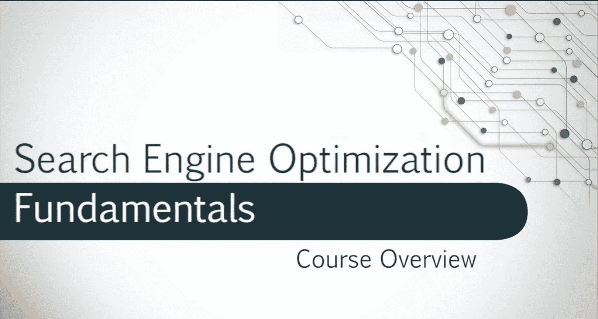
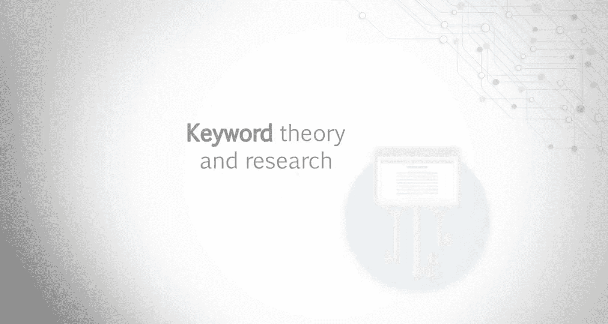

# 028：课程导论

在本节课中，我们将要学习《搜索引擎优化基础》这门课程的整体框架、学习目标以及讲师介绍。这门课程是加州大学戴维斯分校在Coursera平台上提供的SEO专项课程的第二部分。

我的名字是丽贝卡·梅，欢迎来到《搜索引擎优化基础》课程。这门课程由加州大学戴维斯分校提供，是Coursera平台SEO专项课程的第二门课。

我在搜索引擎优化领域已有近十年的工作经验。我的工作经历涵盖代理机构、企业内部职位以及顾问角色。搜索引擎优化巧妙地将我的两大兴趣——市场营销和心理学——结合在了一起。

你是否曾好奇谷歌如何如此精准地匹配你的个人搜索？或者你是否在让网站在特定主题的搜索结果中获得靠前排位时遇到困难？

在本课程中，我们将研究搜索引擎算法，以及它们如何影响自然搜索结果和网站排名。

我们将基于这些知识，来评估制定有效SEO策略的关键要素。

以下是本课程将涵盖的核心内容：
*   如何选择关键词并进行关键词研究。
*   消费者心理学与搜索行为。
*   如何进行页面SEO分析，以识别改善网站搜索优化的机会。

本课程内容分为四个主要模块。

上一节我们介绍了课程的整体目标，本节中我们来看看具体的课程结构安排。

以下是四个模块的简要介绍：
*   **模块一**：我们将探讨页面SEO。
*   **模块二**：我们将讨论页面外SEO。
*   **模块三**：我们将初步了解技术性SEO。
*   **模块四**：我们将以关键词理论与研究完成本课程。

每周，你将观看一系列视频讲解和屏幕演示。你将有机会通过练习来巩固所学，并通过测试来检验知识掌握程度。

很高兴你决定学习这门课程。我相信你会享受这个过程，并学到大量有助于你努力提升公司SEO效果的知识。

本节课中我们一起学习了《搜索引擎优化基础》课程的导论部分，包括课程目标、讲师背景以及四个核心模块的概要。在接下来的课程中，我们将深入每个模块，逐步掌握SEO的基础知识与实践技能。