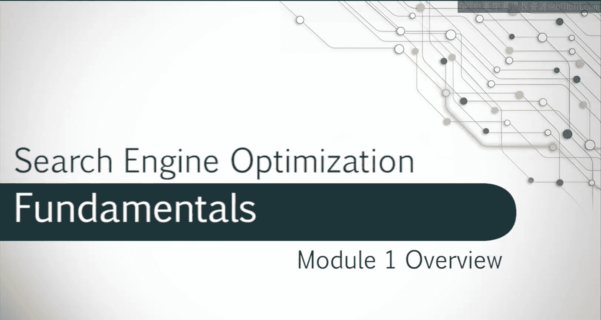

# 029：页面SEO入门

在本节课中，我们将学习如何为网站选择最佳关键词。我们将探讨关键词的相关性、搜索意图和竞争度，以帮助你决定使用哪些关键词。你还会学到如何进行恰当的竞争分析，以便客户或雇主能理解他们可能需要投入的资源，以及可能期望获得的结果。课程结束时，你将学会如何识别机会，通过关键词选择来有效地参与竞争。

## 关键词选择过程概述

上一节我们介绍了课程目标，本节中我们将详细探讨关键词选择的具体过程。这个过程旨在帮助你找到最适合优化网站的关键词。

以下是关键词选择的三个核心考量因素：

1.  **相关性**：关键词必须与你的网页内容高度相关。
2.  **搜索意图**：关键词背后的用户意图必须与你的网页目标相匹配。
3.  **竞争度**：你需要评估该关键词的竞争激烈程度。

## 关键词相关性与搜索意图

理解了基本框架后，我们来看看前两个因素：相关性与搜索意图。关键词的相关性确保你的内容能真正满足搜索者的需求。而理解搜索意图则能帮助你创建符合用户期望的内容类型。

## 进行竞争分析

在确定了相关且意图匹配的关键词后，下一步是评估其竞争环境。进行恰当的竞争分析至关重要，它能帮助你设定现实的期望并规划所需资源。

以下是竞争分析的两个主要目的：

*   让客户或雇主了解可能需要的资源投入。
*   让他们对可能获得的结果有一个合理的预期。

## 识别竞争机会与总结

最后，我们将综合运用以上所有知识。通过分析关键词的相关性、意图和竞争度，你将能够识别出有效的竞争机会，从而做出更明智的关键词选择决策。

本节课中，我们一起学习了页面SEO中关键词选择的核心流程。我们详细探讨了如何基于**相关性**、**搜索意图**和**竞争度**来筛选关键词，并了解了竞争分析在设定资源期望和结果预期中的重要性。掌握这些方法，你将能够为网站选择更具竞争力的关键词。