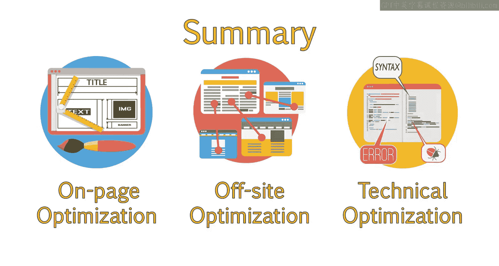
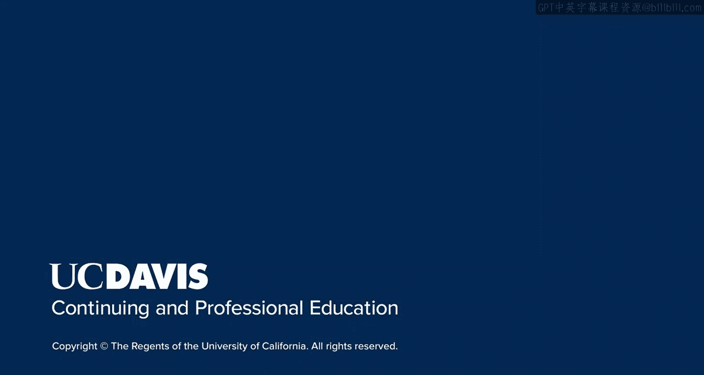

# 030：SEO关键领域 🎯

在本节课中，我们将讨论搜索引擎优化的三个关键领域：**页面内优化**、**技术SEO**和**站外SEO**。学习完本节内容后，你将能够定义这些核心领域，理解它们在网站优化中的作用，并掌握帮助网站在搜索引擎中获得更高排名的具体策略。

网站优化主要分为三个关键领域，我们将在接下来的课程和模块中逐一深入讲解。这将帮助你全面理解制定完整SEO策略所需的各项战术。

---

## 三个核心优化领域

在SEO领域，你经常会听到以下三个主要方面：

1.  **页面内优化**
2.  **技术优化**（也称为站内优化）
3.  **站外优化**

---

### 页面内优化

上一节我们介绍了SEO的整体框架，本节中我们来看看第一个核心领域——页面内优化。

页面内优化是指优化网站中单个页面或一组页面的元素，以提升网站整体的SEO表现。之所以称为“页面内”，是因为我们关注的是页面本身或页面代码内的各种元素。

这主要包括：
*   **页面内容**：撰写高质量、相关性强的内容。
*   **关键词选择**：为页面选择合适的目标关键词。
*   **元数据优化**：优化页面的标题标签（Title Tag）、描述标签（Meta Description）等。

**核心概念示例**：一个优化良好的标题标签代码可能如下所示：
```html
<title>初学者指南：什么是页面内SEO？ | 你的网站名</title>
```

---

### 技术（站内）优化

了解了页面内容的优化后，我们来看看更深层次的技术优化。

技术或站内优化涉及改善网站整体的技术层面。它超越了关键词和内容，着眼于搜索引擎如何更好地“看到”和“理解”你的网站。

通过技术SEO策略，我们会检查并提出建议，以改进网站内部使用的代码、网站结构等。技术SEO非常重要，因为：😊

**核心公式**：`优质内容 + 糟糕的技术架构 = 低排名`
即使你对网站进行了最好的页面内优化，如果搜索引擎无法找到或理解你所做的改进，这些努力也将收效甚微。

---

### 站外SEO

最后，我们来探讨如何从网站外部着手提升优化效果。

站外SEO指的是在你自己网站之外采取行动，以提升网站的优化水平。在这方面，SEO与公共关系非常相似，因为它非常注重与其他网站管理员建立良好关系。

历史上，站外SEO主要指从其他网站获取指向你网站的链接（即外链建设）。但这个领域正在迅速扩展，涵盖了社交媒体和其他站外元素。

---

## 总结





本节课中，我们一起学习了构成一个完整优化策略的三大核心领域：**页面内优化**、**站外优化**和**技术优化**。你现在应该能够定义每个重点领域，并理解它们如何协同工作，共同创建一个优化程度更高的网站。在接下来的课程中，我们将对每个领域进行更深入的探讨。