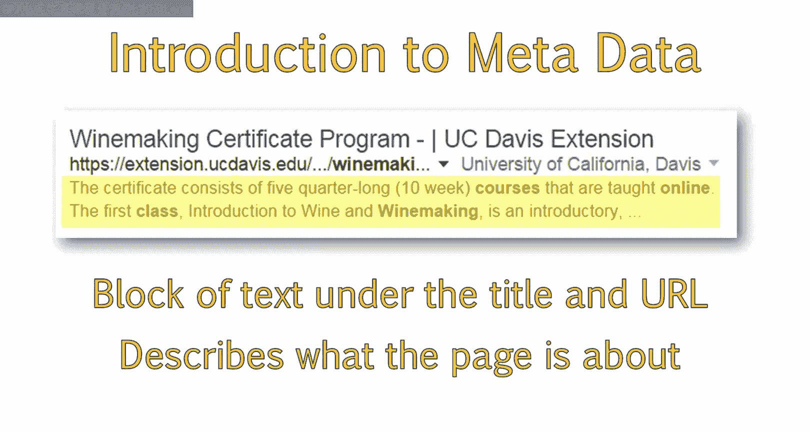
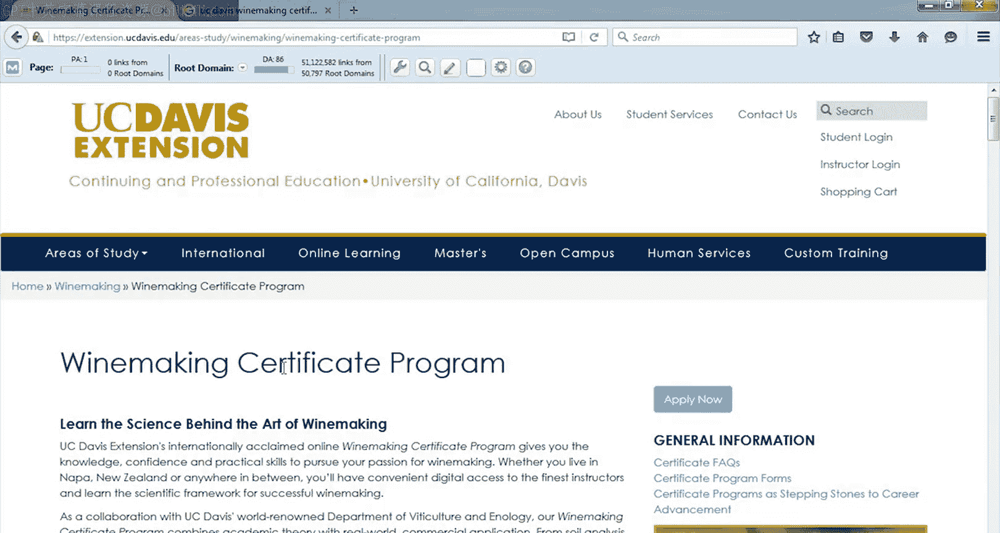
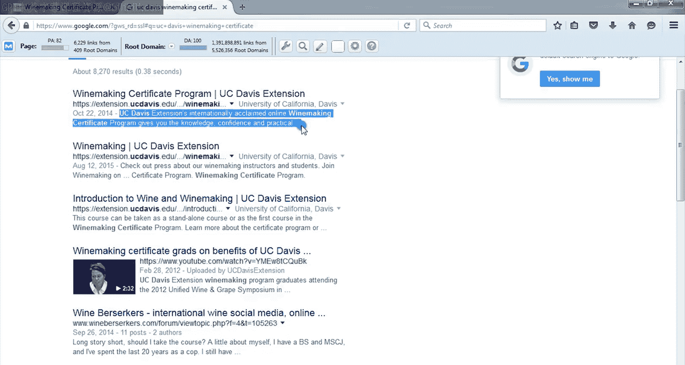
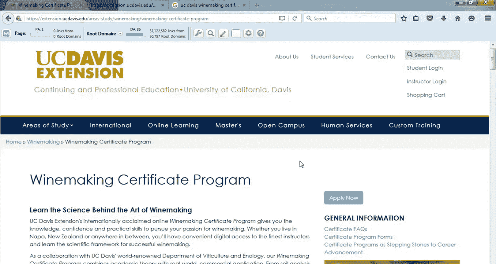
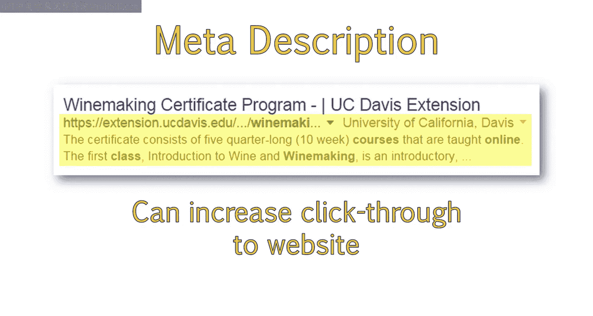
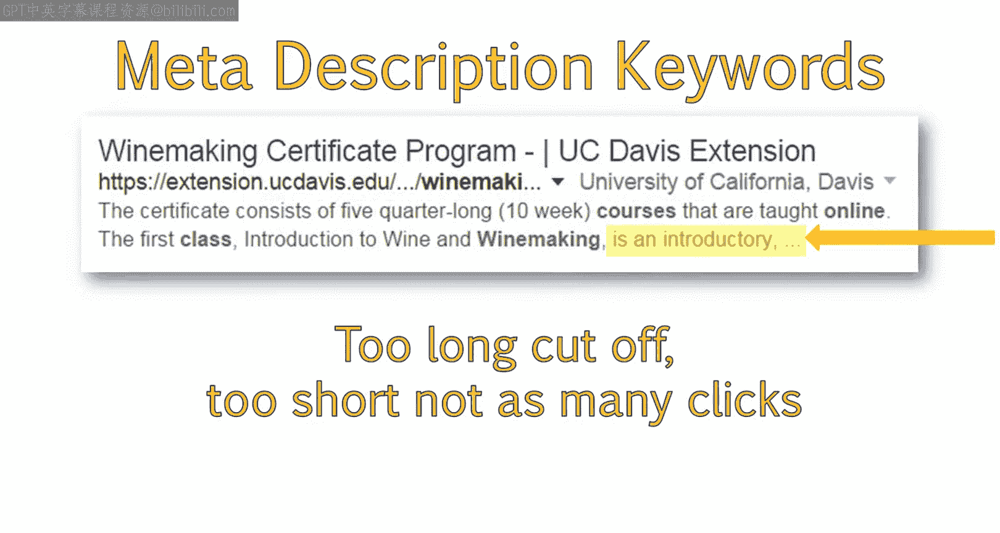
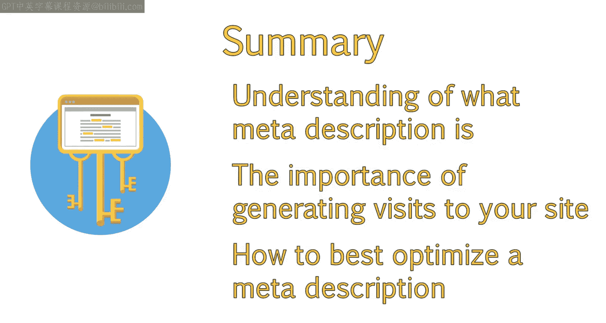
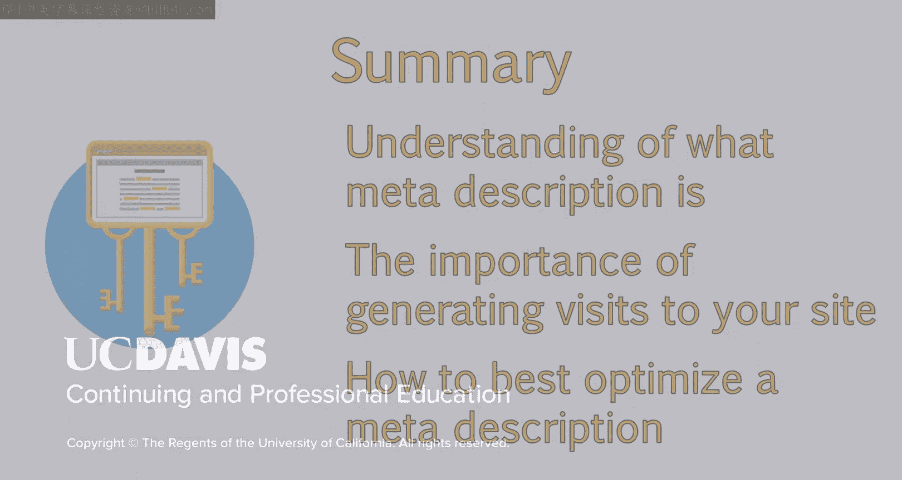

# 033：UCD《搜索引擎优化（谷歌、SEO基础、优化网站、进阶、毕业项目）｜Search Engine Optimization》中英字幕 p33 5_元描述的辅助作用.zh_en -BV1N66VYsEue_p33-

Let's move on。Now that you understand the title tag， we'll move on to another meta tag。

 the meta description。Since meta description keywords don't help a site rank。

 this can be overlooked in SEOo， but we'll look at how this can be used to direct website traffic。

Once you fully understand the purpose of the meta description。

 you'll see how to best use it for an on page optimization strategy。As a refresher。

 the meta description is the block of text under the title and URL。

This block of text describes what the page is about。

It is also important to know how to locate the meta description when you are viewing the site。

I will provide a quick demonstration。

In this demonstration， I will show you how to locate the meta description of a page。

Unlike the title tag， the meta description can be seen on the page or within the browser。

This area is hidden to the viewer and only displays publicly in the search results。

For example， this is a page for UC Davis Wine Ma Certificate Program。Under this result here。

 you can see the meta description of the result。

To discover the meta description of the page itself。

You can either look at the source code or use a browser add on。

To view the meta description in the source code， right click anywhere on the page and then choose View page source。

This will open up a tab displaying the source code of the page you are viewing。

You can locate the meta description here where it says meta name equals description。Next to that。

 you'll see content equals。This tells search engines that information after the equal sign。

Here is part of the meta description。Sometimes websites will not contain a meta description。

 and if this is the case， the page may still include a meta description tag。

 but no content will exist within the tag。Sometimes they won't include a meta description tag at all。

The next way we can locate the meta description is by using a browser add on。In this example。

 I'm going to use the Mosbar。To locate the meta description。

 click on the magnifying glass and choose page elements。

You'll be able to locate the meta description here。

And then see the content within the meta description。

You can also see the number of characters that exist within the meta description content。

You may notice that this meta description does not match the meta description we just read in search results。

If Google believes this area is not well optimized， for example。

 maybe it's not relevant to a query or maybe it's too long。

Google may choose their own meta description to show users。

You should now be able to locate the meta description within search results。

In the source code of a website or by using a browser add on。

Unlike the title tag， keywords within the meta description will not help a site rank better for those keywords。

Due to this， some people are under the misconception that optimizing this area is not helpful to their Se O strategy。

However， while search engines will not look for keywords within the meta description for ranking purposes。

The meta description does help support your SEOo strategy。

A well crafted meta description has been found to increase click through to your website。

That means it influences how likely a user is to click on your result instead of a competitor's。

 Do you recall how the keywords we used were bolded within the meta description。

This helps to draw the eye to that particular result。

It lets us know that the page contains exactly what we're looking for。

By writing a meta description and using keywords that you think a user is likely to search for。

More of the words within that description will be bolded。

Meta description should contain information about the page that entices a user to click。

While also naturally incorporating keywords they might use while performing a search。

You want the meta description to accurately describe the content。For example。

If you just included a list of keywords and no real content。

Most of the keywords would not end up bolded since only a selection of the keywords a user typed in would become bold。

And then the meta description wouldn't makes sense to users。

Mana descriptions should also have a character limit。In this example。

 you can see how the meta description is cut off。Indicating that there is more to read that didn't fit within the space provided。

This can lead to a poor user experience， so it is recommended to keep meta descriptions under 160 characters in link。

Remember when we were viewing the meta description in the screencast。

The meta description used was 415 characters in length。Which is way too long。For this page。

 Google has decided to provide its own meta description based on the content on the page。

This may be due to the existing description's excessive length。

It's important to try to use as many characters as possible without exceeding 160。

If your meta description is too long。It will either not be used or get cut off like the example above。

If the meta description is too short。This can impact click through to your site When search engines decide to create their own meta description。

They will usually take a block of text from the page that includes keywords the user searched for。

The text they choose may not best highlight what the page is about。

Search engines will usually take a full block of text， even if it exceeds 160 characters。

So this may create an unappealing result。It's a good idea to control this area to ensure you present the best information possible。

In cases where you aren't sure which keywords are best to include。

Or if your page is a broad focused topic around multiple keywords。

It may be best to let Google choose the meta description for you。

This is because they will always include appropriate bolded keywords。For pages like blog posts。

 people tend to let Google write the description for them， and that's okay。However。

 for static pages and articles like this example。It's fairly easy to guess what someone will be searching for。

In this example， they'll be searching for keywords related to wine making。

In the word course or certificate。In this case， it may be best to highlight exactly what you want to share about the program right away by writing your own meta description instead of letting search engines decide。

You are in control of the content displayed and have the opportunity to describe your page the way you want to。

Since you know more about your content than search engines do。

You will be able to provide a better description of the page than search engines can。

You should try to use words that really describe the value of the content and entice users to click。

In addition to describing your content， and including keywords。

It's also a good idea to include a call to action。Calls to action have been found to increase click through from search results to your site。

A call to action basically request the user to perform a specific action， such as visiting your page。

When website visitors are faced with calls to action， telling them exactly what you want them to do。

 they are more inclined to take that action。Including words like learn more。

 read our article to discover， find out or download here or watch our video。Can help get that visit。

Another great reason to optimize this area is that social networks use this as a description of the page when you or another user post that page's link to a social network。

When you don't have a meta description， social media sites will choose their own text。

This text is usually just the first text seen on the page。

And if that doesn't happen to be the most catchy and memorable piece of information you want to share。

People are unlikely to visit your site。Also note that social media sites will also poll in the title。

 which is another reason to optimize that area。Let's revisit some of the best practices we've discussed about meta descriptions。

An optimized meta description should contain a couple elements。

The meta description looks better if the end is not cut off due to length。

Avoid going past 160 characters。I try to stay somewhere in between 150 and 160 characters in length。

Which provides a good length while also remaining under the character cutoff limit。

It's a good idea to include keywords where you can。

This will draw attention to your meta description when words used within the search query are bolded。

It's also a best practice to include a call to action。

Calls to action can improve the click through to your page。

A call to action is basically a sentence telling the reader what they should do next。For example。

 a good call to action for the wine making course might be click here to learn the art of making wine。

Or enroll in our online wine making certification course。

Avoid using quotations or special characters， whenever possible。

Quotation specifically will cause your meta description to be cut off。For your next assignment。

Take a look at the UC。 Davis wineine making certification page。

And create a new meta description following the best practices we discussed。Next。

 create a meta description for a page and website of your choosing following SEO best practices。

Describe why you created the meta description you did for each of your examples。

And be sure to include a link to the example side of your choice。

You will be asked to review another Pi's work。When you are doing so。

 make sure they have completed the following。Have they included a link to the example site they used。

Is the meta description between 150 and 160 characters。

Does the meta description contain words that people are likely to use when searching for this topic？

Does the meta description contain a call to action。By now。

 you should have a clear understanding of what the meta description is。

 the importance of the meta description in generating visits to your site。

And how to best optimize the meta description to increase click through from search results to your website。

