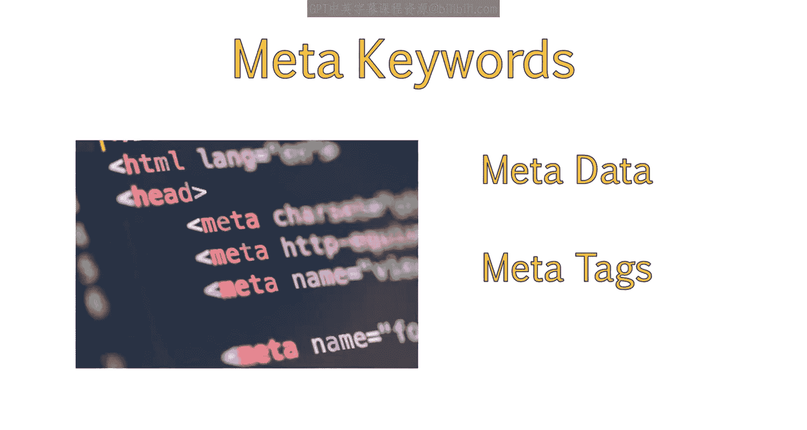
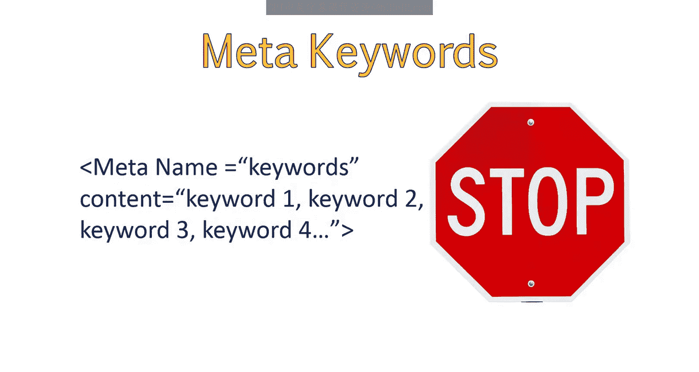
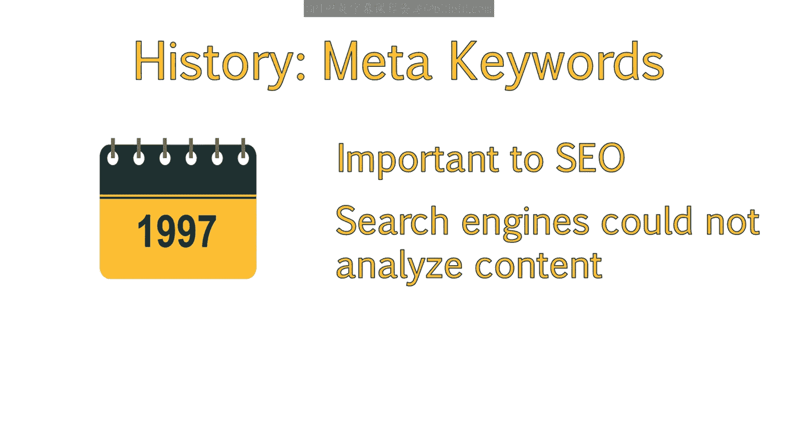
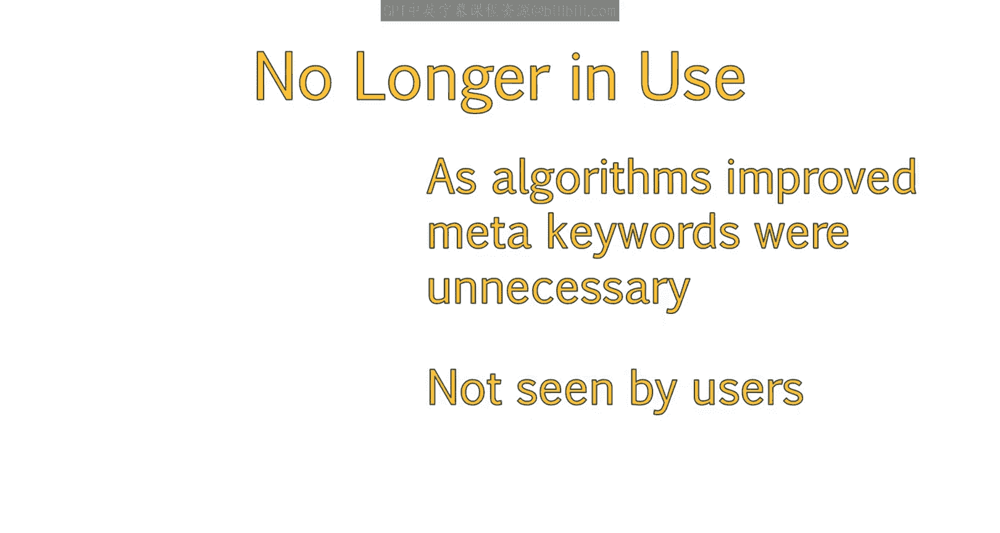
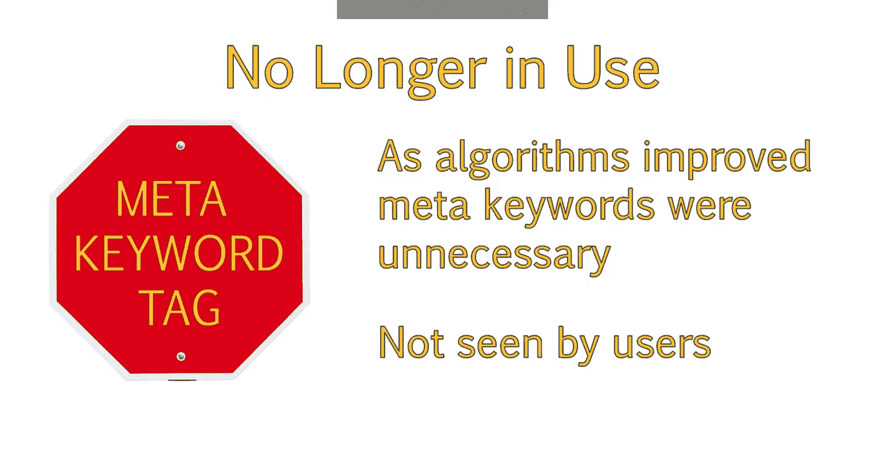
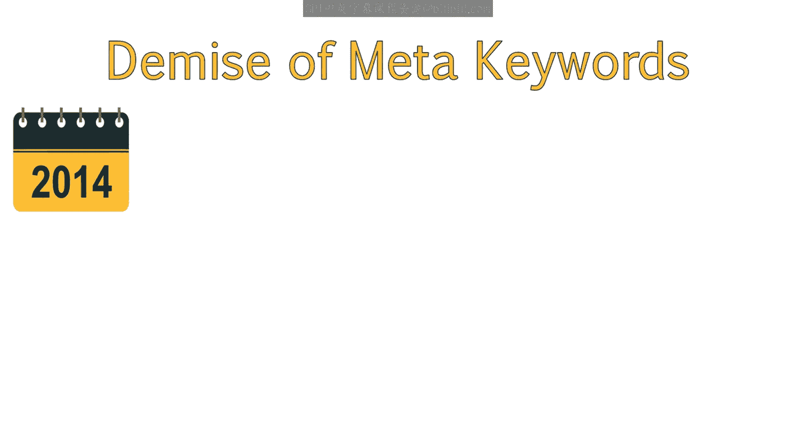
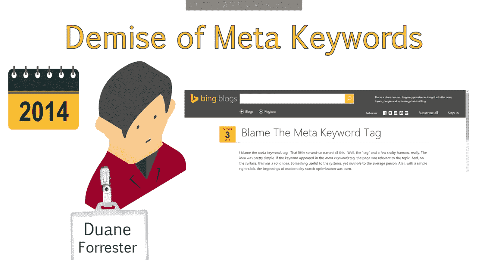
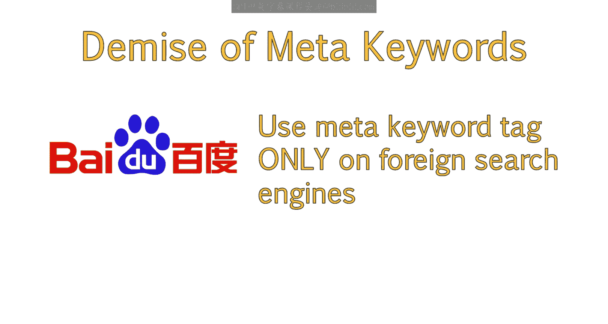
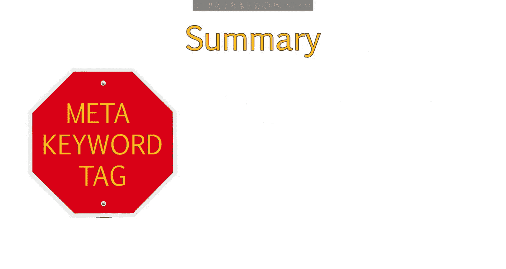
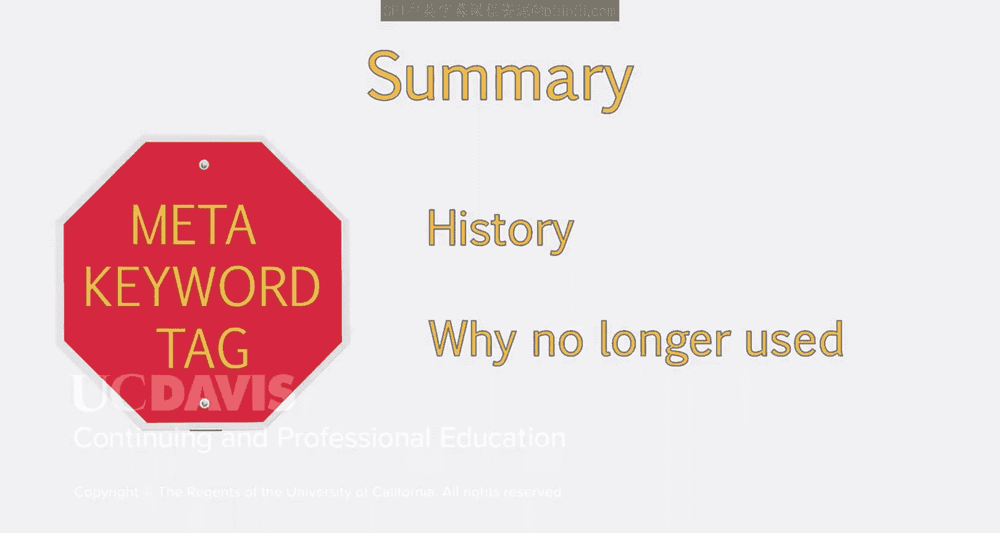

# 034：关于关键词元标签的说明 📝

在本节课中，我们将要学习一个在SEO历史上曾扮演重要角色，但如今已基本被弃用的元素——关键词元标签。我们将了解它的历史、作用以及为何现代搜索引擎优化策略中不再需要关注它。

---

上一节我们介绍了标题标签和元描述，本节中我们来看看另一个元标签：关键词元标签。

这个标签曾经是SEO策略的核心组成部分，但现在仅在某些特定情况下使用。了解其历史有助于你理解这个概念及其原始目的。这对于可能仍会询问此标签的客户，以及了解像百度这样的搜索引擎当前如何使用它，都很有用。

## 关键词元标签的历史与演变 🕰️

在过去的课程中，我们讨论了元数据和其他重要的元标签。另一个需要讨论的元标签区域就是关键词元标签。

这个区域已不再是SEO的关注重点。你可能仍会听到客户询问它。许多内容管理系统仍然保留着用于元数据的区域，其中包括关键词元标签。

许多年前，这个标签对SEO很重要。当时的搜索引擎不具备像今天这样分析页面内容的能力。因此，它们很难确定一个页面的主题是什么。

这导致了关键词元标签的诞生。它是一段信息片段，用于向搜索引擎提供该特定页面应该针对哪些关键词进行排名的信息。

然而，正如人们所预料的那样，随着时间的推移，这个区域没有被负责任地使用。网站管理员会在这个区域堆砌大量关键词。这导致许多并非用户搜索最佳结果的页面获得了排名，从而造成了糟糕的用户体验。

随着搜索引擎算法的改进，关键词元标签变得过时了。现在不再需要使用它。

与仍然可以被用户看到（尽管不影响排名）的元描述不同，关键词元标签不会被用户看到。因此，它对用户体验和排名都毫无影响，最好置之不理。

## 现代搜索引擎与关键词元标签 🔍

你偶尔会听到有人提到，某些搜索引擎可能仍会使用关键词元标签。

但这种情况非常罕见。2014年，必应的高级产品经理Dwayne Forestster写了一篇精彩的博客文章，解释了关键词元标签的消亡，以及它如何无法帮助你的网站。你可以在学习材料提供的链接中访问这篇文章，建议你阅读一下。

不过，你应该注意，一些国际搜索引擎，例如中国的搜索引擎百度，仍然会使用这个标签。但输入的信息必须是中文。

除非你在针对外国搜索引擎进行大量的国际SEO，否则你可以放心地忽略关键词元标签。

## 总结 📋

本节课中我们一起学习了关键词元标签的历史背景、其被弃用的原因以及在现代SEO实践中的地位。你现在应该理解了关键词元标签背后的历史，以及它为何不再被使用。

核心要点是：**关键词元标签 (`<meta name="keywords" content="关键词1, 关键词2">`)** 对现代主流搜索引擎（如谷歌、必应）的排名已无任何影响，可以忽略。仅在针对特定市场（如使用百度）时，才需要考虑使用符合当地语言的关键词。