# 搜索引擎优化（谷歌、SEO基础、优化网站、进阶、毕业项目）：035：URL优化 🔗

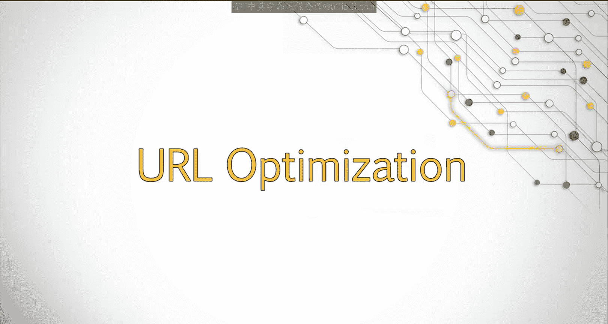

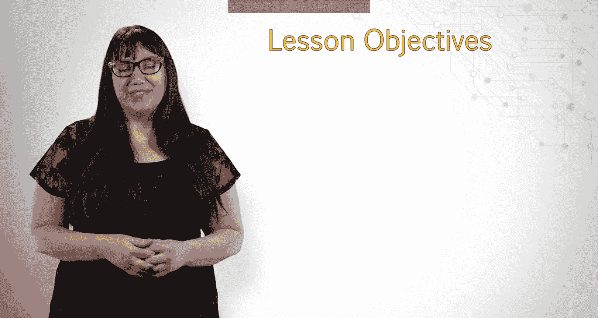

在本节课中，我们将要学习URL（统一资源定位符）的优化。作为互联网用户，你可能已经熟悉URL，但现在你将有机会了解如何根据SEO最佳实践来优化URL，包括关键词、子目录和参数的使用。我们还将探讨何时有机会更改URL，以及何时最好保持URL不变。

## 什么是URL？

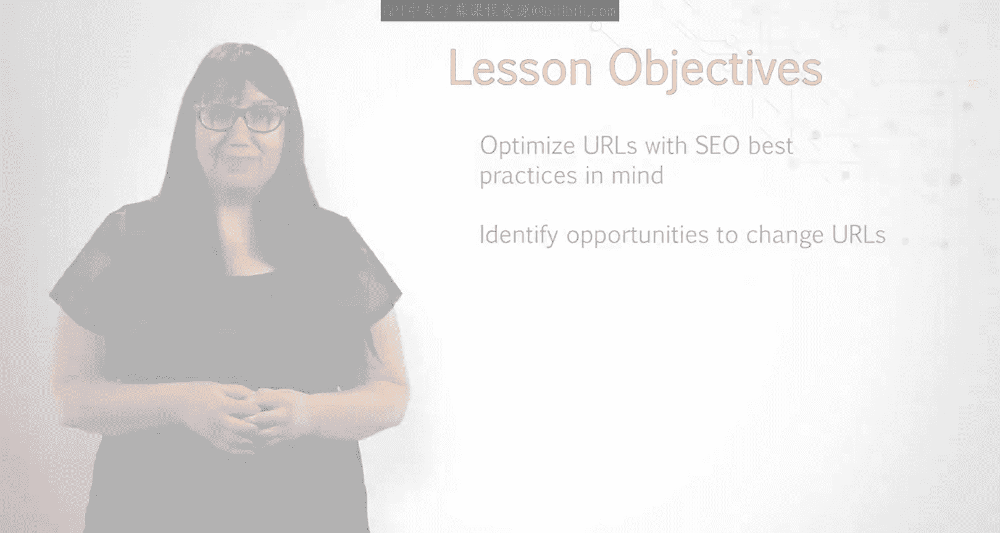

URL本质上是一个加载特定网站或文档的地址。它向访问者和搜索引擎描述一个页面。与重要的元数据元素一样，URL应具有相关性、包含重要关键词，同时保持简洁。

例如，在URL中，关键词“winemaking”被加粗显示。由于字符限制，URL被截断，但理想情况下，应尽可能将重要关键词放在URL的开头。

## URL中关键词的作用

URL中的关键词曾经在SEO中扮演重要角色，但过度优化导致谷歌调整了URL关键词在决定网站排名时的重要性。URL中的关键词仍然有用，只是作用不如从前那么大。

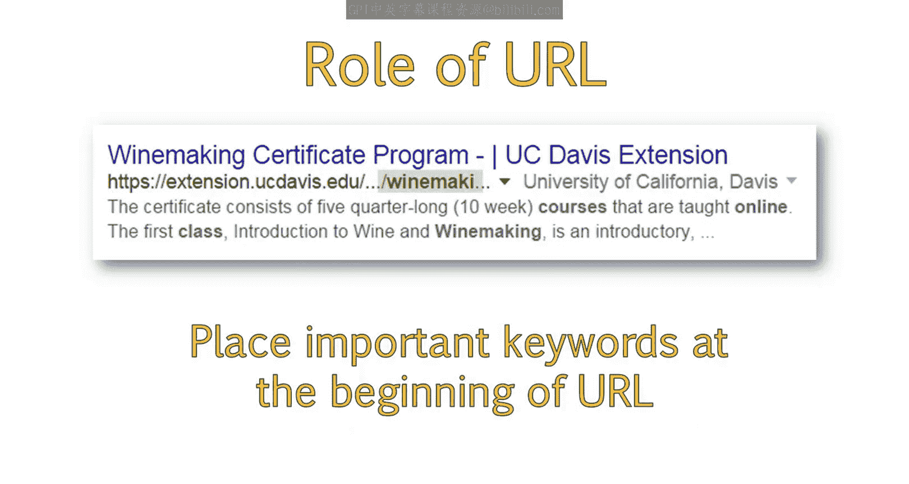

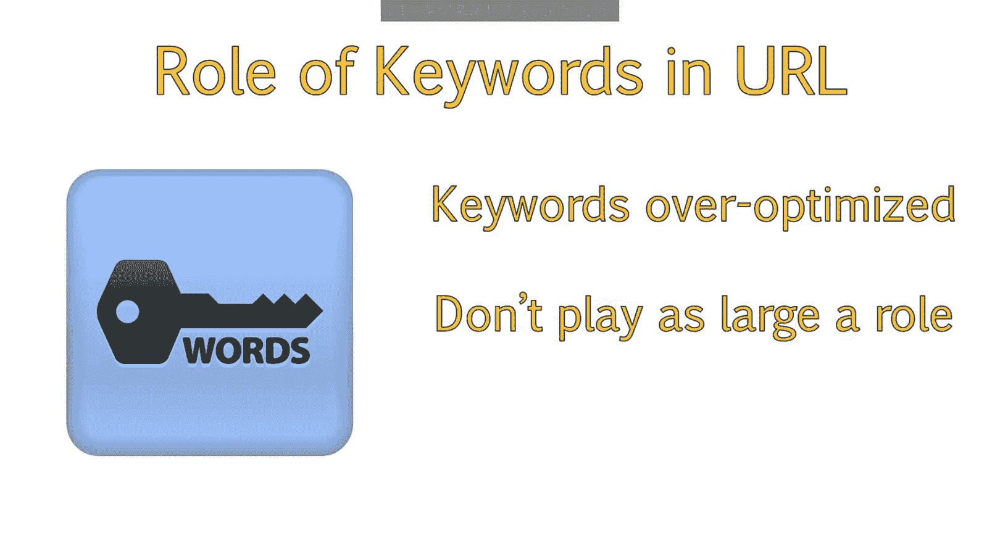

然而，从站外SEO的角度来看，URL也应被考虑。如果人们使用URL作为链接指向特定页面，URL本身可以作为锚文本，其中的关键词可能有助于该页面被视为与这些关键词相关。

例如，查看UC Davis项目的完整URL，该页面可能被视为与“study”、“winemaking”和“certificate”等词更相关，这些词共同指向该页面的整体主题。

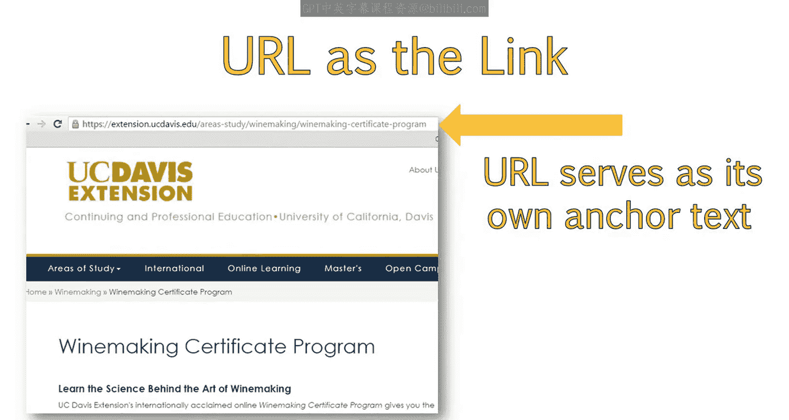

## 子目录的作用

查看URL时，你可以看到包含信息的各种正斜杠。例如，“areas-of-study”和“winemaking”。这些是子文件夹，也称为子目录，有助于对网站上的文档进行分类。

当搜索引擎显示URL时，它们通常会省略中间的类别或子文件夹，以使URL更短、更易于阅读。你可以在示例搜索结果中看到这一点，我高亮了谷歌删除的部分。

如果子目录中包含重要关键词，搜索结果中可能会包含部分子目录名称。这部分会被加粗，有助于吸引注意力。

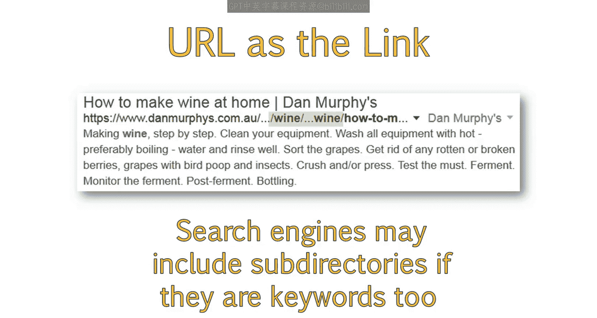

例如，搜索“how to make wine”，我看到一个排名靠前的结果链接到一个名为Dan Murphy‘s的网站。查看该URL，我可以看到包含了两个子目录。这两个子目录都有关键词“wine”被加粗。

分析URL时，我们可以看到整个子目录“wine”因关键词而被包含，然后部分子目录“more-about-wine”也被包含。但只有关键词“wine”被列出，因为该关键词与我们的搜索查询具体相关。接着，你可以看到URL的最后一部分，这部分会正常显示，但由于长度原因被略微截断。然而，URL的最后一部分也被加粗，有助于吸引注意力。

## 参数的影响

在查看此URL时，我还想指出末尾一长串字母和数字的组合，我已将其高亮。这些称为参数，在可能的情况下，最好将它们排除在URL之外。

参数不仅会使你的URL过长，而且参数本身常常会基于各种因素而变化。这个特定的参数是一个会话ID，意味着它会根据用户而变化。

如果你搜索“how to make wine”并找到该网站点击结果，你的URL会与我这里的略有不同。这可能导致重复内容问题，因为URL已更改，但内容保持不变。

## 更改URL的考量

除非我们SEO从业者在网站设计阶段就参与进来（遗憾的是，这种情况很少见），否则我们对URL的显示方式和创建哪些子目录几乎没有发言权。

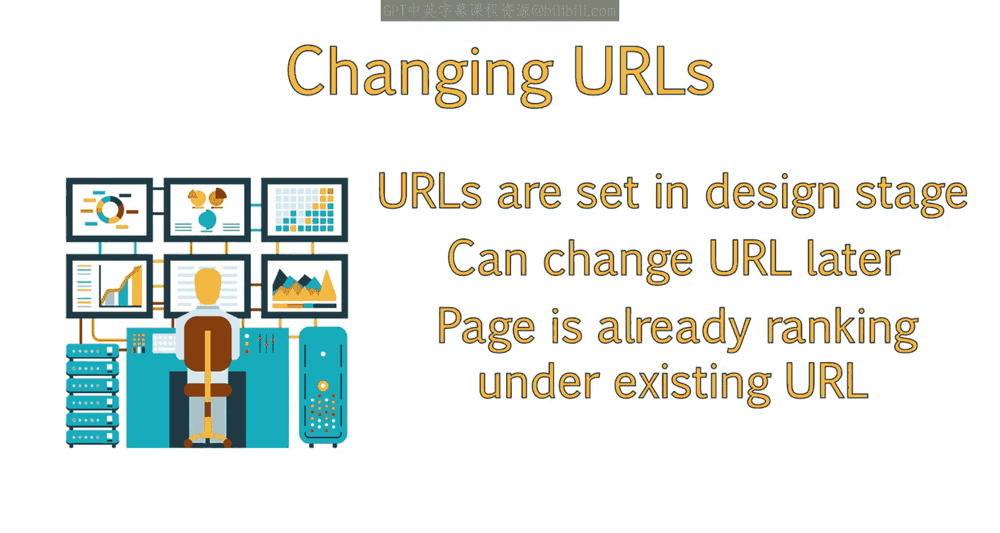

你总可以在事后更改URL，但请记住，该页面可能已经在现有URL下获得了排名。之后更改意味着它将失去已积累的部分历史和权威。

如果必须更改URL，最好确保使用301重定向（永久重定向）将其重定向到新页面。一旦发生这种情况，谷歌需要时间从索引中删除旧URL并索引新URL。因此，仅仅为了SEO而更改URL并不总是最佳选择。是否这样做的建议需要视具体情况而定。

通常情况下，最好尽你所能优化页面和其他页面元素，而保持URL不变。

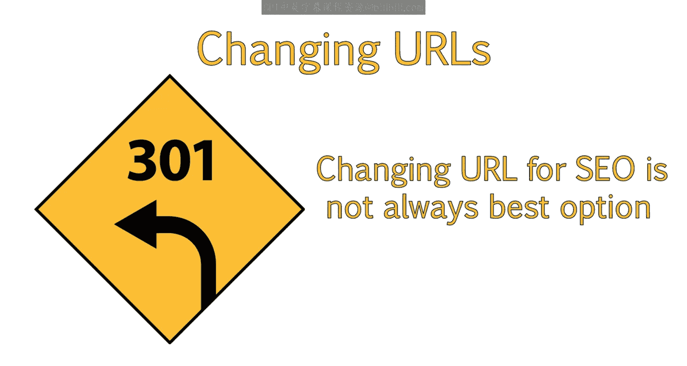

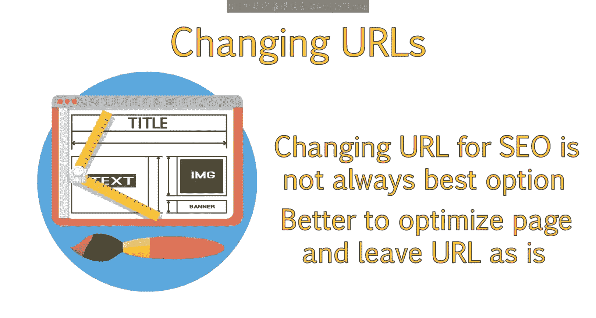

## 创建新URL的最佳实践

决定是否更改现有URL，无论是为了重新设计还是SEO目的，都需要视情况而定，如果仅仅为了SEO，在做出更改前应慎重考虑。

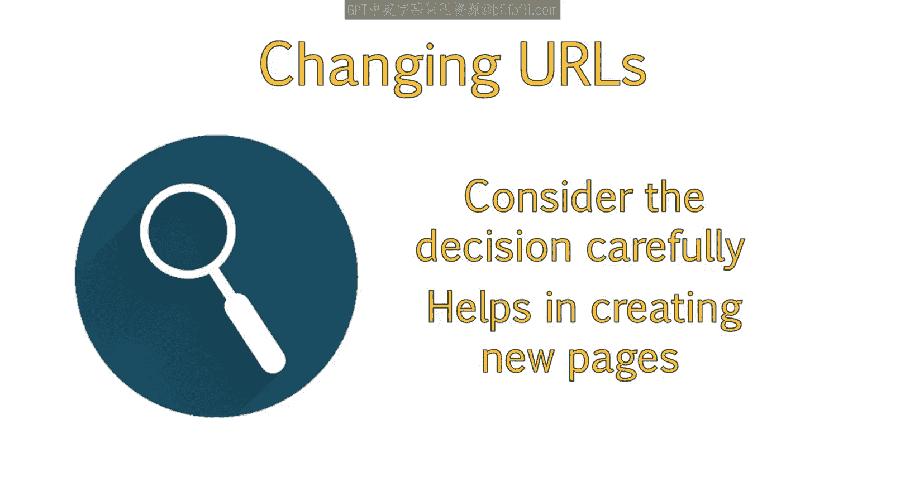

然而，在与客户合作创建新页面，或者在你构建自己的网站或与客户合作构建他们的网站时，这些知识将派上用场。每当创建新页面时，请遵循我们讨论过的最佳实践来创建优化的URL。

以下是URL的一些最佳实践：

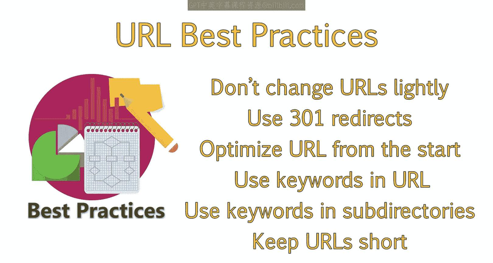

*   **不要为了更改而更改URL。**
*   **如果必须更改URL，请始终使用永久301重定向将其重定向到新页面。**
*   **最好从一开始就优化URL。**
*   **在可能的情况下，将关键词融入URL。**
*   **在可能的情况下，将关键词融入子目录。**
*   **保持URL简短精炼。**

## 总结

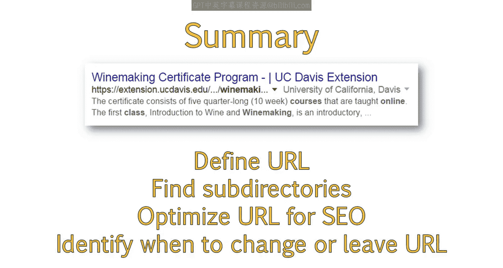

本节课中，我们一起学习了URL的定义，并能够识别URL中的子目录。此外，你还应了解如何以SEO为目标优化URL，以及如何为新网站或重新设计优化URL。你也应该能够识别更改URL的时机，以及何时应保持URL不变。