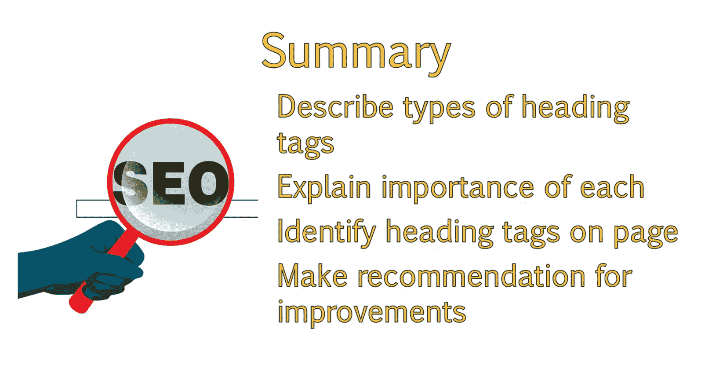

# 036：UCD《搜索引擎优化（谷歌、SEO基础、优化网站、进阶、毕业项目）｜Search Engine Optimization》中英字幕 p36 8_标题标签使用指南.zh_en -BV1N66VYsEue_p36-

Hello again， headings， they're used in documents and papers to help organize them。

While that is also the case for a web page， the heading tags are also important for SEO。

In this lesson， you'll learn the difference between types of heading tags and their importance。

From this， you'll be able to identify heading tags as well as be able to make recommendations for improving them to a client。

Documents you write， as well as web pages have headings。

You have a primary heading referred to as an H1 or less frequently as heading 1。

And subheadings referred to as H2， H3， and so forth。

Heading tags not only help to stylistically break up the content on the page。

But are also useful for Seo。Search engines will look at the heading tags on a page to better determine what the page is about and the page's structure。

From an Se O standpoint， the H1 tag is the most important of the heading tags。

 and then H2 tags are somewhat important。In the grand scheme of things， these are both small signals。

 but it never hurts to have the heading tags optimized with keywords。

 as long as it sounds natural and not written for robots。

If you are unable to naturally incorporate keywords that reinforce the title tag of the page and the pages theme。

It's best to leave it out。Subsequent heading tags like H3 and so forth are not really looked at by search engines from an Se O standpoint。

So we usually only address H1s and H2s with clients。It's a good idea to stick to 1 H1 per page。

 and then use H2s as subsequent heading tags as needed。

Don't include multiple unnecessary heading tags on one page just to include keywords。

As this can make a page appear spammy。You can view what elements of the page are H1 and H2 tags by viewing the source code or by using a browser add on。

I personally like Moz's add on， but you can find any that works best for you when you start examining headings of a page。

 you will often find that a portion of the text that looks like it should be an H1 or an H2 is not。

You may also find that some elements of the page are coded as a heading when they really shouldn't be。

Our job as Seos is to review the page and make recommendations on where to adjust the heading tags and how to best incorporate keywords into the heading tags where possible。

😊，I'm going to take a brief moment to show how you can identify heading tags within a page。

In this demonstration， we will walk through how you can identify heading tags on a page。

There are a couple of different ways you can view heading tags on a page。For example。

 if you want to know whether or not a specific area of text is correctly coded as a heading tag。

One way to find out is to highlight that section of text。Right click and then choose In El。

This will provide you with a view of the specific section of the source code of the page。

In this case， we can see that the text we are looking at wineine Ma certificate program。

Is correctly wrapped in an H1 tag。If you want to see all of the heading tags on a page without having to highlight individual pieces of text individually。

 you can view the entire source code。To do so， right click anywhere on the page。

And then select View page source。A window showing the source code of the page will pop up。

This isn't a very popular method， as there is a lot of information within the source code。

 which can make it difficult to find what you want to look for。To find heading tags。

 you can always just perform a search for the type of heading you are looking for。For this example。

 I'll press C F since I'm on a PC and then type in H1。

The first H1 it brings me to shows me that the H1 is the site name。To view additional H ones。

 I can press enter。And then cycle through additional H1s on the page。

The next one brings me to the H one we were examining earlier， wineine Ma Cer program。

If I press enter again， it brings me right back to the first H1 we just saw。

 which means these are the only two H1 tags on the page。The next method is using a browser add on。

In this example， I'll use the Mos bar。To view the heading tags。

 I can click on the magnifying glass and then select page El。

I could see the H1 here and the text of those H1s here under content。In general。

 you really only want or need H1 H1 per page， and in this case， since the first H1 is the site name。

Which is going to be the same across all pages within the site。

This is creating duplicate content and isn't providing any value。If this were a client。

 we would recommend that they remove the site name as the H1。

One of the downfalls of the Mos bar is that it only picks up1 H2 tag。

We can see that the H2 tags picking up in this case is secondary menu， which isn't an optimal H2。

One of the recommendations we would make would be to remove the H2 tag from this area as it's not helpful to SEO and menus do not need to be wrapped in heading tags。

If we go to the page itself。And look at code behind the second heading here。

 Learn the science behind the art of wine making。We can inspect this。

And we will see that this is an H2 tag as well。This H2 is much more optimal。If we were to inspect。

These additional heading tags， such as about the program， estimated cost， how to apply。

We would see that each of these areas are all age2s。In some cases。

 you can naturally incorporate keywords within these heading tags。For example。

 instead of just saying about the program。You might want to change this too about the wineine Ma certification program。

You wouldn' not want to do this for every age2， But having one or two additional instances of keywords on the page is a good idea as long as it sounds natural。

That wraps up this demonstration on how to find heading tags on a page。So after reviewing that page。

 we already have some recommendations we can provide to the client。Remove the H1 from the site name。

Remove the H2 from the menu。Incorporate a keyword into the second H2 tag。

Add H 3 tags to subheadings near the bottom of the page。

 Your assignment for this lesson is to select two different sites of your own choosing。

Look at the home page of the site and any interior page you want。

Find the H1 and the H2 of these pages if they exist。If the page has multiple H1s， list those。

List any recommendations you have for improving the H1 and the H2。

 you should now have an understanding of the different types of heading tags on a page and the importance of each within an on page optimization strategy。

You should be able to identify heading tags on a page as well as the type of heading tags you are looking at。

In addition， you should be able to make recommendations for improving heading tags within the page。

 whether this is adding heading tags， removing heading tags。

 or incorporating keywords into existing headings。😊。

