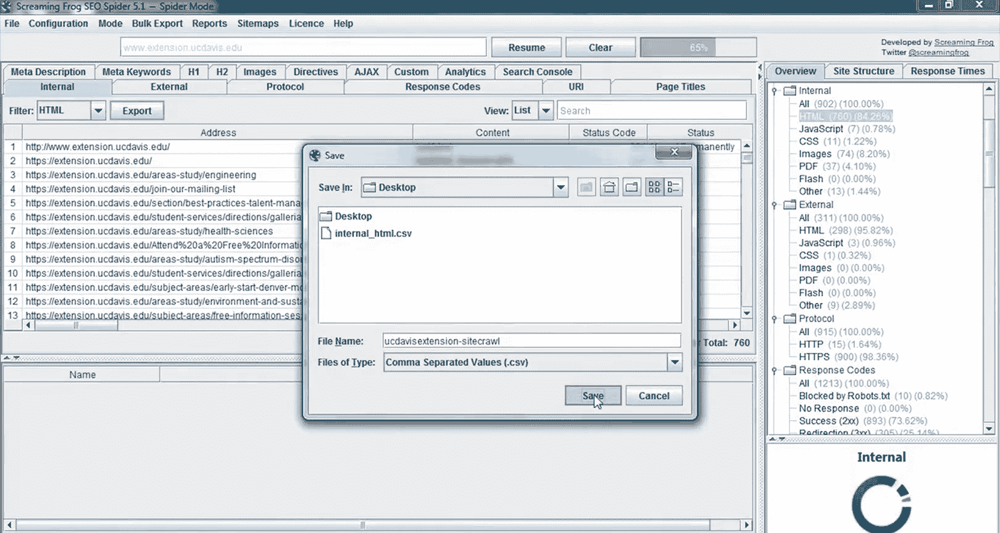
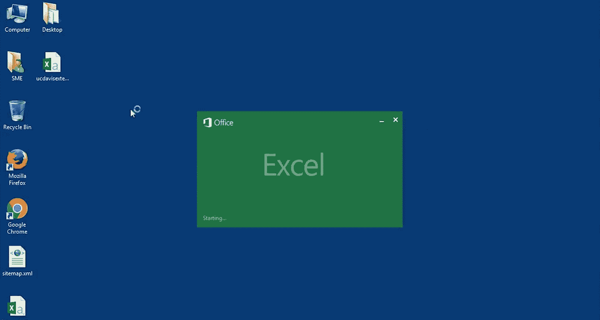

# 搜索引擎优化（谷歌、SEO基础、优化网站、进阶、毕业项目）：038：使用爬虫分析网站 🕷️

在本节课中，我们将要学习如何使用爬虫工具一次性分析整个网站的页面SEO元素。手动逐一检查每个页面非常耗时，而爬虫可以像搜索引擎机器人一样扫描您的网站，并提取关键数据供您分析。课程结束时，您将掌握使用爬虫进行网站全面SEO审计的方法。

## 什么是网站爬虫？

上一节我们介绍了如何手动分析页面上的各个SEO元素。本节中，我们来看看如何借助工具进行大规模分析。

一种查看整个网站信息的有效方法是使用所谓的爬虫或蜘蛛工具。爬虫是一种工具，它能像搜索引擎机器人一样“爬行”或“扫描”您的网站。这可以向您展示它从网站页面中提取了哪些数据，使您能够大规模地查看我们在课程中讨论过的各类信息。

## 选择爬虫工具：Screaming Frog

要爬取一个网站，我推荐一款名为Screaming Frog的程序。如果您爬取的网站页面数在500页以内，Screaming Frog可以免费使用。但如果您需要爬取更多页面，则需要购买专业版。对于学习目的，免费版本完全足够。

## 使用爬虫进行大规模分析

现在我们已经讨论了如何在单个页面内定位标题标签、元描述和标题标签。接下来，我们来看看如何大规模地查看这些元素。

我们可以使用一个工具来实现，这个工具会像搜索引擎机器人一样爬取整个网站。然后，这个网站爬虫将向我们展示关于这些重要元素的站点级信息。

在这个示例中，我将使用名为Screaming Frog的爬虫工具。您可以获取Screaming Frog的免费版本，它能为每个站点爬取最多500个页面。但最终，为了处理更大的网站，您可能需要升级到专业版本。

Screaming Frog将为我们的SEO分析提供大量有用数据。

以下是开始爬取一个网站的具体步骤：

1.  **输入网址**：在搜索栏中添加目标网站的URL。
2.  **开始爬取**：点击“开始”按钮。在本例中，我将使用`UC Davis Extension`作为示例网站。
3.  **查看进度**：当工具开始爬取网站时，您可以在右侧看到进度。请注意，这个进度数字可能会根据工具发现的页面数量而变化。
4.  **浏览结果**：工具发现并爬取的页面将显示在下方。您可以查看工具发现的内容类型，例如：是否是HTML页面、是否是图片、是否是JavaScript文件，或其他信息如可能存在的PDF文件。
5.  **检查状态码**：您还可以查看相关的状态码及其含义。我们将在后面更深入地讨论这一点，但现在请注意，这里是查找重要状态码信息的地方。

## 查看和分析SEO元素

如果您向右滚动，可以看到标题标签及其长度，以及元描述及其长度。如果继续滚动，您还能看到标题标签。

您也可以使用顶部的选项卡来查看这些信息。例如，如果我们点击 **H1** 选项卡，就能看到每个页面的主H1标签是“UC Davis Extension”（网站名称），然后是第二个H1标签。这里也包含了H1标签的长度。您可以以这种方式查看H1标签、H2标签等。

为了更好地分析这些数据，我更喜欢将爬取的页面下载到Excel文件中。

以下是处理数据的步骤：

1.  **筛选HTML页面**：您可以先筛选出仅包含HTML的页面，这样之后就不必在图片或JavaScript文件中进行筛选。操作方法是：选择“HTML”类型。
2.  **停止爬取并导出**：在爬取过程中无法导出，所以我们需要先停止爬取，然后导出已获取的数据。
3.  **保存文件**：为文件命名，例如“UC Davis Extension_网站爬取数据”。这有助于我们记住这是一个网站爬取文件。然后保存文件，例如保存到桌面。

## 在Excel中分析数据

文件保存后，您可以打开这个Excel文件，查看它发现的所有信息的列表。这使您能够更轻松地根据特定需求筛选和分析数据。

## 课程总结

本节课中，我们一起学习了如何爬取一个网站，并在爬取结果中识别重要信息，以及如何下载和筛选这些信息供您自己分析。

您现在应该理解如何爬取一个网站，并一次性查看大量页面的页面元素。您也应该理解如何下载这些数据并将其存储在Excel文件中。