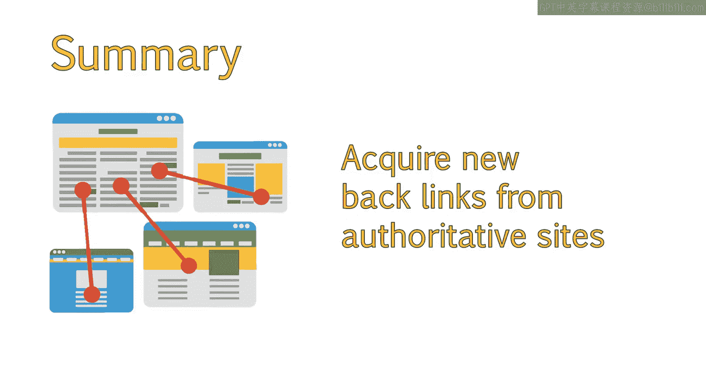

# 041：追踪内容外链来源

在本节课中，我们将要学习谷歌如何分析指向你网站的外部链接，以及如何建立高质量、自然的外链来提升网站权威，同时避免因低质量链接而受到惩罚。

---

## 理解谷歌如何分析外链

你的网站表现如何，部分取决于谁链接了你的内容。谷歌通过分析这些外部链接来评估网站的权威性和相关性。

上一节我们介绍了外链的重要性，本节中我们来看看谷歌具体如何分析这些链接。谷歌认为，所有链接都应该是自然获得的，而非通过刻意购买或操纵手段获取。然而，为了获得外链，我们仍需付出努力。现在的核心思路是，获取那些看起来尽可能自然、非人为操纵的链接。

## 如何建立自然的外链

建立自然外链的关键在于提供卓越的用户体验和优质内容，以吸引用户和网站主动链接。然而，即使内容优秀，通常也需要进行一定的推广，以确保内容能被愿意分享和链接的目标人群发现。

以下是建立自然外链的几个核心策略：

*   **创造优质内容**：这是吸引外链的基础。
*   **进行定向推广**：主动联系相关领域的博主或网站，介绍你的内容。
*   **提供卓越用户体验**：确保网站易于使用、加载快速，这能间接促进分享。

## 谷歌评估链接质量的因素

多年来，谷歌算法在识别低质量链接和判断哪些链接是优质、自然获得方面已变得非常成熟。算法在判断链接质量时会考察多种因素。确保你的外链档案多样化且显得自然，这至关重要，能帮助你避免受到“企鹅”等算法的惩罚。

谷歌在根据你的外链档案判断网站权威时，会考察许多不同因素。以下是其中一些关键因素：

*   **链接数量**：你的网站拥有的外链总数。
*   **链接质量**：链接是否来自其他权威网站，还是主要来自权威性低的新站或垃圾网站。
*   **链接相关性**：链接到你网站的站点内容是否与你的网站主题相关。例如，一个咖啡网站被一个销售咖啡杯的网站链接，相关性就很高。
*   **链接位置**：链接在对方网站上的位置。通常，位于页脚或侧边栏的链接（即全站链接）价值较低，有时可能被视为垃圾链接。
*   **锚文本**：链接的可点击文字。理想情况下，锚文本应包含相关关键词，但过多关键词丰富的锚文本会显得不自然。一个自然的链接档案通常会混合使用品牌名、通用词（如“点击这里”）和纯URL作为锚文本。
*   **互惠链接**：谷歌会查看是否存在互相链接的情况，因为这可能被视为链接交换，导致双方链接价值降低。

## 维护健康的外链档案

因为谷歌长期以来非常重视链接，并且近期开始严厉打击垃圾和操纵性链接策略，他们创建了“拒绝链接工具”。该工具位于谷歌搜索控制台，允许站长告知谷歌忽略指向其网站的低质量链接，从而避免惩罚。建议在使用此工具前，先尝试自行联系移除那些低质量链接。

为了确保维持一个看起来自然的外链档案，你需要定期审查你的外链。同时，持续从权威网站获取新的外链也同样重要。

我们在加州大学戴维斯分校的SEO认证课程中，提供了关于创建有效站外SEO策略的更详细技巧。

---

本节课中我们一起学习了谷歌分析外链的核心因素，包括数量、质量、相关性和锚文本等。我们探讨了如何通过创造优质内容和适当推广来建立自然外链，并了解了如何使用谷歌的拒绝链接工具来维护一个健康的外链档案，从而安全地提升网站在搜索引擎中的表现。