# 042：社交媒体对SEO的利弊影响 📱

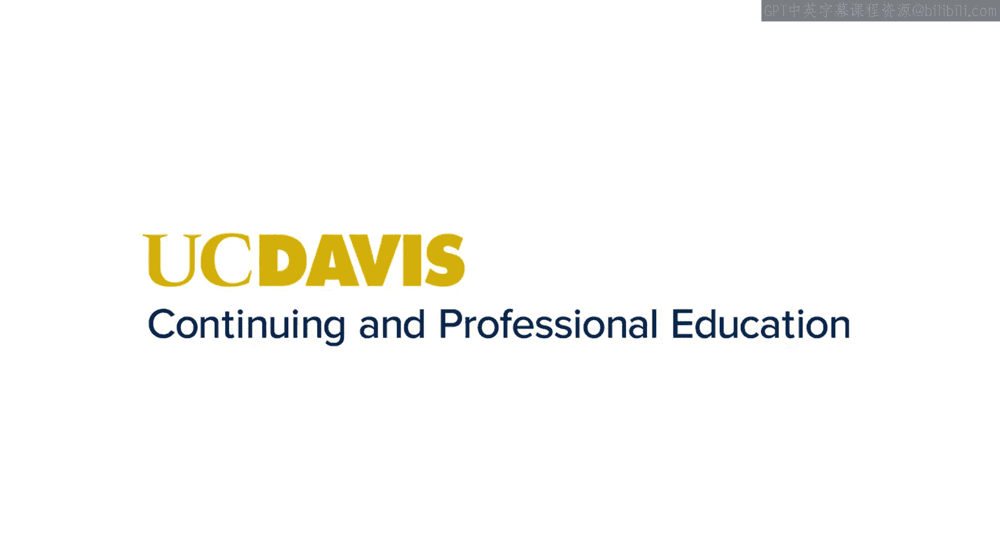

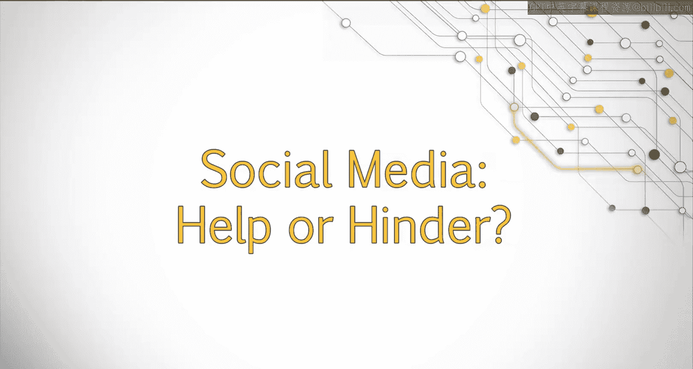

在本节课中，我们将要学习社交媒体如何间接影响搜索引擎优化。虽然链接建设是提升页面权威性的核心，但社交媒体也能通过增加品牌曝光和网站流量，为你的SEO策略带来重要价值。我们将探讨其工作原理，并学习如何有效利用Twitter和Pinterest等平台。

## 社交媒体与SEO的关联 🔗

上一节我们介绍了链接如何优化搜索结果。本节中我们来看看社交媒体扮演的角色。近年来的分析显示，社交媒体使用情况与更高的搜索排名之间存在显著相关性。需要明确的是，**相关性不等于因果关系**。然而，这种关联表明，通过社交媒体发展并吸引在线用户群体，可能对SEO产生间接影响。

即使没有直接影响，一个优秀的社交媒体策略也能提升整体品牌在线可见度，帮助建立更好的声誉，从而为网站带来更多流量。

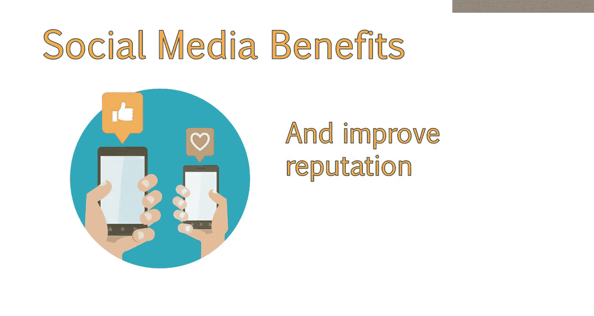

## 社交媒体的工作原理 🛠️

必须指出，谷歌已声明其算法**不会**将特定的社交媒体因素（如粉丝数和互动率）直接计入排名。但和任何网页一样，如果社交媒体内容能被谷歌访问且包含链接，这些链接就会被抓取。

因此，越多人**在Twitter上发布**或**在Facebook上分享**指向你网站的链接，谷歌就有越多机会发现并索引你网站的页面。不过，社交媒体上的链接和推文都属于 **`nofollow`链接**，这意味着它们不会在网站之间传递权威值。

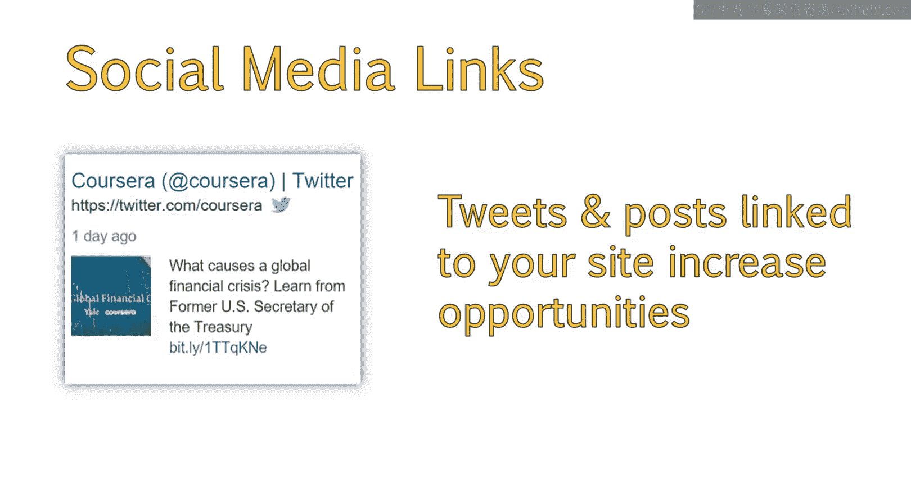

所以，虽然这些链接可能出现在你的外链报告中，但它们不会被计为能提升网站权威性的链接。然而，推文本身会被抓取和索引。因此，越多人发布提及你品牌的推文（并附上链接），你的品牌和网站链接出现在搜索结果中的机会就越多。这可以增加来自社交渠道的推荐流量，并建立更好的品牌认知。

## 将社交媒体纳入长期策略 📈

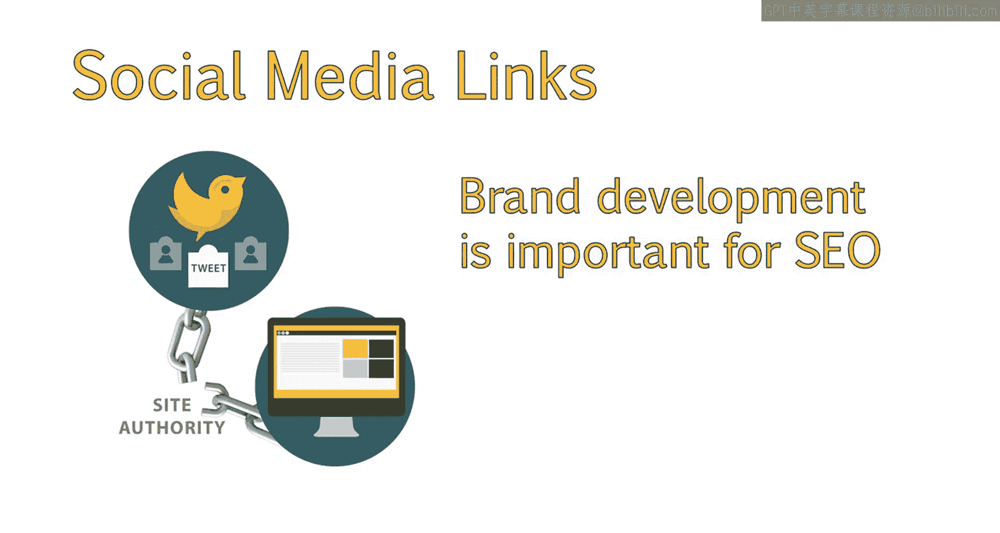

建立一个活跃的用户受众群体需要时间。因此，社交媒体不仅对SEO有用，对更广泛的营销和品牌建设工作也至关重要。建议将社交媒体作为你整体推广策略的早期组成部分。

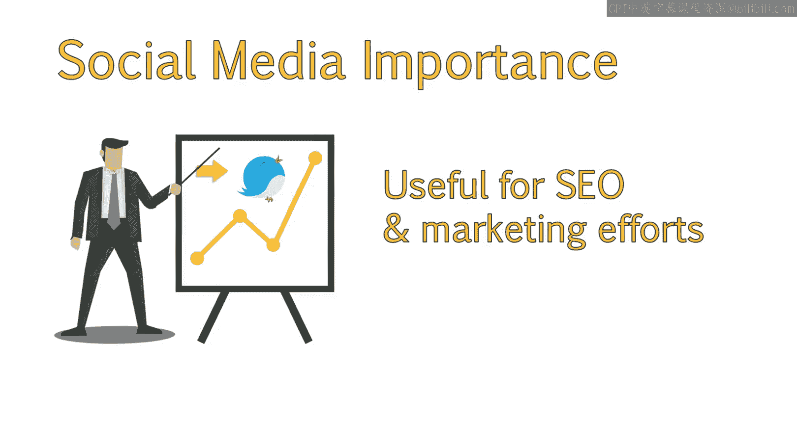

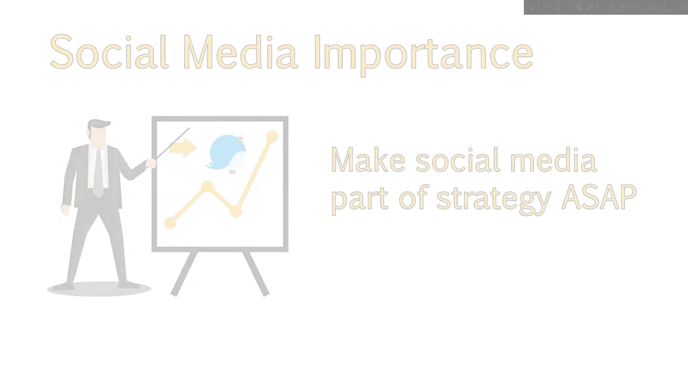

以下是优化社交媒体资料的一些关键点，以便它们能在搜索中被轻松发现：
*   确保人们搜索你的品牌时，能找到你的网站、Twitter个人资料、Facebook页面以及其他与品牌相关的社交资料（如Pinterest）。

## 利用Pinterest获取SEO机会 📌

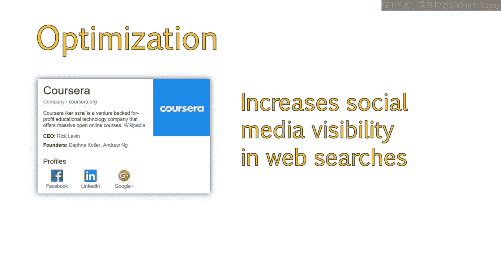

Pinterest本身提供了绝佳的SEO机会，因为它的许多图钉和画板都被谷歌索引，并能在相关搜索查询中获得高排名。经常会出现Pinterest画板排在谷歌搜索结果第一页前五名的情况。

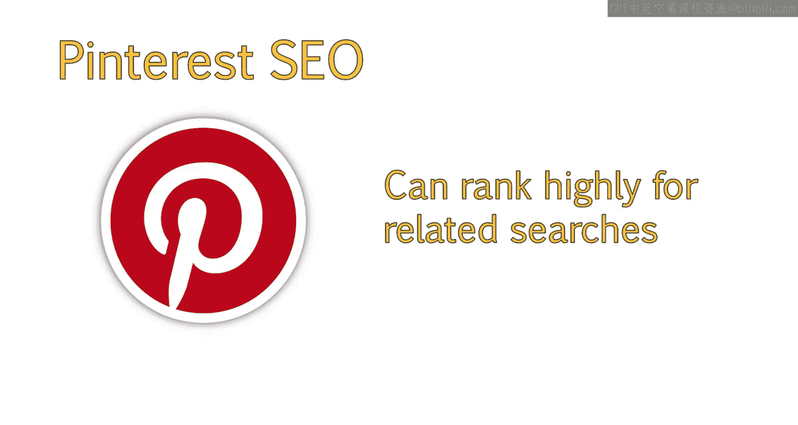

如果使用得当，这能为你的业务带来巨大价值。例如，搜索“小客厅装饰创意”这个**长尾关键词**时，一个Pinterest画板可能位列第五。Pinterest画板在**长尾利基关键词**上排名通常很好。

有效优化Pinterest画板，通过精心布置的图钉和有用的描述，确实有助于吸引访客访问你的网站。此外，拥有大量活跃关注者的画板往往在搜索中排名更好，这再次印证了发展健康、高互动度粉丝群体的重要性。

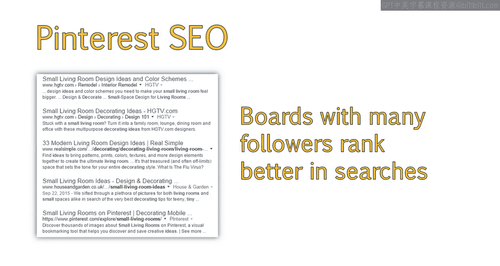

## 总结 📝

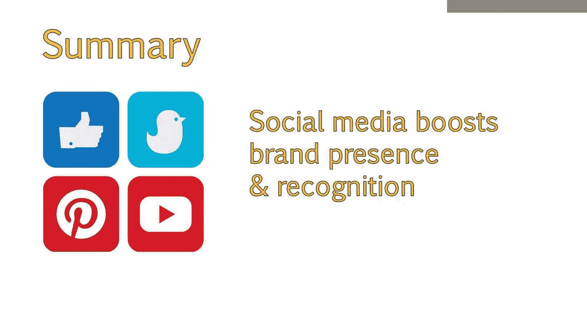

本节课中我们一起学习了社交媒体对SEO的间接影响。虽然社交媒体链接不直接传递权威值，但通过增加品牌曝光、吸引流量和提升整体在线声誉，它能为你全面的SEO策略提供重要的辅助效益。因此，应将社交媒体视为有效的站外SEO策略的一部分，以增强品牌存在感和认知度。