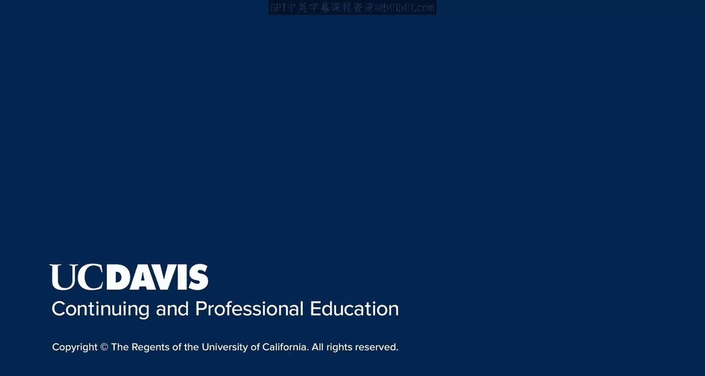

# 043：技术SEO基础

在本节课中，我们将要学习搜索引擎优化的第三个核心组成部分——技术SEO。我们将探讨如何为网站建立坚实的技术基础，以帮助搜索引擎机器人更好地抓取、索引网站内容，并最终让您的目标受众更容易找到您的网站。

在之前的模块中，我们已经学习了页面SEO和站外SEO。本节中，我们将重点介绍技术SEO，它关注的是网站的结构性基础。

技术SEO旨在为您的网站建立一个强大的结构基础。这个基础能让搜索引擎机器人更容易地导航和索引您的网站，并最终让您的受众更容易找到您的网站。

## 网站地图与机器人协议

当我们深入探讨技术SEO时，首先需要了解两个关键工具：网站地图和机器人协议文件。

以下是您需要在网站中包含的两种主要文件：

*   **HTML网站地图**：这是一种面向用户的网页，以链接列表的形式展示网站的主要页面结构，帮助访客快速导航。
*   **XML网站地图**：这是一个专门为搜索引擎准备的XML文件，其中列出了您希望被索引的所有重要页面的URL，帮助搜索引擎更高效地发现和抓取内容。


此外，您还需要在网站的根目录下放置一个 `robots.txt` 文件。这个文件用于指示搜索引擎机器人哪些页面或目录可以抓取，哪些应该被忽略。其基本指令格式如下：

```
User-agent: *
Disallow: /private/
Allow: /public/
```

## 状态码与重定向

接下来，我们来看看网站中常见的错误状态码，以及如何使用重定向来优化用户体验和SEO。


网站服务器在响应请求时会返回HTTP状态码。了解这些代码对于排查问题至关重要。

以下是网站上一些常见的错误状态码：

*   **404（未找到）**：表示服务器找不到请求的页面。这通常是由于URL拼写错误或页面已被删除造成的。
*   **500（内部服务器错误）**：表示服务器遇到了意外情况，无法完成请求。
*   **503（服务不可用）**：表示服务器暂时无法处理请求，通常是由于过载或维护。

当页面被移动或删除时，正确配置重定向至关重要。它不仅能提升用户体验，还能保留旧页面积累的搜索引擎权重。

重定向主要分为两种类型：

*   **301重定向（永久移动）**：告知搜索引擎和浏览器，某个页面已永久移至新位置。旧页面的权重会大部分传递到新页面。代码示例：`HTTP/1.1 301 Moved Permanently`
*   **302重定向（临时移动）**：表示页面只是暂时被移动到另一个URL。搜索引擎通常不会传递权重。代码示例：`HTTP/1.1 302 Found`




本节课中，我们一起学习了技术SEO的基础知识。我们了解了网站地图（HTML和XML）和 `robots.txt` 文件在引导搜索引擎方面的作用。我们还探讨了常见的HTTP错误状态码，并学习了如何通过301和302重定向来管理页面变更，从而优化用户体验并保护网站的SEO价值。