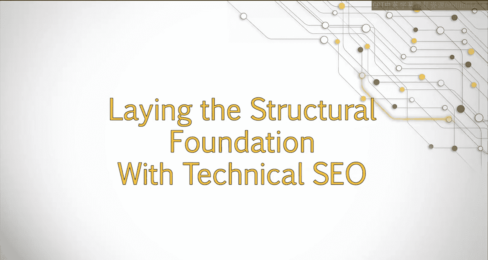
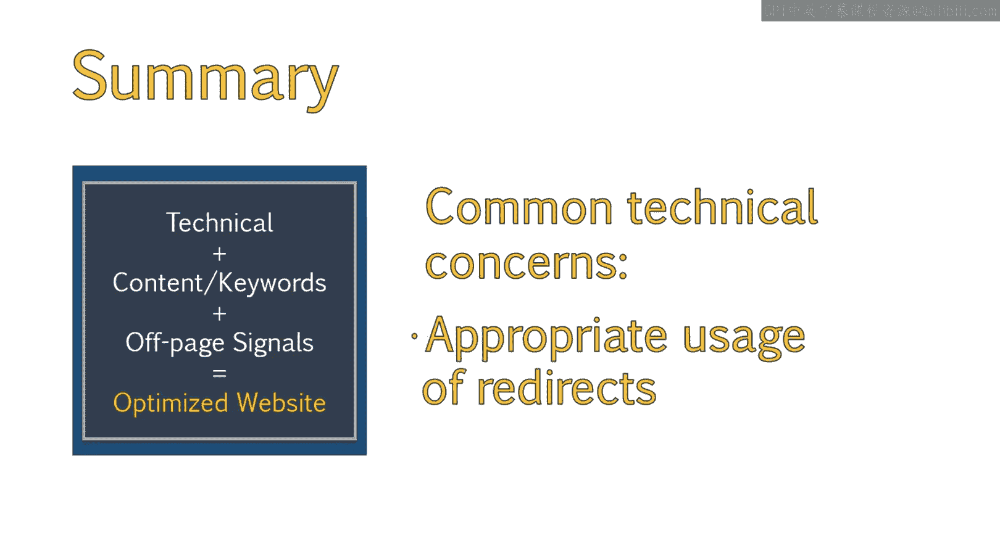

# 044：技术SEO基础架构建设 🏗️

在本节课中，我们将要学习技术SEO的概念及其重要性。我们将探讨技术SEO与页面SEO、站外SEO的区别，并了解为何在制定全面的SEO策略时，必须先打好坚实的技术基础。

一个有效的SEO策略不仅关乎内容，技术SEO同样至关重要。技术SEO为你的内容搭建结构基础，使搜索引擎能更轻松地发现网站上的内容。

上一节我们介绍了SEO的整体框架，本节中我们来看看技术SEO的具体内涵。技术SEO是创建完全优化网站整体流程中必不可少的一环。虽然页面优化和内容对SEO极其重要，但技术SEO为你所有的SEO工作奠定了恰当的基础。

## 技术SEO的重要性

能够识别网站内部的技术问题至关重要，无论你是与客户合作、建设新网站、进行网站改版，还是在提出内容相关建议前进行技术审计。如果没有这个恰当的基础，你制作的内容甚至可能无法被搜索引擎发现，这会导致极大的挫败感。确保网站有能力支持你的页面SEO建议，是任何SEO策略成功的关键。

## 技术SEO并不神秘

“技术SEO”这个术语听起来可能令人生畏，但不必担心。你不需要学习如何编写代码或如何构建网站，就能理解技术SEO并提出有效的建议。

## 技术SEO的流程与常见要素

通常，SEO工作应从技术审查开始，然后转向提供内容和关键词建议，最后再制定站外策略来支持之前的SEO工作。

技术SEO涉及许多方面，以下是一些我们将讨论的常见技术要点：

*   **XML网站地图**：帮助搜索引擎发现和索引网站页面的文件。
*   **Robots.txt文件**：指示搜索引擎爬虫可以访问或禁止访问网站哪些部分的文件。
*   **网站错误**：识别并解决服务器错误（如5xx错误）或客户端错误（如4xx错误）。
*   **404页面最佳实践**：创建用户友好的404错误页面，引导用户返回有效内容。
*   **恰当使用重定向**：正确实施301（永久）或302（临时）重定向，以管理已移动或删除的页面。

本节课中我们一起学习了技术SEO的基础概念、其在整体SEO策略中的核心地位，以及一些关键的构成要素。理解并实施好技术SEO，是为网站长期成功进行优化的第一步。