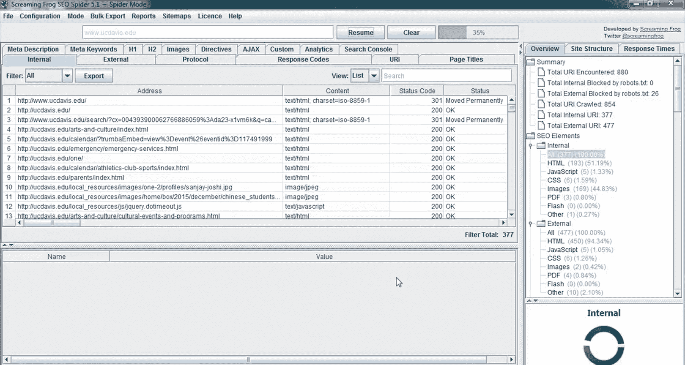
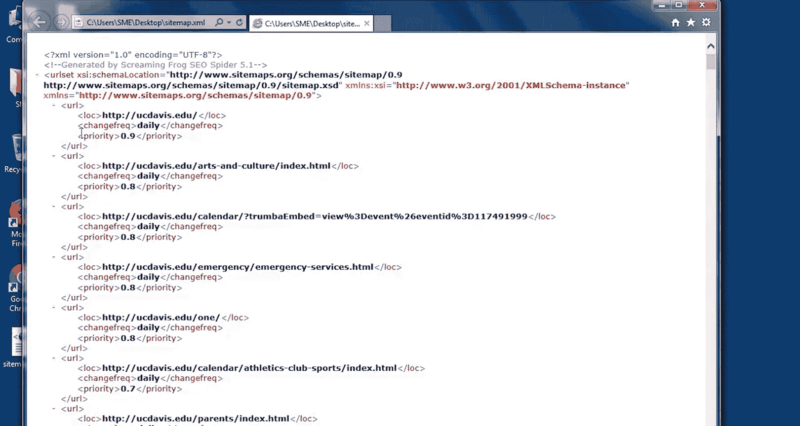

# 045：HTML与XML网站地图对比 🗺️

在本节课中，我们将要学习技术性SEO的一个关键元素——网站地图。我们将探讨HTML网站地图与XML网站地图的区别，并了解为何在网站设计中同时包含这两种地图至关重要。课程最后，我们将使用名为Screaming Frog的爬虫工具来创建一个XML网站地图。

## 概述

上一节我们介绍了技术性SEO的重要性，本节中我们来看看其中一个核心组成部分：网站地图。作为网站访客，你可能遇到过网站地图。但你是否知道，有些网站地图是专门为搜索引擎和机器人创建的呢？

## HTML与XML网站地图的区别

网站地图的作用是引导搜索引擎发现网站上的现有页面，这有助于确保页面不被爬虫忽略或遗漏。当SEO专家提及网站地图时，通常指的是HTML网站地图或XML网站地图。

两者的主要区别在于：
*   **HTML网站地图**：易于用户阅读和理解。
*   **XML网站地图**：专为搜索引擎创建。

### XML网站地图详解

XML网站地图是一个旨在供搜索引擎机器人读取的文件。这个文件包含了网页背后的大量活动信息。

它可以包含每个URL的独特信息，从而为搜索引擎提供关于该页面的额外数据。例如，你可以包含以下信息：
*   页面最后更新时间。
*   页面内容变更的频率。
*   该页面相对于网站其他页面的重要程度。

这些信息使得搜索引擎机器人能够以更逻辑、更智能的方式分析你网站上的内容。

XML网站地图对于尚未被搜索引擎发现的新网站尤其有用。由于搜索引擎通过跟踪链接列表来发现网络上的页面，一个新网站可能需要一段时间才能被发现。

通过在Google Search Console（谷歌搜索控制台）或Bing Webmaster Tools（必应网站管理员工具）中创建免费账户并上传你的网站地图，你可以主动告知搜索引擎你的新网站的存在以及包含哪些页面。

### HTML网站地图详解

HTML网站地图是一个简单的页面，包含用户应关注的网站内重要页面的链接，可以看作是一个总体概览。

例如，如果你在网站中寻找特定页面并点击了其网站地图，你很可能会在那里找到目标页面。

以下是关于HTML网站地图的常见形式：
*   较小的网站通常只有一个页面的HTML网站地图。
*   较大的网站通常会将HTML网站地图的内容按不同类别分开。这样做是为了更好地组织其网站内的内容。

理想情况下，一个网站应该同时提供HTML和XML网站地图。然而，出于本课程的目的，我们将重点讨论创建XML网站地图，因为这与SEO和搜索引擎的关系更为直接。

## 创建XML网站地图

如果你搜索“XML网站地图创建工具”，会得到多种选择。一种选择是通过名为XML-sitemaps.com的网站。这允许你创建免费的网站地图，但最多只能包含500个页面。大多数免费的在线网站地图创建工具都有类似的限制。

首选的方法是使用爬虫工具，例如Screaming Frog，来帮助创建XML网站地图。Screaming Frog的免费版本也只能爬取500个页面，但这对于在本课程中学习如何创建网站地图已经足够。最终，你可能需要考虑购买完整版本，因为它是一个分析网站非常有用的工具。

现在，让我们使用Screaming Frog来创建一个网站地图，看看具体如何操作以及网站地图文件是什么样子。

### 使用Screaming Frog创建XML网站地图演示

在这个演示中，我们将讨论如何使用Screaming Frog这样的爬虫工具来创建XML网站地图。

这是Screaming Frog的界面。首先，让我们爬取一个网站，以便创建该网站的XML网站地图文件。我将以加州大学戴维斯分校（UC Davis）的网站为例。

1.  **输入URL并开始爬取**：输入你的URL后，可以点击“开始”或直接按回车键。工具将开始爬取网站内的页面列表。你可以在右侧看到爬取进度，下方则是工具已爬取的页面列表。
2.  **查看爬取结果**：工具会显示页面地址、页面内容类型（例如是HTML文件、图像还是JavaScript等代码）、状态码、错误码、标题标签等信息。花几分钟时间爬取一个网站并熟悉界面和可用信息是值得的。
3.  **停止爬取并生成网站地图**：由于这次爬取可能需要一些时间，我们将在示例中停止爬取并使用已有的信息。爬取完成后，你可以通过点击菜单项“Sitemaps”（网站地图）并选择“Create XML Sitemap”（创建XML网站地图）来创建XML网站地图。

Screaming Frog会提供一系列选项，通常保留默认设置即可。但是，如果你有特定需求，这里也有一些额外选项。

以下是创建XML网站地图时可配置的主要选项：
*   **包含/排除页面**：你可以选择包含不希望被索引的页面。
*   **规范版本**：此选项允许你包含系列页面（如page1, page2, page3等）。
*   **包含PDF文件**：如果你的PDF文件内容是独特的，那么允许搜索引擎发现并爬取这些文件以便将其纳入索引可能是个好主意。
*   **最后修改时间**：在“Last Modified”（最后修改）标签页，你可以告知搜索引擎页面最后修改的时间。可以选择依据服务器响应或设置自定义日期。
*   **优先级**：在“Priority”（优先级）标签页，你可以设置网站内特定页面的优先级。
*   **更新频率**：你可以更改频率，显示页面更新的频率（如每日、每周、每月或其他）。
*   **包含图片**：你可以选择是否包含图片。通常这不太必要，因为谷歌在爬取页面时会发现与网站内容相关的重要图片。

选择好这些信息后，我们可以点击“下一步”来创建网站地图文件。

Screaming Frog接着会询问我们想将文件保存在哪里。在这个例子中，我选择保存到桌面。选择好保存位置后，只需为网站地图文件命名并点击“保存”。我暂时保留默认的网站地图名称。

文件保存后，你可以将其提供给网站管理员，以便他们上传到服务器；或者，如果你愿意，也可以自己上传。

为了让你了解XML网站地图文件的样子，让我们打开它快速浏览一下。

你可以看到这里有一些介绍性文本，为搜索引擎提供额外信息。然后，你可以看到每个页面及其附加信息，例如更新频率、页面URL和页面优先级。根据你选择的设置，这里可能还会显示其他信息，例如页面最后修改时间。

这个演示到此结束。你现在应该理解如何爬取一个网站以及如何创建网站地图了。

## 总结

本节课中，我们一起学习了HTML网站地图与XML网站地图的核心区别。HTML地图服务于用户，提供清晰的站点导航；而XML地图则专为搜索引擎设计，包含丰富的元数据以辅助索引。我们还通过Screaming Frog工具实践了创建XML网站地图的完整流程。掌握这两种网站地图的创建与应用，是确保网站内容被搜索引擎有效发现和收录的重要技术步骤。