# 搜索引擎优化（谷歌、SEO基础、优化网站、进阶、毕业项目）：046：robots.txt协议详解 🕷️


在本节课中，我们将要学习一个控制搜索引擎如何抓取和发现网站内容的重要工具——`robots.txt`文件。我们将了解它的作用、如何创建、如何解读，并认识其局限性。

上一节我们介绍了网站地图（Sitemap），这是一种“包含性”文件，用于告知搜索引擎你希望哪些内容被收录。本节中我们来看看另一种“排除性”的方法，即通过`robots.txt`文件来指示搜索引擎不应抓取网站的哪些部分。

## 什么是robots.txt文件？

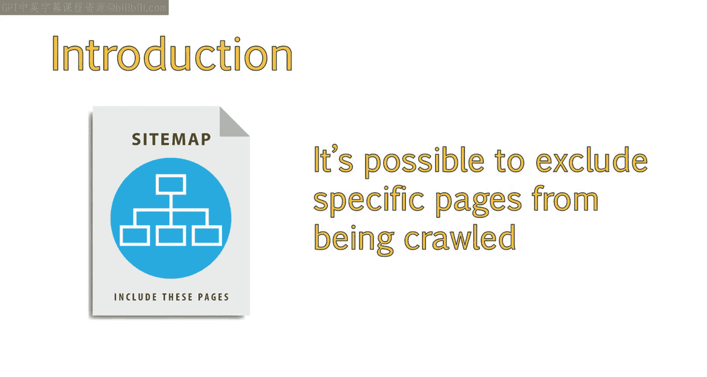

`robots.txt`文件是一种在互联网早期创建的协议，旨在防止网络机器人（robots）抓取不应访问的网络区域。如今，这个协议通常简称为`robots.txt`。

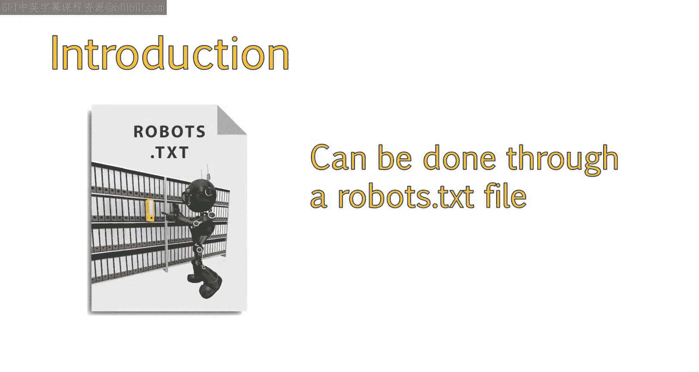

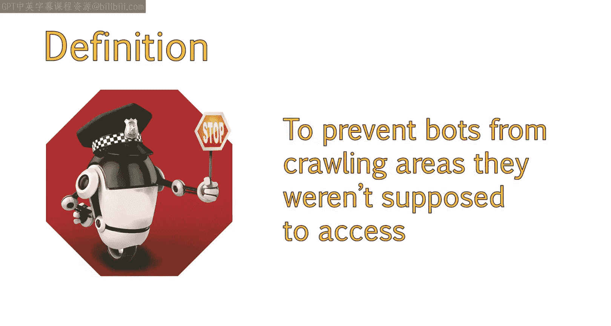

这是一个可以上传到服务器的简单文本文件。当搜索引擎机器人想要访问网站上的某个页面时（例如 `example.com/blue-widgets`），它会首先检查位于 `example.com/robots.txt` 的这个文件，查看是否有禁止抓取该页面的指令。

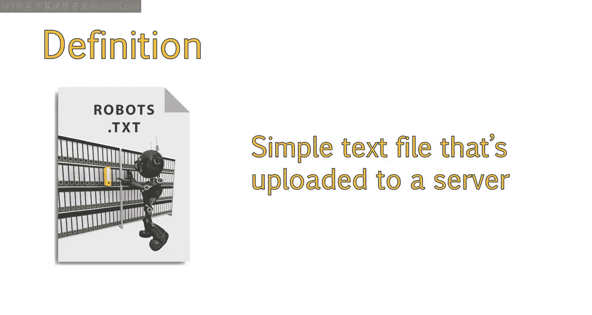

## robots.txt的局限性

需要注意的是，`robots.txt`文件只是向搜索引擎和机器人提供了你的偏好设置，但**机器人可以选择忽略此文件中的信息**。像谷歌或必应这样的主流搜索引擎通常会尊重这个文件，但并非所有机器人都如此。

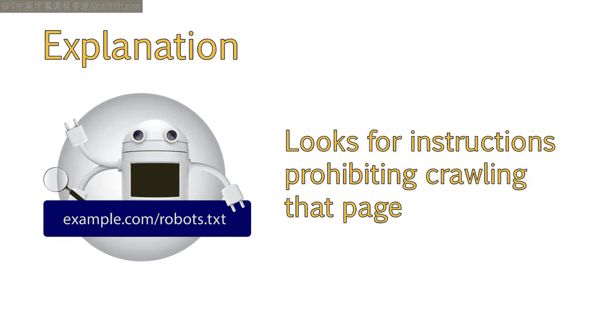

人们创建机器人的目的多种多样，有些目的可能是恶意的。例如，有些机器人会扫描网络以寻找漏洞，意图入侵网站；另一些则会抓取网站并收集电子邮件地址，出售给公司或垃圾邮件发送者。

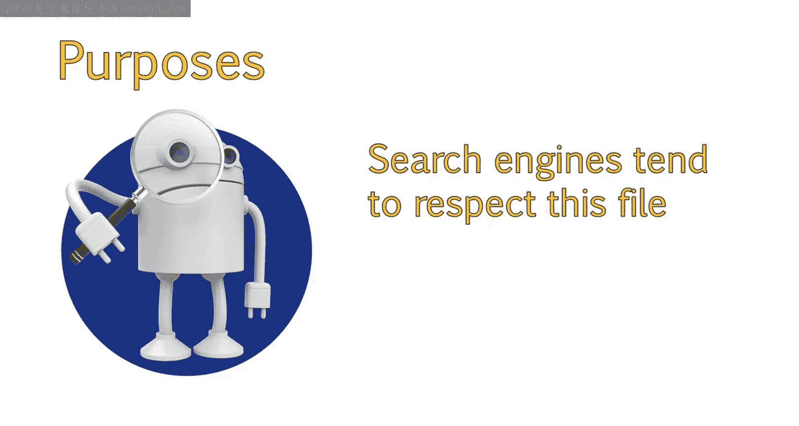

此外，`robots.txt`是一个公开可访问的文件，这意味着任何人都可以看到你不想让机器人访问服务器的哪些部分。

## 解读robots.txt文件示例

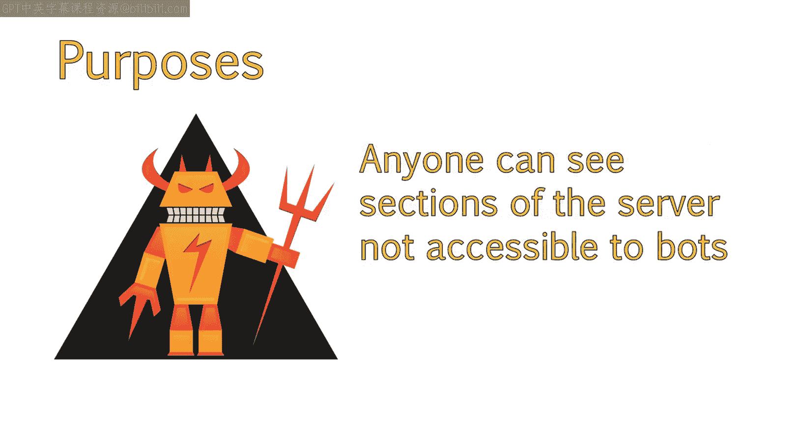

以下是查看UC Davis Extension网站`robots.txt`文件的方法及其内容的解读。

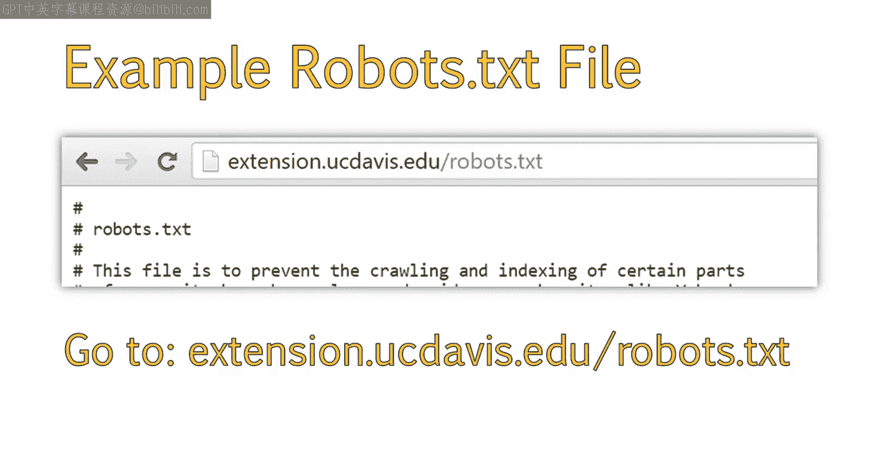

**文件位置**：`extension.ucdavis.edu/robots.txt`

以下是该文件可能包含的关键信息部分：

*   **介绍性文字**：解释文件用途。这部分信息并非必需，但许多网站内容管理系统会默认包含。
*   **文件位置说明**：指出除非将文件放置在主机根目录下，否则指令将被忽略。这意味着必须通过 `example.com/robots.txt` 访问，如果放在 `example.com/site/robots.txt` 则无效。
*   **具体指令**：以下是常见的指令结构：

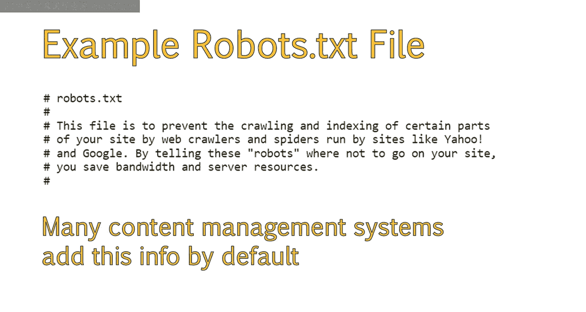

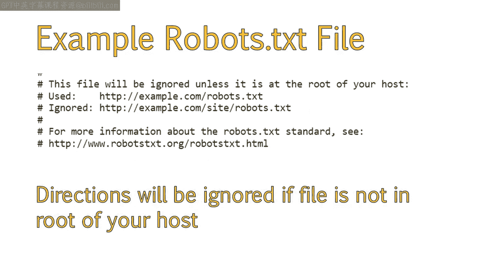

```
User-agent: *
Crawl-delay: 10
# 这是一个给网站管理员看的注释，机器人会忽略。
Disallow: /includes/
Disallow: /temp/
```

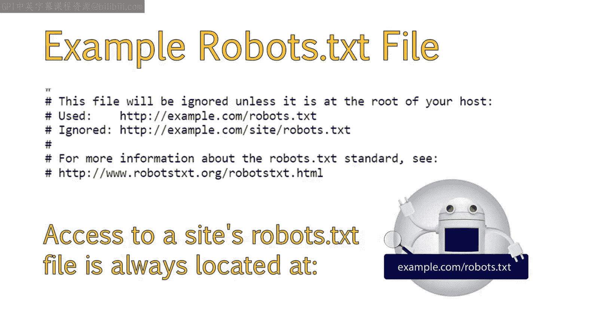

以下是各个指令的含义：

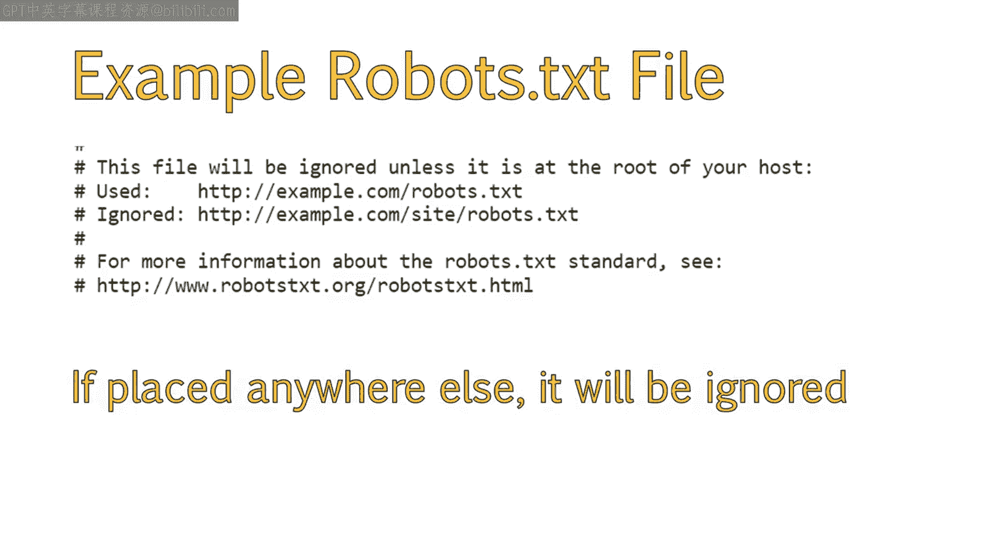

*   **`User-agent`**：指定哪些用户代理（即搜索引擎机器人）应遵守规则。星号 `*` 是通配符，表示所有机器人都应遵循以下指令。通常无需为特定搜索引擎（如谷歌、必应）单独设置。
*   **`Crawl-delay`**：设置机器人在访问你网站的新页面之前应等待的秒数。这有助于防止服务器资源过载导致网站崩溃。
*   **`#`（井号/哈希标签）**：用于添加注释。这是给人看的，机器人会忽略。
*   **`Disallow`**：指示机器人不要抓取其引用的内容。例如，`Disallow: /includes/` 意味着不要抓取 `/includes/` 目录。

## 如何创建robots.txt文件

现在我们已经了解了星号（`*`）和禁止指令（`Disallow`）的含义，可以学习如何创建自己的`robots.txt`文件了。

以下是两种常见情况的配置示例：

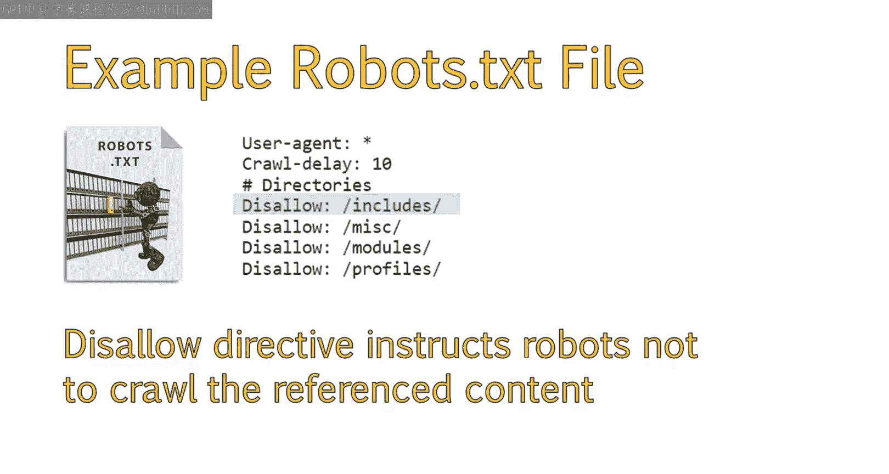

**1. 禁止所有机器人访问整个网站**
如果你想排除所有机器人访问你的整个站点，可以这样设置：
```
User-agent: *
Disallow: /
```

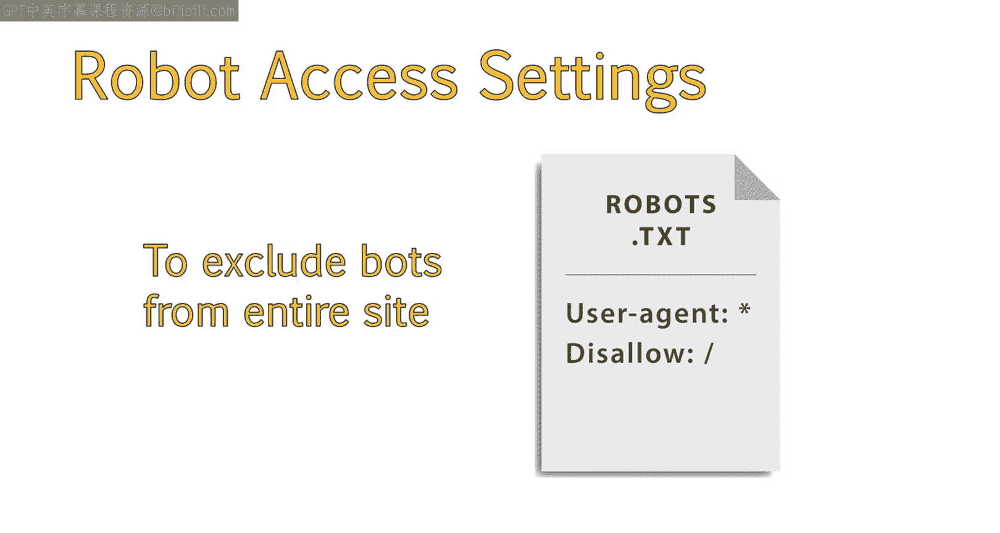

**2. 允许所有机器人完全访问网站**
如果你想允许机器人完全访问网站，只需将 `Disallow` 字段留空：
```
User-agent: *
Disallow:
```
你也可以选择完全不使用`robots.txt`文件，这将自动使所有信息对机器人公开。

## 总结

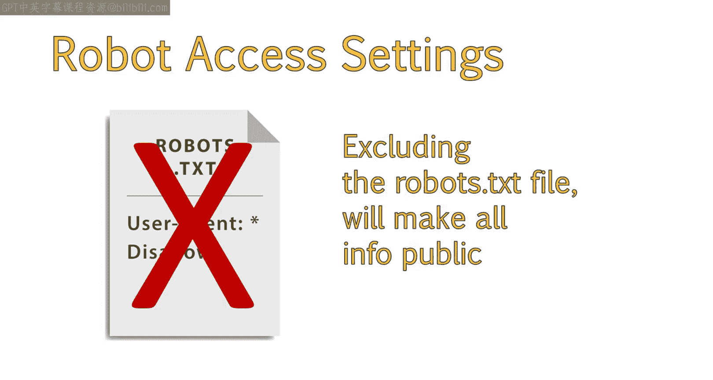

本节课中我们一起学习了`robots.txt`协议。你现在应该理解了：
1.  `robots.txt`文件的用途：控制搜索引擎机器人对网站的抓取行为，主要起排除作用。
2.  如何创建和解读`robots.txt`文件：使用 `User-agent`、`Disallow`、`Crawl-delay` 等指令。
3.  此文件应放置在服务器的什么位置：必须位于网站的根目录（例如 `example.com/robots.txt`）。
4.  该协议的局限性：它只是一种建议，并非强制命令，恶意机器人可能无视它，且其内容是公开的。

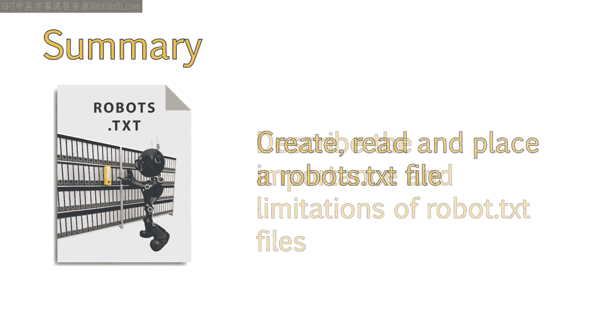

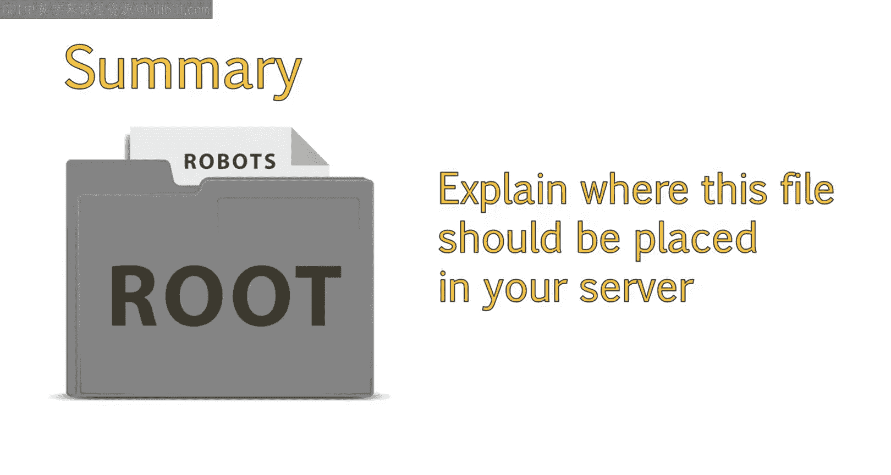

合理使用`robots.txt`文件是网站管理和SEO基础工作中的重要一环。