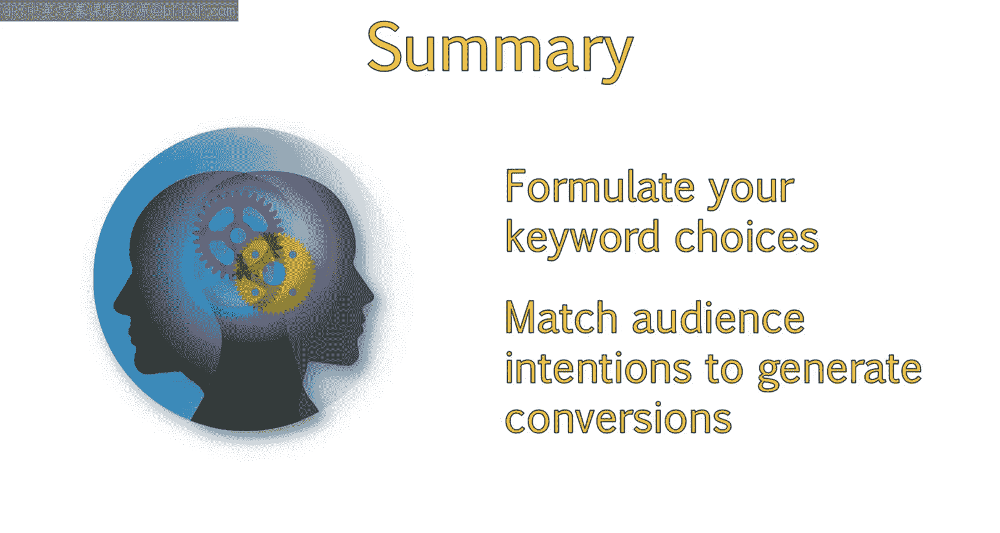

# 052：搜索阶段分析 🔍

在本节课中，我们将学习用户在搜索引擎上进行搜索时所经历的不同阶段，以及与之对应的搜索查询类型。理解这些概念有助于我们更好地把握用户意图，从而优化网站内容，吸引更精准的流量。

---

## 搜索并非千篇一律

并非所有输入谷歌或其他搜索引擎的搜索都是相同的。事实上，互联网用户执行的搜索有几个重要的类别，包括导航型、信息型和交易型查询。

上一节我们介绍了搜索存在不同类型，本节中我们来看看用户从产生兴趣到最终决策的完整过程。

## 用户的搜索与购买路径

为了深入了解搜索者的想法并弄清楚他们使用的查询类型，让我们来看看在整个搜索过程中，用户的搜索和购买意图是如何演变的。这个过程可能会因用户并非总是想购买东西而略有变化，但其路径和过程是相似的：用户通常从一个宽泛的主题开始，随着他们逐渐明确自己的需求，搜索会变得越来越具体。

在购买路径的初始阶段，自然搜索帮助客户了解你的品牌、产品或服务。在这个开始阶段，用户已经识别出一个需求，并正在寻求解决方案。

让我们用一个示例用户来说明搜索过程。我们称这个用户为汤姆。

---

## 搜索阶段详解

以下是用户从产生需求到最终决策通常会经历的四个阶段。

### 1. 认知阶段

汤姆决定他需要一台电脑，但他不知道要哪种。于是他转向他偏好的搜索引擎（很可能是谷歌），并输入“**best computers to buy**”（最好的电脑购买推荐）。

这就是认知阶段。在这个阶段，汤姆很快发现这个搜索非常宽泛，为了得到最佳结果，他需要细化自己的偏好。

### 2. 评估阶段

汤姆决定他想要一台笔记本电脑，而不是台式机。因此，他将搜索优化为“**best laptop to buy**”（最好的笔记本电脑购买推荐）。搜索结果向他展示了各种不同的笔记本电脑，他意识到需要进一步缩小选择范围。

不同的笔记本电脑有不同的用途，例如学习、平面设计或游戏。在这个例子中，汤姆决定他想要一台游戏笔记本电脑。

### 3. 偏好阶段

于是，他搜索“**gaming laptop reviews**”（游戏笔记本电脑评测）来帮助决定一个具体的选择。在阅读评测后，汤姆确定了他想要的特定笔记本电脑品牌和型号。

### 4. 购买/解决阶段

现在他将进入购买阶段，搜索那个笔记本电脑的品牌和型号。有时，这可能会开启一个新的搜索阶段，即比较商家和对比价格。

简单回顾一下：
1.  从对你所寻找事物的**一般认知**开始。
2.  **评估**这些选择并形成**特定偏好**。
3.  **深入研究**那个偏好并做出**最终决定**。
4.  进入**购买或问题解决**阶段。

---

## 自然搜索可见性的价值

在搜索周期的所有阶段保持自然搜索可见性都是有用的，但越接近实际的购买阶段，其作用就越大。

*   **认知阶段**：通常不需要很高的可见度，但在此阶段建立品牌存在感是有益的，这样用户在后续阶段能认出你的品牌或网站。
*   **评估与偏好阶段**：在这两个阶段保持自然搜索可见性很有帮助，因为用户可能决定转化并记住你的网站。
*   **购买阶段**：对SEO可见性非常有益，因为这是用户积极寻找购买产品或执行特定行动的阶段。他们的查询意味着他们心中没有特定的购买网站。如果你的网站在此阶段有可见性，你就有更大的机会吸引并转化用户。

---

## 搜索查询的三种类型

除了搜索阶段，还有特定类型的搜索查询。每种类型的搜索查询都关联着不同的用户意图。

以下是三种主要的搜索查询类型。

### 1. 导航型查询

在这种情况下，用户心中有一个特定的网站。也许他们过去曾在某个特定网站上花费过时间，并且喜欢该网站的内容。在这种类型的查询中，他们直接搜索网站或品牌名称，并访问该页面的品牌结果。

让我们以亚马逊为例。由于这类查询高度聚焦于品牌，它们需要的优化工作很少。高度的品牌聚焦意味着用户特别在寻找你的品牌，并且会更投入地使用你的网站，通常能带来更好的转化率。

然而，你需要注意可能包含你品牌名称的新闻结果，因为这些也会在有人搜索你的品牌时显示。关于你品牌的负面报道可能会影响他们访问你网站或转化的决定。你还应注意，品牌搜索可能会显示你的Twitter账户和最新推文。确保你的社交媒体团队始终在社交渠道上维护品牌形象非常重要。

### 2. 信息型查询

对于这类搜索，人们希望获得关于某个主题的更多信息，或在购买前做出明智的决定。你可以将这种类型的查询与购买漏斗的中间阶段（评估和偏好阶段）联系起来。

一个例子是，某人在比较不同类型的笔记本电脑时，搜索“**laptop reviews**”（笔记本电脑评测）。

请注意，在此阶段，用户更有可能注意到“**搜索建议**”。这些是其他用户输入过的不同搜索查询。这可能会改变他们使用的关键词，因此你应该关注这个领域，为你的网站寻找潜在的内容创意。

### 3. 交易型查询

在这种情况下，用户已准备好购买，他们希望谷歌能为他们的搜索查询提供所需的结果。在这个例子中，用户已经决定要购买一台特定的笔记本电脑。他们输入了型号，搜索结果显示了多个可以购买该特定产品的网站。

请注意，并非所有交易型查询都必须导致实际交易。有人可能试图注册新闻通讯、创建免费账户等。

---

## 总结

本节课中，我们一起学习了用户在线搜索时所经历的处理过程，以及如何制定关键词选择策略，使其更有可能匹配目标受众的意图并促成转化。

正如你所见，这些查询类型与搜索阶段紧密对应，对于确保你在每一步都瞄准了正确的关键词并让你的品牌脱颖而出非常有帮助。你现在应该对用户执行在线搜索时所经历的过程，以及如何制定关键词选择以更好地匹配目标受众意图并促成转化，有了更深入的理解。