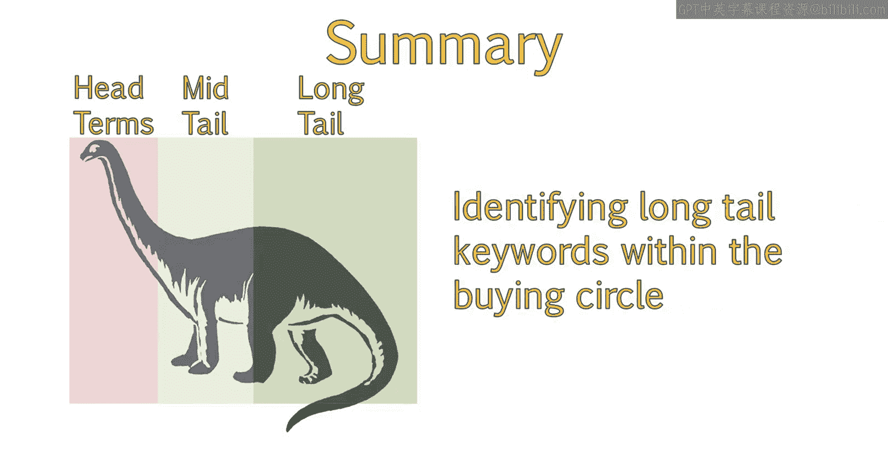

# 053：UCD《搜索引擎优化（谷歌、SEO基础、优化网站、进阶、毕业项目）｜Search Engine Optimization》中英字幕 p53 25_头部-尾部-长尾关键词.zh_en -BV1N66VYsEue_p53-

Welcome back。We know by now that all keywords aren't created equally。

 Some keywords will help you build authority for your site by getting the right kind of attention In this lesson。

 we'll explain the difference between the more general head terms and the more specific tail terms that can be used when identifying keywords for your site。

😊，We'll see why even though long tail keywords account for a lower volume of overall searches。

 they are extremely beneficial to driving the right traffic to your site。

There are many different aspects that go into choosing the right keyword to target。

Another part of the keyword selection process involves choosing keywords that best match buyer intent。

 have low competition and generate more traffic to your site。😊。

Let's discuss what SEOs call long tail keywords。Mongtail keywords are important to use in your keyword strategy。

Longtail keywords are used less frequently because they are more difficult to optimize for。

 You can't always predict the exact long tail phrase a customer might use。However。

 the majority of your traffic will naturally come from these longer tail phrases。

These phrases are often more specific。Because of their specificity。

 they have a higher probability of conversion due to being later in the stages of the buying funnel and search cycle。

😊，In addition， because these keywords are so specific。They are a lot less competitive。

 making it easier for you to rank highly and attract more traffic。😊，For example。

 ranking for the keyword laptops might seem like a great idea。

But popular search terms like this actually make up less than 30% of the overall searches performed online。

The remaining 70 per cent of queries are what are known as long tail keywords or keywords that are longer and more specific。

This chart from Mos does a great job at showing how many searches come from long tail keywords。

 Your website's own traffic will closely follow this chart。

 You can view this chart on their website at the link provided in your study materials。😊。

Let's go over some examples of keywords and their length。The keywords。

 textbooks or even textbook rentals are considered head terms because they are not long tail。

 are very competitive。 have a lot of search volume and are more broad。

As we get more specific and you search queries such as online textbook rentals。

 that becomes more mid to long tail。However， you can get even more specific with a phrase such as rent college textbooks online。

These long tail keywords are easier to guess and optimize around。

Then there are the really long tail transactional queries where users know what they want。

 such as the exact book name。 This will have a very low search volume。

 but is worth it if you rank for these， because the traffic will find exactly what they want on your site and be very likely to convert。

For example， let's take a look at search volume for the keywords we just discussed。

We can see that textbooks has a very high number of monthly searches。

It's easy for clients to get distracted by this and demand to rank number one for textbooks or even textbook rentals。

But if your main focus is online textbooks rather than operating a physical storefront。

 this may not be the best choice for you。You can get even more targeted by choosing more appropriate keywords。

In this scenario， the customer is still in the information gathering phase of their purchase。

The keyword on textbook rentals has lower volume， but is more specific。

 The user is now at the stage where they have a better idea of what they are looking for。

The same goes for online college textbook rental。This is even more specific。

Now you may be looking at the keyword online college textbook rental and thinking，Wow。

 there is a big difference in search volume between online textbook rentals and online college textbook rental。

But when you think about it， you're able to target four very targeted keywords with this one long tail phrase。

You can target text for Grs。Online textbook rentals。

College textbook Rs and the full phrase online college textbook rental。

By keeping this full phrase in mind and writing great content for these pages。

You are slowly building authority for the topic textbooks。

 which can eventually help your site rank higher for more competitive phrases。😊。

It's also important to remember that this volume is for the exact phrase above。

There are a number of different ways this can be worded in search results。

Resulting in a variety of long tail keyword traffic that can result from this particular key phrase。

 You should now be able to define head terms and tail terms and make appropriate recommendations regarding the right types of keywords to target。

You should have a clear understanding of the importance of long tail keywords and where these keywords are within the buying cycle。

