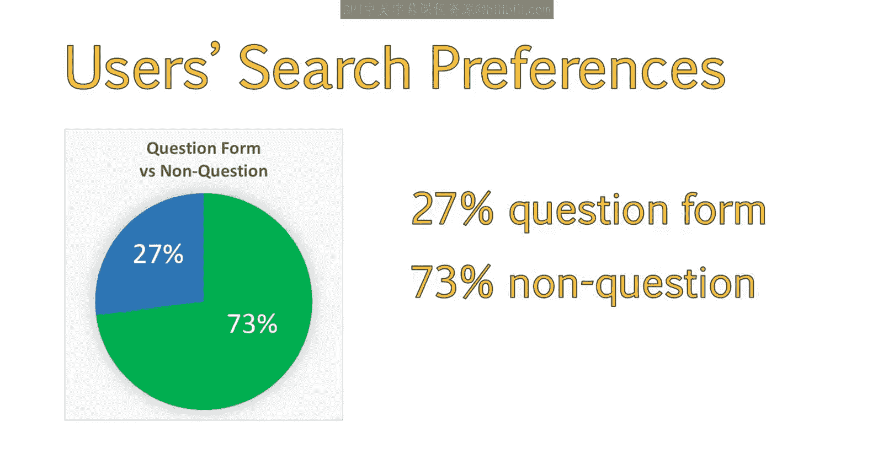
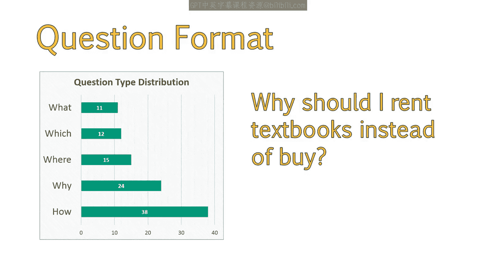
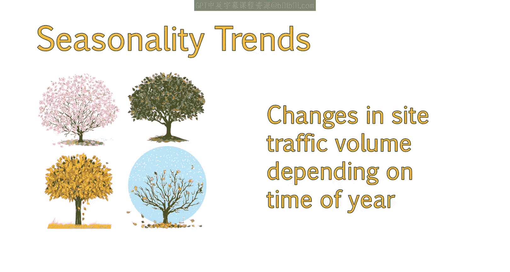
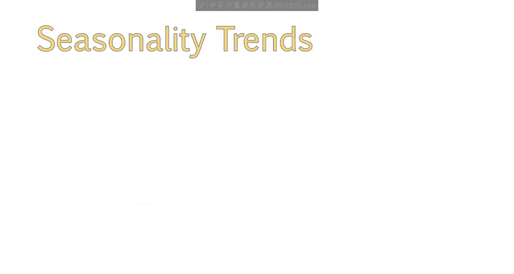
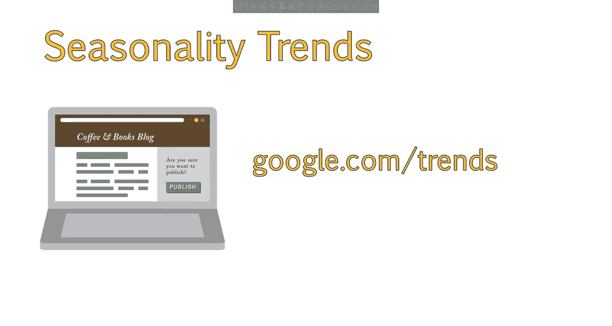
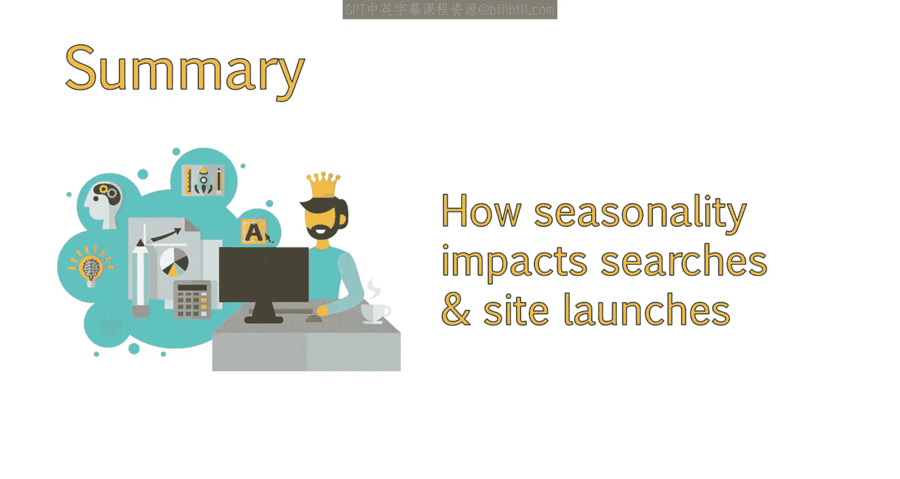

# 054：UCD《搜索引擎优化（谷歌、SEO基础、优化网站、进阶、毕业项目）｜Search Engine Optimization》中英字幕 p54 26_用户搜索行为研究.zh_en -BV1N66VYsEue_p54-

Hello again。In the field of SEOO， it's important to learn as much as you can about how users conduct searches。

As we continue to emphasize in this course， it is critical that youll learn as much as possible about your target audience and the ways they are likely to search for and locate your site。

For this lesson， we'll discuss some of the results of a study about how searchers formulate their queries。

We'll also take a look at why paying attention to the seasonality of searches can help you strategize when you launch sites or publish new content。

A research group called Blue Nile Research recently performed a study to see how searchers choose to formulate their queries in a variety of different scenarios。

Their research showed an interesting 5050 split between users who search in fragments like rent textbooks versus users who search for more specific phrases like Gr college textbooks online。

In addition， when it came to questions versus statements。

 the study found that 27% of users phrase their query in the form of a question。

Question formats are determined by the usage of words like how， why， what。

 and where in the search query。This study shows that how questions are the most popular。

 followed by why， where， which and what。You can use these prefixes to brainstorm good long tail keywords and content ideas。

Example article ideas based on query prefixes include。How to find affordable textbooks。

What textbooks are available online？Where is the best place to rent textbooks？

How do I rent a textbook online？Why should I rent textbooks instead of buy？

Just considering the various questions users may ask will give you a great deal of keyword ideas you can build content around。

When looking at how users search， it is a good idea to consider seasonality as well。

This means you will have an uptick in search during certain times of the year。

 and other times will see very little traffic and conversions。😊。

Here is an example for textbook rentals over time。We can see that this has remained relatively stable since around 2011。

And there are a lot of surges， so we can see that search volume for these keywords is very seasonal。

If we refine this search to show the past 12 months。

We can get a good idea of how exactly seasonality affects these searches。

We can see that during the fall and winter， searches increase significantly。

And we can surmise that these searches are probably college students looking for textbooks during the new semester or school year。

This gives us a lot of insight into our target market。We know， for example。

 that if we were working with the client offering textbook rentals。

And they wanted to do a redesign of their sight。We could advise them not to launch the redesign during the early fall and the beginning of the year。

The best solution would be to launch their site during a down season so new pages can get indexed。

 begin to rank， and any authority from pages which no longer exist is properly transferred over。

This also gives them the opportunity to watch for problems with the new design。For example。

 if conversion rates decrease or user engagement decreases。

 this is something that can be analyzed and addressed before peak traffic hits。

Seasonality trends can also provide great insight into when we might want to publish articles or blog posts regarding certain keywords。

If we see that searches tend to increase in August。

 it'd be a great idea to publish your post around the middle of July。

You can view the trends of various search terms available online at Google。com forward/ trendsd。

You should now have a better understanding of how users formulate keywords and how to generate keyword ideas and content around potential questions the user may be asking。

In addition， you should have an understanding of how seasonality impacts searches。

And how to look at seasonality trends on Google to decide when to launch new pages or redesign a site。

