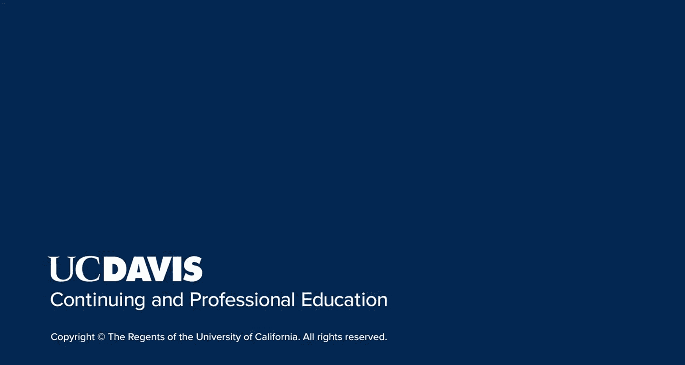

# SEO优化：056：课程概览

在本节课中，我们将要学习《搜索引擎优化》课程的第三部分——“优化网站以提升搜索排名”的概览。我们将了解本课程的整体结构、核心模块以及你将掌握的关键技能。

大家好，我是Rebecca May，欢迎来到我们SEO学习系列的第三门课程。这门课程将专注于如何为搜索引擎优化网站。我们将超越理论研究，进入更实际的技巧领域，以期为你的网站吸引更多流量。

你将把在前两门课程中学到的知识付诸实践，为你或你的客户取得最佳效果。

## 课程模块介绍

本课程分为四个模块，将引导你深入关键词研究与应用的领域，学习高级页面SEO、本地SEO以及如何策划一个完整的SEO推广活动。

以下是本课程的四个核心模块：

1.  **关键词研究与应用**：我们将从关键词开始，学习如何研究、选择并应用这一强大工具来优化你的网站。你还将学习识别和分析竞争对手的艺术，了解他们的策略思路。
2.  **高级页面SEO与内容策略**：在第二个模块中，我们将通过探索内容如何帮助将点击转化为增长的销售额或流量，向优化迈出下一步。我们将解答什么策略能成功以及什么内容算优秀，并学习如何进行有效的内容分析、内部内容审计，以及如何构建域名级别的整体内容策略。
3.  **本地SEO策略**：在模块三中，我们将仔细研究本地SEO策略，学习如何优化你的Google商家页面、站内内容以及外部引用，以提升你在本地搜索环境中的可见度。我们还将探讨构成强大本地SEO策略的各个要素。
4.  **SEO项目管理与客户关系**：最后，在模块四中，我们将讨论SEO中的人为因素。你将学习如何与客户建立并维持良好关系，如何管理他们的期望，以及如何跟踪和报告项目进展。这些是SEO工作的核心问题，其本质在于帮助客户实现他们为网站设定的目标。

## 学习目标与总结

到本课程结束时，你将能够运用在研究与分析方面的新技能，并制定有效策略，以帮助你的客户实现其网站和业务目标。

本节课中，我们一起学习了《搜索引擎优化（三）：优化网站》课程的整体框架。我们了解到，本课程将带领我们从关键词实战、内容优化、本地搜索深入到客户关系管理，旨在培养你将SEO理论转化为实际成果的综合能力。接下来，让我们正式开启第一个模块的学习。