# 搜索引擎优化：061：制定竞争计划 📊

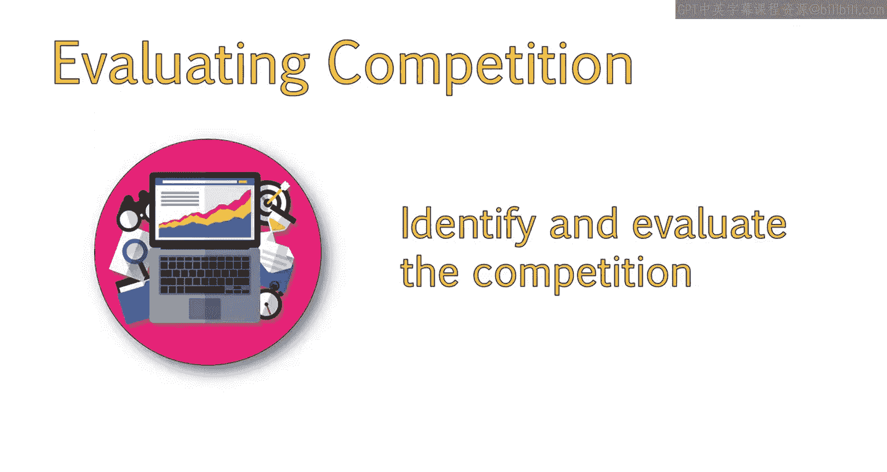

在本节课中，我们将学习如何通过关键词分析来评估和排序竞争对手，从而明确哪些对手可以超越，哪些需要重点关注。我们还将探讨如何设定合理的期望，并制定计划，使我们的网站在竞争中处于最佳位置。

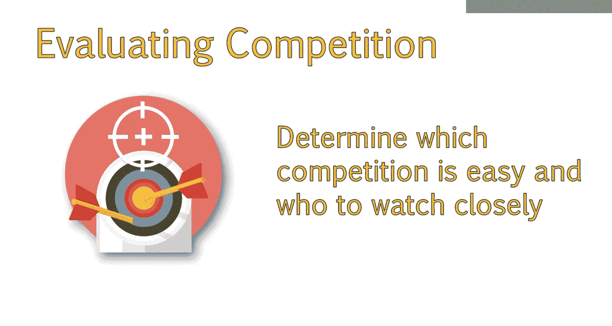

上一节我们介绍了如何识别竞争对手。本节中，我们将学习如何评估竞争对手。

## 评估竞争对手

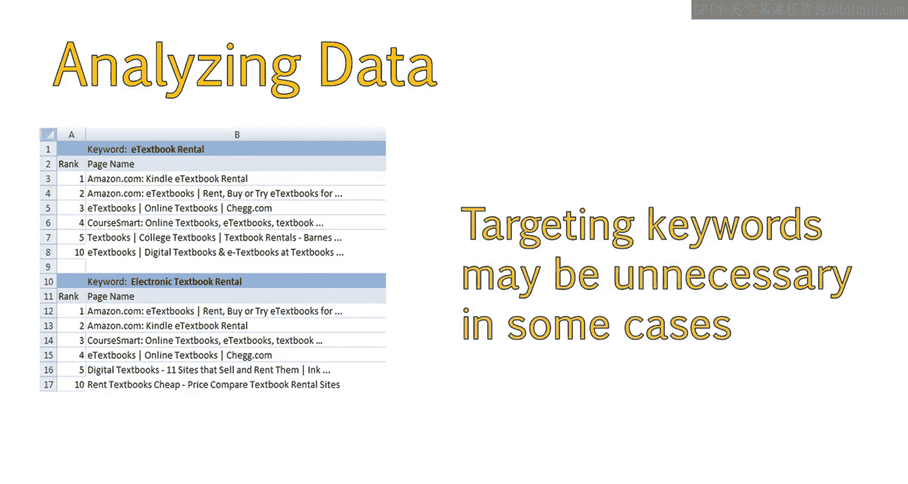

评估竞争对手有助于我们确定哪些对手最容易超越，哪些最值得关注，以及如何在搜索竞争中取得优势。

以下是评估竞争对手的步骤：

1.  **分析关键词数据**：回顾上一节获取的竞争对手数据表格，分析每个关键词的搜索结果。
2.  **观察语义关联**：注意谷歌语义算法的工作方式。例如，“E textbook rental”和“electronic textbook rental”的搜索结果高度重合，表明谷歌认为“E”和“electronic”语义相关。
3.  **识别有机竞争者**：有些网站可能并非直接业务竞争对手，但它们在搜索结果中排名靠前，分流了潜在客户。这些“有机竞争者”同样重要，不应被忽视。

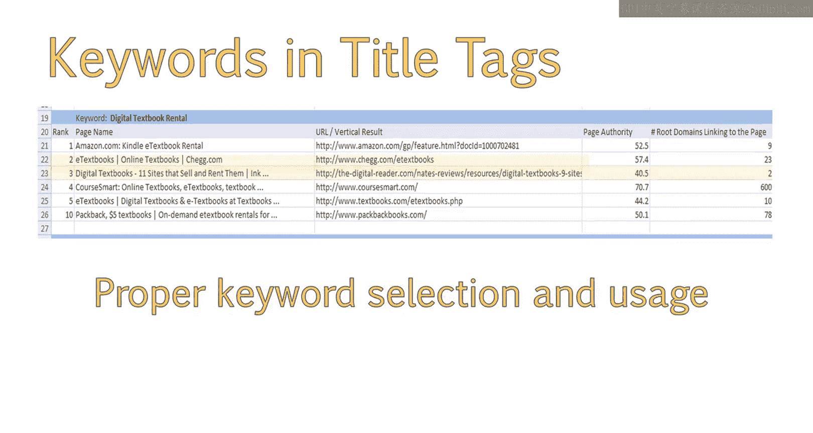

## 分析竞争格局

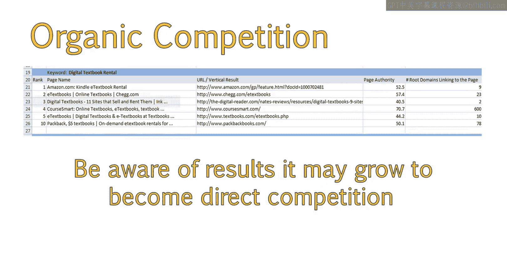

接下来，我喜欢高亮那些在所有目标关键词搜索结果中都出现的网站。例如，亚马逊在我研究的所有关键词中都排在前三位。

高亮此类竞争对手可以让我直观地看到哪些关键词竞争最弱，并全面了解竞争态势。

由于网站应针对多个关键词进行优化，对一系列关键词进行深入的竞争分析是个好方法。这有助于我们了解整体竞争难度。

以下是我根据分析结果对主要竞争对手的排序：

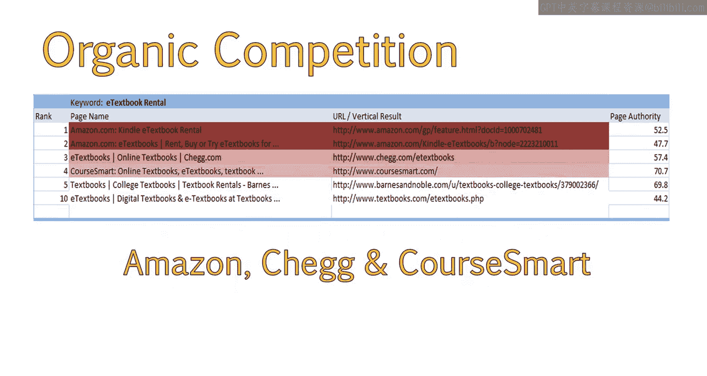

*   **亚马逊**：用深红色高亮，因其在多个关键词中排名第一，是最难超越的对手。
*   **Chegg**：用稍浅的红色高亮，最常出现在第二或第三位，是需要重点关注的次级对手。
*   **CourseSmart**：最常出现在第三或第四位，是下一个需要关注的主要对手。

## 设定合理期望

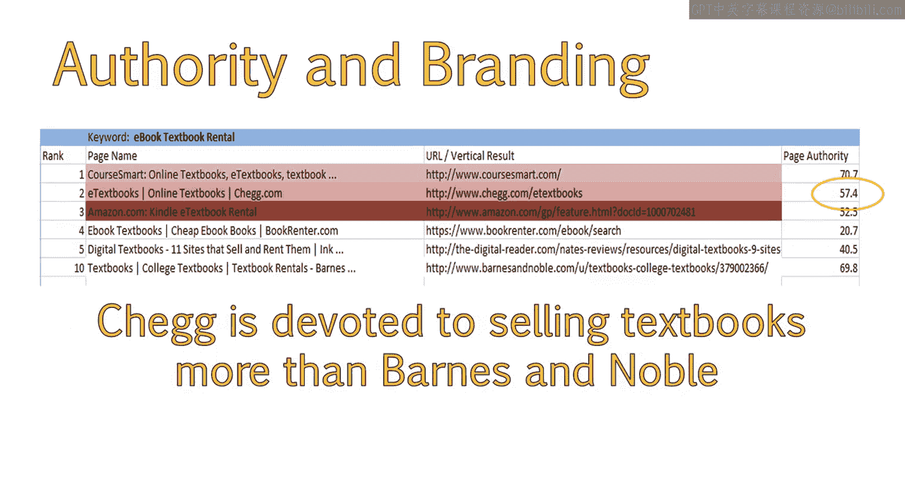

亚马逊品牌强大、域名权威性高，很难超越。但这并非不可能，只是需要投入更多时间和努力来提升我们网站的相关性和信任度，以抗衡其域名权威。

根据分析，进入搜索结果第一页是可行的，但需要付出大量努力。如果拥有足够的营销预算来创作优质内容和获取高质量外链，就有机会随着时间推移逐步提升排名。

## 扩展分析范围

接下来，我会对其他高价值关键词组重复此分析过程。例如，我对“online textbook rental”相关关键词也进行了分析。

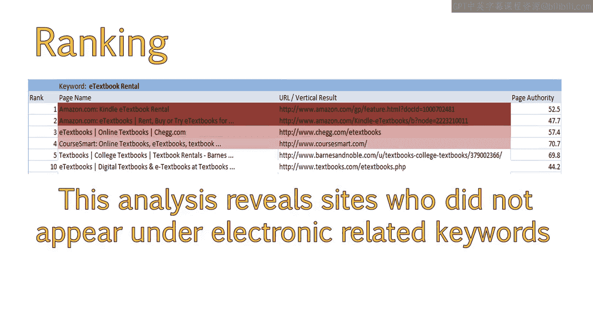

通过比较不同关键词组的分析结果，我可以更全面地了解谁是我最主要的竞争对手。我还会将分析扩展到通用教科书关键词以及长尾关键词和问题类关键词。

将所有分析结果整合后，我根据竞争对手的出现频率和排名位置，对其进行颜色编码，从最强到最弱进行排序。

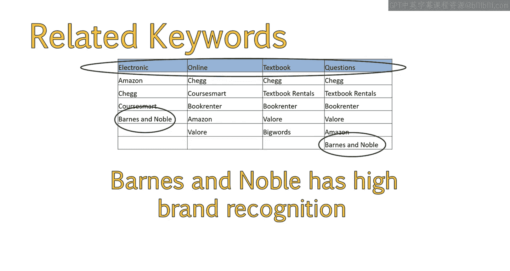

最终，我确定了主要竞争对手的竞争力排序（从强到弱）：**Chegg、亚马逊、BookRenter、TextbookRentals、CourseSmart、Barnes & Noble、BigWords**。

## 总结与下一步

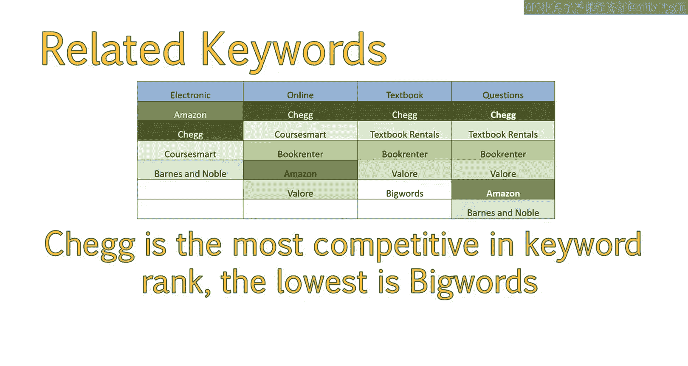

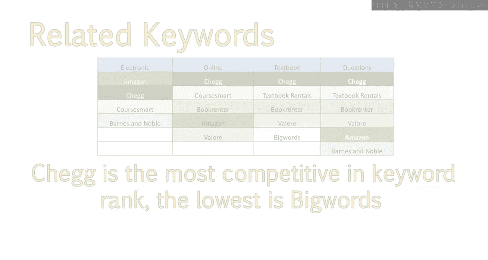

本节课中，我们一起学习了如何通过关键词数据分析来确定主要竞争对手，并对其进行排序。你现在应该已经掌握了如何分析信息以确定整体上的顶级竞争对手。

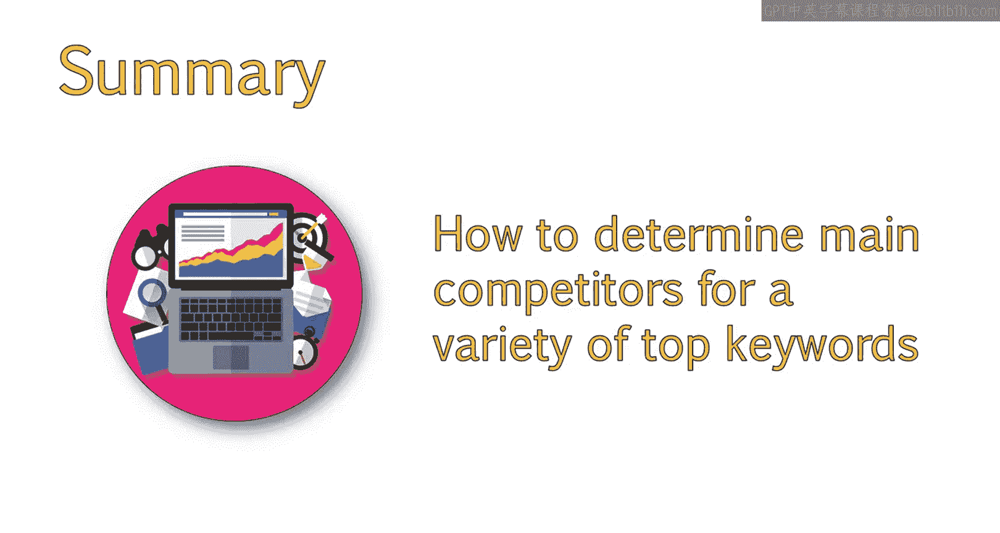

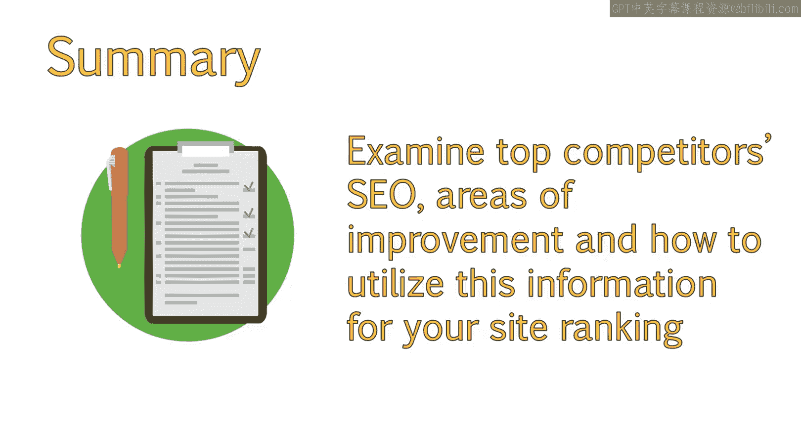

接下来，我们将深入分析这些顶级竞争对手，了解他们在SEO方面的优势与不足，并从中寻找机会，制定策略，使我们的网站能够获得更好的排名。