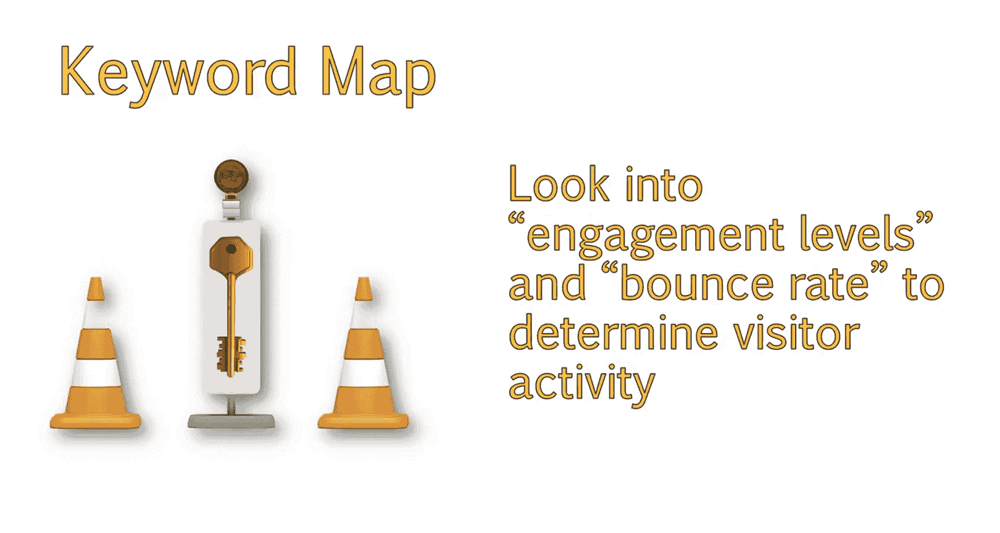
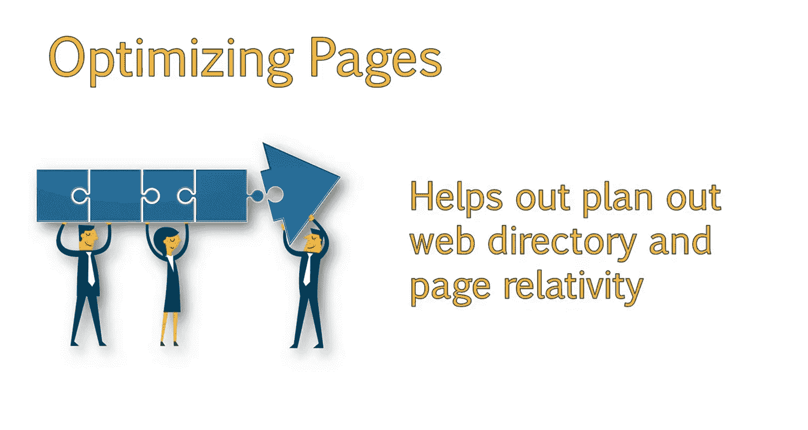

# 搜索引擎优化：064：关键词与页面映射 📍

在本节课中，我们将学习如何将已识别和研究的关键词系统地分配到网站的各个页面，并构建一个清晰的关键词地图。这有助于确保网站内容结构清晰，避免内部竞争，并提升整体优化效果。

欢迎回来。现在你已经为你的网站识别、研究并分析了关键词。接下来该做什么？

你如何保持所有内容的条理性，并为每个页面选择要使用的关键词？在本课中，我们将讨论如何构建关键词地图，以及如何确定关键词在网站内的最佳使用方式。

## 什么是关键词地图？🗺️

关键词地图本质上是一个文档，它概述了哪些关键词属于你网站的哪些页面。你并非在整个网站上使用关键词，而是在网站的特定页面上使用某些关键词。

构建关键词地图有几个目的。

以下是构建关键词地图的主要目的：

*   **创建聚焦页面**：它让我们能够确保围绕特定关键词或关键词组创建内容聚焦的页面。与其思考单个关键词的表现，不如思考哪些关键词与单一主题相关，从而确定该页面的主题。这使我们能够战略性地思考如何优化整个网站。
*   **避免内部竞争**：它确保我们不会因在多个页面上使用重复或过于相似的关键词，而在无意中“蚕食”自己的优化成果。这会导致这些页面为相同的搜索查询而相互竞争。
*   **提供参考依据**：它为我们提供了一个文档，供我们在对网站提出建议和进行更改时参考。这将有助于指导我们在整个优化过程中的工作。
*   **便于客户后续维护**：这是一个很好的文档，当我们不再与客户合作时，客户可以将其作为参考。如果他们以后想要更改或向页面添加内容，他们将能够参考此文档，轻松了解该页面的关键词重点。这也有助于他们避免日后重复使用现有关键词的常见错误。
*   **分析页面表现**：最后但同样重要的是，这使我们能够更轻松地深入了解我们的页面在其关键词重点和主题方面的表现。使用Google Analytics，我们可以通过查看自然搜索着陆页并将这些页面与我们的关键词地图进行比较，来了解这些关键词实际带来了多少流量。虽然你可能没有收到这些确切术语的流量，但很可能收到了类似短语的流量。然后，你可以查看参与度指标和跳出率等数据，以确定该页面在多大程度上满足了访问者的需求。

## 优化的核心目标 🎯

请记住，围绕选定的一组关键词优化特定页面，并不是试图欺骗谷歌来提高你的页面排名。关键在于你能否将页面的主题和语言与你用户群的搜索意图相匹配。

以这种方式优化页面的目标是帮助搜索引擎更好地理解你的网站，以及哪些页面与查询最相关。这也有助于你通过查看不同页面之间的关联来规划网站架构。

## 总结与预告 📝

现在你应该理解了将关键词映射到页面的重要性。接下来，我们将详细介绍具体的操作过程。